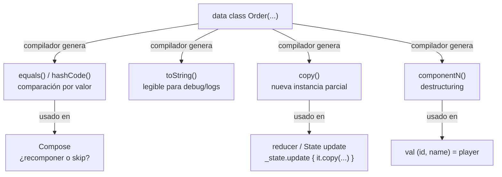

# Data Class

## 1. Mapa del flujo



Los cuatro métodos no son opcionales ni configurables uno por uno — vienen todos juntos apenas ponés la palabra `data` antes de `class`. Lo que cambia según el contexto es cuál de los cuatro termina siendo el que realmente usás en cada capa: `copy()` domina en reducers de MVI, `equals()` domina en la decisión de recomposición de Compose, `componentN()` aparece sobre todo en destructuring declarations puntuales.

## 2. Qué es y cómo funciona

Una `data class` es una clase donde el compilador de Kotlin genera automáticamente, a partir de las propiedades declaradas en el constructor primario, cuatro cosas: `equals()`/`hashCode()` (comparación por valor de esas propiedades, no por referencia), `toString()` (una representación legible tipo `Order(id=1, status=PENDING, ...)`), `copy()` (crear una nueva instancia cambiando solo algunos campos, reusando el resto) y `componentN()` (una función por cada propiedad del constructor, que habilita destructuring: `val (id, status) = order`).

Como muestra el diagrama, estos cuatro métodos no viven aislados — son la base sobre la que se apoyan patrones enteros de arquitectura. `copy()` es lo que permite que un `State` inmutable (`data class OrdersState(...)`) se actualice sin reescribir todos sus campos: `_state.update { it.copy(isLoading = false) }` crea una instancia nueva, deja el resto intacto. `equals()` por valor es lo que le permite a Compose comparar el `State` viejo contra el nuevo en cada recomposición y decidir si hay un cambio real o si puede saltear (skip) el trabajo de recomponer — sin esa comparación por valor, dos instancias con los mismos datos se verían como "distintas" solo por ser objetos diferentes en memoria, y Compose recompondría de más.

Una propiedad importante que se desprende de esto: **`copy()` es shallow copy**. Si una propiedad del `data class` es en sí misma un objeto mutable, `copy()` no lo clona — copia la referencia. Esto no es un bug, es la definición de shallow copy, pero genera bugs sutiles si se asume inmutabilidad total sin verificar que todas las propiedades anidadas también lo sean.

## 3. Cómo se ve en distintos contextos

**App de fitness:** el `State` de la pantalla de rutina activa (`data class WorkoutState(val currentSet: Int, val isResting: Boolean, val elapsedSeconds: Int)`) se actualiza en un timer que corre cada segundo — `_state.update { it.copy(elapsedSeconds = it.elapsedSeconds + 1) }`. Sin `copy()`, cada tick del timer obligaría a reconstruir manualmente el objeto entero repitiendo `currentSet` e `isResting` sin cambios, solo para tocar un campo.

**App de e-commerce:** un carrito (`data class Cart(val items: MutableList<CartItem>)`) es el ejemplo clásico donde la trampa de shallow copy aparece — dos vistas distintas del carrito que hicieron `cart.copy()` para "aislar" sus cambios en realidad comparten la misma `MutableList` por debajo, así que agregar un item desde una vista lo hace aparecer también en la otra, algo que nadie esperaría de un `copy()`.

## 4. Implementación real

El PO pide: *"Necesito el Historial de Pedidos: cada pedido tiene una fecha, un estado, un total, y una lista de items."* — el mismo caso que ya modelamos en `domain` (`02_domain/model.md`). Acá el foco es distinto: no qué representa el Model, sino qué te da gratis el compilador al declararlo como `data class`, y dónde se usa cada pieza en la práctica.

```kotlin
// domain/model/Order.kt
data class Order(
    val id: String,
    val date: Instant,
    val status: OrderStatus,
    val items: List<OrderItem>,
    val total: Double
)

data class OrderItem(
    val productName: String,
    val quantity: Int,
    val unitPrice: Double
)
```

`equals()`/`hashCode()` por valor en la práctica — dos `Order` con los mismos datos son "el mismo pedido" a los ojos del código, aunque sean instancias distintas en memoria:

```kotlin
val orderFromCache = Order("1", date, OrderStatus.PENDING, items, 45.0)
val orderFromApi = Order("1", date, OrderStatus.PENDING, items, 45.0)

println(orderFromCache == orderFromApi)   // true — compara valores
println(orderFromCache === orderFromApi)  // false — instancias distintas
```

`copy()` en el reducer del `OrdersViewModel`, actualizando un solo campo del `State` (definido en `06_presentation_mvi/screencontract_state_event_effect.md`) sin tocar el resto:

```kotlin
fun onOrderConfirmed(orderId: String) {
    _state.update { current ->
        current.copy(
            orders = current.orders.map { order ->
                if (order.id == orderId) order.copy(status = OrderStatus.CONFIRMED)
                else order
            }
        )
    }
}
```

Notá el `copy()` anidado: se actualiza el `status` de un `Order` puntual dentro de la lista, y ese resultado se usa para actualizar el `orders` del `OrdersState` completo — dos niveles de `copy()`, cada uno tocando solo lo que cambió.

`componentN()` habilitando destructuring, útil cuando solo interesan un par de campos:

```kotlin
val (id, _, status) = order
println("Pedido $id está en estado $status")
```

## 5. Buenas prácticas y errores comunes — qué auditar si te lo entrega la IA

- **¿Alguna propiedad del `data class` es una colección mutable (`MutableList`, `MutableMap`) en vez de inmutable (`List`, `Map`)?** Si la IA usó `MutableList` en un Model o un `State`, `copy()` va a compartir la referencia entre instancias — dos `State` "distintos" van a mutar juntos apenas alguien modifica la lista de uno. La corrección es usar tipos inmutables (`List`) y reasignar la lista completa en el `copy()`, nunca mutarla in-place.

- **¿El `data class` tiene lógica de negocio real más allá de transportar datos, y esa lógica pertenece ahí?** Un método propio como `Order.isEditable(): Boolean = status == OrderStatus.PENDING` es legítimo si la lógica es intrínseca al concepto. Lo que hay que marcar es lógica de presentación (formateo de texto, colores, strings de UI) colada dentro de un Model de domain — esa lógica no pertenece ahí.

- **¿Se está comparando por `===` (identidad) cuando la intención era comparar por valor, o viceversa?** Un `if (orderA === orderB)` donde la intención real era "¿son el mismo pedido con los mismos datos?" es casi siempre un bug — debería ser `==`. El caso inverso (usar `==` cuando realmente se necesita distinguir instancias, por ejemplo para invalidar una caché) es más raro pero también hay que chequearlo si aparece.

- **¿Todos los constructores secundarios o factory functions siguen produciendo instancias que `equals()` considera coherentes?** Si el `data class` tiene un `companion object` con una función tipo `Order.empty()`, verificar que dos llamadas a esa función produzcan instancias iguales entre sí si esa es la intención — un campo con valor aleatorio o timestamp actual en el constructor rompe esa expectativa silenciosamente.

- **¿Hay algún campo que debería excluirse de `equals()`/`hashCode()` (por ejemplo, un campo puramente de UI o de caché) y no se usó `data class` con propiedades fuera del constructor primario para lograrlo?** Solo las propiedades declaradas en el constructor primario entran en el `equals()`/`hashCode()`/`copy()` generados — si la IA declaró una propiedad mutable con `var` dentro del cuerpo de la clase pensando que también participaría de la igualdad, no es así, y puede generar bugs de comparación silenciosos.