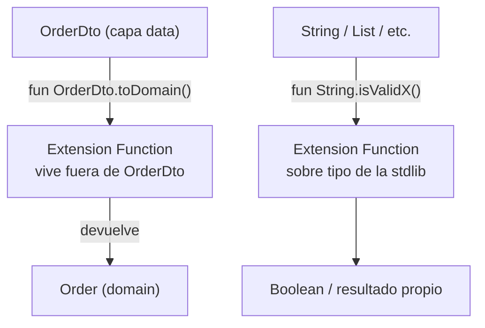

# Extension Functions

## 1. Mapa del flujo



En ambos casos la forma es la misma: un tipo que **no controlás modificar directamente** (un DTO externo, un tipo de la stdlib) recibe una función nueva sin heredar de él ni tocar su código fuente. La función "parece" un método del tipo al llamarla (`dto.toDomain()`), pero vive completamente aparte.

## 2. Qué es y cómo funciona

Las extension functions agregan una función a una clase existente sin heredar de ella ni modificar su código fuente. Es el mecanismo detrás de los Mappers de Clean Architecture (`OrderDto.toDomain()`).

```kotlin
fun OrderDto.toDomain(): Order = Order(id = this.id, status = this.status.toDomainStatus(), /* ... */)
```

Sin extension functions, agregar comportamiento a un tipo que no controlás (una clase de una librería externa, o un tipo de la stdlib como `String`) obliga a envolver el tipo en un wrapper propio o a escribir funciones utilitarias sueltas del estilo `OrderMapper.toDomain(dto)` — que rompen la legibilidad fluida de "el objeto hace algo" y dispersan la lógica en clases utilitarias genéricas en vez de vivir cerca del tipo al que conceptualmente pertenecen.

**Cómo identificarla en medio de código ajeno** — la señal sintáctica es siempre la misma: el tipo receptor pegado justo antes del nombre de la función, con un punto (`Tipo.nombreFuncion()`), en la declaración (`fun OrderDto.toDomain()`, no en el uso). Si ves `fun` seguido de un tipo con mayúscula, un punto, y recién después el nombre de la función, es una extension function — el tipo antes del punto es el "receiver". Compará contra una función miembro normal, que no tiene ningún tipo antes del punto porque ya vive dentro de la clase (`class OrderDto { fun toDomain() { ... } }`). Al llamarla (`dto.toDomain()`), ambos casos se ven idénticos — la única forma de saber si es extension o método miembro es yendo a ver la declaración.

Por debajo, el compilador traduce una extension function a una función estática que recibe el receptor como primer parámetro oculto — por eso **no tiene acceso a miembros `private`** de la clase que "extiende": no modifica realmente la clase original, es azúcar sintáctico. Esa misma naturaleza estática explica también algo contraintuitivo: una extension function **no se resuelve polimórficamente**. Se resuelve según el tipo *declarado* de la variable en compile-time, no el tipo real del objeto en runtime — a diferencia de un método de instancia normal, que sí usa dispatch dinámico.

## 3. Cómo se ve en distintos contextos

**App de fitness:** `fun Duration.toWorkoutTimerText(): String` es una extension sobre un tipo de librería (`kotlin.time.Duration`), formateándolo como `"12:34"` para mostrarlo en el timer de un ejercicio — mantiene el formateo cerca del tipo que representa el tiempo, en vez de una función utilitaria suelta tipo `TimeFormatter.format(duration)`.

**App de e-commerce:** `fun List<CartItem>.totalPrice(): Double = sumOf { it.price * it.quantity }` es una extension sobre `List<CartItem>`, un tipo genérico de la stdlib parametrizado con un tipo propio — permite escribir `cart.items.totalPrice()` en vez de una función suelta `CartCalculator.total(items)`, leyéndose como una propiedad natural de la lista de items.

## 4. Implementación real

El PO pide: *"Los pedidos llegan del backend como `OrderDto` (con campos como `status` en texto libre según el endpoint) y hay que convertirlos al `Order` del dominio antes de que lleguen a cualquier UseCase."*

```kotlin
// data/remote/dto/OrderDto.kt
data class OrderDto(
    val id: String,
    val dateIso: String,
    val status: String,
    val items: List<OrderItemDto>,
    val total: Double
)

data class OrderItemDto(
    val productName: String,
    val quantity: Int,
    val unitPrice: Double
)
```

El Mapper, como extension function sobre el tipo "sucio" de origen — vive en la capa `data`, nunca en `domain`:

```kotlin
// data/mapper/OrderMappers.kt
fun OrderDto.toDomain(): Order = Order(
    id = id,
    date = Instant.parse(dateIso),
    status = status.toOrderStatus(),
    items = items.map { it.toDomain() },
    total = total
)

fun OrderItemDto.toDomain(): OrderItem = OrderItem(
    productName = productName,
    quantity = quantity,
    unitPrice = unitPrice
)

private fun String.toOrderStatus(): OrderStatus = when (uppercase()) {
    "PENDING" -> OrderStatus.PENDING
    "CONFIRMED" -> OrderStatus.CONFIRMED
    "DELIVERED" -> OrderStatus.DELIVERED
    else -> OrderStatus.CANCELLED
}
```

Notá `String.toOrderStatus()` — una extension function sobre `String`, un tipo de la stdlib, no sobre un DTO propio. Es `private` porque solo la usa `OrderDto.toDomain()` dentro del mismo archivo; no necesita ser parte de la API pública del módulo `data`.

El caso trampa de resolución estática, mostrado con el mismo dominio — dos DTOs relacionados por herencia, donde la extension se resuelve por el tipo declarado, no el real:

```kotlin
open class BaseOrderDto(val id: String)
class PriorityOrderDto(id: String) : BaseOrderDto(id)

fun BaseOrderDto.describe() = "Pedido regular"
fun PriorityOrderDto.describe() = "Pedido prioritario"

val dto: BaseOrderDto = PriorityOrderDto("1")
println(dto.describe())  // imprime "Pedido regular" — se resuelve por el tipo DECLARADO
```

## 5. Buenas prácticas y errores comunes — qué auditar si te lo entrega la IA

- **¿La extension function necesita acceder a un miembro `private` del tipo que "extiende"?** Si el código no compila porque la IA intentó acceder a algo `private` desde una extension function, es señal de que malentendió el mecanismo — una extension function nunca tiene acceso a internals, porque no modifica realmente la clase, solo agrega una función estática que recibe el receptor como parámetro.

- **¿Se está asumiendo dispatch dinámico (polimorfismo) sobre una extension function?** Si hay una jerarquía de tipos con extension functions del mismo nombre sobre la clase base y una subclase, y el código espera que se llame la versión "correcta" según el tipo real del objeto en runtime, es un bug — se resuelve por el tipo declarado en compile-time. Si se necesita comportamiento polimórfico real, la herramienta correcta es un método de instancia con `override`, no una extension function.

- **¿Los Mappers viven en la capa `data`, no en `domain`?** El Model de dominio no debería tener ninguna extension function que lo relacione con un DTO/Entity — esa dependencia va en sentido contrario a la Dependency Rule de Clean Architecture. Si la IA puso `fun Order.toDto()` dentro de un archivo de `domain`, es una violación de capas, aunque compile sin errores.

- **¿Se usó una extension function para lógica que en realidad es de negocio y debería vivir como método real de una clase que sí se controla?** Usar extension functions para todo, incluso donde tiene más sentido un método de instancia normal (por ejemplo, lógica intrínseca de `Order` que sí se controla y podría vivir dentro del propio `data class`), dispersa la lógica y dificulta encontrarla — no es gratis solo por ser más "conciso".

- **¿La extension function es demasiado genérica en su nombre y firma, generando colisiones o ambigüedad con otra extension del mismo nombre importada desde otro paquete?** Si dos módulos definen `fun String.toDomain()` con significados distintos, el import ambiguo puede resolver silenciosamente a la incorrecta, o directamente no compilar por conflicto — revisar que el nombre sea lo suficientemente específico al contexto (`OrderDto.toDomain()`, no una extension genérica de propósito ambiguo sobre un tipo muy común como `String` o `Int`).