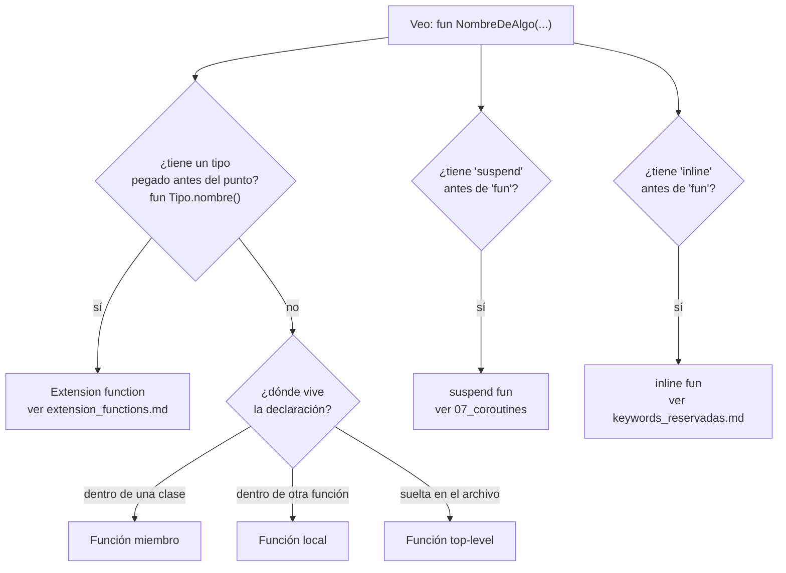

# Funciones en Kotlin: cómo identificar cada `fun`

## 1. Mapa del flujo



Frente a una `fun` que aparece en medio de código ajeno, estas cuatro preguntas se pueden hacer en cualquier orden y no son excluyentes entre sí — una misma función puede ser, a la vez, `suspend`, `inline`, y una extension function. El árbol resuelve la pregunta más común primero (¿es una extension function?), porque es la que menos se nota a simple vista si no se sabe exactamente qué buscar.

## 2. Qué es y cómo funciona

Una `fun` en Kotlin puede tomar formas muy distintas según dónde vive, qué recibe, qué devuelve y qué modificadores lleva pegados. Esta guía separa esas variantes en categorías concretas para poder identificarlas de un vistazo, sin tener que reexplicar cada mecanismo en profundidad — para eso ya existen archivos dedicados en el repo, a los que este archivo cross-linkea.

### Dónde vive la declaración

- **Top-level:** declarada suelta en un archivo `.kt`, fuera de cualquier clase — `fun formatOrderId(id: String): String = "#$id"`. Es la forma más simple, típica de funciones utilitarias sin estado propio.
- **Función miembro:** declarada dentro de una `class`/`object`/`interface` — pertenece a esa clase, tiene acceso a sus propiedades y a otros miembros sin calificar.
- **Función local:** declarada dentro del cuerpo de otra función — solo visible ahí adentro, útil para extraer un paso intermedio sin ensuciar el espacio de nombres del archivo con algo que solo tiene sentido en ese contexto puntual.

```kotlin
fun processOrders(orders: List<Order>): List<String> {
    fun formatOne(order: Order) = "#${order.id} — ${order.status}" // función local
    return orders.map { formatOne(it) }
}
```

### Cómo se identifica una extension function en medio del código

La señal sintáctica es el tipo pegado justo antes del punto, en la **declaración**: `fun OrderDto.toDomain()`. El detalle completo — por qué no accede a `private`, por qué no es polimórfica — vive en `extension_functions.md`; acá el punto es solo reconocerla al leer código ajeno.

### Variantes de sintaxis

- **Single-expression function:** cuando el cuerpo es una sola expresión, se puede escribir con `=` en vez de `{ }`, sin necesitar `return` explícito — `fun isPending(order: Order) = order.status == OrderStatus.PENDING`.
- **`infix fun`:** permite llamar la función sin punto ni paréntesis, como un operador propio — requiere exactamente un parámetro y ser función miembro o extension function. `infix fun Int.until(other: Int) = this..other-1` es un ejemplo de la propia stdlib; se llama `1 until 10`.
- **`operator fun`:** sobrecarga un operador del lenguaje (`+`, `[]`, `()`, etc.) con nombres predefinidos (`plus`, `get`, `invoke`) — `operator fun Order.plus(item: OrderItem) = copy(items = items + item)` habilita escribir `order + newItem`.

### Parámetros

- **Default parameters:** un parámetro con valor por defecto (`fun createOrder(status: OrderStatus = OrderStatus.PENDING)`) puede omitirse al llamar la función.
- **Named arguments:** al llamar, se puede especificar el nombre del parámetro (`createOrder(status = OrderStatus.CONFIRMED)`), útil cuando hay varios parámetros del mismo tipo y el orden posicional sería ambiguo de leer.
- **`vararg`:** acepta una cantidad variable de argumentos del mismo tipo, tratados como un array dentro de la función — `fun logAll(vararg messages: String)`.

### Funciones como valores: higher-order functions, function types y lambdas

Una **higher-order function** es una función que recibe otra función como parámetro, o devuelve una función. Para eso existe el **function type** — un tipo que describe la firma de una función, no una clase concreta: `(Order) -> Boolean` es "una función que recibe un `Order` y devuelve `Boolean`".

```kotlin
fun filterOrders(orders: List<Order>, predicate: (Order) -> Boolean): List<Order> =
    orders.filter(predicate)
```

Una **lambda** es la forma más común de pasarle una función a otra función sin declararla aparte — `orders.filter { it.status == OrderStatus.PENDING }`. La sintaxis de trailing lambda (el `{ }` fuera de los paréntesis cuando es el último parámetro) y el `it` implícito (cuando el lambda tiene un solo parámetro sin nombrar) son las dos razones por las que un lambda a veces "no se ve" como una función al leer el código — no hay ni `fun` ni un nombre visible.

Distinto de un lambda es una **función anónima** — tiene la palabra `fun` pero no tiene nombre: `val double = fun(x: Int) = x * 2`. Es menos común que un lambda, pero se identifica igual por tener `fun` sin nombre después.

Un caso especial de function type es el **lambda con receiver** — `Tipo.() -> Unit` en vez de `(Tipo) -> Unit`. Dentro de ese lambda, `this` se refiere implícitamente al `Tipo`, como si el cuerpo del lambda fuera una extension function temporal. Es la base de los builders/DSL de Kotlin, y explica por qué a veces aparece un `this` "de la nada" dentro de un lambda sin que se vea de dónde salió:

```kotlin
fun buildOrder(block: OrderBuilder.() -> Unit): Order {
    val builder = OrderBuilder()
    builder.block() // dentro del lambda que se le pase, "this" es el OrderBuilder
    return builder.build()
}
```

### `suspend fun` e `inline fun` — solo identificación acá

Una `fun` puede llevar `suspend` antes (`suspend fun getOrders(): List<Order>`), lo que indica que puede pausarse y reanudarse sin bloquear el hilo — la mecánica completa (continuation, structured concurrency) está en `07_coroutines_suspend_scope.md`. Una `fun` también puede llevar `inline` antes, lo que indica que su código se copia en cada sitio de llamada en vez de generar una llamada real — la mecánica completa, junto con `reified`/`crossinline`/`noinline`, está en `keywords_reservadas.md`.

## 3. Cómo se ve en distintos contextos

**App de fitness:** `inline fun <reified T : Exercise> Workout.exercisesOfType(): List<T>` combina varias categorías a la vez — es una extension function (sobre `Workout`), es `inline` con `reified` (necesita el tipo real en runtime), y es genérica. Reconocerla en código ajeno requiere aplicar el árbol de decisión completo: el punto antes del nombre indica extension, el `inline` antes de `fun` indica que copia su código, y el `reified` solo puede estar ahí porque la función ya es `inline`.

**App de e-commerce:** un builder de DSL para armar un filtro de búsqueda, `fun searchFilter(block: SearchFilterBuilder.() -> Unit): SearchFilter`, usa un lambda con receiver — quien lo llama escribe `searchFilter { category = "Electrónica"; maxPrice = 500.0 }` sin ningún `it.` ni nombre de builder visible, porque `this` dentro del lambda ya es el `SearchFilterBuilder` implícito.

## 4. Implementación real

El PO pide: *"Necesito una función que reciba la lista completa de pedidos y un filtro configurable por el caller, devuelva solo los pedidos que superan un monto mínimo (con un valor por defecto razonable), y loguee cuántos pedidos quedaron después de filtrar — sin bloquear mientras loguea, porque el logger es asíncrono."*

```kotlin
suspend fun filterOrdersAboveAmount(
    orders: List<Order>,
    minAmount: Double = 0.0,
    predicate: (Order) -> Boolean = { true }
): List<Order> {
    val filtered = orders.filter { it.total >= minAmount && predicate(it) }
    logFilterResult(orders.size, filtered.size)
    return filtered
}

private suspend fun logFilterResult(total: Int, filteredCount: Int) {
    AsyncLogger.log("Filtrados $filteredCount de $total pedidos")
}
```

Identificando cada pieza con el árbol de la sección 1: `filterOrdersAboveAmount` es `suspend` (puede suspenderse al loguear), top-level (no está dentro de ninguna clase), no es extension function (no tiene tipo antes del punto), tiene un default parameter (`minAmount: Double = 0.0`) y un parámetro de function type con su propio default (`predicate: (Order) -> Boolean = { true }`, un lambda vacío que acepta todo). `logFilterResult` es top-level también, pero `private` — visible solo dentro del archivo, no dentro de otra función.

Uso con trailing lambda y named argument combinados:

```kotlin
val premiumOrders = filterOrdersAboveAmount(
    orders = allOrders,
    minAmount = 100.0
) { order -> order.status == OrderStatus.CONFIRMED }
```

## 5. Buenas prácticas y errores comunes — qué auditar si te lo entrega la IA

- **¿Se confundió una extension function con una función miembro al leer o generar código?** Si la IA agregó una función pensando que iba a tener acceso a miembros `private` de una clase, pero en realidad la declaró como extension function (con el tipo antes del punto), va a fallar — revisar que el acceso a internals solo se asuma dentro de funciones miembro reales.

- **¿Un lambda con receiver se está usando donde un function type normal alcanzaba, agregando un `this` implícito innecesario y confuso?** Los lambda con receiver son la herramienta correcta para builders/DSL, pero si se usan para una función que no arma nada tipo builder, el `this` implícito solo agrega ambigüedad sin ningún beneficio real — un `(Tipo) -> Unit` con parámetro explícito es más legible en esos casos.

- **¿Se declaró una función anónima (`fun(x: Int) = x * 2`) donde un lambda simple (`{ x -> x * 2 }`) hubiera sido más idiomático?** Las funciones anónimas son poco comunes en Kotlin moderno — se justifican principalmente cuando se necesita especificar un tipo de retorno explícito que el lambda no puede inferir bien, o para usar `return` con comportamiento distinto al non-local return de un lambda. Si no hay una razón concreta, un lambda es preferible.

- **¿Los parámetros con default value están ordenados correctamente respecto a los que no lo tienen?** En Kotlin, los parámetros sin default pueden ir después de uno con default siempre que se llame con named arguments, pero si se llama posicionalmente, un parámetro sin default después de uno con default puede generar errores de compilación confusos o forzar a nombrar parámetros innecesariamente — revisar el orden pensando en cómo se va a llamar la función en la práctica.

- **¿Se usó `vararg` en una función donde en realidad se esperaba recibir una `List` ya armada?** Si el caller ya tiene una colección y la función espera `vararg`, hace falta el operador de spread (`*array`) para pasarla — si la IA no lo contempló, el código no va a compilar. Si el caso de uso siempre recibe una lista ya armada (nunca argumentos sueltos escritos a mano), `vararg` puede no ser la elección correcta frente a simplemente recibir `List<T>`.