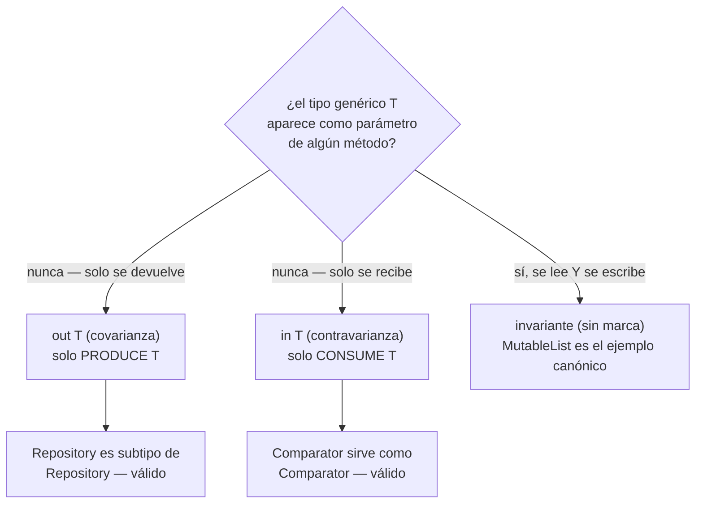

# Generics y Varianza (in / out)

## 1. Mapa del flujo



La pregunta del diagrama es la única que importa para decidir varianza: mirar **todos** los métodos de la interfaz genérica, no solo el que salta a la vista primero — si aunque sea uno de ellos recibe `T` como parámetro, `out` deja de ser una opción válida y el compilador lo va a rechazar.

## 2. Qué es y cómo funciona

Generics y varianza (`in`/`out`) controlan si un tipo genérico parametrizado es compatible en relaciones de subtipo.

- **`out T` (covarianza):** el tipo solo se produce (se devuelve), nunca se consume como parámetro.
- **`in T` (contravarianza):** el tipo solo se consume (se recibe como parámetro), nunca se devuelve.

```kotlin
interface ReadOnlyRepository<out T> {
    fun getAll(): List<T>
}
```

Sin varianza declarada, los tipos genéricos son **invariantes** por defecto: `Repository<Order>` y `Repository<Any>` no tienen ninguna relación de subtipo entre sí, aunque `Order` sea subtipo de `Any`. Esto es innecesariamente rígido para interfaces de solo lectura, donde en la práctica sí debería poder tratarse un `Repository<Order>` como un `Repository<Any>` sin ningún riesgo real de romper type safety, porque nunca se inserta nada en él.

Como resume el diagrama, la decisión de marcar `out`, `in`, o dejarlo invariante depende de revisar **cada** método de la interfaz genérica: si `T` aparece devuelto en algún método y recibido como parámetro en otro, no puede ser covariante ni contravariante — tiene que quedar invariante. `MutableList<T>` es el ejemplo canónico: `add(item: T)` consume `T`, `get(index): T` lo produce — si fuera covariante, sería posible insertar un tipo incorrecto en lo que el código cree que es una colección de otro tipo, rompiendo type safety en runtime.

Declarar `out`/`in` es una decisión de diseño de API que compromete el contrato hacia adelante: si se marca `out T` y más adelante se necesita agregar un método que reciba `T` como parámetro, el compilador va a impedir que compile — hay que pensar la forma final de la interfaz antes de decidir la varianza, no agregarla ni quitarla sobre la marcha.

## 3. Cómo se ve en distintos contextos

**App de fitness:** `interface WorkoutTemplateProvider<out T : WorkoutTemplate>` — un proveedor de plantillas de entrenamiento que solo las expone (`getTemplates(): List<T>`), nunca las recibe como parámetro. Gracias a `out`, un `WorkoutTemplateProvider<StrengthTemplate>` puede tratarse como `WorkoutTemplateProvider<WorkoutTemplate>` sin conversión explícita, útil si una pantalla genérica necesita mostrar plantillas de cualquier tipo sin importarle la subclase concreta.

**App de e-commerce:** `interface DiscountValidator<in T : Product>` — un validador de descuentos que solo consume productos (`isEligible(product: T): Boolean`), nunca los devuelve. Gracias a `in`, un `DiscountValidator<Product>` genérico sirve también como `DiscountValidator<PerishableProduct>` para código que solo maneja ese subtipo específico, sin necesitar un validador separado por cada subtipo de producto.

## 4. Implementación real

El PO pide: *"Necesito una interfaz de solo lectura para historiales — de pedidos, y a futuro capaz de otros tipos de historial (pagos, notificaciones) — que pueda tratarse de forma genérica en una pantalla que solo necesita mostrar 'algún tipo de historial' sin saber cuál específicamente."*

```kotlin
// domain/repository/ReadOnlyHistoryRepository.kt
interface ReadOnlyHistoryRepository<out T> {
    fun getAll(): Flow<List<T>>
    fun getById(id: String): Flow<T?>
}
```

Ambos métodos solo devuelven `T`, nunca lo reciben como parámetro — es un candidato limpio a `out`. Esto habilita el uso covariante:

```kotlin
val orderHistoryRepo: ReadOnlyHistoryRepository<Order> = OrderHistoryRepositoryImpl()

// válido gracias a "out" — una pantalla genérica puede tratar
// cualquier historial como si fuera de "Any", sin conversión explícita
fun observeAnyHistory(repo: ReadOnlyHistoryRepository<Any>) { /* ... */ }
observeAnyHistory(orderHistoryRepo)
```

El caso trampa, mostrado con el mismo dominio — agregar un método de escritura rompe la covarianza y el compilador lo rechaza directamente:

```kotlin
interface HistoryRepository<out T> {
    fun getAll(): Flow<List<T>>
    fun save(item: T) // ❌ ERROR de compilación: 'T' está en posición 'in' pero el parámetro es 'out'
}
```

La pregunta típica de entrevista que esto ilustra: ¿por qué `ReadOnlyHistoryRepository<out T>` tiene sentido pero el mismo repository con un método `save(item: T)` no? Porque covarianza solo es segura si `T` nunca aparece en posición de parámetro de entrada — si se permitiera, sería posible hacer `val anyRepo: HistoryRepository<Any> = orderRepo` y después llamar `anyRepo.save("cualquier string")`, insertando un tipo incorrecto en lo que en runtime sigue siendo un repositorio de `Order`.

El repository real de `Order`, que sí necesita escritura además de lectura, queda correctamente **invariante** — no es candidato a `out` ni `in`:

```kotlin
// domain/repository/OrderRepository.kt — invariante, consume Y produce Order
interface OrderRepository {
    fun getOrders(): Flow<List<Order>>
    suspend fun saveOrder(order: Order)
}
```

## 5. Buenas prácticas y errores comunes — qué auditar si te lo entrega la IA

- **¿Se marcó `out` en una interfaz sin revisar todos sus métodos, no solo el primero?** La trampa más común: ver `getAll(): List<T>` y asumir "esto es de solo lectura, marco `out`" sin notar que otro método de la misma interfaz recibe `T` como parámetro. El compilador lo rechaza, pero vale entender por qué antes de simplemente sacar la marca de varianza sin pensar si la interfaz debería dividirse en dos (una de lectura covariante, otra de escritura aparte).

- **¿Se dejó invariante (sin marca) una interfaz que en realidad solo produce o solo consume `T`?** Es el error inverso — no marcar `out`/`in` cuando sí correspondería no rompe nada, pero es una oportunidad de flexibilidad de subtipos perdida sin ningún costo real. Si la interfaz genuinamente es de solo lectura o solo escritura, marcar la varianza correcta es la forma más correcta de expresar esa intención en el tipo.

- **¿Se usó `MutableList<T>` (o cualquier colección mutable) con `out`, o se intentó marcar varianza sobre un tipo que el propio lenguaje ya define como invariante?** `MutableList`, `MutableMap`, y en general cualquier estructura que lee y escribe, son invariantes por diseño en la stdlib de Kotlin — no hay forma de forzar covarianza ahí sin comprometer type safety, y no es algo que se decida en el código propio.

- **¿La decisión de varianza se tomó pensando en el contrato final de la interfaz, o quedó "de paso" y ahora bloquea agregar un método necesario?** Si al querer agregar un método de escritura a una interfaz marcada `out` el compilador lo rechaza, la solución no es sacar `out` sin pensar (eso rompe todo el código que ya depende de la covarianza) — hay que evaluar si corresponde una interfaz separada para la parte de escritura, preservando la covarianza de la parte de lectura.

- **¿Se usó una variancia de sitio (`List<out T>` o `List<in T>` en el punto de uso, "use-site variance") cuando la variancia debería declararse en la propia interfaz genérica ("declaration-site variance")?** Kotlin permite ambas formas, pero si la interfaz es propia del proyecto y siempre se va a usar de la misma forma, declarar la varianza una sola vez en la interfaz (`interface Repo<out T>`) es más limpio que repetir `out`/`in` en cada punto de uso — el use-site variance tiene más sentido para tipos de terceros que no se pueden modificar.