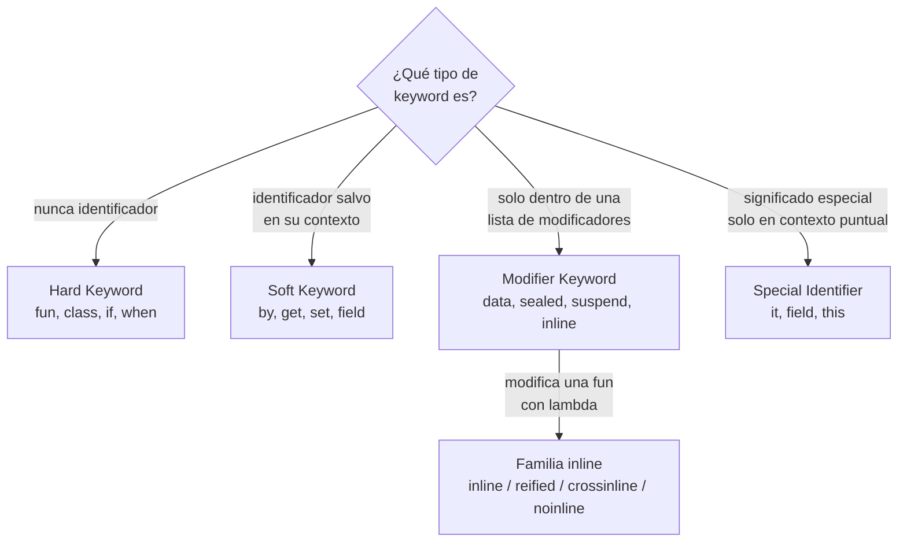

# Keywords Reservadas de Kotlin

## 1. Mapa del flujo



Las cuatro categorías (Hard/Soft/Modifier/Special Identifier) responden "¿puedo usar esta palabra como nombre de variable?". La familia `inline` es un caso particular de Modifier Keywords que merece su propio recorrido, porque no son cuatro palabras sueltas — son una sola decisión de diseño (`inline`) con tres modificadores derivados que afinan esa decisión (`reified`, `crossinline`, `noinline`).

## 2. Qué es y cómo funciona

Kotlin clasifica sus palabras reservadas en 4 categorías según cuán "estrictamente" ocupan el nombre: **Hard Keywords** (siempre son palabra clave, nunca se pueden usar como identificador salvo con backticks), **Soft Keywords** (son palabra clave solo en su contexto específico, en cualquier otro lado son identificadores normales), **Modifier Keywords** (actúan como palabra clave dentro de una lista de modificadores de una declaración) y **Special Identifiers** (definidos por el compilador solo en contextos muy puntuales, como `it` o `field`).

```kotlin
// "data" es Modifier Keyword — reservado SOLO antes de "class"
data class Order(val id: String)

// pero "data" fuera de ese contexto es un identificador válido
val data = "esto compila perfecto"
```

```kotlin
// "by" es Soft Keyword — reservado SOLO en delegación
var expanded by remember { mutableStateOf(false) }
```

Sin esta categorización, no hay forma de predecir si un nombre como `get`, `value`, `by` o `data` está disponible como nombre de variable/función propio o si va a chocar con el compilador. Entender la categoría de cada keyword evita dos errores típicos: usar por accidente un nombre reservado como identificador y no entender por qué falla, o asumir que una palabra es "reservada siempre" cuando en realidad es soft/modifier y solo aplica en un contexto puntual.

### La familia `inline` — el modifier menos obvio y más preguntado en entrevista

`inline` es un Modifier Keyword que se aplica sobre una función, no sobre una clase. Le indica al compilador que, en vez de generar una llamada real a la función, **copie el cuerpo de la función directamente en cada sitio donde se la llama** — el código de la función y de sus lambdas parámetro se "pegan" ahí, en tiempo de compilación.

```kotlin
inline fun <T> measureAndLog(label: String, block: () -> T): T {
    val start = System.currentTimeMillis()
    val result = block()
    println("$label tomó ${System.currentTimeMillis() - start}ms")
    return result
}
```

**Por qué existe:** cada función de orden superior (una función que recibe otra función como parámetro, típicamente un lambda) tiene un costo en runtime — cada lambda es un objeto que Kotlin compila a una clase, y esa clase se instancia en memoria cada vez que se la llama, además del costo de la llamada virtual en sí. `inline` elimina ese costo: al copiar el código directamente, no hay objeto lambda que crear ni llamada virtual que resolver — es exactamente como si hubieras escrito el cuerpo del lambda a mano en el lugar de la llamada.

`inline` habilita, además, dos cosas que una función normal no puede hacer:

- **`reified` (tipos genéricos reificados):** normalmente los generics de Kotlin sufren *type erasure* en la JVM — en runtime, no queda ningún rastro de qué era `T` (`List<Order>` y `List<String>` son, para la JVM, el mismo `List` a secas). Esto significa que dentro de una función genérica normal no se puede hacer `T::class` ni `is T` — el compilador no tiene esa información en runtime. Pero como una función `inline` copia su código en cada sitio de llamada, **el compilador sí sabe, en cada copia, cuál es el tipo real** — y con `reified`, se lo deja usar dentro del cuerpo de la función como si no hubiera type erasure. `reified` **solo existe sobre funciones `inline`** — es un modifier que depende del otro.

```kotlin
inline fun <reified T> Any?.isInstanceOf(): Boolean = this is T

val order: Any = Order("1", /* ... */)
println(order.isInstanceOf<Order>()) // true — sin reified, "is T" no compilaría
```

- **`crossinline`:** cuando un lambda se pasa a una función `inline`, por defecto ese lambda hereda un permiso especial — un `return` dentro del lambda puede cortar no solo el lambda, sino la función que lo contiene por fuera (un **non-local return**), porque al copiarse el código, ese `return` termina físicamente dentro de la función exterior. `crossinline` se usa cuando ese lambda se ejecuta en un contexto donde ese `return` no tendría sentido (por ejemplo, dentro de otro lambda anidado, o de forma diferida) — le prohíbe al lambda tener un `return` no-local, forzando que solo pueda terminar normalmente.

```kotlin
inline fun runInBackground(crossinline action: () -> Unit) {
    Thread { action() }.start() // action corre en otro contexto — un return acá no podría "volver" a la función original
}
```

- **`noinline`:** cuando una función `inline` recibe varios lambdas, por defecto **todos** se inlinean. `noinline` marca un lambda puntual para que **no** se copie — sigue siendo un objeto lambda real, lo cual es necesario si ese lambda se necesita guardar en una variable, devolver, o pasar a otra función que espera un objeto función (no se puede "guardar" código que fue copiado e insertado en el lugar de la llamada).

```kotlin
inline fun process(inlined: () -> Unit, noinline stored: () -> Unit) {
    inlined()          // se copia acá
    saveForLater(stored) // stored sigue siendo un objeto — se puede pasar como parámetro
}
```

## 3. Cómo se ve en distintos contextos

**App de fitness:** una función `inline fun <reified T : Exercise> filterExercisesByType(all: List<Exercise>): List<T> = all.filterIsInstance<T>()` usa `reified` para filtrar una lista heterogénea de ejercicios por subtipo concreto (`StrengthExercise`, `CardioExercise`) sin que el caller tenga que pasar la clase como parámetro extra (`filterExercisesByType<StrengthExercise>(exercises)` en vez de `filterExercisesByType(exercises, StrengthExercise::class)`).

**App de e-commerce:** un helper `inline fun <T> Result<T>.onSuccessLog(crossinline action: (T) -> Unit): Result<T>` usa `crossinline` porque internamente el lambda `action` se invoca dentro de otro lambda (`onSuccess { action(it) }`) — sin `crossinline`, el compilador rechazaría el `return` no-local porque no podría garantizar hacia dónde "volvería" ese return al estar anidado.

## 4. Implementación real

El PO pide: *"Necesito loguear cuánto tarda cada llamada de red del Historial de Pedidos, sin ensuciar cada UseCase con código de medición repetido."*

```kotlin
// util/Timing.kt
inline fun <T> measureAndLog(label: String, block: () -> T): T {
    val start = System.currentTimeMillis()
    val result = block()
    val elapsed = System.currentTimeMillis() - start
    Logger.d("$label tomó ${elapsed}ms")
    return result
}
```

Uso en el UseCase — el lambda `block` se copia directamente dentro del cuerpo de `getOrders()` en tiempo de compilación, sin costo de objeto lambda ni llamada virtual extra:

```kotlin
class GetOrderHistoryUseCase(private val repository: OrderRepository) {
    suspend fun invoke(): Result<List<Order>> = measureAndLog("GetOrderHistory") {
        repository.getOrders()
    }
}
```

Extendiendo el caso con `reified`, para un helper de deserialización genérica que necesita el tipo real en runtime — algo que sin `inline`/`reified` requeriría pasar `Order::class.java` como parámetro extra:

```kotlin
inline fun <reified T> String.decodeAs(): T = Json.decodeFromString<T>(this)

val order: Order = jsonString.decodeAs<Order>() // T = Order, disponible en runtime gracias a reified
```

Y el caso de `noinline`, si `measureAndLog` necesitara además guardar una referencia al bloque para reintentarlo más tarde (algo que un lambda inlineado no permite, porque no existe como objeto):

```kotlin
inline fun <T> measureLogAndRetryable(
    label: String,
    noinline block: suspend () -> T
): Pair<T, suspend () -> T> {
    // block se puede guardar y devolver porque NO fue inlineado
    return runBlocking { block() } to block
}
```

## 5. Buenas prácticas y errores comunes — qué auditar si te lo entrega la IA

- **¿Apareció un `else` "por las dudas" al usar `` `backtick` `` en un identificador que en realidad no lo necesitaba?** Usar backticks para nombrar algo como `` `class` `` o `` `object` `` es un recurso de último caso (interop con Java/JS donde el nombre ya viene dado), no una práctica recomendada para nombres propios nuevos — si la IA lo usó para esquivar una Hard Keyword en código nuevo, es mejor simplemente elegir otro nombre.

- **¿Se usó `inline` en una función grande o llamada desde muchos lugares del código?** `inline` copia el cuerpo completo en cada sitio de llamada — en una función grande usada en decenas de lugares, esto infla el tamaño del bytecode generado sin necesariamente justificar la ganancia de performance. `inline` rinde mejor en funciones cortas de utilidad o funciones de orden superior con lambdas simples, no en funciones con lógica extensa.

- **¿Se usó `reified` sin que la función sea `inline`?** No compila — `reified` depende directamente de `inline`, es un modifier que solo tiene sentido sobre una función que ya copia su código en el sitio de llamada. Si la IA intentó usar `reified` en una función normal, es una señal de que no entendió la dependencia entre ambos modifiers.

- **¿Falta `crossinline` en un lambda que se ejecuta dentro de otro contexto (otro lambda, un callback diferido, un hilo distinto) dentro de una función `inline`?** Si el compilador marca error de "non-local return not allowed", es señal de que ese lambda necesita `crossinline` — indica explícitamente que ese lambda en particular no puede cortar la función exterior con un `return`.

- **¿Falta `noinline` en un lambda parámetro de una función `inline` que necesita guardarse, devolverse, o pasarse a otra función que espera un objeto función real?** Si el compilador marca error de que el parámetro "can't be inlined" en ese contexto, es la señal de que ese lambda puntual necesita `noinline` para seguir existiendo como objeto en vez de copiarse.

- **¿Se está usando `data`, `sealed`, `suspend`, `operator` u otro Modifier Keyword fuera de una lista de modificadores de una declaración?** Los Modifier Keywords solo tienen significado especial pegados a una declaración concreta (`class`, `fun`, `val`) — si aparecen sueltos en cualquier otro contexto, son identificadores normales; ver el detalle de cómo se comportan en `data_class.md` y `sealed_class_interface.md`, donde `data` y `sealed` ya están cubiertos en profundidad.