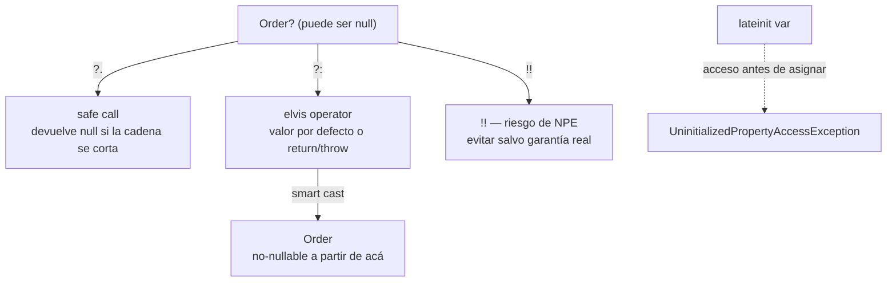

# Null Safety

## 1. Mapa del flujo



Tres caminos parten del mismo punto — un valor que puede ser `null` — y solo uno de ellos (`?:` con return/throw) termina garantizando al compilador que, de ahí en adelante, el tipo ya no es nullable. `!!` promete lo mismo pero sin que el compilador verifique nada: es una garantía manual, no verificada.

## 2. Qué es y cómo funciona

Null safety es el sistema de tipos de Kotlin que distingue en tiempo de compilación entre tipos que pueden ser null (`Order?`) y los que no (`Order`), evitando el `NullPointerException` en el punto de uso — el compilador obliga a manejar el caso null antes de que el código compile.

En lenguajes sin este sistema (Java clásico), cualquier referencia puede ser null en cualquier momento sin que el tipo lo indique, así que el `NullPointerException` puede aparecer en runtime en cualquier punto del código, sin aviso previo del compilador. Kotlin traslada ese chequeo al compilador: si un valor puede ser null, el tipo lo dice explícitamente (`Order?`), y no se puede usar como si no lo fuera sin antes resolver el caso null.

Como muestra el diagrama, hay tres herramientas principales para resolver ese caso null, y cada una responde una pregunta distinta:

- **`?.` (safe call):** "si es null, no hagas nada y devolveme null" — encadenable (`order?.items?.firstOrNull()?.productName`).
- **`?:` (elvis):** "si es null, usá este valor por defecto" o "si es null, cortá la ejecución acá" (`?: return`, `?: continue`, `?: throw ...`). Es la única de las tres que puede producir un **smart cast**: después de `val id = order?.id ?: return`, el compilador sabe que `order` no es null en el resto de la función.
- **`!!` (not-null assertion):** "confío en que esto no es null, y si me equivoco, que crashee ahí mismo" — es una garantía manual sin verificación del compilador, lo opuesto al espíritu de null safety.

Además del sistema `?`/`?:`/`!!`, Kotlin tiene una herramienta relacionada pero distinta para un problema distinto: **`lateinit var`**. Sirve para propiedades `var` no-nullables que no pueden inicializarse en el constructor pero se garantiza que van a tener un valor antes de usarse — típicamente inyección de dependencias que llega después de la construcción del objeto, o referencias a vistas que se resuelven en un ciclo de vida (`onCreate`, no en el constructor). La diferencia clave con `Order?`: `lateinit var order: Order` declara el tipo como no-nullable (`Order`, sin `?`), pero el compilador no puede verificar en compile-time que ya tiene un valor al momento de leerlo. Si se accede antes de asignar, no da `null` — tira `UninitializedPropertyAccessException` en runtime.

## 3. Cómo se ve en distintos contextos

**App de fitness:** al buscar el ejercicio actual dentro de una rutina, `workout.exercises.find { it.id == currentId }` devuelve `Exercise?` — si el usuario borró ese ejercicio de la rutina mientras la pantalla estaba abierta, la búsqueda no encuentra nada. La cadena `exercise?.name ?: "Ejercicio no disponible"` resuelve ese caso sin ningún `if` explícito, mostrando un texto de fallback en vez de crashear.

**App de e-commerce:** un ViewModel de Android con Hilt/Koin y `lateinit var analyticsTracker: AnalyticsTracker` es un caso típico — la dependencia se inyecta después de que el constructor corre (vía field injection), así que no puede ser un parámetro del constructor, pero se garantiza que va a estar lista antes de que cualquier método del ViewModel la use. Si por un bug de configuración de DI la inyección nunca ocurre, el primer uso de `analyticsTracker` tira `UninitializedPropertyAccessException`, no un `NullPointerException` silencioso — el mensaje de error ya te dice exactamente qué propiedad quedó sin inicializar.

## 4. Implementación real

El PO pide: *"Al tocar un pedido en el Historial, si el pedido ya no existe en la lista (por ejemplo se eliminó justo en ese instante) no debe pasar nada — no crashear, no mostrar una pantalla vacía rota."*

```kotlin
fun onOrderClicked(orderId: String) {
    val order = _state.value.orders.find { it.id == orderId } ?: return
    // a partir de acá, order es Order no-nullable (smart cast)
    emitEffect(OrdersEffect.NavigateToOrderDetail(order.id))
}
```

El `?: return` corta la ejecución temprano si el pedido no está — sin ese `find` devolver `Order?`, no habría forma de que el compilador te obligue a contemplar el caso "el pedido ya no existe". Encadenado con safe call, para mostrar un total formateado solo si hay un pedido seleccionado:

```kotlin
val totalText: String = selectedOrder?.total?.let { "$ $it" } ?: "Sin selección"
```

Y el caso de `!!`, mostrado para dejar explícito por qué se evita: acá no hay ninguna garantía de negocio real de que `find` vaya a encontrar algo, así que usar `!!` sería introducir un crash potencial donde el `?: return` ya resuelve el caso de forma segura:

```kotlin
// ❌ evitar — no hay garantía real de que el pedido exista en ese instante
val order = _state.value.orders.find { it.id == orderId }!!
```

Caso de `lateinit`, en el ViewModel recibiendo una dependencia por field injection en vez de por constructor (situación puntual donde el framework de DI lo requiere):

```kotlin
class OrdersViewModel : ViewModel() {
    @Inject lateinit var orderRepository: OrderRepository

    fun loadOrders() {
        viewModelScope.launch {
            // si orderRepository no fue inyectado a tiempo, esto tira
            // UninitializedPropertyAccessException, no NPE
            orderRepository.getOrders()
        }
    }
}
```

## 5. Buenas prácticas y errores comunes — qué auditar si te lo entrega la IA

- **¿Apareció `!!` como atajo genérico "para que compile", sin una garantía de negocio real y documentada en ese punto exacto?** Es la trampa más común: usar `!!` porque el código compila rápido reintroduce exactamente el riesgo de NPE que null safety fue diseñado para eliminar en compile-time. Si la IA lo usó, preguntarse: ¿hay alguna razón por la que este valor no puede ser null acá? Si no hay una respuesta concreta y verificable, hay que reemplazarlo por `?:` con un manejo explícito.

- **¿Se encadenaron demasiados `?.` seguidos (`a?.b?.c?.d`) escondiendo una cadena de responsabilidades ambigua?** Si `b` nunca debería ser null según las reglas de negocio, la solución correcta es modelar el tipo para que no lo sea desde el origen, no "tolerar" el null en cada nivel de la cadena con `?.`.

- **¿Se usó `lateinit` en una propiedad que en realidad debería ser un parámetro del constructor?** `lateinit` es necesario cuando el framework lo impone (field injection, `onCreate` de un lifecycle), pero si la propiedad puede recibirse en el constructor sin problema, eso es preferible — un constructor obliga a tener el valor antes de que el objeto exista, `lateinit` no.

- **¿Se usó `lateinit` sobre un tipo que en realidad admite null de forma legítima?** `lateinit` solo aplica a tipos no-nullables (no funciona con `Order?`, ni con tipos primitivos como `Int` sin boxing). Si el valor real puede no llegar nunca (no solo "llega después"), la herramienta correcta es `Order?` con el manejo de null habitual, no forzar `lateinit`.

- **¿El smart cast después de un `?: return`/`?: throw` se está aprovechando, o el código sigue tratando la variable como nullable innecesariamente después de ese punto?** Si ya se cortó la ejecución en caso de null, el compilador garantiza que el resto del bloque puede usar el valor como no-nullable sin repetir `?.` — repetirlo de ahí en más es ruido, señal de que no se entendió que el smart cast ya resolvió el caso.