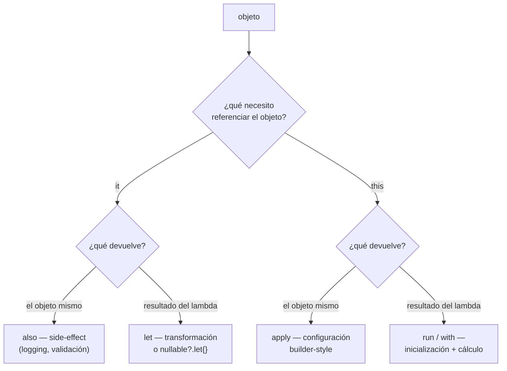

# Scope Functions (let, run, apply, also, with)

## 1. Mapa del flujo



Las cinco funciones resuelven el mismo problema genérico ("operar sobre un objeto sin repetir su nombre"), pero cada una responde una combinación distinta de dos preguntas: cómo referencian el objeto adentro del bloque (`it` vs `this`) y qué devuelven al terminar (el objeto mismo vs el resultado del lambda). El árbol de decisión es la forma más rápida de elegir la correcta sin memorizar las cinco de forma aislada.

## 2. Qué es y cómo funciona

Las scope functions (`let`, `run`, `apply`, `also`, `with`) son funciones de la stdlib de Kotlin que ejecutan un bloque de código en el contexto de un objeto, sin necesidad de nombrarlo repetidamente. Se diferencian en dos ejes: cómo referencian al objeto (`it` vs `this`) y qué devuelven (el objeto mismo vs el resultado del lambda).

| Función | Referencia | Devuelve | Es extension function |
|---|---|---|---|
| `let` | `it` | resultado del lambda | sí |
| `run` | `this` | resultado del lambda | sí (y también existe como no-extension) |
| `apply` | `this` | el objeto mismo | sí |
| `also` | `it` | el objeto mismo | sí |
| `with` | `this` | resultado del lambda | no — se llama `with(objeto) { }` |

Sin scope functions, operar sobre un objeto recién creado (configurarlo, transformarlo, o actuar solo si no es null) obliga a repetir el nombre de la variable en cada línea, o a declarar variables intermedias solo para un uso puntual. Esto ensucia el código con ruido que no aporta información — el lector tiene que rastrear el mismo identificador línea por línea en vez de ver de un vistazo "todo esto es sobre el mismo objeto".

Como resume la tabla, `with` es la única de las cinco que no es una extension function — por eso se llama distinto (`with(objeto) { }` en vez de `objeto.with { }`), y por eso no puede encadenarse sobre un valor nullable con `?.` como sí puede hacerse con las otras cuatro (`nullable?.let { }` compila, `nullable?.with { }` no existe).

## 3. Cómo se ve en distintos contextos

**App de fitness:** al construir un `WorkoutSession` recién creado, `apply` encaja para configurar varias propiedades mutables internas antes de exponerlo (`WorkoutSession().apply { startTime = now(); status = ACTIVE }`) — se aprovecha que `apply` devuelve el objeto mismo, así la expresión completa sigue siendo un `WorkoutSession` listo para usar.

**App de e-commerce:** al validar un carrito antes de proceder al checkout, `cart.takeIf { it.items.isNotEmpty() }?.let { proceedToCheckout(it) }` combina `takeIf` con `let` para actuar solo si la condición se cumple — un patrón común que evita un `if` explícito cuando la acción es una sola expresión encadenable.

## 4. Implementación real

El PO pide: *"Cuando se confirma un pedido, hay que loguear el evento sin cortar el flujo, y después calcular un resumen de texto para mostrar en un Snackbar."*

`also` para el side-effect de logging, sin alterar el flujo principal — el resultado de la expresión sigue siendo el `Order` original:

```kotlin
fun confirmOrder(order: Order): Order =
    order.copy(status = OrderStatus.CONFIRMED)
        .also { Logger.d("Pedido confirmado: ${it.id}, total: ${it.total}") }
```

`let` para transformar ese `Order` en un `String` de resumen — acá sí cambia el tipo del resultado, de `Order` a `String`:

```kotlin
val summaryText = confirmedOrder.let { order ->
    "Pedido #${order.id} confirmado — ${order.items.size} items, total $${order.total}"
}
```

`apply` al construir el `MutableStateFlow` inicial del ViewModel, configurando algo sobre el objeto recién creado antes de exponerlo (caso típico en el módulo de DI, `04_di/koin_fundamentos_y_scopes.md`):

```kotlin
private val _state = MutableStateFlow(OrdersState()).apply {
    // configuración adicional sobre el StateFlow recién creado, si hiciera falta
}
```

`nullable?.let { }` para actuar solo si hay un pedido seleccionado, patrón muy común en un `onClick` de UI:

```kotlin
selectedOrder?.let { order ->
    navigateToDetail(order.id)
}
```

`with` para agrupar varias llamadas sobre el mismo objeto no-nullable sin repetirlo, útil dentro de un bloque de construcción de UI o logging estructurado:

```kotlin
with(order) {
    Logger.d("id=$id, status=$status, total=$total")
}
```

## 5. Buenas prácticas y errores comunes — qué auditar si te lo entrega la IA

- **¿Se confundió `apply`/`also` (devuelven el objeto) con `let`/`run` (devuelven el resultado del lambda)?** Es el error más común. Si el código espera el resultado de la última expresión del bloque pero usó `apply`, el valor asignado va a ser el objeto original, no lo que parece que "devuelve" el bloque — un bug silencioso porque el código compila igual, solo el tipo/valor resultante es el incorrecto.

- **¿Hay scope functions anidadas al punto de que ya no queda claro a qué objeto refiere `it` o `this` en cada nivel?** Si la IA anidó dos o más `let`/`run` con `it` implícito, es más legible nombrar las variables explícitamente (`order.let { ord -> ... }` con nombre propio) que dejar `it` ambiguo entre niveles.

- **¿Se usó `let` solo para envolver código que no necesitaba ningún scope function (sin transformación de tipo, sin chequeo de null)?** Un `objeto.let { it.metodo() }` que podría ser simplemente `objeto.metodo()` es ruido innecesario — las scope functions se justifican cuando resuelven algo real (nullable, transformación, agrupación), no como hábito automático.

- **¿`with` se usó sobre un valor potencialmente nullable?** `with` no es extension function y no admite `?.` — si el objeto puede ser null, `with` no es la herramienta correcta (se necesitaría un `if`/`let` antes). Si la IA forzó `with(nullable!!) { }` para sortear esto, es una bandera roja: mezcla dos problemas (manejo de null + agrupación de llamadas) de la forma menos segura posible.

- **¿El uso de `apply` para configurar un objeto mutable expone ese objeto mutando después de haber sido "publicado"?** Si `apply` se usa para inicializar algo que después se comparte entre varias partes del código, verificar que ninguna otra referencia externa pueda seguir mutándolo por fuera del bloque — `apply` no aísla ni protege el objeto, solo agrupa configuración inicial.