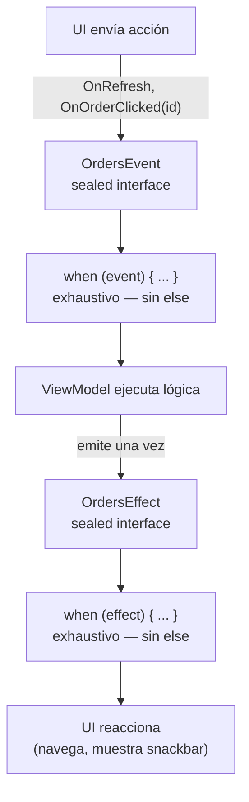

# Sealed Class / Sealed Interface

## 1. Mapa del flujo



`Event` y `Effect` entran y salen del ViewModel por caminos separados, pero ambos pasan por el mismo mecanismo: un `when` exhaustivo sobre un tipo sellado. El diagrama remarca que ese `when` nunca necesita `else` — es el compilador, no una convención de estilo, el que garantiza que no falta ningún caso.

## 2. Qué es y cómo funciona

`sealed class` / `sealed interface` restringen una jerarquía de tipos a un conjunto cerrado y conocido en tiempo de compilación — todas las subclases están declaradas en el mismo módulo/paquete. Esto permite que un `when` sobre un sealed type sea **exhaustivo**: el compilador obliga a cubrir todos los casos posibles, sin necesitar un `else`.

```kotlin
sealed interface OrdersEvent {
    data object OnRefresh : OrdersEvent
    data class OnOrderClicked(val orderId: String) : OrdersEvent
}
```

Como muestra el diagrama, el valor real de sellar un tipo no es solo organizativo — es que el compilador queda como garante de que ningún caso se procesa "en silencio". Si mañana se agrega un caso nuevo a `OrdersEvent` (por ejemplo `OnRetryClicked`), cada `when` exhaustivo que consuma ese tipo en todo el repo deja de compilar hasta que se agregue la rama correspondiente — el error aparece en compile-time, en el lugar exacto donde falta manejarlo, no como un bug silencioso en runtime.

`sealed interface` es la opción por defecto hoy: no requiere estado común compartido en una superclase, y permite que una subclase implemente esta jerarquía junto con otra (herencia múltiple de tipos, algo que `sealed class` no permite por ser clase). `sealed class` sigue siendo necesaria cuando sí hace falta una propiedad o comportamiento común implementado en la superclase que todas las subclases heredan — por ejemplo, un `abstract val timestamp: Long` con lógica compartida entre todos los casos.

## 3. Cómo se ve en distintos contextos

**App de fitness:** `WorkoutEffect` es `sealed interface` con `PlayCompletionSound` y `NavigateToSummary` — cosas que pasan una sola vez (un sonido, una navegación) y no tienen sentido como parte de un `State` persistente. Si mañana se agrega `ShowPersonalRecordBanner`, el `when` que consume `WorkoutEffect` en la UI deja de compilar hasta que se contemple el caso nuevo — nadie puede "olvidarse" de manejarlo.

**App de e-commerce:** `PaymentMethod` es un caso típico donde un `enum` no alcanza y hace falta `sealed interface` — `CreditCard(val lastFourDigits: String)` lleva datos que `CashOnDelivery` no tiene, y cada variante necesita propiedades distintas. Un `enum` obliga a que todos los valores tengan la misma forma; acá cada método de pago es conceptualmente distinto, no una simple etiqueta.

## 4. Implementación real

El PO pide: *"En la pantalla de Historial de Pedidos, el usuario puede pedir un refresh, reintentar si falló, o tocar un pedido para ver el detalle. Cuando toca un pedido hay que navegar; si el refresh falla pero ya había datos previos, mostrar un aviso puntual sin perder la lista vieja."*

```kotlin
// OrdersContract.kt

sealed interface OrdersEvent {
    data object OnRefresh : OrdersEvent
    data object OnRetryClicked : OrdersEvent
    data class OnOrderClicked(val orderId: String) : OrdersEvent
}

sealed interface OrdersEffect {
    data class NavigateToOrderDetail(val orderId: String) : OrdersEffect
    data class ShowSnackbar(val message: String) : OrdersEffect
}
```

Consumo exhaustivo de `OrdersEvent` en el ViewModel — cada rama del `when` es obligatoria, el compilador no permite omitir ninguna:

```kotlin
fun onEvent(event: OrdersEvent) {
    when (event) {
        OrdersEvent.OnRefresh -> refreshOrders()
        OrdersEvent.OnRetryClicked -> refreshOrders()
        is OrdersEvent.OnOrderClicked -> emitEffect(
            OrdersEffect.NavigateToOrderDetail(event.orderId)
        )
    }
}
```

Notá la diferencia entre `data object` (para `OnRefresh`/`OnRetryClicked`, que no llevan datos — un singleton sin estado) y `data class` (para `OnOrderClicked`, que sí necesita cargar el `orderId`). Ambos participan igual del `when` exhaustivo; la elección entre uno y otro depende únicamente de si el caso lleva datos propios o no.

Consumo del lado de la UI, reaccionando a `OrdersEffect` una sola vez por emisión (patrón completo de colección de `Effect` en `06_presentation_mvi/viewmodel.md`):

```kotlin
when (effect) {
    is OrdersEffect.NavigateToOrderDetail -> navController.navigate("order/${effect.orderId}")
    is OrdersEffect.ShowSnackbar -> snackbarHostState.showSnackbar(effect.message)
}
```

## 5. Buenas prácticas y errores comunes — qué auditar si te lo entrega la IA

- **¿Apareció un `else` "por las dudas" en un `when` sobre un sealed type?** Esto es lo primero a buscar y el error más frecuente: un `else -> {}` absorbe silenciosamente cualquier caso no contemplado, presente o futuro — elimina exactamente la garantía que sellar el tipo te da. Si la IA lo agregó, hay que sacarlo y dejar que el compilador marque error si falta un caso real.

- **¿Se usó `enum class` donde en realidad cada caso necesita llevar datos distintos?** Si algún caso de la jerarquía necesita una propiedad que otro no tiene (`OnOrderClicked(val orderId: String)` vs. `OnRefresh` sin datos), un `enum` no puede modelar eso — todos sus valores tienen la misma forma. Es señal de que debería ser `sealed interface`/`sealed class`.

- **¿`data object` se usó para los casos sin datos, en vez de `object` a secas o una `data class` vacía?** `data object` (Kotlin 1.9+) genera un `toString()` legible y comparación consistente, algo que un `object` simple no da tan cómodo y que una `data class` sin parámetros sería redundante. Si la IA usó `object` simple, no es un error grave, pero es la forma menos idiomática hoy.

- **¿Se eligió `sealed class` cuando `sealed interface` alcanzaba, o viceversa?** Si ninguna subclase necesita estado/comportamiento común heredado, y no hace falta herencia múltiple, `sealed interface` es la opción por defecto — usar `sealed class` sin necesitarla es sobre-ingeniería menor, pero vale señalarlo. El caso inverso (necesitar una propiedad común tipo `timestamp` y modelarla repetida en cada subclase de una `sealed interface` en vez de usar `sealed class`) sí es una falta de aprovechar la herramienta correcta.

- **¿Todas las subclases de la jerarquía están en el mismo paquete/módulo?** Sealed types requieren que todas las subclases sean conocidas en compile-time dentro del mismo módulo (con Kotlin moderno, mismo paquete alcanza dentro del módulo). Si la IA intentó extender una jerarquía sellada desde otro módulo o package sin que el proyecto lo permita, no va a compilar — y si el caso de uso real necesita que terceros externos extiendan la jerarquía libremente, sealed directamente no es la herramienta correcta.