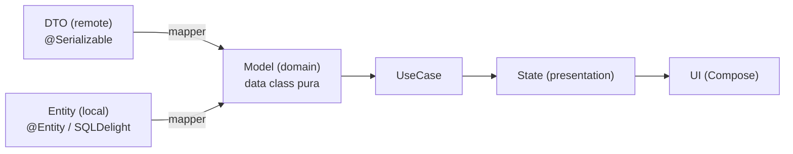

# model.md

## 1. Mapa del flujo



El Model es el punto de convergencia del diagrama: no importa si el dato entró por red o por disco, ambos caminos terminan mapeados al mismo tipo antes de subir. De ahí para arriba (UseCase → State → UI) todo el resto de la app habla un solo idioma, sin saber ni le importa de qué lado vino el dato originalmente.

## 2. Qué es y cómo funciona

El **Model** es la representación pura de un concepto del negocio, escrita como `data class` de Kotlin sin ninguna anotación ni dependencia de librería externa — nada de `@Entity`, `@Serializable`, `@Composable`. Vive en `domain/model/` y es el tipo que circula por Presentation y por los UseCases: el idioma común de toda la app.

Como muestra el diagrama, el Model nunca se construye directo desde una fuente externa — siempre hay un Mapper de por medio (`dto_entity_mappers.md`, en `03_data`) que traduce el tipo "sucio" de esa fuente (`OrderDto` con `@SerialName`, `OrderEntity` con `@Entity`) al Model puro. Esa traducción es la frontera: todo lo que está del lado de "DTO"/"Entity" puede cambiar libremente (renombrar un campo del backend, migrar de Room a SQLDelight) sin que ese cambio se propague hacia arriba, porque nunca cruza la frontera sin pasar por el Mapper.

Una consecuencia directa de ser un tipo puro: el Model no tiene por qué calcar la forma de ninguna fuente. Si el DTO trae fechas como `String` en formato ISO porque así las serializa el backend, el Model puede — y debería — modelarlas como `Instant` o `LocalDate`, porque el tipo correcto para representar una fecha en el dominio no depende de cómo la representa un JSON.

## 3. Cómo se ve en distintos contextos

**App de fitness:** `Workout` es el Model que junta datos de dos fuentes distintas — la rutina en sí viene de una API (`WorkoutDto`), pero el progreso del usuario (series completadas, peso usado) se guarda solo localmente (`WorkoutProgressEntity`). El Model combina ambos en un único `Workout` con toda la información que la UI necesita, sin que ni el UseCase ni el ViewModel tengan que saber que esos datos vinieron de dos lugares distintos.

**App de e-commerce:** `Product` en domain no tiene el campo `internalWarehouseCode` que sí trae el DTO del backend — ese código es un detalle logístico interno que ninguna pantalla de la app necesita mostrar ni manipular. El Mapper simplemente no lo copia al construir el `Product`. Esto ilustra que el Model no es un espejo 1:1 de la fuente: es el subconjunto de datos que el dominio realmente necesita, con la forma que el dominio necesita.

## 4. Implementación real

El PO pide: *"Necesito el Historial de Pedidos: cada pedido tiene una fecha, un estado, un total, y una lista de items — cada item con el nombre del producto, la cantidad pedida y el precio unitario."*

```kotlin
// domain/model/Order.kt
data class Order(
    val id: String,
    val date: Instant,
    val status: OrderStatus,
    val items: List<OrderItem>,
    val total: Double
)

enum class OrderStatus {
    PENDING, CONFIRMED, DELIVERED, CANCELLED
}
```

```kotlin
// domain/model/OrderItem.kt
data class OrderItem(
    val productName: String,
    val quantity: Int,
    val unitPrice: Double
)
```

Dos decisiones a notar. Primero, `date` es `Instant`, no `String` — aunque el `OrderDto` remoto probablemente traiga la fecha como texto ISO-8601, el Mapper la parsea antes de que llegue a domain, porque el tipo correcto para una fecha es una fecha, no un texto con forma de fecha. Segundo, `status` es un `enum class` cerrado en vez de un `String` libre — si el backend manda `"pendiente"` en español o `"PENDING"` en mayúsculas según el endpoint, ese caos se resuelve una sola vez en el Mapper; domain solo conoce cuatro estados posibles, y cualquier valor inesperado del backend se detecta ahí, no se arrastra silenciosamente hasta la UI.

`OrderItem` vive anidado dentro de `Order` como `List<OrderItem>` — no como un tipo separado que haya que ir a buscar con otro ID. El puente hacia `03_data`: la traducción real de `OrderDto`/`OrderEntity` a estos dos tipos se ve en detalle en `dto_entity_mappers.md`.

## 5. Buenas prácticas y errores comunes — qué auditar si te lo entrega la IA

- **¿El `data class` importa algo de `kotlinx.serialization`, Room, SQLDelight o Compose?** Cualquier import de esas librerías dentro de `domain/model/` es una violación directa de la frontera — el Model tiene que compilar sin ninguna de esas dependencias en el classpath del módulo domain.

- **¿Los tipos son los correctos para el dominio, o son los tipos "cómodos" de la fuente de datos?** Una fecha como `String`, un estado como `String` libre en vez de `enum`, o un ID que debería ser un value class y quedó como `String` sin ninguna validación — son señales de que el Model se armó copiando la forma del DTO/Entity en vez de pensar qué necesita realmente el dominio.

- **¿Hay algún campo puramente técnico de una fuente (`etag`, `syncedAt`, `internalWarehouseCode`) filtrado en el Model?** Si un campo solo tiene sentido para la lógica interna de una fuente de datos y ninguna pantalla ni UseCase lo necesita, no debería estar en domain — es responsabilidad del Mapper dejarlo del lado de data.

- **¿El Model tiene lógica de negocio real, o quedó reducido a un simple contenedor de datos?** Un `data class` puede (y a veces debería) tener funciones propias si esa lógica es intrínseca al concepto — por ejemplo, `Order.isEditable(): Boolean = status == OrderStatus.PENDING`. Lo que no debería tener es dependencias de infraestructura ni lógica de presentación (formateo de texto, colores) — esa línea es la misma que separa domain de las otras capas.

- **¿Cuándo hay más de una fuente para el mismo concepto (local + remoto), el Model tiene algún campo que solo una de las dos fuentes puede llenar, sin que quede claro qué pasa si esa fuente falta?** Revisar si ese campo debería ser nullable de forma justificada, o si el Mapper que combina ambas fuentes tiene un valor por defecto explícito — un campo nullable "por las dudas" sin ninguna razón de negocio suele ser síntoma de que no se pensó bien el caso de una sola fuente disponible.