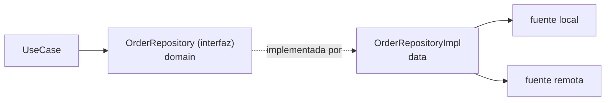

# repository_contracts.md

## 1. Mapa del flujo



El contrato es el punto donde se invierte la flecha de dependencia: `UseCase` depende de `OrderRepository` (una interfaz que vive en domain), y es `OrderRepositoryImpl` (en `data`) la que depende de esa interfaz para implementarla — nunca al revés. Esa flecha punteada del medio es la Dependency Rule en estado puro: domain nunca importa nada de `data`, es `data` quien mira hacia domain.

## 2. Qué es y cómo funciona

Un **Repository contract** es una `interface` de Kotlin que declara *qué* operaciones de datos existen, sin decidir *cómo* se resuelven. Vive en `domain/repository/` y es pura firma — cero detalles de Ktor, Room, SQLDelight, DataStore o cualquier otra tecnología. La implementación real vive del otro lado de la frontera, en `data`, y es la única pieza del sistema que sabe de dónde vienen los datos realmente.

Como muestra el diagrama, esto invierte la dependencia que existiría naturalmente si el UseCase dependiera directo de la clase concreta: si `RefreshOrdersUseCase` conociera `OrderRepositoryImpl`, domain quedaría acoplado a una decisión de infraestructura, y cualquier cambio de tecnología (migrar de una fuente local a otra, agregar sincronización remota) obligaría a tocar código en una capa que conceptualmente no tiene nada que ver con esa decisión. El contrato existe exactamente para evitar eso: domain declara la interfaz que necesita, `data` depende de domain para cumplirla.

Una consecuencia directa, más allá del desacoplamiento: la firma del contrato solo expone tipos de domain (`Order`, `Flow<List<Order>>`) — nunca DTOs ni Entities. Si un DTO o una Entity aparece en la firma de un método del contrato, la frontera ya está rota, sin importar qué tan "prolija" se vea la interfaz.

## 3. Cómo se ve en distintos contextos

**App de fitness:** `WorkoutRepository` expone `fun observeActiveWorkout(): Flow<Workout?>` y `suspend fun completeSet(setId: String)` — nada más. La implementación combina una fuente local (progreso guardado) con una API (catálogo de rutinas), pero esa orquestación es un detalle que el contrato ni sugiere: el UseCase que llama a `observeActiveWorkout()` no tiene forma de saber, ni le importa, si por detrás hay una o dos fuentes de datos.

**App de e-commerce:** el equipo migra `ProductRepositoryImpl` de una implementación que usaba solo caché en memoria a una que persiste en disco con expiración — un cambio de infraestructura considerable. `ProductRepository` (el contrato) no cambia una sola línea, porque la firma (`fun getProducts(): Flow<List<Product>>`) sigue siendo la misma. Ningún UseCase ni ViewModel se entera del cambio.

## 4. Implementación real

El PO pide lo mismo que ya venimos resolviendo en `model.md` y `usecases.md`: el Historial de Pedidos, con su refresh manual contra el backend.

```kotlin
// domain/repository/OrderRepository.kt
// Solo el contrato: QUÉ se puede hacer, sin ninguna pista de CÓMO.
interface OrderRepository {
    fun getOrderHistory(): Flow<List<Order>>
    suspend fun refreshOrders()
}
```

La implementación vive del otro lado de la frontera, en `data`, y es la única que sabe qué tecnología hay detrás — el detalle completo de cómo `OrderRepositoryImpl` combina fuente local y remota está en `repository_impl.md` (`03_data`); acá solo importa la forma del contrato que esa implementación tiene que cumplir:

```kotlin
// data/repository/OrderRepositoryImpl.kt
// Acá sí importa la tecnología concreta — domain nunca ve este archivo.
class OrderRepositoryImpl(
    private val localDataSource: OrderLocalDataSource,
    private val remoteDataSource: OrderRemoteDataSource
) : OrderRepository {

    override fun getOrderHistory(): Flow<List<Order>> =
        localDataSource.observeOrders()

    override suspend fun refreshOrders() {
        val freshOrders = remoteDataSource.fetchOrders()
        localDataSource.saveOrders(freshOrders)
    }
}
```

Los dos UseCases de `usecases.md` dependen únicamente de la interfaz, nunca de `OrderRepositoryImpl`:

```kotlin
// domain/usecases/GetOrderHistoryUseCase.kt
class GetOrderHistoryUseCase(private val repository: OrderRepository) {
    operator fun invoke(): Flow<List<Order>> = repository.getOrderHistory()
}
```

Notar que el contrato tiene solo dos métodos, y ninguno de los dos expone *cómo* se resuelve — `refreshOrders()` no dice si hay una fuente local involucrada, ni `getOrderHistory()` dice si el `Flow` viene de una base de datos o de una simple lista en memoria. Esa es la señal de un contrato bien diseñado: la firma describe la operación de negocio, no la estrategia técnica detrás.

## 5. Buenas prácticas y errores comunes — qué auditar si te lo entrega la IA

- **¿La firma de algún método del contrato expone un DTO o una Entity, en vez de un tipo de domain?** Un parámetro o tipo de retorno que viene de `data` (`OrderDto`, `OrderEntity`) en una interfaz de `domain/repository/` es una violación directa de la frontera — el contrato tiene que compilar sin conocer esos tipos.

- **¿El contrato incluye algún detalle de implementación — parámetros de paginación de una API específica, nombres de columnas, cursores de una query — en vez de la operación de negocio pura?** Eso es responsabilidad de cómo `RepositoryImpl` decide resolver la operación, no de qué operación existe. `fun getOrderHistory(cursor: String, pageSize: Int): Flow<List<Order>>` filtra una decisión de paginación de API hacia domain, que no debería saber que eso existe.

- **¿Hay un método que mezcla dos conceptos sin relación semántica solo porque "ya está inyectado ahí"?** El caso típico es agregar `fun isOnline(): Boolean` a `OrderRepository` porque el ViewModel ya lo tiene inyectado y "es rápido". La conectividad de red no es una operación sobre pedidos — es una capacidad de plataforma que merece su propio contrato (`ConnectivityObserver` o similar), inyectado donde haga falta, sin forzarlo dentro de un repository que semánticamente no tiene nada que ver.

- **¿El contrato tiene un solo método que en realidad esconde una orquestación de múltiples fuentes con lógica propia, sin que eso se note desde la firma?** Está bien que `OrderRepositoryImpl` combine local + remoto — lo que no está bien es que el contrato prometa algo distinto de lo que entrega. Si `refreshOrders()` en la práctica también actualiza analytics o dispara una notificación, esa responsabilidad extra debería ser visible desde el nombre del método o documentada, no un efecto secundario oculto detrás de una firma inocente.

- **¿Existe una sola implementación real y eso se usó como excusa para saltear el contrato?** Es una objeción válida en apps chicas — "¿para qué la interfaz si total solo hay un `OrderRepositoryImpl`?" — pero el valor no está en tener múltiples implementaciones simultáneas: está en la testeabilidad. Sin el contrato, testear `RefreshOrdersUseCase` obligaría a instanciar (o mockear con herramientas pesadas) la implementación real con su fuente local y remota reales; con el contrato, se inyecta un `FakeOrderRepository` liviano que cumple la interfaz sin tocar ninguna base de datos ni red real (ver `12_testing`, `fakes_vs_mocks_turbine.md`).