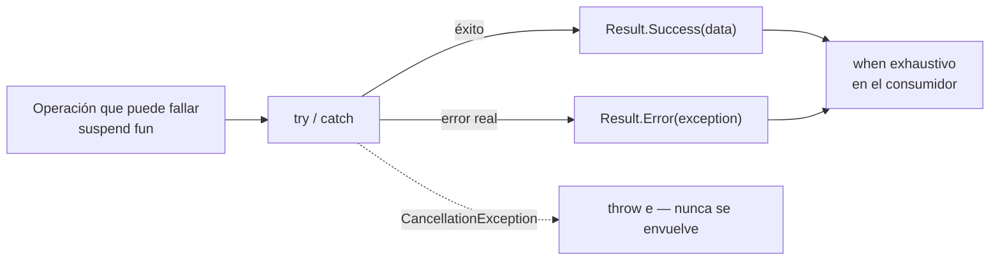

# result_pattern.md

## 1. Mapa del flujo



El diagrama deja ver algo que no es obvio a simple vista: de las tres salidas posibles del `try/catch`, solo dos terminan convertidas en `Result` — la tercera (`CancellationException`) tiene una salida propia que la saca del flujo normal antes de llegar al `when`. Esa rama punteada es la que se profundiza en la sección 5, y con más detalle todavía en `07_-_supervisorjob_excepciones.md` (sección 6, "Profundización").

## 2. Qué es y cómo funciona

El **Result Pattern** es un tipo envoltorio (`sealed interface`) que representa el resultado de una operación que puede fallar, sin depender de que las excepciones se propaguen sin control. Vive en `domain/util/` y tiene dos ramas cerradas: éxito con un dato, o error con una excepción.

```kotlin
sealed interface Result<out T> {
    data class Success<T>(val data: T) : Result<T>
    data class Error(val exception: Throwable) : Result<Nothing>
}
```

Sin este tipo, una función que puede fallar tiene dos caminos típicos, y ambos son problemáticos. El primero es lanzar excepciones directo — `suspend fun refreshOrders(): Unit` que puede tirar `IOException` en cualquier punto sin que la firma lo diga, así que quien la llama no tiene ninguna garantía en tiempo de compilación de que debe manejar el error; se entera recién en runtime, cuando la excepción llega sin `catch`. El segundo camino es devolver `null` en caso de error — pero eso pierde información: un `null` no distingue "no hay pedidos" de "falló la conexión al backend", dos situaciones que la UI necesita mostrar de forma completamente distinta.

`Result` resuelve ambos problemas a la vez: la firma deja explícito que la operación puede fallar (`Result<Unit>`), y el `sealed interface` obliga —vía `when` exhaustivo— a manejar ambos casos en el punto de consumo, sin poder ignorar el error por accidente. El costo es un nivel de indirección extra en cada punto de consumo (desenvolver el tipo con `when`); la ganancia es eliminar una categoría entera de bugs de "excepción no capturada que crashea la app", porque el compilador no deja ignorar el caso de error silenciosamente.

**Este tipo no aplica a todo por igual.** Como se detalla en `usecases.md`, `Result` envuelve operaciones de acción puntual (`suspend`, que terminan una vez) — nunca un `Flow` reactivo, que no tiene un "desenlace" al cual `Result` pueda aplicarse.

## 3. Cómo se ve en distintos contextos

**App de fitness:** `CompleteSetUseCase` devuelve `Result<Unit>` — la operación puede fallar si el set ya estaba marcado como completo (validación de negocio) o si la escritura a disco falla. El ViewModel resuelve el `when` y decide si mostrar el set como completado o un mensaje de error puntual, sin que ninguna excepción cruda llegue nunca a esa capa.

**App de e-commerce:** `ConfirmPaymentUseCase` devuelve `Result<Order>` en vez de `Result<Unit>` — cuando la operación tiene éxito, el consumidor necesita el pedido recién creado (para navegar a la pantalla de confirmación con su ID), no solo saber que "salió bien". Esto ilustra que el tipo que envuelve `Result<T>` no tiene por qué ser `Unit`: es el dato real que el éxito de esa operación puntual produce.

## 4. Implementación real

Retomando `RefreshOrdersUseCase` de `usecases.md` — el PO pidió que el botón "Actualizar" del Historial de Pedidos traiga los datos más recientes del backend, y que la pantalla pueda distinguir si el refresh salió bien o falló.

```kotlin
// domain/util/Result.kt
// out T: covariante porque Result solo PRODUCE T, nunca lo recibe como parámetro.
sealed interface Result<out T> {
    data class Success<T>(val data: T) : Result<T>
    data class Error(val exception: Throwable) : Result<Nothing>
}
```

```kotlin
// domain/usecases/RefreshOrdersUseCase.kt
class RefreshOrdersUseCase(private val repository: OrderRepository) {
    suspend operator fun invoke(): Result<Unit> {
        return try {
            repository.refreshOrders()
            Result.Success(Unit)
        } catch (e: CancellationException) {
            throw e // nunca capturar la cancelación — hay que dejarla propagarse
        } catch (e: Exception) {
            Result.Error(e)
        }
    }
}
```

Consumo exhaustivo desde el ViewModel — el compilador exige cubrir ambos casos:

```kotlin
private fun refreshOrders() {
    viewModelScope.launch {
        when (val result = refreshOrdersUseCase()) {
            is Result.Success -> _state.update { it.copy(refreshError = null) }
            is Result.Error -> _state.update { it.copy(refreshError = result.exception.message) }
        }
    }
}
```

El `catch (e: CancellationException) { throw e }` antes del `catch (e: Exception)` genérico es la pieza que evita que una cancelación real (el usuario saliendo de la pantalla mientras el refresh está en vuelo) termine mostrada como "Error: StandaloneCoroutine was cancelled" en la UI — el detalle cronológico completo de por qué esa excepción aparece justo ahí y cómo viaja hasta este `catch` está desarrollado en `07_-_supervisorjob_excepciones.md`, sección 6.

## 5. Buenas prácticas y errores comunes — qué auditar si te lo entrega la IA

- **¿El `catch` genérico atrapa `CancellationException` sin relanzarla?** Es el error más común y más difícil de detectar en review — el código compila, el happy path funciona, y el bug solo aparece cuando alguien navega fuera de la pantalla en el momento exacto en que esa operación está en curso. Ver `07_-_supervisorjob_excepciones.md` para el detalle completo de por qué esto rompe la propagación de cancelación.

- **¿Aparece `Result.Loading` como tercera rama del `sealed interface`?** El estado de carga no es el resultado de una operación finalizada — es estado transitorio de presentation, y pertenece al `State` del ViewModel (`isLoading: Boolean`), no a `Result`. Mezclar ambas responsabilidades en el mismo tipo es una señal de que no se entendió qué representa cada uno.

- **¿Un `Flow` reactivo (como `GetOrderHistoryUseCase` de `usecases.md`) viene envuelto en `Result`?** Es el error simétrico al anterior, señalado en detalle en `usecases.md` — `Result` modela el desenlace de una operación puntual, y un `Flow` reactivo no tiene ese desenlace mientras alguien lo esté coleccionando.

- **¿`Result.Error` expone el `Throwable` crudo hasta la UI, en vez de un mensaje o código de error ya interpretado?** Pasar `exception.message` directo a un `Text()` funciona para debug, pero en producción termina mostrando mensajes técnicos ("SocketTimeoutException") a un usuario final. Auditar si existe una capa (típicamente en el ViewModel, al consumir el `when`) que traduzca el tipo de excepción a un mensaje de negocio antes de llegar al `State`.

- **¿Se envuelve en `Result` una función que en la práctica nunca puede fallar de una forma relevante para el dominio** (una transformación pura, un cálculo matemático)? Es ceremonia sin propósito — `Result` se justifica cuando existe un fallo real y esperable (red, disco, validación de negocio) que el consumidor necesita distinguir explícitamente del éxito.

- **¿El `when` que consume el `Result` es realmente exhaustivo, o tiene un `else` que lo vuelve innecesario?** Un `else -> {}` sobre un `sealed interface` de dos ramas anula la garantía del compilador que es la razón de ser de este patrón — si mañana se agrega una tercera rama a `Result`, el compilador ya no va a poder avisar que ese `when` quedó incompleto.