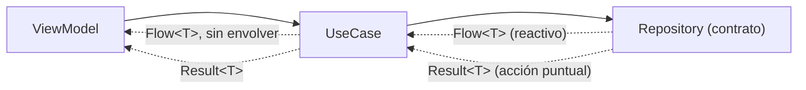

# usecases.md

## 1. Mapa del flujo



Dos caminos salen de `Repository` hacia `UseCase`, y el diagrama los deja separados a propósito: uno es un `Flow` que vive mientras alguien lo colecte (una lista que se actualiza sola), el otro es un `Result` que resuelve una vez y termina (guardar algo, refrescar algo). Un mismo módulo `domain` normalmente tiene UseCases de ambos tipos — la sección 2 explica cuándo es cada uno.

## 2. Qué es y cómo funciona

Un **UseCase** encapsula una sola acción de negocio en una clase con una única responsabilidad. Recibe lo que necesita (típicamente un `Repository`), valida las reglas de negocio de esa acción puntual, y expone un solo método de entrada vía `operator fun invoke()`. Vive en `domain/usecases/` — una clase por acción, nunca una clase "manager" con métodos sueltos para todo.

**Los dos patrones del diagrama no son intercambiables — responden a naturalezas distintas de la operación:**

- **UseCase reactivo:** envuelve una operación que expone un `Repository` como `Flow<T>` — datos que cambian con el tiempo y que alguien quiere observar de forma continua (la lista de pedidos, que se actualiza sola cuando llega uno nuevo). Este tipo de UseCase típicamente **no envuelve el resultado en `Result`** — devuelve el `Flow` tal cual, porque `Result` modela el desenlace de una operación que termina, y un `Flow` reactivo, por definición, no "termina": vive mientras alguien lo colecte. Si hace falta manejar un error dentro de ese `Flow`, se resuelve con el operador `.catch { }` sobre el propio `Flow` (ver `operadores_flow.md`), no envolviendo cada emisión en `Result.Success`/`Result.Error`.

- **UseCase de acción puntual:** envuelve una operación `suspend` que se ejecuta una vez y termina — guardar algo, refrescar contra el backend, borrar un registro. Acá sí aplica `Result<T>` de punta a punta (ver `result_pattern.md`): la operación puede fallar de forma esperable, y quien la llama necesita un `when` exhaustivo para reaccionar a éxito o error.

La confusión típica es tratar de forzar uno en la forma del otro: envolver un `Flow` reactivo en `Result<Flow<T>>` no tiene sentido (el `Result` solo diría si *arrancar a observar* salió bien, no si cada emisión es válida), y devolver un `Flow` para una acción puntual que en realidad solo necesita ejecutarse una vez agrega complejidad de colección donde alcanzaba con `suspend fun`.

## 3. Cómo se ve en distintos contextos

**App de fitness:** `ObserveActiveWorkoutUseCase` es reactivo — devuelve `Flow<Workout?>` directo desde el repositorio, porque la rutina activa puede cambiar en cualquier momento (el usuario la pausa, la cambia desde otra pantalla) y la UI necesita enterarse sola. En cambio `CompleteSetUseCase` es de acción puntual — `suspend operator fun invoke(setId: String): Result<Unit>`, valida que el set no esté ya completado antes de guardar, y termina.

**App de e-commerce:** `GetCartUseCase` es reactivo, expone el carrito como `Flow<Cart>` para que el ícono del carrito en la barra superior se actualice solo apenas se agrega un producto desde cualquier pantalla. `ConfirmPaymentUseCase` es de acción puntual — combina, además, más de un `Repository` (`PaymentRepository` para procesar el cobro, `CartRepository` para vaciar el carrito si el pago fue exitoso), y devuelve `Result<Order>` con el pedido recién creado.

## 4. Implementación real

El PO pide: *"El Historial de Pedidos tiene que mostrarse solo (sin que el usuario tenga que refrescar a mano) y necesita un botón de 'Actualizar' que traiga los pedidos más recientes del backend."* — dos acciones de negocio distintas, dos UseCases distintos.

```kotlin
// domain/usecases/GetOrderHistoryUseCase.kt
// Reactivo: expone el Flow del repositorio tal cual, sin envolver en Result.
class GetOrderHistoryUseCase(private val repository: OrderRepository) {
    operator fun invoke(): Flow<List<Order>> = repository.getOrderHistory()
}
```

```kotlin
// domain/usecases/RefreshOrdersUseCase.kt
// Acción puntual: suspend, con Result porque puede fallar (sin conexión, error del servidor).
class RefreshOrdersUseCase(private val repository: OrderRepository) {
    suspend operator fun invoke(): Result<Unit> {
        return try {
            repository.refreshOrders()
            Result.Success(Unit)
        } catch (e: CancellationException) {
            throw e
        } catch (e: Exception) {
            Result.Error(e)
        }
    }
}
```

`GetOrderHistoryUseCase` hoy es un passthrough puro — no valida ni transforma nada, solo delega en `repository.getOrderHistory()`. Se justifica igual, porque la fuente de datos por debajo (`03_data`) ya tiene una estrategia local-first no trivial (`repository_impl.md`), y el UseCase es el punto de extensión natural si mañana aparece una regla real (por ejemplo, filtrar pedidos cancelados del historial que ve el usuario). `RefreshOrdersUseCase` sí tiene trabajo real: traduce cualquier excepción de la operación de refresh en un `Result` explícito, cuidando de relanzar `CancellationException` sin capturarla (ver `result_pattern.md`, sección 5).

## 5. Buenas prácticas y errores comunes — qué auditar si te lo entrega la IA

- **¿Un UseCase reactivo (`Flow<T>`) viene envuelto en `Result`, tipo `Result<Flow<T>>` o `Flow<Result<T>>` sin que haga falta?** Es la trampa más específica de este archivo. Salvo un caso real de necesitar distinguir estados por emisión (poco común y normalmente mejor resuelto con un `sealed class` de UI State, no con `Result`), un `Flow` reactivo se expone tal cual — los errores se manejan con `.catch{}` sobre el propio `Flow`.

- **¿Un UseCase de acción puntual (`suspend`) devuelve el resultado crudo, sin `Result`, dejando que una excepción se propague sin control hasta quien lo llama?** Si la operación puede fallar de forma esperable (red, disco, validación), el llamador necesita una forma explícita de manejar ambos casos — ver `result_pattern.md` para por qué eso no debería resolverse con `try/catch` disperso en cada ViewModel.

- **¿El UseCase es un passthrough sin ninguna lógica (`fun invoke() = repository.algo()`)? ¿Hay evidencia real de que eso vaya a cambiar pronto, o es indirección sin propósito?** Si no hay ninguna regla de negocio previsible, cuestionar si el UseCase se justifica o si el ViewModel podría llamar al `Repository` directo.

- **¿La "regla de negocio" que el UseCase valida es en realidad lógica de presentación (formatear texto, decidir un color)?** Eso pertenece al ViewModel, no a domain — si el UseCase empieza a decidir cómo se ve algo en vez de si algo es válido, la responsabilidad se mezcló.

- **¿Un UseCase que combina más de un `Repository` (como `ConfirmPaymentUseCase` en el ejemplo de e-commerce) maneja correctamente el caso en que la primera operación tiene éxito pero la segunda falla?** Si `confirmPayment()` tiene éxito pero `emptyCart()` falla después, revisar si el UseCase deja el sistema en un estado a medias (pago cobrado, carrito no vaciado) sin ninguna estrategia — ese es justo el tipo de caso borde que un passthrough simple no expone, pero un UseCase que orquesta dos repositorios sí necesita resolver explícitamente.

- **¿El `CancellationException` se relanza en el `catch`, o queda absorbida junto con las excepciones reales?** Mismo chequeo que en `result_pattern.md` — capturar `Exception` genérico sin distinguir la cancelación rompe la propagación de `structured concurrency`.