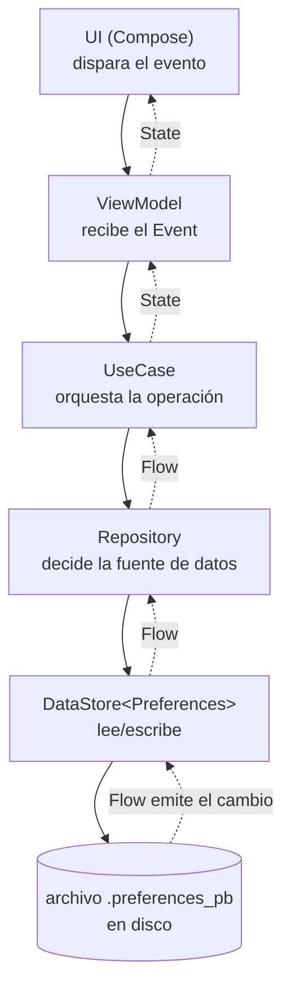

# DataStore (persistencia local)

## 1. Mapa del flujo



Mismo mapa de siempre — acá el nodo de abajo ni siquiera es una base de datos: es un archivo en disco que DataStore lee y escribe de forma atómica, sin tablas ni SQL.

## 2. Qué es y cómo funciona

DataStore es el reemplazo oficial de Jetpack para `SharedPreferences`: guarda datos de forma asíncrona (vía coroutines) y reactiva (vía `Flow`), sin los problemas clásicos de `SharedPreferences` (lecturas bloqueantes en el hilo principal, sin garantías de consistencia). Es multiplataforma oficial desde la versión 1.1.0 — usa **Okio** por debajo para abstraer el sistema de archivos entre Android, iOS y Desktop.

Viene en dos sabores, y elegir cuál no es una preferencia de estilo, es una decisión real:
- **Preferences DataStore** — pares clave-valor sueltos, sin schema fijo. Cada valor se declara con una `Key<T>` (`booleanPreferencesKey`, `stringPreferencesKey`, etc.) y se guarda en un mapa inmutable (`Preferences`).
- **Proto DataStore** — objetos tipados con un schema fijo definido en un `.proto`, serializados con Protocol Buffers. Más setup, pero con garantía de tipo end-to-end: no hay forma de pedir una key que no existe o del tipo equivocado, porque no son keys sueltas, es un objeto completo.

Cómo se relacionan las piezas: el `DataStore<Preferences>` (o `DataStore<T>` para Proto) es el objeto único que vive en memoria y apunta al archivo en disco. `.data` expone un `Flow` que emite cada vez que el archivo cambia — así se entera la UI sin refrescar a mano. `.edit { }` es la única forma de escribir: es una transacción atómica sobre **todo el archivo**, no existe el concepto de "actualizar un campo" aislado del resto.

## 3. Cómo se ve en distintos contextos

**App de streaming de música (Preferences DataStore):** guardar si el autoplay está activado y el volumen preferido — dos flags sueltos, sin relación entre sí, exactamente el caso para el que Preferences DataStore fue pensado. Se define una `Key<Boolean>` y una `Key<Int>`, y listo.

**App de fitness (Proto DataStore):** guardar las preferencias del usuario como un objeto — unidad de medida (kg/lb) y meta diaria de pasos — usando un schema `.proto` fijo. Acá el valor de Proto DataStore se nota: si mañana alguien intenta leer la meta de pasos como si fuera un `String`, ni compila — con Preferences DataStore ese mismo error (pedir una key con el tipo equivocado) también falla, pero recién en tiempo de ejecución si la key no coincide exactamente.

## 4. Implementación real

Te piden: *"La app tiene que recordar si el usuario ya completó el onboarding, y su preferencia de tema (claro/oscuro/sistema), para que persista entre sesiones sin pedir login."* — el caso típico de Preferences DataStore: dos flags simples, sin relación entre sí, sin necesidad de queries.

**Paso 1 — las keys y el data source:**

```kotlin
class UserPreferencesDataSource(private val dataStore: DataStore<Preferences>) {

    private object Keys {
        val HAS_COMPLETED_ONBOARDING = booleanPreferencesKey("has_completed_onboarding")
        val THEME_MODE = stringPreferencesKey("theme_mode") // "light" | "dark" | "system"
    }

    val hasCompletedOnboarding: Flow<Boolean> =
        dataStore.data.map { prefs -> prefs[Keys.HAS_COMPLETED_ONBOARDING] ?: false }

    val themeMode: Flow<String> =
        dataStore.data.map { prefs -> prefs[Keys.THEME_MODE] ?: "system" }

    suspend fun setOnboardingCompleted() {
        dataStore.edit { prefs -> prefs[Keys.HAS_COMPLETED_ONBOARDING] = true }
    }

    suspend fun setThemeMode(mode: String) {
        dataStore.edit { prefs -> prefs[Keys.THEME_MODE] = mode }
    }
}
```

**Paso 2 — crear la instancia, con la ruta del archivo resuelta por plataforma vía `expect/actual`** (esto es lo único que cambia entre plataformas, no toda la lógica como en SQLDelight):

```kotlin
// commonMain
expect fun createDataStore(): DataStore<Preferences>

fun buildPreferencesDataStore(producePath: () -> String): DataStore<Preferences> =
    PreferenceDataStoreFactory.createWithPath(produceFile = { producePath().toPath() })

// androidMain
actual fun createDataStore(): DataStore<Preferences> =
    buildPreferencesDataStore { context.filesDir.resolve("user.preferences_pb").absolutePath }

// iosMain
actual fun createDataStore(): DataStore<Preferences> =
    buildPreferencesDataStore {
        val documentDirectory = NSFileManager.defaultManager.URLForDirectory(
            NSDocumentDirectory, NSUserDomainMask, null, false, null
        )
        requireNotNull(documentDirectory?.path) + "/user.preferences_pb"
    }
```

## 5. Buenas prácticas y errores comunes — qué auditar si te lo entrega la IA

- **¿Hay una `List<T>` o un objeto complejo serializado como un solo valor de Preferences DataStore?** Es la trampa más común: guardar un JSON de una lista entera en una `stringPreferencesKey`. Cada escritura reescribe el archivo completo, cada lectura deserializa todo en memoria, y no hay forma de hacer una query. Si la IA usó DataStore para algo que crece (una lista de items, un historial), es una tabla disfrazada de preferencia — corresponde a Room o SQLDelight, no a esto.

- **¿El `DataStore<Preferences>` se crea una sola vez y se inyecta como singleton (vía Koin)?** DataStore lanza una excepción en runtime si detectás múltiples instancias activas apuntando al mismo archivo simultáneamente — no es solo una cuestión de performance como con `HttpClient`, acá directamente puede crashear.

- **¿La lógica de "leer el valor actual y decidir el nuevo" pasa DENTRO de la lambda de `.edit { }`, o afuera?** `.edit { }` es atómico, pero si el código lee `dataStore.data.first()` afuera para calcular el nuevo valor y después llama a `.edit { }` con ese resultado, hay una condición de carrera entre el momento en que lee y el momento en que escribe. Un `toggle()` o un contador que se incrementa tienen que calcular el nuevo valor a partir del `prefs` que llega como parámetro de la lambda, no de una lectura previa.

- **¿El `Flow` de `.data` maneja la posibilidad de `IOException`?** Si falla la lectura del archivo en disco, `.data` puede emitir una excepción en vez de un valor. Sin un `.catch { emit(emptyPreferences()) }` (o equivalente), esa excepción se propaga sin manejar y puede tirar abajo el collector.

- **Si es Proto DataStore: ¿el `Serializer` tiene un `defaultValue` razonable?** La primera vez que se lee (archivo todavía no existe), DataStore usa `defaultValue` del serializer en vez de fallar — si la IA no lo definió con valores sensatos, la app puede arrancar con un estado inválido la primera vez que corre.