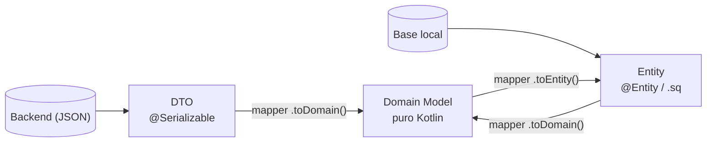

# DTO / Entity / Mappers

## 1. Mapa del flujo



A diferencia de los diagramas anteriores (una cadena de llamadas de arriba a abajo), acá el dato converge desde dos orígenes distintos hacia un único punto de encuentro: el Domain Model. Este archivo es zoom sobre las flechas del diagrama, no sobre los nodos — el Mapper es la flecha, no la caja.

## 2. Qué es y cómo funciona

DTO y Entity son los modelos "sucios" de la capa `data` — cada uno atado a una tecnología concreta:

- **DTO** (Data Transfer Object) — la forma exacta en que un dato viaja por la red. Anotado con `@Serializable` (Kotlinx Serialization), habla el idioma del backend: nombres de campo en `snake_case`, campos opcionales que domain quizás ni necesita.
- **Entity** — la forma exacta en que un dato se guarda en disco. Anotada con `@Entity` (Room) o generada desde un `.sq` (SQLDelight), habla el idioma de la tabla: tipos que la base entiende, no necesariamente los mismos que el dominio.
- **Domain Model** — el tipo puro, sin anotaciones de ninguna tecnología, que circula por `domain` y `presentation`.
- **Mapper** — la función de extensión que traduce de un lado al otro: `DtoX.toDomain()`, `EntityX.toDomain()`, `DomainX.toEntity()`. Siempre nombrada `algo.toX()`, nunca al revés (nunca `Order.fromDto(dto)` como función estática) — el mapper queda pegado a quien lo origina.

Ninguno de los dos modelos sucios cruza jamás hacia `domain` ni hacia la UI — es el Mapper el único que conoce ambos idiomas a la vez.

## 3. Cómo se ve en distintos contextos

**App de e-commerce:** el `ProductDto` que devuelve el backend trae un campo `internal_sku_code` que el negocio nunca muestra ni usa en ninguna regla — el mapper simplemente no lo copia al `Product` de dominio. El dato existe en el DTO, existe en el JSON, pero muere ahí — domain ni se entera de que existió.

**App de fitness:** un caso más interesante de conversión de tipos, no solo de descarte: el `WorkoutDto` trae la fecha como string ISO-8601 (`"2026-08-15T10:30:00Z"`), la `WorkoutEntity` la guarda como epoch millis (`Long`, lo que la tabla entiende), y el `Workout` de dominio la expone como `Instant` (el tipo con el que el resto de la app realmente trabaja). Tres representaciones distintas del mismo dato, tres mappers distintos, y ninguna de las tres capas necesita saber cómo hacen las otras dos su parte.

## 4. Implementación real

Retomando la app de delivery: el backend te devuelve el historial de pedidos con la fecha en formato ISO-8601 y los nombres de campo en `snake_case`. La base local (de `room_persistencia.md`/`sqldelight_persistencia_local.md`) ya guarda `placedAt` como `Instant` directamente. El domain necesita `Order`, sin saber nada de ninguna de las dos fuentes.

**Paso 1 — el DTO, con la forma exacta del JSON del backend:**

```kotlin
@Serializable
data class OrderDto(
    val id: String,
    @SerialName("restaurant_name") val restaurantName: String,
    @SerialName("placed_at") val placedAt: String, // ISO-8601: "2026-08-15T10:30:00Z"
    val items: List<OrderItemDto>
)

@Serializable
data class OrderItemDto(
    @SerialName("item_name") val itemName: String,
    val quantity: Int
)
```

**Paso 2 — el Domain Model, puro:**

```kotlin
data class Order(
    val id: String,
    val restaurantName: String,
    val placedAt: Instant,
    val items: List<OrderItem>
)

data class OrderItem(val itemName: String, val quantity: Int)
```

**Paso 3 — mapper DTO → Domain, donde ocurre la conversión de tipos real** (`String` ISO-8601 → `Instant`):

```kotlin
fun OrderDto.toDomain(): Order = Order(
    id = id,
    restaurantName = restaurantName,
    placedAt = Instant.parse(placedAt),
    items = items.map { it.toDomain() }
)

fun OrderItemDto.toDomain(): OrderItem = OrderItem(itemName = itemName, quantity = quantity)
```

**Paso 4 — mapper Entity → Domain, donde esta vez casi no hay conversión** (la `Entity` ya guarda `placedAt` como `Instant`, gracias al `@TypeConverter`/columna correspondiente visto en el archivo de persistencia):

```kotlin
fun OrderWithItems.toDomain(): Order = Order(
    id = order.id,
    restaurantName = order.restaurantName,
    placedAt = order.placedAt, // ya es Instant, sin conversión acá
    items = items.map { it.toDomain() }
)

fun OrderItemEntity.toDomain(): OrderItem = OrderItem(itemName = itemName, quantity = quantity)
```

**Paso 5 — mapper Domain → Entity, para guardar en local lo que llegó de la red:**

```kotlin
fun Order.toEntity(): OrderEntity = OrderEntity(id = id, restaurantName = restaurantName, placedAt = placedAt)

fun OrderItem.toEntity(orderId: String): OrderItemEntity =
    OrderItemEntity(orderId = orderId, itemName = itemName, quantity = quantity)
```

## 5. Buenas prácticas y errores comunes — qué auditar si te lo entrega la IA

- **¿El mapper "resuelve" un valor nulo o inesperado con un default silencioso?** Ejemplo clásico: si `quantity` viniera nullable del backend y el mapper hiciera `quantity ?: 1`, esa es una decisión de negocio (¿un item sin cantidad especificada es "uno"?) escondida en una línea de conversión de tipos. Si la IA agregó un `?:` para "que compile", confirmá que esa decisión es realmente la que el negocio quiere, y que quede visible, no enterrada.

- **¿Hay una clase DTO y una Entity separadas, aunque hoy tengan los mismos campos?** Es tentador "ahorrarse" la duplicación cuando `OrderDto` y `OrderEntity` se ven idénticos. No lo hagas: son conceptualmente distintos (uno es un contrato de red, el otro un esquema de tabla) y el día que uno cambie sin el otro, la separación ya construida evita que ese cambio se propague donde no corresponde.

- **¿El `Instant.parse(placedAt)` está protegido contra un formato inesperado?** Si el backend manda una fecha mal formada en un solo item de una lista de cien, `Instant.parse` lanza una excepción — sin un `try/catch` o una validación previa, ese único item corrompido puede tirar abajo el mapeo de toda la lista, no solo el suyo.

- **¿El mapper es una extension function del origen hacia el destino, o una función que rompe esa dirección?** `fun OrderDto.toDomain(): Order`, nunca `fun Order.Companion.fromDto(dto: OrderDto): Order`. La convención importa porque hace que el mapper viva pegado a quien lo origina — más fácil de encontrar, más fácil de auditar.

- **¿Hay lógica de negocio real (cálculos, validaciones, reglas condicionales) mezclada dentro del mapper?** Un mapper debería ser una traducción de campos, no el lugar donde se decide una regla de negocio. Si el mapper que te entregó la IA tiene un `if` que decide algo más que "cómo convertir un tipo a otro", esa lógica probablemente pertenece a un `UseCase`, no acá.