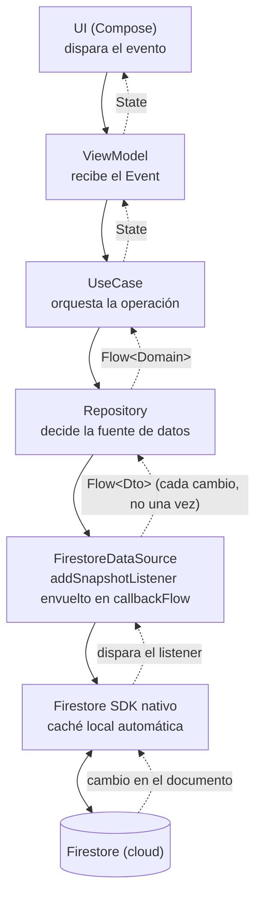

# Firestore (networking remoto — tiempo real)

## 1. Mapa del flujo



Diferencia estructural con `ktor_client_remoto.md`/`retrofit_client_remoto.md`: ahí el `Result<T>` sube una sola vez por request — acá el `Flow<Dto>` sube **cada vez** que el documento cambia en la nube, sin que nadie pida nada de nuevo. No hay "engine por plataforma" como en Ktor, pero sí hay un SDK nativo por plataforma (Android/iOS) detrás del cliente común — la misma idea de "una API compartida, una implementación por plataforma" que ya viste en `05_-_expect_actual.md`, aplicada acá a Firebase en vez de a código propio.

## 2. Qué es y cómo funciona

El SDK de Firestore no expone una función `suspend fun getOrder(id)` que devuelva un valor y termine — expone `addSnapshotListener { }`, una API basada en callbacks que se dispara una vez al conectarse y de nuevo cada vez que el documento (o la query) cambia en el servidor. Ese callback no es `suspend` ni devuelve un `Flow` por sí solo — hay que envolverlo.

**`callbackFlow { }`** es la pieza que resuelve ese puente: es un `builder` de `Flow` pensado específicamente para adaptar APIs basadas en callbacks al mundo de coroutines. Dentro del bloque se registra el listener nativo, cada valor que el callback recibe se empuja al `Flow` con `trySend(valor)` (no `send`, porque el callback no es una función `suspend` — no puede suspenderse esperando que el colector esté listo), y cuando el colector se cancela se ejecuta `awaitClose { }`, el lugar exacto donde hay que remover el listener nativo para no dejarlo corriendo de fondo sin nadie escuchando.

**Caché offline embebida:** a diferencia de Room/SQLDelight (bases locales que vos administrás explícitamente) o de Ktor/Retrofit (sin ningún estado local propio), el SDK de Firestore trae una caché local propia activada por default en mobile — cachea lo último que vio, sirve esos datos cuando no hay conexión, y sincroniza solo apenas vuelve la red. Esto cambia una decisión de arquitectura real: en `repository_impl.md`, la regla es que la red nunca le habla directo a la UI, solo alimenta una base local propia. Con Firestore, esa base local ya la trae el SDK — así que exponer el `Flow` de Firestore directo desde el `Repository` (sin una capa local propia intermedia) es una opción válida, no una violación del patrón. Si el feature necesita convivir con otras fuentes offline (Room/SQLDelight) bajo una única estrategia consistente, sigue teniendo sentido redirigir Firestore a través de esa base local — es una decisión de proyecto, no una regla fija de la tecnología.

## 3. Cómo se ve en distintos contextos

**App de mensajería:** cada mensaje nuevo de un chat llega vía snapshot listener sin que el cliente haga polling — apenas otro usuario escribe, todos los que tienen la conversación abierta reciben el cambio casi al instante. Gracias a la caché offline, el historial sigue visible sin conexión, y los mensajes escritos offline se sincronizan solos cuando vuelve la red.

**App de subastas en vivo:** el precio actual de una puja se expone como `Flow<Bid>` desde Firestore — cada vez que otro postor puja, todos los clientes conectados a esa subasta reciben el nuevo precio sin refrescar manualmente. Es el tipo de comportamiento en tiempo real que, con un endpoint REST tradicional (Ktor/Retrofit), requeriría agregar WebSockets a mano — acá viene resuelto por el SDK.

## 4. Implementación real

El PO pide: en la pantalla de detalle de un pedido, mostrar el estado (`Confirmado` → `En preparación` → `En camino` → `Entregado`) actualizándose solo cuando el backend cambia el estado en Firestore, sin que el usuario tenga que refrescar.

```kotlin
// data — el listener nativo envuelto en callbackFlow
class OrderStatusRemoteDataSource(
    private val firestore: FirebaseFirestore
) {
    fun observeOrderStatus(orderId: String): Flow<OrderStatusDto> = callbackFlow {
        val listener = firestore.collection("orders")
            .document(orderId)
            .addSnapshotListener { snapshot, error ->
                if (error != null) {
                    close(error) // cierra el Flow con la excepción, se propaga río abajo
                    return@addSnapshotListener
                }
                snapshot?.toObject(OrderStatusDto::class.java)?.let { dto ->
                    trySend(dto)
                }
            }
        awaitClose { listener.remove() } // corre cuando el colector se cancela
    }
}
```

```kotlin
// data — Repository: acá el Flow de Firestore sube directo, sin capa local intermedia
class OrderRepositoryImpl(
    private val remoteDataSource: OrderStatusRemoteDataSource
) : OrderRepository {
    override fun observeOrderStatus(orderId: String): Flow<OrderStatus> =
        remoteDataSource.observeOrderStatus(orderId)
            .map { dto -> dto.toDomain() }
}
```

```kotlin
// presentation
class OrderDetailViewModel(
    private val orderRepository: OrderRepository,
    private val orderId: String
) {
    private val viewModelScope = CoroutineScope(SupervisorJob() + Dispatchers.Main.immediate)

    private val _state = MutableStateFlow(OrderDetailState())
    val state: StateFlow<OrderDetailState> = _state.asStateFlow()

    init {
        viewModelScope.launch {
            orderRepository.observeOrderStatus(orderId)
                .catch { e ->
                    _state.update { it.copy(error = "No se pudo obtener el estado del pedido") }
                }
                .collect { status ->
                    _state.update { it.copy(status = status, isLoading = false) }
                }
        }
    }
}
```

Cada vez que el documento cambia en Firestore, el snapshot listener dispara, `trySend` empuja el nuevo `OrderStatusDto` al `Flow`, y baja por el pipeline hasta actualizar el `State` — sin polling, sin refresh manual. Cuando el usuario sale de la pantalla y `viewModelScope` se cancela, `awaitClose` remueve el listener nativo — si faltara esa línea, el listener seguiría activo (y consumiendo datos, batería y potencialmente memoria) aunque ya no haya nadie escuchando.

## 5. Buenas prácticas y errores comunes — qué auditar si te lo entrega la IA

- **¿Falta el `awaitClose { listener.remove() }`, o está vacío?** Es el error más grave posible acá: sin remover el listener nativo, cada vez que la pantalla se abre y se cierra queda un listener más corriendo de fondo — un leak que crece con cada visita a la pantalla, no algo que se note en la primera prueba.

- **¿Usa `send(valor)` en vez de `trySend(valor)` dentro del callback?** `send()` es `suspend`; el callback de `addSnapshotListener` no lo es — no compila, o si compila porque está envuelto mal (con `runBlocking` u otro hack), puede bloquear el hilo que Firestore usa para notificar cambios.

- **¿El parámetro `error` del callback se ignora silenciosamente?** Si el código solo maneja el caso `snapshot != null` y nunca revisa `error`, un fallo de permisos (reglas de seguridad de Firestore) o de conexión no se propaga a ningún lado — el `Flow` simplemente deja de emitir sin que nadie se entere de por qué.

- **¿Distingue una excepción de permisos (`FirebaseFirestoreException` con código `PERMISSION_DENIED`) de una de red (`UNAVAILABLE`)?** Mismo principio que en `ktor_client_remoto.md`/`retrofit_client_remoto.md` con sus tipos de excepción — tratarlas todas igual le saca a la UI la posibilidad de mostrar "no tenés acceso a este pedido" en vez de "revisá tu conexión".

- **¿Confía ciegamente en la caché offline de Firestore como si fuera equivalente a tener una base local propia (Room/SQLDelight)?** Es una caché de lo último visto, no una base con control total sobre queries complejas, migraciones o relaciones — si el feature necesita algo más determinístico que "lo último que este dispositivo vio de este documento", vale la pena reconsiderar si conviene igual redirigir a través de una base local propia en vez de depender solo del SDK.

- **¿El `Flow` se vuelve a colectar más de una vez desde distintos lugares sin compartirlo?** Cada `collect { }` independiente sobre `observeOrderStatus()` registra su propio listener nativo — si dos pantallas distintas necesitan el mismo estado del mismo pedido, conviene compartir el `Flow` (ver `stateflow.md`) en vez de duplicar listeners contra Firestore.