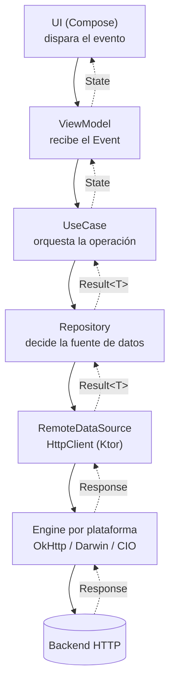

# Ktor Client (networking remoto)

## 1. Mapa del flujo



Cambio importante respecto a los tres archivos anteriores: acá no hay `Flow` emitiendo solo — una llamada de red es pedido/respuesta, no algo que "cambia" espontáneamente. El `Result<T>` sube una sola vez por cada request. Si una pantalla necesita reaccionar en vivo a datos remotos, eso se arma combinando esto con una fuente local (Room/SQLDelight/DataStore) que sí expone `Flow` — no es trabajo de Ktor.

## 2. Qué es y cómo funciona

Ktor Client es la librería oficial de JetBrains para HTTP en Kotlin Multiplatform. Vive en `data/remote`, y expone una API común (`HttpClient`, `client.get {}`, `client.post {}`) que compila igual en `commonMain` — pero, igual que SQLDelight necesita un `SqlDriver` por plataforma, Ktor necesita un **engine** por plataforma que ejecute la request de verdad:

- **OkHttp** — Android/JVM, el engine maduro que cualquier dev Android ya conoce.
- **Darwin** — iOS/macOS, envuelve `NSURLSession` nativo (respeta políticas de red del sistema que un engine puro-Kotlin no replica).
- **CIO** — 100% Kotlin puro, sin dependencia nativa, la opción "portable" para Desktop/servidor cuando no hay un engine nativo mejor.

El engine se declara como dependencia en el sourceSet de cada plataforma (nunca en `commonMain`), y se pasa al crear el `HttpClient` — o se deja que Ktor lo detecte solo del classpath.

Las piezas y cómo se relacionan: **`HttpClient`** es el objeto central, se configura una sola vez. Sobre él se instalan **plugins** con `install { }` — `ContentNegotiation` (serializa/deserializa JSON automáticamente), `HttpTimeout` (evita que una request cuelgue indefinidamente), `Logging` (para debug). Cada llamada (`client.get { }`, `client.post { }`) arma un `HttpRequestBuilder` con headers, query params y body, y el engine lo ejecuta.

## 3. Cómo se ve en distintos contextos

**App de clima:** un `GET` simple con query params (`?city=Cordoba&units=metric`) que devuelve un JSON que se deserializa directo a un DTO — el caso más básico, sin body, sin auth, solo `ContentNegotiation` haciendo su trabajo.

**App de e-commerce:** acá aparece la complejidad real — un `POST` para crear una orden necesita mandar un body serializado Y un header de autenticación (`Bearer <token>`) en cada request. Eso normalmente no se escribe a mano en cada función: se resuelve con el plugin `Auth` de Ktor, que agrega el header automáticamente y puede refrescar el token solo si el servidor devuelve 401 — sin que cada llamada individual sepa que la autenticación existe.

## 4. Implementación real

Te piden: *"Pantalla de restaurantes cercanos en la app de delivery: el usuario busca por nombre y puede filtrar por categoría, con los resultados viniendo del backend."*

**Paso 1 — el cliente, configurado una vez en `commonMain`:**

```kotlin
fun createHttpClient(engine: HttpClientEngine): HttpClient = HttpClient(engine) {
    install(ContentNegotiation) {
        json(Json { ignoreUnknownKeys = true }) // tolera campos nuevos del backend sin crashear
    }
    install(HttpTimeout) {
        requestTimeoutMillis = 10_000
    }
    expectSuccess = true // 4xx/5xx lanzan excepción automáticamente, en vez de devolver la respuesta cruda
}
```

**Paso 2 — instanciación por plataforma, vía Koin:**

```kotlin
// androidMain
single { createHttpClient(OkHttp.create()) }

// iosMain
single { createHttpClient(Darwin.create()) }
```

**Paso 3 — el data source:**

```kotlin
class RestaurantRemoteDataSource(private val client: HttpClient) {

    suspend fun searchRestaurants(query: String?, category: String?): List<RestaurantDto> =
        client.get("https://api.example.com/restaurants") {
            url {
                query?.let { parameters.append("q", it) }
                category?.let { parameters.append("category", it) }
            }
        }.body()
}
```

**Paso 4 — el `Repository`, distinguiendo los tres tipos de fallo posibles** (no todos son "lo mismo" para el usuario):

```kotlin
suspend fun getNearbyRestaurants(query: String?, category: String?): Result<List<Restaurant>> {
    return try {
        val dtos = remoteDataSource.searchRestaurants(query, category)
        Result.Success(dtos.map { it.toDomain() })
    } catch (e: ClientRequestException) { // 4xx — ej: category inválida
        Result.Error(BadRequestException(e.response.status.value))
    } catch (e: ServerResponseException) { // 5xx — el backend tuvo un problema
        Result.Error(ServerException(e.response.status.value))
    } catch (e: IOException) { // sin conexión, timeout, DNS caído
        Result.Error(NoConnectionException())
    }
}
```

## 5. Buenas prácticas y errores comunes — qué auditar si te lo entrega la IA

- **¿El `HttpClient` se crea una sola vez (singleton vía Koin), o se instancia dentro de cada función?** Un `HttpClient` nuevo por request tira a la basura el pool de conexiones reutilizables del engine — más latencia por request y, en Android, riesgo de leak de sockets si nunca se cierra con `.close()`.

- **¿Tiene `ignoreUnknownKeys = true` en la configuración de `Json`?** Sin esa flag, el día que el backend agregue un campo nuevo al JSON antes de que la app se actualice, la deserialización explota en producción — con la flag, simplemente lo ignora.

- **¿Distingue `ClientRequestException` (4xx) de `ServerResponseException` (5xx) de `IOException` (sin conexión), o todo cae en un `catch (e: Exception)` genérico?** Son causas y soluciones completamente distintas desde la perspectiva del usuario ("revisá tu conexión" vs. "el servidor tuvo un problema" vs. "el pedido estaba mal armado") — tratarlas igual no crashea la app, pero le saca a la UI la posibilidad de mostrar el mensaje correcto.

- **¿Hay un `HttpTimeout` configurado explícitamente?** Sin él, una request puede quedar colgada indefinidamente si el servidor no responde ni falla — depende del default del engine, que no siempre es el que el proyecto necesita.

- **¿El token de autenticación se repite manualmente en cada función del data source, o está centralizado en un plugin `Auth`/interceptor?** Si la IA te devolvió `headers.append("Authorization", "Bearer $token")` copiado en cada método, cualquier cambio en cómo se maneja el token (refresh, expiración) requiere tocar N lugares en vez de uno.

- **¿El engine declarado en cada sourceSet (`androidMain`, `iosMain`) es el nativo esperado, o alguien puso CIO en todos "para simplificar"?** Compila y funciona en desarrollo, pero en producción se pierde el manejo maduro de caché/interceptors de OkHttp en Android, y en iOS se pierde la integración con las políticas de red del sistema que trae `NSURLSession` por debajo de Darwin — CIO es el fallback portable, no el default recomendado donde hay una alternativa nativa.