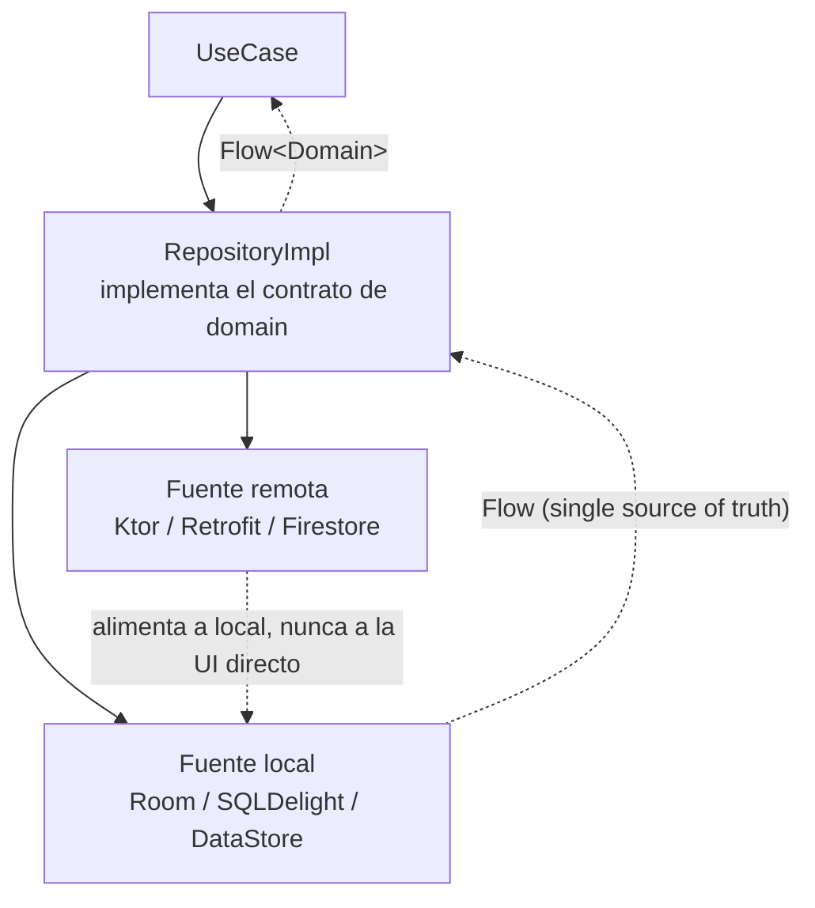

# RepositoryImpl

## 1. Mapa del flujo



La flecha punteada de `REMOTE` no va directo a `REPO` — va a `LOCAL`. Ese es el detalle que define todo este archivo: la red nunca le habla a la UI de frente, solo alimenta la base local, y es la base local la única fuente que el `Repository` observa. (Excepción real: Firestore, por su caché offline embebida en el SDK, puede actuar como su propia fuente local — ver `firestore_remoto.md` para ese caso puntual.)

## 2. Qué es y cómo funciona

`RepositoryImpl` es la clase concreta que vive en `data` e implementa una interfaz `Repository` definida en `domain`. Es donde se decide **de dónde** sale un dato (¿red? ¿base local? ¿ambas combinadas?) y **qué hacer** cuando esas fuentes no están de acuerdo entre sí. Domain solo conoce el contrato — un método como `getOrders(): Flow<List<Order>>` — y no sabe, ni le importa, qué hay atrás.

Las piezas y cómo se relacionan: el `Repository` (interfaz, en `domain`) es el contrato estable que el resto de la app consume. `RepositoryImpl` (en `data`) lo implementa, recibiendo por constructor las fuentes que necesita (un `Dao`/`Queries` local, un `ApiService` remoto). Cada método decide la estrategia — leer solo de local, refrescar desde remoto y guardar en local, o combinar ambas — y usa los Mappers (`dto_entity_mappers.md`) para traducir lo que cada fuente entrega al Domain Model antes de devolverlo.

## 3. Cómo se ve en distintos contextos

**App de noticias (cache-first con refresh):** la UI muestra inmediatamente lo que ya está en la base local (aunque esté desactualizado), mientras en paralelo se dispara un refresh silencioso contra el backend que actualiza esa misma base — la UI nunca "espera" a la red, solo se entera cuando el refresh termina porque la base local emitió un cambio nuevo por `Flow`.

**App de mensajería (local-first con sync en la nube):** cada mensaje se escribe primero en la base local — la UI reacciona al instante, sin esperar la nube — y en segundo plano se sincroniza con un backend de tiempo real. Si la sincronización falla (sin conexión), el mensaje ya está guardado y consistente localmente; la sync puede reintentarse después sin que el usuario pierda nada ni vea un estado a medias.

## 4. Implementación real

Retomando la app de delivery: *"El Historial de Pedidos tiene que funcionar offline. La UI siempre tiene que mostrar algo, y actualizarse sola cuando llega un pedido nuevo del backend."* — estrategia local-first: la base local (ya construida en `room_persistencia.md`) es la única fuente de verdad para la UI.

```kotlin
class OrderRepositoryImpl(
    private val dao: OrderDao,
    private val api: OrderApiService
) : OrderRepository {

    // La UI siempre observa la base local — nunca la red directamente.
    override fun getOrderHistory(): Flow<List<Order>> =
        dao.getOrderHistory().map { rows -> rows.map { it.toDomain() } }

    // La red solo alimenta la base local, nunca responde directo a la UI.
    override suspend fun refreshOrders() {
        val remoteOrders = api.fetchOrders()
        remoteOrders.forEach { dto ->
            val order = dto.toDomain()
            dao.saveOrder(
                order = order.toEntity(),
                items = order.items.map { it.toEntity(order.id) }
            )
        }
        // dao.getOrderHistory() emite el cambio solo — nadie "empuja" nada a la UI a mano.
    }
}
```

La clave: `getOrderHistory()` nunca le pide nada a `api` directamente. `refreshOrders()` escribe en `dao`, y como ese `Flow` es reactivo, la UI se entera del pedido nuevo sin que `RepositoryImpl` tenga que notificar nada manualmente — el mismo mecanismo que ya viste en `room_persistencia.md`/`sqldelight_persistencia_local.md`.

## 5. Buenas prácticas y errores comunes — qué auditar si te lo entrega la IA

- **¿La UI/UseCase lee siempre de la fuente local, o hay algún método que devuelve la respuesta de red directo?** Es la trampa central de este archivo: un `Flow` que hace `emit(remoteOrders.map { it.toDomain() })` después de guardar en la base, en vez de dejar que sea la base la que emita, rompe el single source of truth. Si la base tiene alguna lógica propia entre medio (un `INSERT OR REPLACE` que descarta un campo, una constraint), lo que la UI vio en ese instante deja de coincidir con lo que efectivamente quedó persistido — y el usuario ve algo distinto la próxima vez que abre la app.

- **¿Un fallo en `refreshOrders()` (sin conexión, error del servidor) rompe o deja inconsistente lo que ya estaba guardado localmente?** El refresh tiene que ser capaz de fallar sin tocar los datos que ya existen en local — si la excepción se propaga sin manejar desde el `UseCase` que llama a `refreshOrders()`, revisá que ese fallo no dispare, por accidente, un borrado o sobreescritura parcial de la base.

- **¿`RepositoryImpl` expone en algún punto un DTO o una Entity fuera de sus propios métodos?** El contrato de `Repository` (definido en domain) debería hablar únicamente en tipos de dominio. Si algún método filtra un `OrderDto` o `OrderEntity` hacia afuera, se rompió la frontera que los Mappers existen para sostener.

- **¿Las fuentes (`dao`, `api`) llegan por constructor, o se instancian dentro de la clase?** Si `RepositoryImpl` crea sus propias dependencias en vez de recibirlas inyectadas, se vuelve imposible reemplazarlas por fakes en un test — revisá que el constructor reciba interfaces/clases inyectables, no que las construya él mismo.

- **¿Hay una estrategia clara y consistente, o el código mezcla local-first y network-first sin decidirlo a propósito?** Si un método lee de local y otro del mismo repositorio responde directo de la red "porque en ese caso era más simple", la app termina con comportamiento inconsistente entre pantallas — la estrategia (local-first, network-first, cache-first) debería ser una decisión explícita, no una que varíe método a método por conveniencia de quien lo escribió.