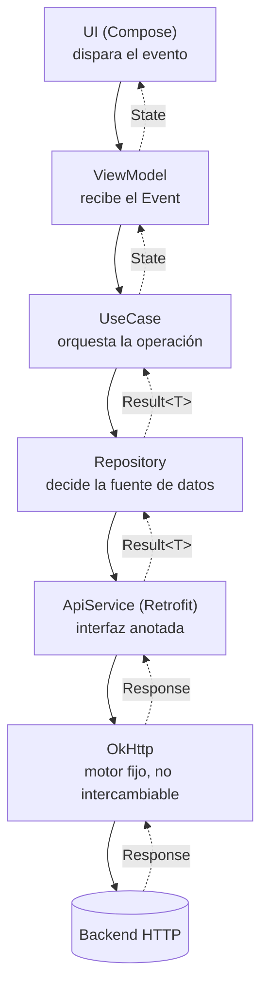

# Retrofit (networking remoto — Android/JVM)

## 1. Mapa del flujo



Mismo mapa que `ktor_client_remoto.md`, con una diferencia estructural importante: no hay un nodo de "engine por plataforma", porque Retrofit corre siempre sobre OkHttp — no es opcional ni intercambiable, y no existe fuera de Android/JVM.

## 2. Qué es y cómo funciona

Retrofit es el cliente HTTP type-safe de Square para Android/JVM — la referencia histórica en Android nativo, y la palabra que un reclutador de Android espera ver en un CV incluso donde Ktor sería técnicamente equivalente.

La diferencia de raíz con Ktor: **Ktor expone funciones imperativas (`client.get(url)`); Retrofit convierte una interfaz anotada en una implementación real.** Cada método de la interfaz describe un endpoint con anotaciones (`@GET`, `@POST`, `@Body`, `@Path`, `@Query`), y Retrofit arma el request a partir de eso.

Las piezas y cómo se relacionan:
- **La interfaz anotada** — el contrato, sin implementación escrita a mano.
- **`Retrofit.Builder`** — se configura una vez: `baseUrl`, el `OkHttpClient` (interceptors, timeouts), y el `Converter` (Gson, Moshi, o `kotlinx.serialization`) que transforma JSON en DTOs.
- **`retrofit.create(Interface::class.java)`** — acá está la diferencia más importante con Room: esto **no genera una clase en tiempo de compilación**. Crea un `java.lang.reflect.Proxy` dinámico que intercepta cada llamada, lee las anotaciones vía reflection recién cuando se invoca por primera vez, y arma el request de OkHttp en ese momento. No hay ningún `ApiService_Impl` generado — y por eso Retrofit no puede compilar para Kotlin/Native: `java.lang.reflect.Proxy` no existe ahí.

## 3. Cómo se ve en distintos contextos

**App de noticias:** un `@GET` simple con `@Query("category") category: String` — el caso base, sin body, sin auth, el `Converter` hace todo el trabajo de deserialización.

**App de banca:** acá se ve cómo Retrofit maneja lo que en Ktor resuelve el plugin `Auth` — no tiene un plugin equivalente propio, delega en un **interceptor de OkHttp**: una clase que intercepta cada request antes de que salga y le agrega el header `Authorization` automáticamente, sin que la interfaz anotada sepa que la autenticación existe. Es el mismo resultado que Ktor, pero resuelto un nivel más abajo, en OkHttp en vez de en Retrofit mismo.

## 4. Implementación real

Mismo pedido que en `ktor_client_remoto.md`, para comparar directo: *"Pantalla de restaurantes cercanos en la app de delivery: buscar por nombre y filtrar por categoría."*

**Paso 1 — la interfaz:**

```kotlin
interface RestaurantApiService {

    @GET("restaurants")
    suspend fun searchRestaurants(
        @Query("q") query: String?,
        @Query("category") category: String?
    ): List<RestaurantDto>
}
```

**Paso 2 — la construcción, una sola vez:**

```kotlin
val okHttpClient = OkHttpClient.Builder()
    .callTimeout(10, TimeUnit.SECONDS)
    .build()

val retrofit = Retrofit.Builder()
    .baseUrl("https://api.example.com/")
    .client(okHttpClient)
    .addConverterFactory(Json { ignoreUnknownKeys = true }
        .asConverterFactory("application/json".toMediaType()))
    .build()

val api: RestaurantApiService = retrofit.create(RestaurantApiService::class.java)
```

**Paso 3 — el `Repository`, distinguiendo los dos tipos de fallo de Retrofit** (no tres como en Ktor — acá el modelo de excepciones es distinto):

```kotlin
suspend fun getNearbyRestaurants(query: String?, category: String?): Result<List<Restaurant>> {
    return try {
        val dtos = api.searchRestaurants(query, category)
        Result.Success(dtos.map { it.toDomain() })
    } catch (e: HttpException) { // el servidor respondió, pero con 4xx/5xx
        Result.Error(ServerException(e.code()))
    } catch (e: IOException) { // la request nunca llegó a completarse
        Result.Error(NoConnectionException())
    }
}
```

## 5. Buenas prácticas y errores comunes — qué auditar si te lo entrega la IA

- **¿Distingue `HttpException` de `IOException`, o cae todo en un `catch (e: Exception)`?** `HttpException` es el servidor respondiendo con un status de error (podés leer `e.code()`); `IOException` es que la request nunca llegó a completarse (sin conexión, timeout, DNS caído). Tratarlas igual no crashea la app, pero le saca a la UI la chance de mostrar "revisá tu conexión" en vez de "el servidor tuvo un problema".

- **¿La instancia de `Retrofit`/`OkHttpClient` se arma una sola vez (singleton vía Koin/Hilt), o se reconstruye en cada llamada?** Mismo problema que con `HttpClient` de Ktor: se pierde el pool de conexiones de OkHttp, más latencia por request.

- **¿El header de auth está en un interceptor de OkHttp centralizado, o repetido a mano en cada método de la interfaz?** Si cada función de `RestaurantApiService` recibe el token como parámetro y lo arma en un header manual, cualquier cambio en el manejo de auth (refresh, expiración) obliga a tocar cada endpoint.

- **¿El `Converter` es consistente con el resto del proyecto?** Si en otro lado ya se usa `kotlinx.serialization` y acá la IA metió Gson "porque es lo que conoce", quedan dos librerías de serialización conviviendo sin necesidad — sumá el converter que ya está en uso, no el más común en tutoriales viejos.

- **¿Alguien está intentando usar esto en `commonMain` de un proyecto KMP?** Es un error de bulto, no un matiz: Retrofit usa `java.lang.reflect.Proxy`, que no existe en Kotlin/Native. Si la IA generó una interfaz Retrofit y la puso en código compartido pensando en iOS, ni va a compilar para ese target — la corrección no es un ajuste, es reemplazar la librería entera por Ktor ahí.