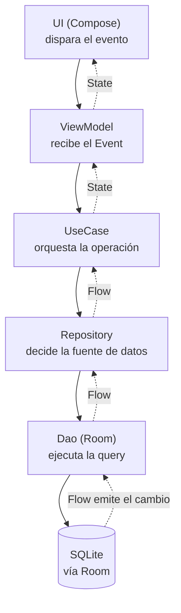

# Room (persistencia local)

## 1. Mapa del flujo



La línea sólida es el camino de escritura: un evento baja capa por capa hasta tocar la base. La línea punteada es el camino de vuelta — no es un `return`, es un `Flow` que emite solo, y por eso la UI se actualiza sin que nadie la refresque a mano. Todo lo que sigue en este archivo es zoom sobre el nodo `Dao (Room)` de este mapa.

## 2. Qué es y cómo funciona

Room es la librería oficial de Jetpack para persistencia local: una capa sobre SQLite que reemplaza el SQL a mano por anotaciones que Room valida contra el esquema real en tiempo de compilación (vía KSP), no en runtime.

Las piezas se relacionan así — pensalo como una casa con planos:
- **`@Database`** es la casa completa: la clase abstracta que declara qué tablas existen y le entrega al resto de la app el `Dao` de cada una.
- **`@Entity`** es cada habitación: un `data class` que define una tabla — columnas, primary key, tipos.
- **`@Dao`** es el manual de instrucciones de esa habitación: una interfaz con las operaciones permitidas (`insert`, `delete`, `query`).
- **`@Query`** es la instrucción puntual, en SQL real, dentro de una función del manual.

El resto (`@Insert`, `@Transaction`, `@Relation`, `@TypeConverter`) son herramientas puntuales que se suman cuando el caso lo pide — se ven en la sección 4, no hace falta memorizarlas de entrada.

Un dato de contexto para no confundirte si lo buscás: a agosto de 2026 conviven **Room 2.x** (`androidx.room`, estable, en maintenance mode, la que domina el mercado hoy) y **Room 3.0** (`androidx.room3`, alpha desde marzo de este año — reescritura KMP-first, sin codegen Java, coroutines obligatorias). Este archivo cubre Room 2.x, que es lo que se usa en producción y lo que te van a pedir en una entrevista hoy.

## 3. Cómo se ve en distintos contextos

**App de entrenamiento (fitness tracker):** cada sesión de gimnasio se guarda con fecha y una lista de series (ejercicio, peso, repeticiones). Es una relación uno-a-muchos clásica — una sesión tiene varias series — resuelta con `@Relation`: `WorkoutEntity` + `SetEntity` con foreign key, y un `WorkoutWithSets` que las trae juntas en una sola consulta para la pantalla de historial.

**App de notas con etiquetas:** acá el problema es distinto — una nota puede tener varias etiquetas, y una etiqueta aplica a varias notas (muchos-a-muchos), lo que pide una tabla puente (`NoteTagCrossRef`) además de `NoteEntity` y `TagEntity`. Y si la app necesita buscar notas por texto, Room tiene soporte de full-text search (`@Fts4`) para eso — un problema que ni el fitness tracker ni una relación uno-a-muchos común resuelven.

Dos problemas de forma de dato distinta (uno-a-muchos vs. muchos-a-muchos + búsqueda), misma herramienta, dos soluciones que no se parecen en el código aunque ambas sean "Room".

## 4. Implementación real

Te piden: *"Necesitamos la pantalla de Historial de Pedidos de la app de delivery: cada pedido guarda restaurante, fecha y los items pedidos con su cantidad, el usuario scrollea la lista ordenada de más reciente a más vieja — tiene que andar sin conexión."*

**Paso 1 — las tablas**, relacionadas por `orderId`:

```kotlin
@Entity(tableName = "orders")
data class OrderEntity(
    @PrimaryKey val id: String,
    val restaurantName: String,
    val placedAt: Instant
)

@Entity(
    tableName = "order_items",
    foreignKeys = [ForeignKey(
        entity = OrderEntity::class,
        parentColumns = ["id"],
        childColumns = ["orderId"],
        onDelete = ForeignKey.CASCADE
    )]
)
data class OrderItemEntity(
    @PrimaryKey(autoGenerate = true) val id: Long = 0,
    val orderId: String,
    val itemName: String,
    val quantity: Int
)
```

**Paso 2 — `Instant` necesita un `@TypeConverter`**, porque SQLite no tiene tipo fecha:

```kotlin
class Converters {
    @TypeConverter
    fun fromInstant(value: Instant?): Long? = value?.toEpochMilliseconds()

    @TypeConverter
    fun toInstant(value: Long?): Instant? = value?.let { Instant.fromEpochMilliseconds(it) }
}
```

**Paso 3 — la relación uno-a-muchos**, para traer "un pedido con todos sus items" sin escribir el JOIN a mano:

```kotlin
data class OrderWithItems(
    @Embedded val order: OrderEntity,
    @Relation(parentColumn = "id", entityColumn = "orderId")
    val items: List<OrderItemEntity>
)
```

**Paso 4 — el DAO.** Guardar un pedido completo tiene que ser atómico: si se corta a mitad de camino, no puede quedar el pedido sin sus items.

```kotlin
@Dao
interface OrderDao {

    @Transaction
    suspend fun saveOrder(order: OrderEntity, items: List<OrderItemEntity>) {
        insertOrder(order)
        insertItems(items)
    }

    @Insert
    suspend fun insertOrder(order: OrderEntity)

    @Insert
    suspend fun insertItems(items: List<OrderItemEntity>)

    @Transaction
    @Query("SELECT * FROM orders ORDER BY placedAt DESC")
    fun getOrderHistory(): Flow<List<OrderWithItems>>
}
```

**Paso 5 — la caja que junta todo:**

```kotlin
@Database(entities = [OrderEntity::class, OrderItemEntity::class], version = 1, exportSchema = true)
@TypeConverters(Converters::class)
abstract class AppDatabase : RoomDatabase() {
    abstract fun orderDao(): OrderDao
}
```

## 5. Buenas prácticas y errores comunes — qué auditar si te lo entrega la IA

- **¿La escritura multi-tabla está en `@Transaction`?** Si un endpoint/feature guarda en más de una tabla (como `saveOrder` acá) y no está envuelto en `@Transaction`, un crash a mitad de camino deja datos huérfanos. Si la IA te devuelve dos `insert` sueltos sin transacción, es un bug esperando pasar.

- **¿Hay un `@Relation` sobre una lista que puede crecer sin límite?** Por default dispara una query extra por cada fila padre (N+1). Andá a buscar: si la pantalla es una lista de historial que puede tener cientos de filas en producción, preguntá si conviene paginar (Paging 3) o reemplazar la relación por un `JOIN` explícito. Si la IA lo dejó con `@Relation` "porque es más corto" sin mencionar el trade-off, revisalo vos.

- **¿Usa `fallbackToDestructiveMigration()` en el `Room.databaseBuilder`?** Es aceptable en una rama de desarrollo antes del primer release. En cualquier código que vaya a producción con usuarios reales, es una bandera roja — borra y recrea todas las tablas ante cualquier cambio de versión, y el usuario pierde sus datos locales sin ningún error visible. Tiene que haber una `Migration` explícita.

- **¿`exportSchema` está en `true` y con el directorio de schemas versionado?** Si está en `false` (o no se declaró), no hay forma de testear migraciones con `MigrationTestHelper` más adelante. Aceptable solo en un prototipo descartable, no en código que va a un repo real.

- **¿Usa KSP o KAPT?** Si el `build.gradle` que te trae la IA usa `kapt` en vez de `ksp` para Room, es código copiado de una fuente vieja — corregilo, KAPT es más lento y es el camino que Room va a dejar de soportar.

- **¿El `Instant`/`LocalDate`/enum tiene su `@TypeConverter` registrado en `@Database`?** Si la entidad usa un tipo no primitivo y no ves `@TypeConverters(...)` en la clase `Database`, el código ni compila — pero si lo agregó de forma implícita o rara, vale la pena confirmar que está aplicado donde corresponde.