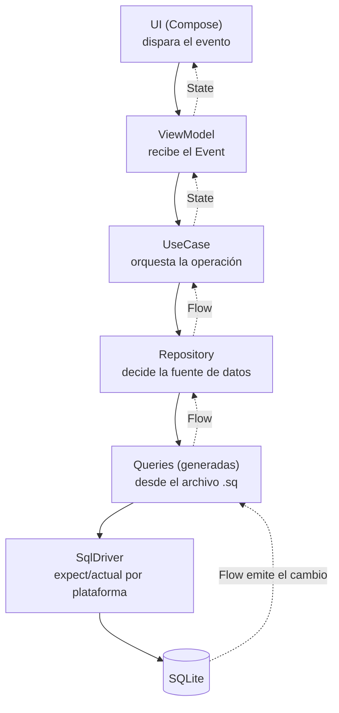

# SQLDelight (persistencia local)

## 1. Mapa del flujo



Mismo mapa grande que en `room_persistencia.md` — lo que cambia es el nodo de abajo: en vez de un `Dao` anotado, acá aparece `Queries` (generado a partir de SQL real) y un `SqlDriver` que sí necesita una implementación distinta por plataforma.

## 2. Qué es y cómo funciona

SQLDelight (Cash App/Square) genera una API Kotlin type-safe a partir de SQL real, no de anotaciones. La diferencia de raíz con Room: **Room genera código Kotlin a partir de anotaciones; SQLDelight genera código Kotlin a partir de archivos `.sq`.**

Las piezas:
- **Archivo `.sq`** — hace el trabajo de `@Entity` + `@Dao` juntos, en un solo lugar: el `CREATE TABLE` define el schema, y cada bloque `nombreQuery: SELECT/INSERT/...` es una query con nombre.
- **`Queries` (generado)** — por cada `.sq`, el compilador genera una clase con un método por cada query nombrada, ya tipado — es el equivalente a lo que en Room escribís vos mismo como interfaz `@Dao`.
- **`SqlDriver`** — acá SQLDelight se separa fuerte de Room: nace multiplataforma desde el día uno, así que necesita un driver real de SQLite por plataforma (`AndroidSqliteDriver`, `NativeSqliteDriver` para iOS, `JdbcSqliteDriver` para desktop/JVM). Se resuelve con `expect/actual` — no es opcional, es parte del setup.

La validación de SQL corre en el momento de compilar el proyecto (el plugin de Gradle de SQLDelight procesa los `.sq`): un typo en una columna, o una query que no coincide con el schema, rompe el build — no llega a runtime, igual que Room, pero acá el error apunta directo a la línea de SQL, no a una anotación.

## 3. Cómo se ve en distintos contextos

**App de presupuesto personal:** un presupuesto (`Budget`) tiene muchos gastos (`Expense`) — uno-a-muchos, igual que el caso de Room. La diferencia está en cómo se resuelve: en vez de un `@Relation` automático, la query de "presupuesto con sus gastos" se escribe como un `JOIN` explícito dentro del propio `.sq`, y el archivo generado te devuelve filas planas que agrupás vos en Kotlin — no hay magia de mapeo automático como en Room.

**App de notas multiplataforma (Android + iOS + Desktop):** acá se ve el motivo real de por qué SQLDelight existe. La misma tabla de notas corre en las tres plataformas con el mismo `.sq`, pero cada plataforma instancia su propio `SqlDriver` (`AndroidSqliteDriver` en Android, `NativeSqliteDriver` en iOS, `JdbcSqliteDriver` en desktop) a través de una clase `expect/actual` — el código de queries es 100% compartido, solo el driver cambia. Es el caso que Room, aun con soporte KMP desde 2.7, todavía no resuelve con la misma cantidad de años de rodaje en producción real.

## 4. Implementación real

Mismo pedido que en Room, para que compares directo: *"Historial de Pedidos de la app de delivery: cada pedido con restaurante, fecha, y los items pedidos con su cantidad, ordenado de más reciente a más vieja, funcionando offline."*

**Paso 1 — el archivo `.sq`.** Acá va el schema y las queries juntos:

```sql
-- Order.sq
CREATE TABLE OrderEntity (
    id TEXT NOT NULL PRIMARY KEY,
    restaurantName TEXT NOT NULL,
    placedAt INTEGER NOT NULL
);

CREATE TABLE OrderItemEntity (
    id INTEGER PRIMARY KEY AUTOINCREMENT,
    orderId TEXT NOT NULL,
    itemName TEXT NOT NULL,
    quantity INTEGER NOT NULL,
    FOREIGN KEY(orderId) REFERENCES OrderEntity(id) ON DELETE CASCADE
);

insertOrder:
INSERT INTO OrderEntity(id, restaurantName, placedAt) VALUES (?, ?, ?);

insertItem:
INSERT INTO OrderItemEntity(orderId, itemName, quantity) VALUES (?, ?, ?);

getOrderHistory:
SELECT OrderEntity.id, OrderEntity.restaurantName, OrderEntity.placedAt,
       OrderItemEntity.itemName, OrderItemEntity.quantity
FROM OrderEntity
JOIN OrderItemEntity ON OrderItemEntity.orderId = OrderEntity.id
ORDER BY OrderEntity.placedAt DESC;
```

Notá que en el `SELECT` de `getOrderHistory` listé las columnas a mano en vez de usar `SELECT *` — necesario acá porque ambas tablas podrían tener nombres de columna que choquen (`id` aparece en las dos), y `SELECT *` en un `JOIN` con columnas ambiguas es un error clásico (ver sección 5).

**Paso 2 — el data source, sobre la clase `Queries` generada.** Como no hay `@Relation` automático, la agrupación de filas planas en `OrderWithItems` se hace a mano:

```kotlin
data class OrderWithItems(val order: OrderEntity, val items: List<OrderItemEntity>)

class OrderLocalDataSource(private val queries: OrderQueries) {

    suspend fun saveOrder(order: OrderEntity, items: List<OrderItemEntity>) {
        queries.transaction {
            queries.insertOrder(order.id, order.restaurantName, order.placedAt.toEpochMilliseconds())
            items.forEach { queries.insertItem(order.id, it.itemName, it.quantity) }
        }
    }

    fun getOrderHistory(): Flow<List<OrderWithItems>> =
        queries.getOrderHistory()
            .asFlow()
            .mapToList(Dispatchers.IO)
            .map { rows -> rows.groupBy { it.id }.map { (_, group) -> // agrupa filas por pedido
                OrderWithItems(
                    order = OrderEntity(group.first().id, group.first().restaurantName, group.first().placedAt),
                    items = group.map { OrderItemEntity(it.itemName, it.quantity) }
                )
            }}
}
```

**Paso 3 — el driver por plataforma:**

```kotlin
expect class DatabaseDriverFactory {
    fun createDriver(): SqlDriver
}

// androidMain
actual class DatabaseDriverFactory(private val context: Context) {
    actual fun createDriver(): SqlDriver =
        AndroidSqliteDriver(OrderDatabase.Schema, context, "orders.db")
}

// iosMain
actual class DatabaseDriverFactory {
    actual fun createDriver(): SqlDriver =
        NativeSqliteDriver(OrderDatabase.Schema, "orders.db")
}
```

## 5. Buenas prácticas y errores comunes — qué auditar si te lo entrega la IA

- **¿Usa `SELECT *` en un `JOIN` entre tablas con columnas de mismo nombre?** `OrderEntity.id` y (si la tuviera) `OrderItemEntity.id` chocan — el resultado generado puede pisar una columna con otra silenciosamente. Si la IA te devolvió un `SELECT *` en una query con `JOIN`, confirmá que no hay columnas ambiguas, o pedile que liste las columnas explícitas.

- **¿Envuelve la escritura multi-tabla en `queries.transaction { }`?** Mismo riesgo que en Room: sin transacción, un corte a mitad de camino deja el pedido sin sus items. Es fácil que la IA te devuelva los dos `insert` sueltos porque "funciona" en la demo.

- **¿El agrupamiento de filas planas del `JOIN` está bien hecho?** Es el punto más propenso a bugs sutiles de SQLDelight comparado con Room: si el `groupBy` no agrupa por el campo correcto, terminás con pedidos duplicados en la lista en vez de items agrupados dentro de un pedido. Si la IA generó este código, ejecutalo mentalmente con 2 pedidos de 3 items cada uno antes de confiar en que agrupa bien.

- **¿El `DatabaseDriverFactory` está bien resuelto por plataforma, y no se instancia el driver más de una vez?** Igual que el `HttpClient` de Ktor: el driver/la conexión a la base tiene que vivir como singleton (inyectado vía Koin), no crearse en cada operación.

- **¿Hay archivos de migración (`.sqm`) si cambió el schema, o el proyecto arranca de cero?** SQLDelight versiona las migraciones en archivos `.sq` con sufijo numérico — si un cambio de schema no vino acompañado de la migración correspondiente, el build puede compilar igual pero la app rompe al abrir la base de un usuario con la versión vieja instalada.