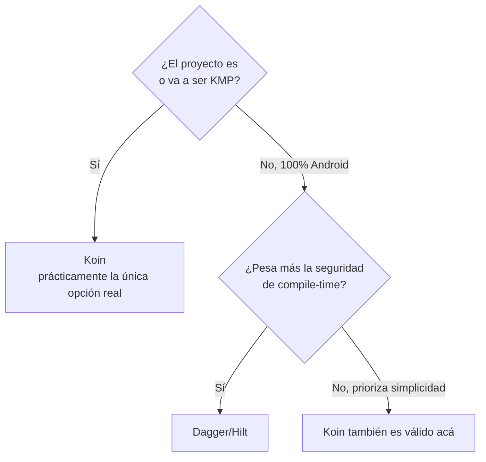

# Alternativas a Koin (Dagger/Hilt y Kodein)

## 1. Mapa del flujo



Este archivo no tiene un "flujo de datos" propio como los anteriores — es un árbol de decisión. Cada rama es una alternativa real a Koin, y por qué casi siempre se termina en la misma hoja.

## 2. Qué es y cómo funciona

**Dagger** es un framework de DI para JVM que resuelve el grafo de dependencias **en compile-time**, generando código real mediante annotation processing (hoy vía KSP). **Hilt** es una capa sobre Dagger, hecha por Google específicamente para Android, que simplifica su configuración atándose a los componentes del ciclo de vida de Android (`Activity`, `Fragment`, `ViewModel`).

La diferencia de fondo con Koin no es de sintaxis, es **cuándo** se resuelve el grafo: Dagger/Hilt lo resuelve el compilador, generando clases concretas antes de que la app corra — si falta una dependencia, **no compila**. Koin lo resuelve en runtime, y ese mismo error recién aparece al ejecutar. El problema estructural para KMP es que Hilt está construido sobre anotaciones y componentes que **no existen fuera de Android** (`@AndroidEntryPoint`, `@HiltViewModel`, `ViewComponent`) — no hay `Activity` ni `Fragment` en iOS, Desktop ni Web.

**Kodein** resuelve el mismo problema que Koin — grafo en runtime, 100% Kotlin puro, portable a KMP — pero apoyándose más fuerte en el sistema de tipos genéricos de Kotlin, con bindings explícitos (`bind<Tipo>() with singleton { }`) en vez del DSL más simple de Koin. Históricamente tuvo ventajas puntuales en manejo de genéricos complejos; hoy esa brecha se achicó y Koin se quedó con la adopción de la comunidad KMP.

## 3. Cómo se ve en distintos contextos

**App bancaria, 100% Android, sin planes de KMP:** acá Hilt es una elección defendible, no solo "la opción de siempre" — un error de DI en producción en un dominio financiero es costoso, y la garantía de compile-time (el build directamente no compila si falta una dependencia) pesa más que la portabilidad que no se va a necesitar.

**App con años de código en Kodein:** el equipo evalúa si migrar a Koin vale la pena. La pregunta correcta no es "¿cuál tiene mejor API en el paper?" — es si el costo de reescribir cada módulo de DI existente se justifica frente al beneficio real (más documentación, más respuestas ante un bug puntual, comunidad activa). Para un proyecto nuevo la respuesta es casi siempre Koin; para uno que ya funciona con Kodein, migrar solo por moda no es un argumento suficiente.

## 4. Implementación real

El mismo caso en los tres frameworks: *"Armá la inyección para un `LoginViewModel` que depende de un `AuthRepository`."* Koin ya se vio en `koin_fundamentos_y_scopes.md` — acá el foco es cómo se ven las otras dos.

**Dagger/Hilt (Android-only, compile-time):**

```kotlin
@Module
@InstallIn(SingletonComponent::class)
object AuthModule {
    @Provides
    @Singleton
    fun provideAuthRepository(api: AuthApi): AuthRepository = AuthRepositoryImpl(api)
}

@HiltViewModel
class LoginViewModel @Inject constructor(
    private val repository: AuthRepository
) : ViewModel()
```

**Kodein (runtime, tipado explícito):**

```kotlin
val appModule = DI.Module("appModule") {
    bind<AuthRepository>() with singleton { AuthRepositoryImpl(instance()) }
}

class LoginViewModel(di: DI) : DIAware {
    override val diContext = di.direct
    private val repository: AuthRepository by instance()
}
```

La diferencia visible: Hilt depende de anotaciones que el compilador de Android procesa contra clases del framework — ese código no compila en `iosMain`. Kodein es una función Kotlin normal, portable, pero expone `bind<Tipo>() with singleton { }` en vez del `single { }` más corto de Koin — más explícito, más verboso para el caso común.

## 5. Buenas prácticas y errores comunes — qué auditar si te lo entrega la IA

- **¿Hay `@HiltViewModel`, `@AndroidEntryPoint` o cualquier anotación de Hilt en un archivo que vive en `commonMain`?** Es un error estructural, no un matiz de estilo — ese código directamente no va a compilar para iOS/Desktop. Si la IA generó un `ViewModel` compartido usando Hilt "porque es lo más común en Android", hay que reemplazarlo por Koin antes de seguir, no ajustarlo.

- **¿Se está mezclando Hilt "solo para Android" con Koin en el resto del proyecto?** Es válido únicamente para dependencias 100% específicas de Android que viven en `androidMain` (un `WorkManager`, un servicio del sistema) — nunca para algo que vive en `commonMain`. Si el `ViewModel` de una feature compartida terminó con Hilt "para simplificar", se rompió la premisa de que ese código es multiplataforma.

- **¿La justificación para usar Hilt en vez de Koin es real, o es "porque es lo que la IA vio más en su entrenamiento"?** Hilt tiene más ejemplos en el mundo dado que domina el training data de proyectos Android puros — eso no lo hace la opción correcta para un proyecto KMP. Si no hay una razón explícita ("este módulo es 100% Android y sin planes de expandirse"), sospechá del default.

- **¿Alguien propuso Kodein para un proyecto nuevo sin una razón puntual?** Salvo que ya exista una base de código en Kodein y migrar no se justifique, no hay buena razón para elegirlo hoy sobre Koin — menos comunidad, menos documentación actualizada, sin ventaja técnica lo bastante grande como para compensarlo.

- **¿El `@Provides`/`@Module` de Hilt vive en el sourceSet correcto?** Confirmá que las declaraciones `@InstallIn(SingletonComponent::class)` y compañía están únicamente dentro de `androidMain`, nunca en un archivo que el proyecto espera compartir entre plataformas.