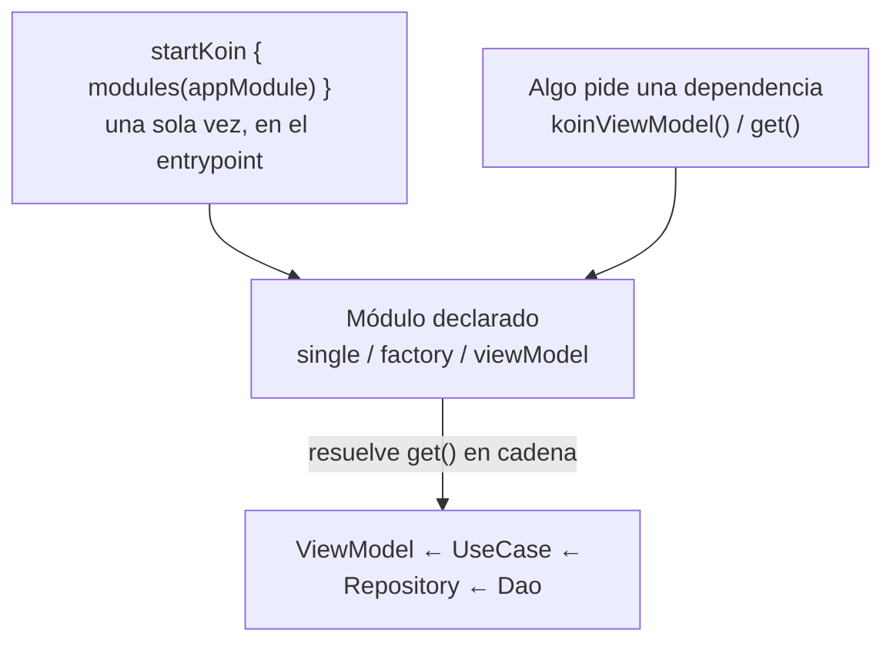

# Koin (fundamentos y scopes)

## 1. Mapa del flujo



Este es el mismo mapa del archivo anterior (`que_resuelve_la_di.md`), con el contenedor genérico reemplazado por la implementación concreta: Koin.

## 2. Qué es y cómo funciona

Koin es el framework de DI más usado en KMP. A diferencia de Dagger/Hilt, resuelve el grafo de dependencias **en runtime** — no genera código en compile-time vía KSP, es 100% Kotlin puro, sin reflexión pesada, lo que lo hace liviano y portable a cualquier target (Android, iOS, Desktop, Web).

Se organiza en **módulos** (`module { }`), donde cada dependencia se declara con un **scope** que define su ciclo de vida:

- **`single`** — una única instancia compartida en toda la app (`HttpClient`, `Database`, un `Repository` sin estado por-pantalla).
- **`factory`** — una instancia nueva cada vez que se pide — típicamente `UseCase`s sin estado propio.
- **`viewModel`** — específico para ViewModels; Koin lo ata al ciclo de vida correcto de cada plataforma.

Cómo se relacionan las piezas: dentro de un módulo, `get()` le dice a Koin "resolvé esta dependencia con lo que ya está declarado en el grafo" — no hace falta pasarla a mano, Koin la busca por tipo. `startKoin { modules(...) }` arranca el contenedor una sola vez, típicamente en el entrypoint de cada plataforma. A partir de ahí, cualquier punto de la app que pida una dependencia (`koinViewModel()` en un composable, `by inject()`, `get()`) dispara la resolución de toda la cadena necesaria.

## 3. Cómo se ve en distintos contextos

**App de fitness:** el módulo completo de la feature de rutinas encadena cuatro piezas: `single { WorkoutDao(get()) }`, `single<WorkoutRepository> { WorkoutRepositoryImpl(get()) }`, `factory { GetWorkoutsUseCase(get()) }`, `viewModel { WorkoutsViewModel(get()) }`. Pedir el `ViewModel` dispara la resolución de las cuatro, en cadena, sin que nadie tenga que ensamblarlas a mano.

**App de e-commerce (testing):** en un test de integración del flujo de compra, se reemplaza el `PaymentGateway` real por un fake sin tocar ninguna clase de producción — se arma un `koinApplication` de test con un módulo que sobreescribe la declaración real: `module { single<PaymentGateway> { FakePaymentGateway() } }`. Koin resuelve todo lo demás igual, pero cualquier clase que pida `PaymentGateway` recibe el fake.

## 4. Implementación real

Retomando la app de delivery: armá el módulo de Koin completo para la feature de Historial de Pedidos, encadenando persistencia local, red, y presentación.

```kotlin
val orderModule = module {
    // Local
    single { AppDatabase.Schema } // o el equivalente de Room
    single { get<AppDatabase>().orderDao() }

    // Remoto
    single { createHttpClient(engine = get()) }
    single { OrderApiService(get()) }

    // Data layer
    single<OrderRepository> { OrderRepositoryImpl(dao = get(), api = get()) }

    // Domain
    factory { GetOrderHistoryUseCase(get()) }
    factory { RefreshOrdersUseCase(get()) }

    // Presentation
    viewModel { OrdersViewModel(getOrderHistory = get(), refreshOrders = get()) }
}

// androidMain — el engine específico de esta plataforma se declara en su propio módulo
val androidOrderModule = module {
    single<HttpClientEngine> { OkHttp.create() }
}

// Arranque, en el entrypoint de cada plataforma
fun initKoin() {
    startKoin {
        modules(orderModule, androidOrderModule)
    }
}
```

`OrdersViewModel` nunca sabe que existe `OrderApiService` ni `AppDatabase` — solo declara los dos `UseCase`s que necesita, y Koin resuelve el resto de la cadena por debajo.

## 5. Buenas prácticas y errores comunes — qué auditar si te lo entrega la IA

- **¿El scope elegido es el correcto para cada dependencia?** Una clase con estado mutable interno declarada como `single` comparte ese estado entre todos los lugares de la app que la inyecten — un bug de concurrencia silencioso. La regla: si la clase tiene estado mutable propio no intencionalmente compartido, casi nunca debería ser `single`.

- **¿El módulo nuevo está efectivamente agregado a `modules(...)` en el `startKoin`?** Koin resuelve en runtime, así que un módulo declarado pero nunca importado no da error de compilación — recién falla cuando algo intenta pedir esa dependencia y Koin no la encuentra (`NoDefinitionFoundException` en producción, en el peor momento). Si la IA te agregó un módulo nuevo, confirmá que también lo sumó a la lista de `modules(...)`.

- **¿Hay una dependencia circular entre `single`s?** Si `A` necesita `B` y `B` necesita `A` en sus constructores, Koin no lo detecta hasta que efectivamente se intenta resolver esa cadena — y ahí sí falla en runtime. El compilador no te va a avisar como sí lo haría Dagger.

- **¿`get()` resuelve el tipo correcto cuando hay más de una implementación de la misma interfaz?** Si el proyecto tiene dos `HttpClient` distintos (uno para el backend propio, otro para un servicio de terceros), un `get()` sin calificar puede resolver el que no corresponde — hace falta usar `named()`/qualifiers para desambiguar, y vale la pena confirmar que la IA no los mezcló.

- **¿La UI consume el ViewModel vía `koinViewModel()` (o el mecanismo de Koin equivalente), o hay algún lugar donde se instancia a mano?** Un `PlayersViewModel()` instanciado directo en un composable, en vez de resuelto por Koin, rompe silenciosamente el grafo de DI en ese punto puntual — compila, pero esa instancia queda fuera del ciclo de vida y del scope que el resto de la app espera.