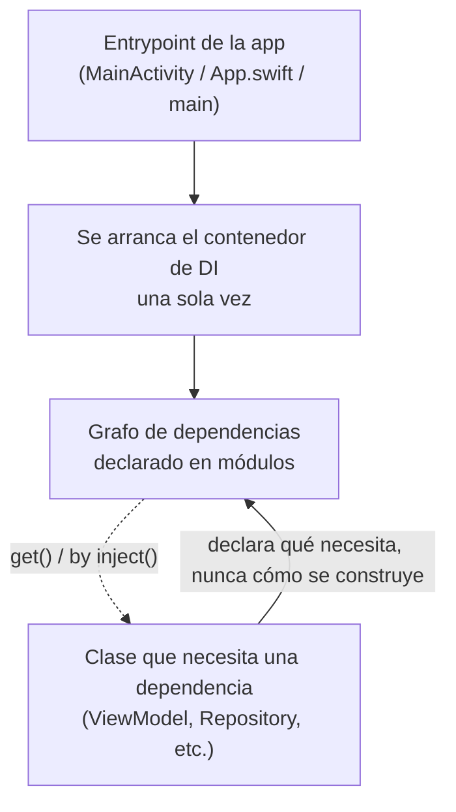

# Qué resuelve la Inyección de Dependencias

## 1. Mapa del flujo



Este archivo es sobre el patrón en sí, antes de cualquier framework concreto (Koin, Hilt, Kodein) — esos son formas distintas de implementar exactamente este mapa.

## 2. Qué es y cómo funciona

La Inyección de Dependencias (DI) es un patrón donde una clase **recibe** las dependencias que necesita en vez de **crearlas ella misma**. No es una librería — es el patrón en sí. Koin, Dagger/Hilt y Kodein son tres formas distintas de implementarlo, pero el problema que resuelven es el mismo, y existe incluso sin usar ninguna de las tres (pasar dependencias por constructor a mano ya es DI).

Sin DI, cada clase construye sus propias dependencias internamente — y eso genera tres problemas concretos: **acoplamiento rígido** (la clase conoce cómo se construye cada cosa que usa, y un cambio ahí obliga a tocar cada punto que la instancia a mano), **imposibilidad de testear en aislamiento** (no hay forma de reemplazar una dependencia por un fake si está hardcodeada adentro), y **nadie sabe "quién construye qué"** (en un proyecto grande, sin un lugar centralizado, no existe una vista única del grafo de objetos de la app).

Cómo se relacionan las piezas: la **clase consumidora** declara por constructor lo que necesita (una interfaz, idealmente, no una implementación concreta). El **contenedor/módulo de DI** es quien sabe cómo construir cada pieza del grafo, y se arranca una sola vez en el entrypoint de la app. Cuando algo pide una dependencia (`get()`, `by inject()`, o el mecanismo que sea), el contenedor resuelve la cadena completa — la clase consumidora nunca sabe de dónde vino lo que recibió.

## 3. Cómo se ve en distintos contextos

**App de fitness:** un `WorkoutViewModel` necesita un repositorio de rutinas. Sin DI, el `ViewModel` instancia `WorkoutRepositoryImpl(RoomDatabase.getInstance(context))` en su propio constructor — acoplado a Room, a `Context`, y a la forma exacta de construir la base. Con DI, el `ViewModel` solo declara `WorkoutRepository` (la interfaz) como parámetro de constructor, y no le importa qué hay detrás.

**App de notas (testing):** una clase `SearchNotesUseCase` que recibe su `NotesRepository` por constructor se puede testear pasándole un `FakeNotesRepository` que devuelve datos fijos en memoria — sin levantar una base de datos real, sin mockear frameworks pesados. Sin DI, si el `UseCase` instanciara su propio repositorio adentro, ese test sería imposible de aislar.

## 4. Implementación real

Te piden: *"La clase `PriceCalculator` hoy instancia su propia conexión a una API de tipo de cambio adentro del constructor, y el equipo no puede testearla sin hacer llamadas de red reales. Refactorizala para que sea testeable."*

**Antes — acoplada, no testeable:**

```kotlin
class PriceCalculator {
    private val exchangeRateApi = ExchangeRateApiClient(HttpClientProvider.getInstance())
    // ^ la clase se arma su propia dependencia — no hay forma de reemplazarla en un test

    suspend fun convertToLocalCurrency(amountUsd: Double): Double {
        val rate = exchangeRateApi.getCurrentRate()
        return amountUsd * rate
    }
}
```

**Después — la dependencia entra por constructor:**

```kotlin
class PriceCalculator(
    private val exchangeRateApi: ExchangeRateApi // interfaz, no la implementación concreta
) {
    suspend fun convertToLocalCurrency(amountUsd: Double): Double {
        val rate = exchangeRateApi.getCurrentRate()
        return amountUsd * rate
    }
}

// En producción, un framework de DI (o el entrypoint) decide qué implementación pasar
val calculator = PriceCalculator(exchangeRateApi = ExchangeRateApiClient(httpClient))

// En un test, se pasa un fake sin tocar la clase real
class FakeExchangeRateApi : ExchangeRateApi {
    override suspend fun getCurrentRate(): Double = 1.0 // tasa fija, sin red
}

val calculatorEnTest = PriceCalculator(exchangeRateApi = FakeExchangeRateApi())
```

`PriceCalculator` ya no decide **de dónde** viene su `ExchangeRateApi` — eso lo decide quien la construye.

## 5. Buenas prácticas y errores comunes — qué auditar si te lo entrega la IA

- **¿La dependencia llega como interfaz, o como implementación concreta?** `PriceCalculator(exchangeRateApi: ExchangeRateApiClient)` (la clase concreta) sigue acoplando al consumidor a una implementación específica, aunque técnicamente "entre por constructor". El punto de DI es poder cambiar la implementación sin tocar al consumidor — eso solo funciona si el tipo del parámetro es una interfaz/abstracción.

- **¿Hay un *default value* que sigue construyendo la dependencia real adentro del constructor?** `class Foo(private val repo: Repository = RepositoryImpl(RealDatabase.instance))` "acepta" la dependencia, pero si nadie pasa el parámetro explícitamente (como en un test que se olvida de hacerlo), se sigue instanciando la implementación real. El acoplamiento no desapareció, se escondió un nivel más adentro.

- **¿La clase importa, en algún punto interno, la implementación concreta de algo que ya recibe por constructor?** Si `PriceCalculator` recibe `ExchangeRateApi` por constructor pero en algún método interno hace `ExchangeRateApiClient()` de nuevo "para un caso puntual", el acoplamiento reaparece por la puerta de atrás.

- **¿Hay un singleton global (`object`, `companion object` con estado, service locator estático) actuando como sustituto informal de DI?** Un `object DatabaseProvider { val instance = ... }` accedido directamente desde varias clases tiene el mismo problema que no tener DI — nadie puede reemplazarlo en un test, aunque no se vea tan obvio como un `new` directo en el constructor.

- **¿Vale la pena, para este proyecto puntual, el overhead de un framework de DI?** No siempre. Para un prototipo chico o descartable, pasar dependencias por constructor a mano (sin Koin ni ningún framework) ya es DI y puede alcanzar. El framework entra cuando el grafo crece lo suficiente como para que armarlo a mano en cada entrypoint se vuelva repetitivo y propenso a error — si la IA metió Koin en un proyecto de 3 clases, preguntate si hacía falta.