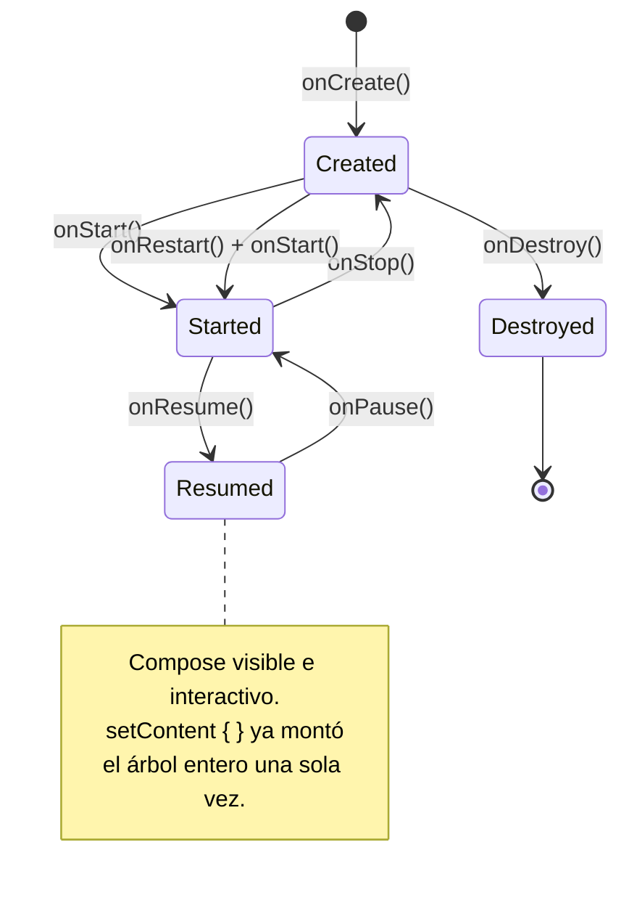

# android_lifecycle_y_fundamentals.md

## 1. Mapa del flujo



## 2. Qué es y cómo funciona

El lifecycle de Android es el conjunto de estados por los que pasa una `Activity` durante su existencia, gestionados por el sistema operativo — no por el desarrollador. Los 6 callbacks core son `onCreate()`, `onStart()`, `onResume()`, `onPause()`, `onStop()` y `onDestroy()` (más `onRestart()`, la transición especial de Stopped → Started marcada en el diagrama).

En una app Compose/Compose Multiplatform, la `Activity` deja de ser "la pantalla" — pasa a ser un contenedor único (`ComponentActivity`) que monta, una sola vez, el árbol entero de Compose vía `setContent { }`. Es contenido que solo existe en `androidMain`: no hay `expect/actual` que bridgear acá (ver `expect_actual.md`), porque iOS no tiene el concepto de `Activity` (usa `UIViewController`) y Compose Multiplatform ya abstrae esa diferencia por vos.

Junto con el lifecycle va `Context`: la interfaz que da acceso a recursos del sistema (strings, layouts, servicios). Hay dos sabores relevantes — **Activity Context** (vive y muere con esa Activity puntual, tiene noción de tema/UI) y **Application Context** (vive tanto como el proceso, sin ninguna referencia a una pantalla específica).

## 3. Cómo se ve en distintos contextos

En una app de **delivery**, el `MainActivity` es deliberadamente angosto: solo monta `setContent { DeliveryApp() }`, y todo el resto — la lista de pedidos, el detalle, el tracking en mapa — vive como composables dentro de ese único árbol, navegando internamente sin crear Activities nuevas. El `Application Context` es lo que se le pasa a Koin al arrancar, porque los `single {}` (el repositorio de pedidos, el cliente HTTP) necesitan sobrevivir más que cualquier pantalla puntual.

En una app de **edición de fotos**, un caso legítimo de multi-Activity es cuando se integra un SDK de terceros para compra dentro de la app (in-app purchase) que exige lanzar su propia Activity aislada con su propio ciclo de vida — ahí no tiene sentido forzarlo dentro del árbol de Compose de la app, porque el SDK ya viene con su propia UI nativa y su propio manejo de lifecycle que hay que respetar tal cual.

## 4. Implementación real

**El PO pide:** la pantalla principal de la app tiene que trackear analíticamente cuánto tiempo el usuario la tuvo en foreground, sin usar Activity Context en ningún componente de larga vida (para evitar el memory leak clásico).

```kotlin
class MainActivity : ComponentActivity() {
    override fun onCreate(savedInstanceState: Bundle?) {
        super.onCreate(savedInstanceState)
        // de acá para abajo, todo lo que corre es Compose compartido de commonMain
        setContent {
            AppTheme {
                App() // el único punto Android-only de toda la UI
            }
        }
    }
}
```

```kotlin
// Application Context: vive tanto como el proceso, sin atarse a ninguna Activity puntual
class MyApplication : Application() {
    override fun onCreate() {
        super.onCreate()
        startKoin {
            androidContext(this@MyApplication) // Application Context, nunca Activity Context
            modules(appModule)
        }
    }
}
```

```kotlin
// commonMain — el tracking de tiempo en foreground vía Lifecycle-aware API, no callbacks manuales
@Composable
fun HomeScreen() {
    val lifecycleOwner = LocalLifecycleOwner.current

    DisposableEffect(lifecycleOwner) {
        val observer = LifecycleEventObserver { _, event ->
            when (event) {
                Lifecycle.Event.ON_RESUME -> analyticsLogger.logEvent("home_foreground_start", emptyMap())
                Lifecycle.Event.ON_PAUSE -> analyticsLogger.logEvent("home_foreground_end", emptyMap())
                else -> Unit
            }
        }
        lifecycleOwner.lifecycle.addObserver(observer)
        onDispose {
            lifecycleOwner.lifecycle.removeObserver(observer)
        }
    }

    // resto de la UI de la pantalla
}
```

`MainActivity` es angosta a propósito, `MyApplication` es donde arranca Koin con Application Context, y el tracking de foreground se resuelve con `DisposableEffect` + `LocalLifecycleOwner` — nunca hookeando `onResume()`/`onPause()` directamente desde adentro de un composable, que es la recomendación oficial actual de Google.

## 5. Buenas prácticas y errores comunes — checklist de auditoría de código de IA

Si una IA te entrega código relacionado con lifecycle o Context, revisá:

- **¿Guardó una Activity Context en algo de vida más larga que esa Activity?** — un `companion object`, un singleton de Koin, cualquier clase con `single {}` que reciba `Context` debería recibir siempre `androidContext()` (Application Context), nunca una referencia directa a `this` desde una Activity. Es la causa #1 de memory leaks clásicos.
- **¿Hookeó `onStart()`/`onResume()` directamente dentro de un composable?** — si el código vive dentro de Compose, la IA debería haber usado `DisposableEffect` + `LocalLifecycleOwner` o `collectAsStateWithLifecycle()`, no override de callbacks de Activity. Hookear callbacks de Activity solo tiene sentido para setup a nivel de toda la app (el `setContent { }` inicial, `onNewIntent()` para deep links).
- **¿`MainActivity` quedó "gorda"?** — si la IA metió lógica de negocio, llamadas a repositorios, o manejo de estado directamente en `MainActivity` en vez de dejarla como el punto mínimo que monta `setContent { }`, es señal de que no está respetando el patrón single-Activity con Compose.
- **¿Propuso múltiples Activities sin una razón real?** — multi-Activity solo se justifica por mantenimiento de código legacy con XML Views, o un caso puntual donde una pantalla necesita un ciclo de vida completamente aislado (un SDK de terceros que lo exige). Si la IA generó una Activity nueva para "una pantalla más" del flujo normal de la app, está rompiendo el patrón single-Activity sin necesidad.
- **¿El observer de lifecycle se remueve correctamente?** — todo `addObserver()` dentro de un `DisposableEffect` necesita su `removeObserver()` correspondiente en el bloque `onDispose { }`. Si falta, es un leak de listener que persiste después de que el composable sale de composición.

## 6. Profundización: por qué el memory leak del companion object ocurre exactamente en la rotación

*(sección extra — mecánica paso a paso del caso trampa más citado en entrevistas)*

```kotlin
// ❌ trampa: el companion object vive tanto como la clase — prácticamente toda la app —
// pero acá se le mete una referencia a una Activity puntual
class AnalyticsTracker private constructor(private val context: Context) {
    companion object {
        private var instance: AnalyticsTracker? = null
        fun init(activityContext: Context) {
            instance = AnalyticsTracker(activityContext) // 🚩 Activity Context en un singleton
        }
    }
}

// en MainActivity.onCreate():
AnalyticsTracker.init(this) // "this" acá es la Activity
```

La secuencia exacta de lo que pasa en una rotación de pantalla:

1. **Antes de rotar:** `MainActivity` está en estado `Resumed`. `AnalyticsTracker.instance` tiene una referencia fuerte a esa instancia puntual de `MainActivity`.
2. **El usuario rota el dispositivo:** Android considera esto un cambio de configuración. El sistema dispara `onPause() → onStop() → onDestroy()` sobre la Activity actual — la destruye por completo, con la intención de recrearla desde cero para aplicar la nueva configuración (orientación, tamaño de pantalla).
3. **Se crea una `MainActivity` nueva:** el sistema instancia una Activity nueva y corre `onCreate()` de nuevo, montando un `setContent { }` nuevo. Si el código llama `AnalyticsTracker.init(this)` otra vez, `instance` ahora apunta a la Activity nueva.
4. **El problema está en el paso 2, no en el 3:** el recolector de basura de la JVM/ART libera un objeto cuando no hay ninguna referencia fuerte activa hacia él. Pero durante el breve instante entre `onDestroy()` de la vieja y el `init()` de la nueva (y en cualquier escenario donde `init()` no se vuelva a llamar), `AnalyticsTracker.instance` sigue reteniendo la Activity vieja — que ya fue destruida por el sistema operativo pero **no puede ser recolectada** porque el `companion object` (que vive tanto como la clase, prácticamente toda la app) todavía tiene una referencia fuerte hacia ella.
5. **El resultado acumulativo:** cada rotación repite el ciclo. Si `init()` se llama de nuevo cada vez, la Activity vieja eventualmente sí queda sin referencias y se libera — pero hay una ventana real donde coexisten en memoria la Activity "fantasma" (con todas sus vistas y recursos ya inflados) y la nueva, y en escenarios donde el `Context` viejo se sigue usando después de la destrucción (un callback asíncrono que capturó `context` antes de la rotación y responde después), la referencia nunca se limpia y el leak es permanente.

La solución (`context.applicationContext` en vez de la Activity directamente) rompe el problema en la raíz: el `Application Context` es la misma instancia durante toda la vida del proceso, así que no hay "Activity vieja" que retener — el objeto referenciado nunca se destruye mientras el proceso viva, entonces no hay nada que leakear.