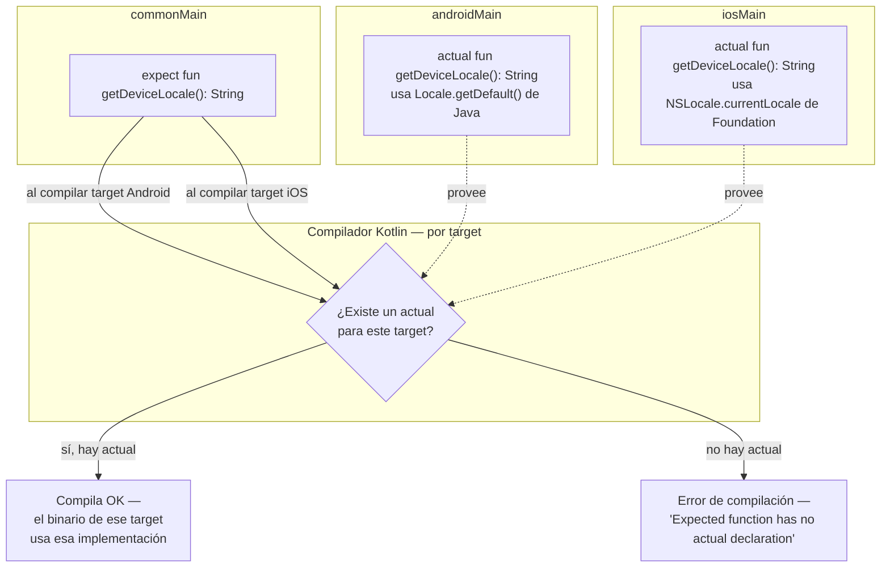

# expect_actual.md

## 1. Mapa del flujo



## 2. Qué es y cómo funciona

`expect/actual` es el mecanismo de Kotlin Multiplatform para declarar que una función, clase, propiedad u objeto existe en `commonMain` con una firma común, pero cada plataforma provee su propia implementación concreta. `expect` es la declaración (sin cuerpo) en código compartido; `actual` es la implementación real en cada sourceSet de plataforma (`androidMain`, `iosMain`, etc).

Como muestra el diagrama, el compilador resuelve esto **por target, no de forma global**: cuando compila el binario de Android, busca un `actual` en `androidMain` (o en un sourceSet padre que Android herede); cuando compila el de iOS, busca uno en `iosMain`. Si falta, no es un warning ni un crash en runtime — es un error de compilación que bloquea el build de ese target específicamente.

El código que *llama* a la función `expect` vive en `commonMain` y no sabe (ni le importa) qué implementación se ejecuta — eso lo resuelve el compilador, no el desarrollador en runtime.

## 3. Cómo se ve en distintos contextos

En una app de **clima**, `expect/actual` es el punto natural para pedir permiso de ubicación al sistema operativo — la lógica de qué hacer con las coordenadas (pedir el pronóstico, cachearlo) vive entera en `commonMain`, pero *cómo* se dispara el diálogo de permiso nativo es distinto en Android (`ActivityResultContracts`) que en iOS (`CLLocationManager`), así que esa única función puntual queda aislada con `expect/actual` mientras todo el resto del feature se comparte.

En una app de **notas**, es un buen candidato para copiar texto al portapapeles: es una acción atómica, sin estado propio, que cada plataforma resuelve con su propia API nativa (`ClipboardManager` en Android, `UIPasteboard` en iOS), y el resto del flujo — qué texto copiar, cuándo mostrar el feedback de "copiado" — es 100% lógica compartida que no necesita saber cómo se hizo el copiado por debajo.

## 4. Implementación real

**El PO pide:** una pantalla de configuración/soporte que muestre el idioma detectado del dispositivo, para que el usuario pueda reportarlo si algo se ve mal traducido.

```kotlin
// commonMain — la firma común, sin implementación
expect fun getDeviceLocale(): String
```

```kotlin
// androidMain
import java.util.Locale

actual fun getDeviceLocale(): String =
    Locale.getDefault().toLanguageTag() // ej: "es-AR"
```

```kotlin
// iosMain
import platform.Foundation.NSLocale
import platform.Foundation.currentLocale
import platform.Foundation.localeIdentifier

actual fun getDeviceLocale(): String =
    NSLocale.currentLocale.localeIdentifier // ej: "es_AR"
```

```kotlin
// commonMain — el consumidor no sabe (ni le importa) qué actual se ejecutó
@Composable
fun SupportScreen() {
    val locale = remember { getDeviceLocale() }
    Text(text = "Idioma detectado: $locale")
}
```

Notá que `SupportScreen()` está en `commonMain` y se compila igual para ambos targets — el único punto donde el código realmente diverge es la línea de `getDeviceLocale()`, y el compilador garantiza que esa línea nunca queda sin resolver en ningún target.

## 5. Buenas prácticas y errores comunes — checklist de auditoría de código de IA

Si una IA te entrega código usando `expect/actual`, revisá:

- **¿El `expect` tiene cuerpo o lógica condicional?** — un `expect fun` nunca lleva `{ }` con implementación; si la IA metió lógica ahí ("por las dudas"), no compila y hay que sacarla.
- **¿Cada `actual` tiene *exactamente* la misma firma que el `expect`?** — mismo nombre, mismos parámetros, mismo tipo de retorno. Una IA a veces "mejora" la firma en un solo target (agrega un parámetro default, cambia el tipo de retorno a nullable) rompiendo la paridad — eso no compila, pero en revisiones rápidas de diff es fácil no notar la firma exacta.
- **¿Falta el `actual` en algún target del proyecto?** — si el proyecto tiene 3 targets (Android, iOS, Desktop) y la IA solo generó `actual` para 2, el build va a fallar en el target faltante. Chequealo contra los targets reales declarados en `build.gradle.kts`, no asumas que "Android e iOS" es todo el proyecto.
- **¿Es candidato real para `expect/actual` o debería ser interfaz + DI?** — si la implementación que la IA generó necesita recibir un `Context`, un cliente HTTP, o cualquier dependencia por constructor, es señal de que eligió mal el mecanismo. Se profundiza en `expect_actual_vs_interfaz_di.md`.
- **¿Hay lógica de negocio con ramificaciones dentro del `actual`?** — un `actual` debería ser un puente puro hacia una API nativa (una o pocas líneas). Si la IA metió `if`/`when` con reglas de negocio dentro del `actual`, esa lógica debería vivir en `domain` y el `actual` debería quedar reducido a la llamada nativa mínima.
- **¿El `actual` vacío es una decisión real o un parche?** — si aparece un `actual fun algo() {}` sin hacer nada en un target nuevo, verificá si es una decisión documentada (la capacidad no aplica ahí) o si la IA solo lo puso para que compile, escondiendo el problema real.

## 6. Profundización: resolución de expect/actual en tiempo de compilación

*(sección extra — mecánica interna del compilador que no entra en un checklist de auditoría)*

Cuando el compilador de Kotlin procesa un módulo KMP, no compila "un binario" — compila **un binario distinto por cada target declarado** (Android, iOS x64, iOS arm64, etc.), y cada uno de esos binarios se arma combinando el código de `commonMain` con el código del sourceSet específico de ese target (más los sourceSets intermedios que herede, ver `sourceset_hierarchy.md`).

El paso de resolución de `expect/actual` ocurre **por target, de forma independiente**: para el binario de Android, el compilador toma el árbol `commonMain → androidMain` y por cada declaración `expect` en ese árbol busca una declaración `actual` correspondiente en algún punto del mismo árbol. Si la encuentra, la "conecta" — el binario final ni siquiera tiene el concepto de `expect/actual`, tiene una sola función real. Si no la encuentra, ese target específico falla en compilar con `Expected function 'xxx' has no actual declaration in module <target>` — pero los demás targets, si sus `actual` sí están completos, compilan sin problema. Por eso es común que un build "ande en Android" pero falle en iOS: son procesos de compilación separados, no una sola pasada que valida todos los targets a la vez.

Esto también explica por qué un sourceSet intermedio (`appleMain`) resuelve la duplicación sin romper nada: el compilador de iOS busca el `actual` recorriendo *toda* la cadena de herencia (`iosMain` → `appleMain` → `commonMain`), no solo el sourceSet hoja — así que un `actual` declarado en `appleMain` es visible para la resolución del target iOS exactamente igual que si estuviera en `iosMain` directamente.