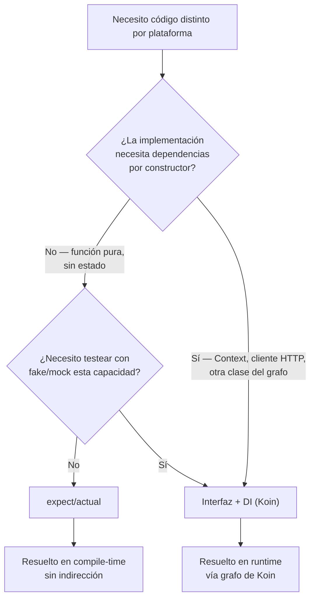

# expect_actual_vs_interfaz_di.md

## 1. Mapa del flujo



## 2. Qué es y cómo funciona

Es la decisión de criterio entre dos mecanismos que resuelven el mismo problema de fondo — "necesito código distinto por plataforma" — pero con garantías y costos distintos: `expect/actual` (resolución en compile-time, sin indirección, ver `expect_actual.md`) vs. una interfaz común en `domain`/`data` con una implementación concreta por plataforma, inyectada vía Koin (resolución en runtime, a través del grafo de DI).

Como muestra el diagrama, la pregunta que separa un camino del otro no es "¿esto difiere por plataforma?" — eso es cierto en ambos casos — sino **si la implementación necesita recibir algo por constructor** y **si vas a necesitar reemplazarla por un fake en tests**. Ninguno de los dos mecanismos es "el correcto" en abstracto: la forma del problema concreto determina cuál conviene.

## 3. Cómo se ve en distintos contextos

En una app de **fitness**, saber si el dispositivo soporta un sensor de pasos nativo es candidato ideal para `expect/actual`: es una consulta puntual, sin estado, sin dependencias — el mismo tipo de función atómica que un `getPlatformName()`. Pero el logger que manda esos eventos a un servicio de analítica externo (que necesita una API key, un cliente HTTP configurado, y que en tests se quiere reemplazar por un fake que no dispare llamadas reales) es candidato para interfaz + DI, porque tiene dependencias de construcción y necesita ser testeable.

En una app de **streaming de música**, el control del volumen del sistema es un caso simple de `expect/actual` — una función que lee/escribe un valor nativo sin más contexto. En cambio, el reproductor de audio en sí (que necesita configuración, mantiene estado interno de reproducción, y sobre el que vas a querer testear la lógica de "qué pasa cuando termina una canción" sin depender del motor de audio real) va por interfaz + DI, con una implementación fake para tests de la lógica que lo consume.

## 4. Implementación real

**El PO pide:** loguear eventos de analítica (qué pantalla se vio, qué botón se tocó) para un dashboard interno, y que ese logging se pueda desactivar completamente en tests sin tocar la lógica que lo dispara.

```kotlin
// commonMain — interfaz, no expect/actual, porque hay dependencias y se necesita fake en tests
interface AnalyticsLogger {
    fun logEvent(name: String, params: Map<String, String>)
}
```

```kotlin
// androidMain — necesita el Context de Android para inicializar el SDK nativo
class AndroidAnalyticsLogger(private val context: Context) : AnalyticsLogger {
    override fun logEvent(name: String, params: Map<String, String>) {
        // ejemplo: FirebaseAnalytics.getInstance(context).logEvent(name, params.toBundle())
    }
}
```

```kotlin
// iosMain — necesita su propio setup nativo, sin Context (no existe en iOS)
class IosAnalyticsLogger : AnalyticsLogger {
    override fun logEvent(name: String, params: Map<String, String>) {
        // ejemplo: llamada al SDK nativo de analítica vía cinterop
    }
}
```

```kotlin
// androidMain — módulo de Koin
val androidPlatformModule = module {
    single<AnalyticsLogger> { AndroidAnalyticsLogger(androidContext()) }
}

// iosMain — módulo de Koin
val iosPlatformModule = module {
    single<AnalyticsLogger> { IosAnalyticsLogger() }
}
```

```kotlin
// commonTest — el fake reemplaza la implementación real sin tocar la lógica que la consume
class FakeAnalyticsLogger : AnalyticsLogger {
    val loggedEvents = mutableListOf<String>()
    override fun logEvent(name: String, params: Map<String, String>) {
        loggedEvents.add(name)
    }
}
```

Con `expect/actual`, pasarle el `Context` a un `actual class AndroidAnalyticsLogger` implicaría declarar el `expect class` con constructor, y ya empieza a sentirse forzado comparado con dejar que Koin resuelva la dependencia naturalmente — y el `FakeAnalyticsLogger` de test directamente no tendría dónde engancharse.

## 5. Buenas prácticas y errores comunes — checklist de auditoría de código de IA

Si una IA te entrega código resolviendo una diferencia de plataforma, revisá:

- **¿Eligió `expect/actual` para algo con dependencias por constructor?** — si el `actual` necesita un `Context`, un cliente HTTP, o cualquier objeto del grafo de DI, la IA eligió mal el mecanismo. Señal clara: si ves un `expect class` (no `expect fun`) con parámetros de constructor, es candidato fuerte a migrar a interfaz + DI.
- **¿Eligió interfaz + DI para algo trivial de una sola función pura?** — el error simétrico: una interfaz con un solo método, una sola implementación por plataforma, sin estado, sin necesidad real de fake en tests, es ceremonia de más. `expect/actual` directo es más simple ahí.
- **¿La interfaz vive en la capa correcta?** — si la capacidad la consume `domain` (un UseCase), la interfaz debería vivir en `domain` y la implementación en `data` o `platform`, nunca al revés (domain no puede depender de implementaciones concretas de plataforma).
- **¿El binding de Koin está en el módulo de plataforma correcto?** — cada `single<Interfaz> { ImplementacionAndroid(...) }` tiene que estar en el módulo de `androidMain`, no en `commonMain` (donde no compilaría, porque la clase concreta no existe ahí).
- **¿Hay un fake/mock disponible para tests si la lógica que consume la interfaz tiene tests?** — si la IA generó la interfaz pero no un fake mínimo en `commonTest`, y hay tests que dependen de esa capacidad, falta esa pieza.
- **¿Se coló un `expect/actual` dentro de algo que después necesitó estado?** — si el código empezó como `expect fun` simple y la IA lo fue "parchando" agregándole estado interno (variables `var` a nivel de `actual`), es señal de que cruzó la línea y debería haber migrado a interfaz + DI en vez de acumular estado en una función expect.

## 6. Profundización: costo real de cada mecanismo en runtime vs. compile-time

*(sección extra — para entender qué se está pagando en cada camino, no solo cuándo elegirlo)*

Con `expect/actual`, el costo de resolución es **cero en runtime**: como se vio en `expect_actual.md`, el compilador conecta la llamada `expect` con su `actual` correspondiente durante la compilación de cada target, así que en el binario final no queda ningún rastro de indirección — es una llamada directa a función, tan barata como cualquier otra. El costo real está en tiempo de compilación (obliga a tener el `actual` completo en cada target) y en diseño (no admite parámetros de construcción variables).

Con interfaz + DI, el costo se traslada a runtime: Koin arma su grafo de dependencias al arrancar la app (`startKoin { modules(...) }`), y cada `single<Interfaz> { Implementacion(...) }` se resuelve la primera vez que algo pide esa interfaz — recién ahí Koin busca en su registro interno qué implementación concreta corresponde a esa plataforma. Esto significa que un binding mal declarado (una interfaz sin implementación registrada en algún módulo) **no falla al compilar** — compila perfecto, porque el compilador no valida el grafo de Koin — y solo explota en runtime, con un `NoDefinitionFoundException`, la primera vez que algo intenta resolver esa dependencia. Es exactamente la diferencia de garantías que menciona la matriz de criterio: `expect/actual` falla temprano (compile-time), interfaz + DI falla tarde (runtime, y solo si el código que dispara la resolución efectivamente se ejecuta — un módulo mal configurado puede pasar inadvertido si esa rama de código no se testea).