# sourceset_hierarchy.md

## 1. Mapa del flujo

```mermaid
flowchart TB
    common["commonMain"]
    apple["appleMain (intermedio, creado a mano)"]
    ios["iosMain"]
    macos["macosMain"]
    android["androidMain"]

    common --> apple
    common --> android
    apple --> ios
    apple --> macos

    style apple fill:#333,stroke:#999
```



## 2. Qué es y cómo funciona

Es la organización jerárquica de los `sourceSets` de Gradle en un proyecto KMP: no son solo `commonMain`, `androidMain` e `iosMain` como tres compartimentos aislados, sino un árbol donde podés crear sourceSets **intermedios** que agrupan varios targets emparentados (ej: `appleMain` compartido entre `iosMain` y `macosMain`; o `jvmCommonMain` compartido entre `androidMain` y `desktopMain`). Cada sourceSet hereda automáticamente todo lo que está definido en sus padres en la jerarquía.

Como muestra el diagrama, `commonMain` es la raíz que todo hereda. `androidMain` cuelga directo de `commonMain` porque no tiene "hermanos" con los que compartir un intermedio. En cambio `iosMain` y `macosMain` cuelgan de `appleMain` — un sourceSet que no existe por default en KMP, hay que crearlo a mano cuando aparece la primera duplicación real entre esos dos targets.

```kotlin
// build.gradle.kts (módulo shared)
kotlin {
    androidTarget()
    iosX64()
    iosArm64()
    iosSimulatorArm64()
    macosX64()

    sourceSets {
        val commonMain by getting
        val appleMain by creating {
            dependsOn(commonMain)
        }
        val iosX64Main by getting { dependsOn(appleMain) }
        val iosArm64Main by getting { dependsOn(appleMain) }
        val iosSimulatorArm64Main by getting { dependsOn(appleMain) }
        val macosX64Main by getting { dependsOn(appleMain) }
    }
}
```

Nota importante: `iosMain` en KMP ya es en sí mismo un sourceSet intermedio automático que agrupa `iosX64Main`/`iosArm64Main`/`iosSimulatorArm64Main` — eso KMP lo da gratis. Lo que **no** da gratis es un padre común entre `iosMain` y `macosMain`; eso hay que crearlo explícitamente como `appleMain`.

## 3. Cómo se ve en distintos contextos

En una app de **lectura de ebooks** que corre en Android, iOS y macOS, la lógica para leer el tamaño de fuente preferido del sistema operativo es idéntica entre iOS y macOS (ambos usan APIs de Accessibility de Apple) pero distinta de Android — ese `actual` va una sola vez en `appleMain` y lo heredan ambos targets Apple, en vez de copiarlo dos veces.

En una app de **catálogo de productos** que corre en Android y en una versión Desktop (JVM), compartir el `actual` que lee variables de entorno del sistema operativo (mismo mecanismo Java tanto en Android como en una JVM de escritorio) es un caso típico de sourceSet intermedio `jvmCommonMain` — evita reescribir la misma lógica dos veces solo porque son "targets distintos" en la configuración de Gradle, cuando en los hechos comparten el mismo runtime subyacente.

## 4. Implementación real

**El PO pide:** la app ya corre en Android y iOS, y ahora se suma un target macOS para una versión de escritorio para Mac. Se necesita compartir la lógica de almacenamiento seguro (Keychain) que ya funciona en iOS, porque macOS usa la misma API.

```kotlin
// build.gradle.kts — se agrega macosX64() y se crea appleMain a mano
kotlin {
    androidTarget()
    iosX64()
    iosArm64()
    iosSimulatorArm64()
    macosX64() // nuevo target

    sourceSets {
        val commonMain by getting
        val androidMain by getting { dependsOn(commonMain) }

        // appleMain no existe por default — se crea explícitamente
        val appleMain by creating {
            dependsOn(commonMain)
        }
        val iosX64Main by getting { dependsOn(appleMain) }
        val iosArm64Main by getting { dependsOn(appleMain) }
        val iosSimulatorArm64Main by getting { dependsOn(appleMain) }
        val macosX64Main by getting { dependsOn(appleMain) } // nuevo, cuelga del mismo padre
    }
}
```

```kotlin
// commonMain — la firma compartida
expect fun getSecureStorageKey(): String
```

```kotlin
// appleMain — un solo actual para toda la familia Apple, antes vivía duplicado en iosMain
actual fun getSecureStorageKey(): String =
    platform.Security.kSecClassGenericPassword.toString()
```

```kotlin
// iosMain — solo lo que sí difiere entre iOS y macOS específicamente
actual fun getHapticFeedbackStyle(): String = "UIImpactFeedbackGenerator"

// macosMain — macOS no tiene haptics de iOS, necesita su propia implementación
actual fun getHapticFeedbackStyle(): String = "NSHapticFeedbackManager"
```

El punto clave: mover `getSecureStorageKey()` a `appleMain` no rompe nada en iOS — el compilador sigue encontrando el `actual` recorriendo la cadena de herencia (`iosMain` → `appleMain` → `commonMain`), y ahora macOS lo hereda gratis sin duplicar una sola línea.

## 5. Buenas prácticas y errores comunes — checklist de auditoría de código de IA

Si una IA te entrega configuración de sourceSets o código que asume una jerarquía, revisá:

- **¿Duplicó código idéntico en `iosMain` y `macosMain` en vez de crear `appleMain`?** — si dos `actual` de targets emparentados son literalmente el mismo código, la IA debería haber propuesto un sourceSet intermedio, no copiarlo dos veces. Duplicación silenciosa es el error más común de este tema.
- **¿Creó un sourceSet intermedio para targets que en realidad tienen comportamiento distinto?** — el error simétrico: forzar un `actual` común en `appleMain` cuando iOS y macOS necesitan lógica distinta obliga a meter un `if`/`when` de plataforma *dentro* del `actual` compartido, reintroduciendo el problema que `expect/actual` existe para evitar.
- **¿El `dependsOn()` apunta al padre correcto?** — cada sourceSet nuevo (`appleMain`, `jvmCommonMain`, etc.) necesita `dependsOn(commonMain)` explícito, y cada sourceSet hoja (`iosX64Main`, `macosX64Main`) necesita `dependsOn(appleMain)` — si la IA se olvidó un `dependsOn`, ese sourceSet queda huérfano y no hereda nada de la jerarquía intermedia, aunque el nombre sugiera que sí.
- **¿Creó un sourceSet intermedio sin necesidad real?** — un `appleMain` declarado con un solo target Apple en el proyecto (sin `macosX64()` ni otro hermano) es una capa vacía, complejidad prematura. Debería agregarse recién cuando aparece la primera duplicación real entre dos targets emparentados.
- **¿Confundió el sourceSet automático (`iosMain`) con uno manual?** — `iosMain` ya agrupa los tres targets de iOS sin que nadie lo declare a mano; si la IA generó código creando `iosMain by creating { }` explícitamente, es un error — ya existe por default, y recrearlo puede pisar la configuración automática de Kotlin/Native.

## 6. Profundización: cómo Gradle resuelve la herencia de dependencias entre sourceSets

*(sección extra — para entender qué se hereda exactamente, no solo estructura)*

Cuando un sourceSet declara `dependsOn(otroSourceSet)`, lo que hereda no es solo el código Kotlin — es **todo el classpath de compilación** de ese padre: las dependencias de Gradle (`implementation(...)`) declaradas en el sourceSet padre están disponibles automáticamente en el hijo, sin que haga falta redeclararlas. Esto es lo que hace que declarar una dependencia de Ktor en `commonMain` la haga visible en `androidMain`, `iosMain` y `appleMain` a la vez — todos cuelgan (directa o indirectamente) de `commonMain`.

Esta herencia es transitiva a lo largo de toda la cadena: si `iosX64Main` depende de `appleMain`, que depende de `commonMain`, entonces `iosX64Main` tiene acceso al código y las dependencias de los tres niveles, no solo del inmediatamente superior. Es exactamente el mismo mecanismo por el que, en el ejemplo de implementación real, mover `getSecureStorageKey()` a `appleMain` no requirió cambiar nada en la configuración de `iosX64Main`, `iosArm64Main` ni `iosSimulatorArm64Main` — todos siguen viendo esa función a través de la cadena de herencia, exactamente igual que antes de moverla.