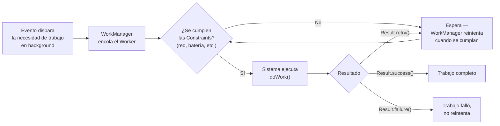

# workmanager.md

## 1. Mapa del flujo



## 2. Qué es y cómo funciona

WorkManager es la API de Android (parte de Jetpack, no de KMP) para programar trabajo en background que necesita **garantía de ejecución** — incluso si la app se cierra, el dispositivo se reinicia, o el proceso muere, WorkManager persiste el pedido y lo ejecuta quen se cumplan las condiciones. Es distinto de simplemente lanzar una corrutina en `viewModelScope`: esa corrutina muere si el usuario sale de la pantalla o mata la app; un `Worker` de WorkManager sobrevive a eso porque el sistema operativo lo gestiona a nivel de proceso, no a nivel de tu app.

Como muestra el diagrama, el ciclo tiene dos partes: encolar el trabajo con sus `Constraints` (condiciones que deben cumplirse antes de ejecutar — red disponible, batería no baja, dispositivo cargando), y la ejecución en sí dentro de `doWork()`, que devuelve `Result.success()`, `Result.retry()` (reintenta con backoff) o `Result.failure()` (no reintenta más).

**Es Android puro, sin equivalente KMP real** — no hay `expect/actual` que lo bridgee a iOS, porque iOS resuelve background work con un mecanismo completamente distinto (`BGTaskScheduler`), con su propia lógica y limitaciones. Esto lo aparta de todo lo demás documentado en `05_platform`: no es una capa que se abstraiga con `expect/actual` ni con interfaz+DI compartida — cada plataforma necesita su propia estrategia, resuelta por separado.

## 3. Cómo se ve en distintos contextos

En una app de **backup de fotos**, WorkManager es el mecanismo natural para subir fotos nuevas a la nube: es trabajo que puede tardar minutos, no debería bloquear la UI, tiene que sobrevivir a que el usuario cierre la app, y solo debería correr con `Constraints.NetworkType.UNMETERED` (para no gastar datos móviles del usuario sin que lo sepa).

En una app de **notas colaborativas**, sincronizar cambios pendientes hechos offline es otro caso típico: el usuario edita notas sin conexión, y apenas vuelve la red, WorkManager dispara automáticamente el trabajo de sincronización — sin que el usuario tenga que volver a abrir la app manualmente para que se dispare.

## 4. Implementación real

**El PO pide:** los pedidos que el usuario crea offline en la app de delivery se tienen que sincronizar automáticamente con el backend apenas vuelva la conexión, incluso si el usuario cerró la app.

```kotlin
// androidMain — el Worker que ejecuta la sincronización real
class SyncPendingOrdersWorker(
    context: Context,
    params: WorkerParameters,
    private val orderRepository: OrderRepository // inyectado, ver nota más abajo
) : CoroutineWorker(context, params) {

    override suspend fun doWork(): Result {
        return try {
            orderRepository.syncPendingOrders() // suspend fun ya existente en el repository
            Result.success()
        } catch (e: IOException) {
            // fallo de red: reintentar más tarde, no descartar el trabajo
            Result.retry()
        } catch (e: Exception) {
            // error no recuperable: no tiene sentido seguir reintentando
            Result.failure()
        }
    }
}
```

```kotlin
// androidMain — Factory de Koin para que WorkManager pueda construir el Worker con dependencias
class AppWorkerFactory(private val orderRepository: OrderRepository) : WorkerFactory() {
    override fun createWorker(
        appContext: Context,
        workerClassName: String,
        workerParameters: WorkerParameters
    ): ListenableWorker? = when (workerClassName) {
        SyncPendingOrdersWorker::class.java.name ->
            SyncPendingOrdersWorker(appContext, workerParameters, orderRepository)
        else -> null
    }
}
```

```kotlin
// androidMain — cómo se encola el trabajo, con Constraints de red
fun scheduleOrderSync(context: Context) {
    val constraints = Constraints.Builder()
        .setRequiredNetworkType(NetworkType.CONNECTED)
        .build()

    val syncRequest = OneTimeWorkRequestBuilder<SyncPendingOrdersWorker>()
        .setConstraints(constraints)
        .setBackoffCriteria(BackoffPolicy.EXPONENTIAL, 10, TimeUnit.SECONDS)
        .build()

    WorkManager.getInstance(context).enqueueUniqueWork(
        "sync_pending_orders",
        ExistingWorkPolicy.KEEP, // si ya hay uno encolado, no duplicar
        syncRequest
    )
}
```

Notá que el `Worker` no reimplementa la lógica de sincronización — llama a `orderRepository.syncPendingOrders()`, la misma función suspend que ya vive en `data` y que se testea igual que cualquier otro método de repository. WorkManager solo resuelve *cuándo y bajo qué condiciones* se dispara esa llamada, no *qué hace* la llamada en sí.

## 5. Buenas prácticas y errores comunes — checklist de auditoría de código de IA

Si una IA te entrega código usando WorkManager, revisá:

- **¿Usó `Worker` en vez de `CoroutineWorker` para trabajo suspend?** — si `doWork()` necesita llamar a una función `suspend` (como un repository con Ktor/Firestore), tiene que extender `CoroutineWorker`, no `Worker` (que es sincrónico y bloquea el hilo). Usar `Worker` con código suspend obliga a `runBlocking`, lo cual es un anti-patrón.
- **¿El Worker recibe sus dependencias por constructor o las resuelve él mismo?** — si la IA hizo que el `Worker` llame directamente a `GlobalContext.get().get<OrderRepository>()` (Koin como service locator dentro del Worker) en vez de recibirlo vía un `WorkerFactory`, es una violación de inyección de dependencias que además complica los tests: un Worker con dependencias por constructor se puede testear con un fake repository sin tocar WorkManager real.
- **¿Registró el `WorkerFactory` custom al arrancar la app?** — si el Worker tiene dependencias inyectadas, `Application.onCreate()` necesita configurar `WorkManager` con esa `WorkerFactory` custom (vía `Configuration.Provider`); si la IA generó el Worker con constructor de dependencias pero no tocó la configuración de `Application`, WorkManager va a fallar al intentar crear el Worker en runtime porque no sabe cómo resolver esas dependencias.
- **¿Usó `enqueueUniqueWork` cuando corresponde evitar duplicados?** — si el trabajo no debería encolarse múltiples veces en paralelo (como una sincronización que ya cubre todos los pendientes), la IA debería usar `enqueueUniqueWork` con una política (`KEEP`, `REPLACE`, `APPEND`) en vez de `enqueue()` simple, que permite duplicados sin límite.
- **¿Definió `Constraints` razonables?** — trabajo de red sin `NetworkType.CONNECTED` (o `UNMETERED` si aplica) puede dispararse sin conexión y fallar en loop de reintentos innecesariamente; revisar que las constraints coincidan con lo que el trabajo realmente necesita.
- **¿Distingue `Result.retry()` de `Result.failure()` correctamente?** — un error de red transitorio (`IOException`) debería reintentar; un error de lógica de negocio no recuperable (datos corruptos, validación fallida) debería fallar sin reintentar indefinidamente. Si la IA usó `Result.retry()` para todo, un error permanente puede quedar reintentando para siempre.