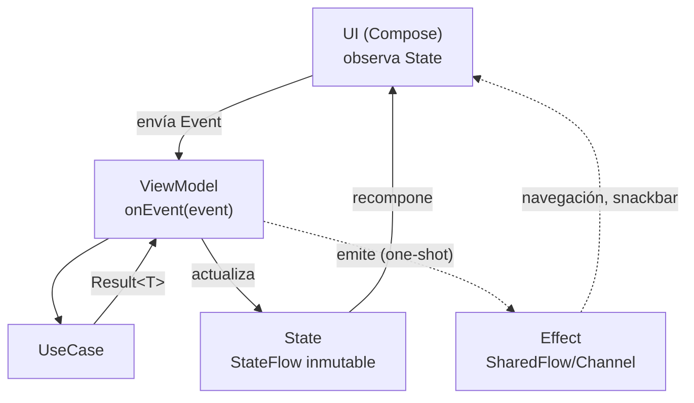

# MVI (Model-View-Intent)

## 1. Mapa del flujo



El detalle que define todo el patrón: hay **una sola flecha entrando** al ViewModel (`Event`) y **una sola flecha de estado persistente saliendo** (`State`). No hay atajos — nada le habla al ViewModel salvo `onEvent()`, y nada sale de él salvo por `State`/`Effect`.

## 2. Qué es y cómo funciona

MVI (Model-View-Intent) es un patrón de flujo de datos unidireccional para la capa Presentation. El nombre original usa "Intent" para lo que el usuario quiere hacer; en la convención Kotlin/Compose que vas a encontrar en la práctica (y la que usamos en este repo) se lo llama **Event** — es el mismo concepto, dos nombres.

Las piezas y cómo se relacionan: el **Model** en MVI es el `State` — la representación completa e inmutable de lo que la pantalla debe mostrar en este instante (no confundir con el Model de `02_domain`, que es un concepto distinto aunque comparta nombre). El **View** es la UI, que solo hace dos cosas: observa `State` y envía `Event`. El **Intent/Event** es la única puerta de entrada — todo lo que el usuario puede hacer pasa por ahí, nunca por un método público suelto.

La pieza que hace esto testeable es el **reducer**: una función pura `(State, Event) -> State`, sin efectos secundarios (sin coroutines, sin llamadas de red, sin logging) — solo calcula qué State resulta de aplicar un Event. El trabajo async real (llamar a un UseCase, esperar la respuesta) vive alrededor del reducer, no adentro.

## 3. Cómo se ve en distintos contextos

**App de fitness (pantalla de rutina activa):** el estado agrupa `currentExercise`, `isTimerRunning`, `elapsedSeconds` y `isLoading` en un único `WorkoutState`. Sin esa agrupación, nada impide que `isLoading = true` mientras `isTimerRunning = true` — una combinación sin sentido (¿el timer sigue corriendo mientras se está cargando la próxima rutina?) que el `data class` único hace imposible de dejar mal formada por accidente.

**App de chat:** el `Event` agrupa `OnSendMessage`, `OnRetryFailedMessage`, `OnMessageLongPressed` como un único `sealed interface ChatEvent` — la UI nunca llama tres métodos públicos distintos del ViewModel, todo entra por el mismo `onEvent()`. Esto es lo que permite, más adelante, loguear o testear "cada acción que el usuario intentó hacer en esta pantalla" con un solo punto de instrumentación.

## 4. Implementación real

Te piden: *"La pantalla de Historial de Pedidos necesita comportarse igual sin importar si el estado de carga vino de la apertura inicial o de un refresh manual, y el equipo quiere poder testear esa lógica sin levantar ViewModel ni Compose."*

**Paso 1 — el reducer, aislado y puro:**

```kotlin
data class OrdersState(
    val orders: List<Order> = emptyList(),
    val isLoading: Boolean = false,
    val error: String? = null
)

sealed interface OrdersEvent {
    data object OnRefresh : OrdersEvent
    data object OnRetryClicked : OrdersEvent
    data class OnOrderClicked(val orderId: String) : OrdersEvent
}

// Puro: mismo input -> mismo output, sin I/O, sin coroutines. Testeable con un simple assertEquals.
fun reduce(current: OrdersState, event: OrdersEvent): OrdersState = when (event) {
    OrdersEvent.OnRefresh -> current.copy(isLoading = true, error = null)
    OrdersEvent.OnRetryClicked -> current.copy(isLoading = true, error = null)
    is OrdersEvent.OnOrderClicked -> current // no cambia el State, dispara un Effect de navegación (ver viewmodel.md)
}
```

**Paso 2 — el test, sin ViewModel ni Compose de por medio:**

```kotlin
@Test
fun `OnRefresh pone isLoading en true y limpia el error previo`() {
    val estadoConError = OrdersState(error = "Sin conexión")
    val resultado = reduce(estadoConError, OrdersEvent.OnRefresh)

    assertTrue(resultado.isLoading)
    assertNull(resultado.error)
}
```

El reducer no sabe que existe un `UseCase`, una API, ni una base de datos — solo transforma `State` en `State` a partir de un `Event`. Todo lo asíncrono (llamar a `refreshOrdersUseCase()`, actualizar el `State` con el resultado real) es responsabilidad del ViewModel que envuelve este reducer — eso se ve en `viewmodel.md`.

## 5. Buenas prácticas y errores comunes — qué auditar si te lo entrega la IA

- **¿Hay un único `State` inmutable, o el ViewModel expone varios `StateFlow` sueltos?** Si ves más de un `StateFlow` público en el mismo ViewModel (`isLoading`, `orders`, `error` como streams separados), no es MVI aunque el archivo se llame `Contract.kt` — es MVVM con otro nombre. Ver `mvvm.md` para el problema concreto que eso reintroduce.

- **¿Hay más de un punto de entrada para modificar el estado?** Si el ViewModel tiene, además de `onEvent()`, algún método público que actualiza `_state` directamente (`fun setLoading(value: Boolean)`), se rompió la garantía de "una sola puerta de entrada" — cualquier lugar de la UI que llame ese método bypassa el Event y el reducer.

- **¿El reducer (o la lógica equivalente dentro de `onEvent`) hace I/O o lanza coroutines?** Un reducer que llama a un `UseCase` adentro deja de ser puro y deja de ser testeable con un simple assert — si la IA metió una llamada suspendida dentro de la función `reduce`, esa lógica necesita salir de ahí y vivir en el ViewModel.

- **¿El `Event` es un `sealed interface` (o `sealed class`), no una interfaz abierta?** Sin `sealed`, el compilador no puede garantizar que el `when (event)` sea exhaustivo — un caso nuevo agregado después puede quedar sin manejar sin que nada avise en compilación.

- **¿Las combinaciones de campos del `State` tienen sentido real?** Repasá mentalmente: ¿puede `isLoading = true` coexistir con `orders` ya poblado? Si la respuesta esperada es "sí, mostrando lo viejo mientras refresca", está bien — pero si es "no, eso no debería pasar nunca", el modelo del `State` tiene un hueco que el reducer no está cerrando.