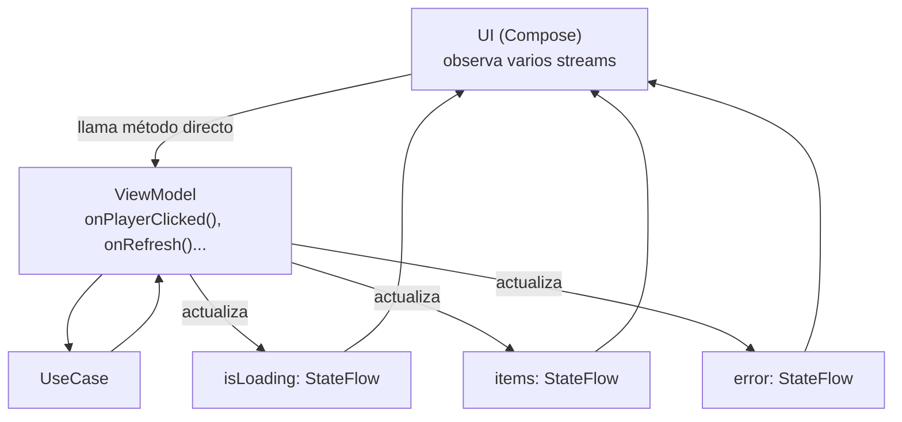

# MVVM (Model-View-ViewModel)

## 1. Mapa del flujo



Compará este mapa con el de `mvi.md`: ahí había una sola flecha de entrada (`Event`) y una sola de salida persistente (`State`). Acá hay varias de cada lado — esa es la diferencia completa entre los dos patrones, no hay ningún otro matiz escondido.

## 2. Qué es y cómo funciona

MVVM (Model-View-ViewModel) es, igual que MVI, un patrón que usa un ViewModel para separar lógica de presentación de la UI, exponiendo estado observable para que la UI reaccione sin conocer detalles de Compose ni de la plataforma. La diferencia real no es "si hay ViewModel o no" — los dos lo tienen. Está en **cómo se modela el estado que expone** y **cómo entran las acciones del usuario**.

En MVVM "clásico", cada pieza de estado vive en su propio stream independiente (`val isLoading: StateFlow<Boolean>`, `val players: StateFlow<List<Player>>`, cada uno separado), y la UI suele llamar métodos públicos directos del ViewModel para cada acción (`onPlayerClicked()`, `onRefresh()`) en vez de pasar por un único canal de eventos.

Cómo se relacionan las piezas: el **Model** es el dato de dominio que el ViewModel expone. La **View** observa cada stream por separado y decide cómo combinarlos visualmente. El **ViewModel** no fuerza ninguna relación entre los streams a nivel de tipos — nada impide, por ejemplo, que `isLoading = true` y `error != null` existan al mismo tiempo, aunque esa combinación no debería tener sentido real.

## 3. Cómo se ve en distintos contextos

**App de configuración (caso donde MVVM encaja bien):** una pantalla con dos toggles independientes — modo oscuro y notificaciones — sin loading ni error asociado a ninguno de los dos. Acá no hay ninguna combinación imposible que prevenir: cada `StateFlow<Boolean>` es autosuficiente, y forzar un `Contract` con `State`/`Event`/`Effect` completo sería ceremonia sin beneficio real.

**App con estado que creció sin que nadie lo decidiera (caso donde MVVM empieza a doler):** una pantalla de lista que arrancó con un solo `StateFlow<List<Item>>` fue sumando, con el tiempo, `isLoading`, `error`, y `isRefreshing` — cada uno agregado por separado, cada vez que una feature nueva lo pidió. Hoy la UI tiene lógica condicional tipo `if (isLoading && error != null && items.isNotEmpty())` tratando de desambiguar combinaciones que, en rigor, nunca deberían haber podido coexistir — porque nada en el modelo de datos las prohíbe.

## 4. Implementación real

Te piden: *"Pantalla de Configuración de la app: modo oscuro y notificaciones, cada uno como un toggle independiente, sin estados de carga ni error."*

```kotlin
class SettingsViewModel(
    private val preferencesRepository: PreferencesRepository
) {
    val isDarkMode: StateFlow<Boolean> = preferencesRepository
        .isDarkMode
        .stateIn(viewModelScope, SharingStarted.WhileSubscribed(5_000), false)

    val notificationsEnabled: StateFlow<Boolean> = preferencesRepository
        .notificationsEnabled
        .stateIn(viewModelScope, SharingStarted.WhileSubscribed(5_000), false)

    fun onDarkModeToggled(enabled: Boolean) {
        viewModelScope.launch { preferencesRepository.setDarkMode(enabled) }
    }

    fun onNotificationsToggled(enabled: Boolean) {
        viewModelScope.launch { preferencesRepository.setNotificationsEnabled(enabled) }
    }
}
```

Cada método público es una acción independiente, cada `StateFlow` es una pieza de estado independiente — no hay ninguna relación entre `isDarkMode` y `notificationsEnabled` que un `Contract` unificado necesitara proteger. Esto es MVVM bien aplicado, no una versión incompleta de MVI.

## 5. Buenas prácticas y errores comunes — qué auditar si te lo entrega la IA

- **¿Los streams son realmente independientes, o hay campos que interactúan entre sí?** Si `isLoading`, `data` y `error` del mismo ViewModel pueden estar relacionados (por ejemplo, no debería haber datos Y error de carga inicial al mismo tiempo), MVVM con streams sueltos no es la elección correcta — esa pantalla necesita un `State` único (MVI, ver `mvi.md`).

- **¿Aparece lógica condicional en la UI tratando de desambiguar combinaciones de streams?** Un `if (isLoading && error != null && items.isNotEmpty())` en un Composable es la señal más clara de que el estado de esa pantalla ya superó lo que MVVM con streams sueltos puede modelar de forma segura — es momento de migrar a un `State` agrupado.

- **¿Cada `StateFlow` público expone la versión inmutable (`asStateFlow()`/`stateIn()`), no el `MutableStateFlow` directo?** Si un `val isDarkMode: MutableStateFlow<Boolean>` queda público, cualquier lugar de la UI puede mutarlo directamente, sin pasar por el ViewModel — se pierde el control sobre quién puede cambiar el estado.

- **¿Los métodos públicos de acciones están documentados o listados en algún lugar centralizado?** A diferencia de MVI (donde el `sealed interface Event` es, por diseño, la lista completa de acciones posibles), en MVVM esa lista no existe de forma forzada — si el ViewModel fue acumulando métodos públicos sin ningún inventario, nadie puede ver de un vistazo "todo lo que esta pantalla puede hacer" sin leer la clase entera.

- **¿La elección de MVVM para esta pantalla fue deliberada, o es el default sin evaluar si el estado puede volverse inconsistente?** La pregunta correcta no es "¿mi proyecto usa MVVM en general?" sino "¿el estado específico de esta pantalla puede tener combinaciones que no deberían existir?" — si la respuesta es sí, aunque hoy la pantalla sea simple, MVI es la opción que previene el problema desde el diseño en vez de parchearlo después.