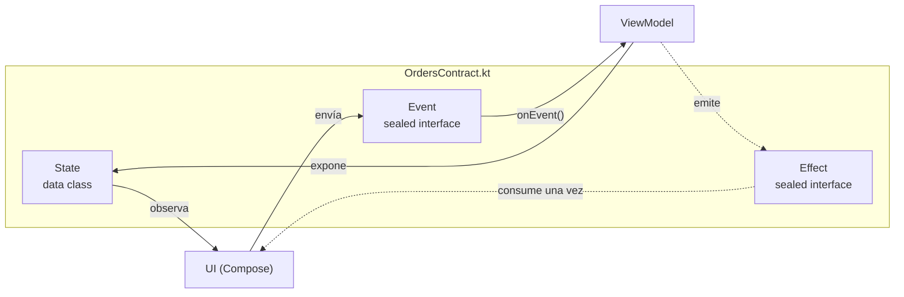

# ScreenContract (State, Event, Effect)

## 1. Mapa del flujo



Las tres piezas del recuadro viven en el mismo archivo — no porque el lenguaje lo obligue, sino porque juntas son la respuesta completa a "¿qué puede ser y hacer esta pantalla?", legible de punta a punta antes de tocar una línea de implementación.

## 2. Qué es y cómo funciona

El **Contract** es el archivo que define, para una sola pantalla, las tres piezas del patrón MVI (`mvi.md`): **State** (la foto completa de lo que la UI debe mostrar en este instante), **Event** (lo que el usuario puede hacer — a veces llamado Intent), y **Effect** (algo que ocurre una sola vez y no es parte del estado persistente).

No es una clase ni una interfaz que se instancie — es una convención de organización. Normalmente `State` es un `data class` (necesita `copy()` para las actualizaciones inmutables del reducer), y `Event`/`Effect` son `sealed interface` (para que el `when` que los consume sea exhaustivo, verificado por el compilador). Los tres viven juntos, típicamente en `NombrePantallaContract.kt`.

Cómo se relacionan: `Event` es lo único que la UI le puede enviar al ViewModel — entra por `onEvent()`. `State` es lo único que la UI observa de forma persistente — sobrevive a una recomposición o rotación de pantalla. `Effect` es distinto de ambos: se consume una sola vez y no vuelve a emitirse si nadie estaba escuchando en ese instante — por eso se expone como `SharedFlow(replay = 0)` o `Channel`, nunca como `StateFlow` (que sí "recuerda" el último valor y lo re-emitiría a cualquier nuevo colector).

## 3. Cómo se ve en distintos contextos

**App de fitness (rutina activa):** `WorkoutState` agrupa `currentExercise`, `isTimerRunning`, `elapsedSeconds`; `WorkoutEvent` tiene `OnStartTimer`, `OnPauseTimer`, `OnSkipExercise`; `WorkoutEffect` tiene `PlayCompletionSound` y `NavigateToSummary` — cosas que pasan una vez (un sonido, una navegación) y no tienen sentido como "estado" que la pantalla deba recordar si se recompone.

**App de e-commerce (checkout):** acá aparece el caso interesante de clasificación. Si la tarjeta es rechazada, ¿va en `State` o en `Effect`? Si el mensaje "tarjeta rechazada, probá con otro método" debe seguir visible en el formulario aunque el usuario rote el dispositivo, es `State`. Si es solo un snackbar momentáneo que desaparece solo, es `Effect`. La respuesta correcta depende del diseño de la pantalla, no es automática — ver la sección 4 para la pregunta que desambigua esto.

## 4. Implementación real

Retomando la app de delivery: armá el Contract completo para la pantalla de Historial de Pedidos, incluyendo el caso de "falla el refresh pero la lista vieja sigue visible".

```kotlin
// OrdersContract.kt — todo lo que esta pantalla puede ser y hacer, en un solo archivo

data class OrdersState(
    val orders: List<Order> = emptyList(),
    val isLoading: Boolean = false,
    val error: String? = null // error que debe seguir visible aunque rote la pantalla
)

sealed interface OrdersEvent {
    data object OnRefresh : OrdersEvent
    data object OnRetryClicked : OrdersEvent
    data class OnOrderClicked(val orderId: String) : OrdersEvent
}

sealed interface OrdersEffect {
    data class NavigateToOrderDetail(val orderId: String) : OrdersEffect
    data class ShowSnackbar(val message: String) : OrdersEffect // aviso puntual, no persiste
}
```

La pregunta que desambigua **State vs. Effect**: *si el usuario rota la pantalla ahora mismo, ¿esto debería seguir viéndose?* Si el refresh falla y la lista vieja sigue en pantalla con un aviso puntual tipo "no se pudo actualizar" que no necesita persistir, eso es `ShowSnackbar` (Effect). Si en cambio la pantalla completa debería mostrar un estado de error persistente (por ejemplo, la primera carga falló y no hay datos previos que mostrar), eso es el campo `error` en `OrdersState`.

Consumo típico dentro del ViewModel (se profundiza en `viewmodel.md`):

```kotlin
class OrdersViewModel(/* ... */) {
    private val _state = MutableStateFlow(OrdersState())
    val state: StateFlow<OrdersState> = _state.asStateFlow()

    private val _effect = MutableSharedFlow<OrdersEffect>()
    val effect: SharedFlow<OrdersEffect> = _effect.asSharedFlow()

    fun onEvent(event: OrdersEvent) {
        when (event) {
            OrdersEvent.OnRefresh -> refreshOrders()
            OrdersEvent.OnRetryClicked -> refreshOrders()
            is OrdersEvent.OnOrderClicked -> navigateToDetail(event.orderId)
        }
    }
}
```

## 5. Buenas prácticas y errores comunes — qué auditar si te lo entrega la IA

- **¿Un error/aviso está clasificado correctamente entre `State` y `Effect`?** Aplicá la pregunta de rotación: si debería seguir visible, es `State`; si es un aviso puntual, es `Effect`. Confundir esto es el error de diseño más común al armar un Contract nuevo — y si la IA generó ambos (un `error: String?` en `State` Y un `ShowError` en `Effect` para lo mismo), hay redundancia con dos fuentes de verdad para el mismo aviso.

- **¿`Effect` se expone como `SharedFlow(replay = 0)` o `Channel`, no como `StateFlow`?** Si la IA usó `StateFlow` para `Effect`, un snackbar ya mostrado se va a repetir cada vez que un nuevo colector se suscriba (por ejemplo, al rotar la pantalla) — porque `StateFlow` siempre re-emite el último valor a cualquier nuevo suscriptor, que es exactamente lo que no querés para algo "de un solo uso".

- **¿`Event` y `Effect` son `sealed interface` (o `sealed class`), no interfaces abiertas?** Sin `sealed`, el `when` que los consume no es exhaustivo — el compilador no te avisa si falta manejar un caso nuevo.

- **¿Las tres piezas viven en el mismo archivo, o quedaron dispersas?** Si `State` está en un archivo, `Event` en otro y `Effect` en un tercero, se perdió el punto central del Contract: poder leer "todo lo que esta pantalla es y hace" de una sola pasada, sin saltar entre archivos.

- **¿Algún campo del `State`/`Event` filtra un tipo "sucio" de `data` (un DTO, una Entity) en vez de un tipo de dominio?** El Contract debería hablar exclusivamente en tipos de `domain` (`Order`, no `OrderDto` ni `OrderEntity`) — si se coló uno de los tipos técnicos de la capa `data`, se rompió la frontera que los Mappers (`dto_entity_mappers.md`) existen para sostener.