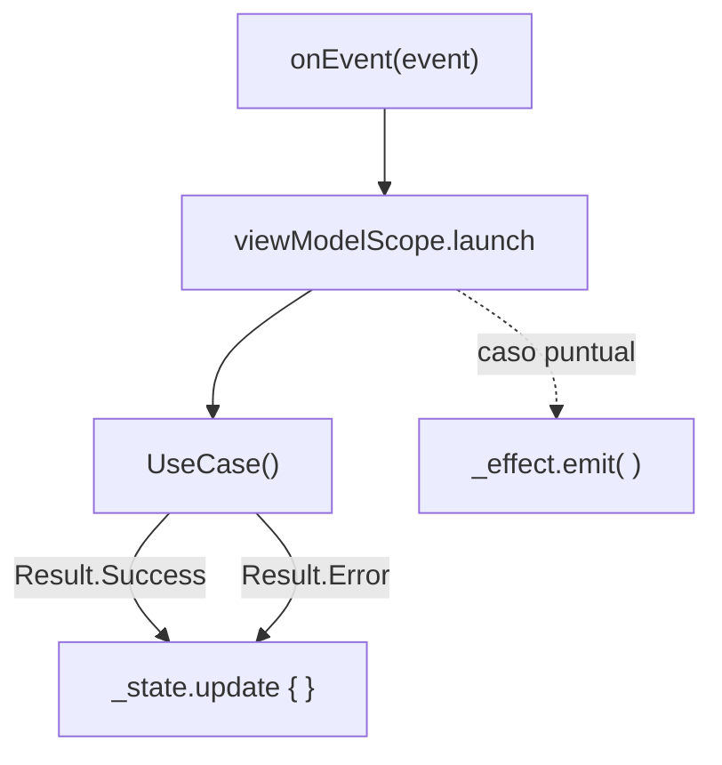

# ViewModel

## 1. Mapa del flujo



Este es el zoom sobre el nodo `VM` de los dos diagramas anteriores (`mvi.md`, `contract_state_event_effect.md`) — acá vive el código real que conecta `Event` con `UseCase`, y el resultado de vuelta con `State`/`Effect`.

## 2. Qué es y cómo funciona

El **ViewModel** es la clase que orquesta una pantalla: recibe `Event` desde la UI a través de `onEvent()`, decide qué `UseCase` invocar según ese evento, actualiza el `State` con el resultado, y eventualmente emite un `Effect`. Es el único punto de la app que conoce tanto el Contract de la pantalla como los UseCases de `domain` — nunca al revés.

No contiene lógica de negocio propia. Su trabajo es **orquestar y traducir**: traduce un Event de usuario en una llamada a UseCase, y traduce el resultado del UseCase (típicamente un `Result<T>`) en una actualización de State. Si el ViewModel empieza a decidir *qué es correcto* en vez de *en qué orden llamar las cosas*, esa lógica se escapó de donde debería vivir (ver sección 5).

Cómo se relacionan las piezas: `onEvent()` recibe el `Event` y despacha según su tipo (normalmente un `when`). Cada rama lanza una coroutine en `viewModelScope` (con `SupervisorJob`, para que el fallo de una no cancele a las demás), llama al `UseCase` correspondiente, y según el `Result` que devuelve, actualiza `_state` (con `.update { it.copy(...) }`) o emite un `_effect`.

## 3. Cómo se ve en distintos contextos

**App de fitness:** `WorkoutViewModel` encadena dos UseCases en una sola acción — `getActiveWorkoutUseCase()` para saber qué rutina está en curso, y después `startTimerUseCase(workout.id)` usando ese resultado. Encadenar así es orquestación legítima: el ViewModel decide *en qué orden* llamar las cosas, no *qué determina el resultado correcto* de cada una.

**App de e-commerce:** `CheckoutViewModel` recibe `OnConfirmPayment`, pone `isProcessingPayment = true`, llama a `confirmPaymentUseCase()`, y según el `Result` mapea el error técnico (`PaymentDeclinedException`, `NetworkException`) a un mensaje que la UI puede mostrar directo — ese mapeo de "excepción técnica" a "texto entendible por un usuario" es trabajo típico del ViewModel, no del UseCase ni de la UI.

## 4. Implementación real

Retomando la app de delivery: armá `OrdersViewModel`, que arranca observando el historial local (reactivo, vía `Flow`) y expone la posibilidad de refrescar contra el backend.

```kotlin
class OrdersViewModel(
    private val getOrderHistoryUseCase: GetOrderHistoryUseCase,
    private val refreshOrdersUseCase: RefreshOrdersUseCase
) {
    private val _state = MutableStateFlow(OrdersState())
    val state: StateFlow<OrdersState> = _state.asStateFlow()

    private val _effect = MutableSharedFlow<OrdersEffect>()
    val effect: SharedFlow<OrdersEffect> = _effect.asSharedFlow()

    private val viewModelScope = CoroutineScope(SupervisorJob() + Dispatchers.Main.immediate)

    init {
        observeOrderHistory()
        onEvent(OrdersEvent.OnRefresh)
    }

    fun onEvent(event: OrdersEvent) {
        when (event) {
            OrdersEvent.OnRefresh -> refreshOrders()
            OrdersEvent.OnRetryClicked -> refreshOrders()
            is OrdersEvent.OnOrderClicked -> {
                viewModelScope.launch {
                    _effect.emit(OrdersEffect.NavigateToOrderDetail(event.orderId))
                }
            }
        }
    }

    // El historial local es reactivo — se colecciona una sola vez, en init.
    private fun observeOrderHistory() {
        viewModelScope.launch {
            getOrderHistoryUseCase().collect { orders ->
                _state.update { it.copy(orders = orders) }
            }
        }
    }

    // El refresh es una acción puntual, disparada por Event — no un stream continuo.
    private fun refreshOrders() {
        viewModelScope.launch {
            _state.update { it.copy(isLoading = true, error = null) }

            when (val result = refreshOrdersUseCase()) {
                is Result.Success -> _state.update { it.copy(isLoading = false) }
                is Result.Error -> {
                    _state.update { it.copy(isLoading = false) }
                    _effect.emit(OrdersEffect.ShowSnackbar("No se pudo actualizar el historial"))
                }
            }
        }
    }
}
```

Notá la diferencia entre las dos coroutines de `init`: `observeOrderHistory()` colecciona un `Flow` que vive mientras el ViewModel exista — es la fuente reactiva de `orders`. `refreshOrders()` es una llamada puntual que termina — no actualiza `orders` directamente, porque eso lo hace `observeOrderHistory()` solo, apenas la base local cambia (mismo mecanismo de `repository_impl.md`).

## 5. Buenas prácticas y errores comunes — qué auditar si te lo entrega la IA

- **¿El `UseCase` llega por constructor, o el ViewModel lo instancia adentro?** Si el ViewModel arma su propio `RefreshOrdersUseCase(OrderRepositoryImpl(...))` en vez de recibirlo inyectado, se rompe la testeabilidad con fakes — mismo problema documentado en `04_di/que_resuelve_la_di.md`.

- **¿Hay una decisión de negocio viviendo en el ViewModel en vez de en un UseCase?** Encadenar dos UseCases está bien (orquestación). El problema aparece si el ViewModel empieza a *decidir* algo — por ejemplo, "si el pedido tiene más de 3 items, aplicar descuento antes de confirmar". Esa es una regla de negocio que pertenece a `domain`, no a Presentation. La pregunta que desambigua: *¿esto es "en qué orden llamo las cosas" o "qué determina el resultado correcto"?*

- **¿El `Flow` reactivo (`getOrderHistoryUseCase()`) se colecciona una sola vez en `init`, o se relanza en cada evento?** Relanzar la colección de un `Flow` reactivo cada vez que se dispara un `Event` genera colectores duplicados acumulándose — el `Flow` continuo va en `init`, las acciones puntuales van en las ramas de `onEvent`.

- **¿El error que llega a `State`/`Effect` es un mensaje entendible, o la excepción técnica cruda?** Si `_state.update { it.copy(error = e.message) }` expone directamente `e.message` de una `IOException` o `HttpException` sin traducir, la UI termina mostrando algo como "Unable to resolve host" en vez de "revisá tu conexión" — el mapeo de excepción técnica a mensaje de usuario es trabajo del ViewModel.

- **¿El `viewModelScope` usa `SupervisorJob`?** Sin él, el fallo de una coroutine (por ejemplo, el refresh) cancela el `Job` padre y con él cualquier otra coroutine en curso en el mismo scope — incluida la colección del `Flow` reactivo de `observeOrderHistory()`, que dejaría de recibir actualizaciones sin ningún error visible.