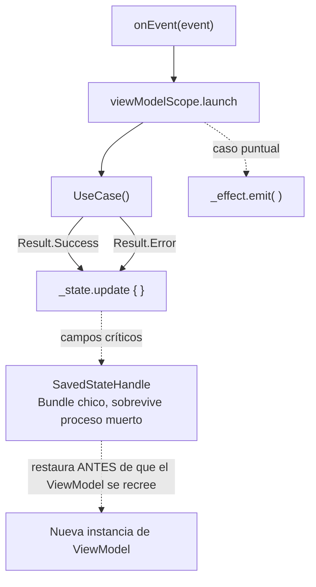

# ViewModel

## 1. Mapa del flujo



Este es el zoom sobre el nodo `VM` de los dos diagramas anteriores (`mvi.md`, `contract_state_event_effect.md`) — acá vive el código real que conecta `Event` con `UseCase`, y el resultado de vuelta con `State`/`Effect`. Los dos nodos nuevos (`SAVED`, `Nueva instancia de ViewModel`) cubren un caso que el resto del diagrama no resuelve: qué pasa si el sistema mata el proceso completo de la app en background, y no solo la rotación de pantalla que el `ViewModel` ya sobrevive por diseño.

## 2. Qué es y cómo funciona

El **ViewModel** es la clase que orquesta una pantalla: recibe `Event` desde la UI a través de `onEvent()`, decide qué `UseCase` invocar según ese evento, actualiza el `State` con el resultado, y eventualmente emite un `Effect`. Es el único punto de la app que conoce tanto el Contract de la pantalla como los UseCases de `domain` — nunca al revés.

No contiene lógica de negocio propia. Su trabajo es **orquestar y traducir**: traduce un Event de usuario en una llamada a UseCase, y traduce el resultado del UseCase (típicamente un `Result<T>`) en una actualización de State. Si el ViewModel empieza a decidir *qué es correcto* en vez de *en qué orden llamar las cosas*, esa lógica se escapó de donde debería vivir (ver sección 5).

Cómo se relacionan las piezas: `onEvent()` recibe el `Event` y despacha según su tipo (normalmente un `when`). Cada rama lanza una coroutine en `viewModelScope` (con `SupervisorJob`, para que el fallo de una no cancele a las demás), llama al `UseCase` correspondiente, y según el `Result` que devuelve, actualiza `_state` (con `.update { it.copy(...) }`) o emite un `_effect`.

**Rotación vs proceso muerto — no son lo mismo:** una rotación de pantalla o una recomposición no destruyen el `ViewModel` — está diseñado específicamente para sobrevivir esos eventos, atado al ciclo de vida del `NavBackStackEntry`/Activity, no al de cada Composable. El **proceso muerto** es otra cosa: el sistema operativo mata el proceso completo de la app cuando está en background y necesita liberar memoria — al volver, Android recrea la Activity y, con ella, una instancia **nueva** del `ViewModel`. Cualquier estado que solo viva en propiedades normales de la clase (`private var searchText = ""`) se pierde por completo; el `ViewModel` arranca de cero como si la app nunca hubiera estado abierta.

**`SavedStateHandle`** es el mecanismo que resuelve ese caso puntual: es un objeto tipo `Bundle` (clave-valor, con tipos soportados por `Bundle` — primitivos, `Parcelable`, `Serializable`) que Android guarda automáticamente antes de matar el proceso, y restaura antes de que la nueva instancia del `ViewModel` termine de construirse. Se recibe por constructor (el framework, vía Koin/`viewModel { }`, lo inyecta solo) y expone `savedStateHandle[key] = valor` para escribir y `savedStateHandle.getStateFlow(key, default)` para leer de forma reactiva — este último es clave, porque no es "guardar y listo": el valor devuelto ya es un `StateFlow` que la UI puede colectar igual que cualquier otro campo del `State`.

No todo merece ir ahí. `SavedStateHandle` tiene un límite de tamaño (comparte el límite del `Bundle` del sistema, pensado para datos chicos), así que solo tiene sentido para estado "en progreso" que el usuario esperaría encontrar igual si vuelve a la app un rato después — texto tipeado en un buscador, una posición de scroll, un filtro seleccionado. Datos que de todas formas van a volver a llegar solos (la lista de pedidos desde Room/Firestore vía `Flow`) no necesitan guardarse ahí — se re-obtienen apenas el `ViewModel` nuevo vuelve a colectar la fuente reactiva.

## 3. Cómo se ve en distintos contextos

**App de fitness:** `WorkoutViewModel` encadena dos UseCases en una sola acción — `getActiveWorkoutUseCase()` para saber qué rutina está en curso, y después `startTimerUseCase(workout.id)` usando ese resultado. Encadenar así es orquestación legítima: el ViewModel decide *en qué orden* llamar las cosas, no *qué determina el resultado correcto* de cada una.

**App de e-commerce:** `CheckoutViewModel` recibe `OnConfirmPayment`, pone `isProcessingPayment = true`, llama a `confirmPaymentUseCase()`, y según el `Result` mapea el error técnico (`PaymentDeclinedException`, `NetworkException`) a un mensaje que la UI puede mostrar directo — ese mapeo de "excepción técnica" a "texto entendible por un usuario" es trabajo típico del ViewModel, no del UseCase ni de la UI.

## 4. Implementación real

Retomando la app de delivery: armá `OrdersViewModel`, que arranca observando el historial local (reactivo, vía `Flow`) y expone la posibilidad de refrescar contra el backend.

```kotlin
class OrdersViewModel(
    private val getOrderHistoryUseCase: GetOrderHistoryUseCase,
    private val refreshOrdersUseCase: RefreshOrdersUseCase,
    private val savedStateHandle: SavedStateHandle
) {
    private val _state = MutableStateFlow(OrdersState())
    val state: StateFlow<OrdersState> = _state.asStateFlow()

    private val _effect = MutableSharedFlow<OrdersEffect>()
    val effect: SharedFlow<OrdersEffect> = _effect.asSharedFlow()

    // el texto de búsqueda sobrevive tanto rotación como proceso muerto
    val searchQuery: StateFlow<String> =
        savedStateHandle.getStateFlow(KEY_SEARCH_QUERY, "")

    private val viewModelScope = CoroutineScope(SupervisorJob() + Dispatchers.Main.immediate)

    init {
        observeOrderHistory()
        onEvent(OrdersEvent.OnRefresh)
    }

    fun onEvent(event: OrdersEvent) {
        when (event) {
            OrdersEvent.OnRefresh -> refreshOrders()
            OrdersEvent.OnRetryClicked -> refreshOrders()
            is OrdersEvent.OnOrderClicked -> {
                viewModelScope.launch {
                    _effect.emit(OrdersEffect.NavigateToOrderDetail(event.orderId))
                }
            }
            is OrdersEvent.OnSearchQueryChanged -> {
                savedStateHandle[KEY_SEARCH_QUERY] = event.query
            }
        }
    }

    // El historial local es reactivo — se colecciona una sola vez, en init.
    private fun observeOrderHistory() {
        viewModelScope.launch {
            getOrderHistoryUseCase().collect { orders ->
                _state.update { it.copy(orders = orders) }
            }
        }
    }

    // El refresh es una acción puntual, disparada por Event — no un stream continuo.
    private fun refreshOrders() {
        viewModelScope.launch {
            _state.update { it.copy(isLoading = true, error = null) }

            when (val result = refreshOrdersUseCase()) {
                is Result.Success -> _state.update { it.copy(isLoading = false) }
                is Result.Error -> {
                    _state.update { it.copy(isLoading = false) }
                    _effect.emit(OrdersEffect.ShowSnackbar("No se pudo actualizar el historial"))
                }
            }
        }
    }

    companion object {
        private const val KEY_SEARCH_QUERY = "search_query"
    }
}
```

Notá la diferencia entre las dos coroutines de `init`: `observeOrderHistory()` colecciona un `Flow` que vive mientras el ViewModel exista — es la fuente reactiva de `orders`. `refreshOrders()` es una llamada puntual que termina — no actualiza `orders` directamente, porque eso lo hace `observeOrderHistory()` solo, apenas la base local cambia (mismo mecanismo de `repository_impl.md`).

`searchQuery` no tiene una función `observeX()` propia porque no la necesita: `savedStateHandle.getStateFlow(KEY_SEARCH_QUERY, "")` ya devuelve un `StateFlow` listo para colectar (ver `operadores_flow.md` para cómo se conecta con `debounce`/`flatMapLatest` para filtrar el historial). La diferencia frente a un `MutableStateFlow` común: cada `savedStateHandle[KEY_SEARCH_QUERY] = event.query` no solo actualiza ese `StateFlow`, también persiste el valor en el `Bundle` que el sistema guarda antes de matar el proceso — si eso pasa mientras el usuario tiene texto tipeado en el buscador, al volver a la app lo encuentra igual, sin haber tenido que escribirlo de nuevo.

## 5. Buenas prácticas y errores comunes — qué auditar si te lo entrega la IA

- **¿El `UseCase` llega por constructor, o el ViewModel lo instancia adentro?** Si el ViewModel arma su propio `RefreshOrdersUseCase(OrderRepositoryImpl(...))` en vez de recibirlo inyectado, se rompe la testeabilidad con fakes — mismo problema documentado en `04_di/que_resuelve_la_di.md`.

- **¿Hay una decisión de negocio viviendo en el ViewModel en vez de en un UseCase?** Encadenar dos UseCases está bien (orquestación). El problema aparece si el ViewModel empieza a *decidir* algo — por ejemplo, "si el pedido tiene más de 3 items, aplicar descuento antes de confirmar". Esa es una regla de negocio que pertenece a `domain`, no a Presentation. La pregunta que desambigua: *¿esto es "en qué orden llamo las cosas" o "qué determina el resultado correcto"?*

- **¿El `Flow` reactivo (`getOrderHistoryUseCase()`) se colecciona una sola vez en `init`, o se relanza en cada evento?** Relanzar la colección de un `Flow` reactivo cada vez que se dispara un `Event` genera colectores duplicados acumulándose — el `Flow` continuo va en `init`, las acciones puntuales van en las ramas de `onEvent`.

- **¿El error que llega a `State`/`Effect` es un mensaje entendible, o la excepción técnica cruda?** Si `_state.update { it.copy(error = e.message) }` expone directamente `e.message` de una `IOException` o `HttpException` sin traducir, la UI termina mostrando algo como "Unable to resolve host" en vez de "revisá tu conexión" — el mapeo de excepción técnica a mensaje de usuario es trabajo del ViewModel.

- **¿El `viewModelScope` usa `SupervisorJob`?** Sin él, el fallo de una coroutine (por ejemplo, el refresh) cancela el `Job` padre y con él cualquier otra coroutine en curso en el mismo scope — incluida la colección del `Flow` reactivo de `observeOrderHistory()`, que dejaría de recibir actualizaciones sin ningún error visible.

- **¿Guarda en `SavedStateHandle` datos que de todas formas se re-obtienen solos vía `Flow` (la lista completa de `orders`, por ejemplo)?** `SavedStateHandle` comparte el límite de tamaño del `Bundle` del sistema — pensado para estado chico "en progreso" (texto tipeado, un filtro, un id seleccionado), no para colecciones completas que ya vuelven a llegar apenas `observeOrderHistory()` se reconecta a la fuente local.

- **¿Confunde "el ViewModel sobrevive rotación" con "el estado sobrevive proceso muerto"?** Son garantías distintas: el `ViewModel` sobrevive rotación por diseño, sin necesitar `SavedStateHandle` para eso. `SavedStateHandle` resuelve específicamente el caso en que el sistema mata el proceso completo en background — si el código asume que un `private var` común alcanza para "no perder nada nunca", ese estado se pierde justo en ese escenario, que además es difícil de reproducir a mano (hay que forzarlo desde las opciones de desarrollador, "No conservar actividades").

- **¿El tipo que se intenta guardar en `SavedStateHandle` es compatible con `Bundle` (primitivo, `Parcelable`, `Serializable`), o es un objeto de dominio complejo, un `Flow` o una lambda?** Si la IA intenta hacer `savedStateHandle[KEY] = someComplexDomainObject` sin que ese tipo implemente `Parcelable`/`Serializable`, o peor, intenta guardar algo no serializable como una función o un `Flow`, no compila o falla en runtime al intentar persistirlo.

- **¿Usa `getStateFlow(key, default)` para estado que la UI necesita colectar reactivamente, o lee el valor una sola vez con `savedStateHandle.get<T>(key)`?** Si el valor necesita reflejarse en la UI de forma reactiva (como `searchQuery`), `get()` da un snapshot puntual que no se actualiza solo — `getStateFlow()` es la opción correcta porque combina persistencia y reactividad en un solo mecanismo.