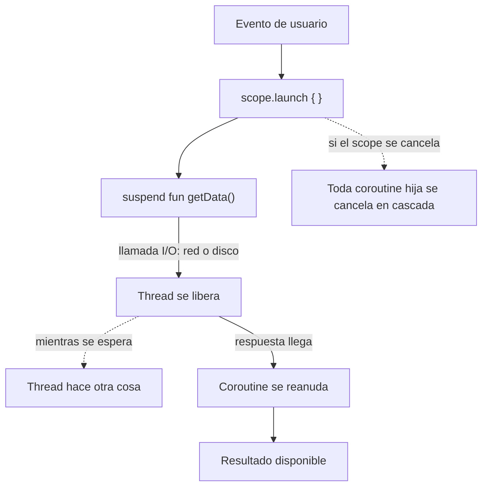

# 07_coroutines / `coroutines_suspend_scope.md`

## 1. Mapa del flujo



Este diagrama es el mapa macro de todo el package `07_coroutines`: acá se ve el ciclo completo (lanzar → pausar → reanudar → cancelación en cascada). `dispatchers.md` hace zoom sobre el nodo D/E (en qué thread pasa eso). `launch_vs_async.md` hace zoom sobre qué devuelve el nodo B. `supervisorjob_excepciones.md` hace zoom sobre qué pasa cuando algo falla en el medio del flujo.

## 2. Qué es y cómo funciona

Una **coroutine** es una tarea suspendible: puede pausarse en medio de una operación lenta y reanudarse después, sin bloquear el thread que la ejecuta. Mientras está pausada (nodo D del diagrama), ese thread queda libre para hacer otra cosa (nodo E) — no se queda "clavado" esperando.

Dos piezas son indivisibles entre sí para que esto exista:

- **`suspend fun`**: una función marcada como pausable. El compilador la transforma para que pueda "cortar" su ejecución en un punto de pausa y retomarla después exactamente donde quedó, sin perder el estado local. Por eso solo se puede llamar desde otra `suspend fun` o desde dentro de una coroutine ya corriendo — el compilador necesita garantizar que el mecanismo de pausa/reanudación existe en ese punto.
- **`CoroutineScope`**: el contenedor que define el ciclo de vida dentro del cual viven las coroutines lanzadas con `launch` o `async`. Internamente contiene un `Job`, que es quien arma la jerarquía padre-hijo: toda coroutine lanzada dentro de un scope se vuelve "hija" del `Job` de ese scope.

Cómo se relacionan: una `suspend fun` sin scope no hace nada por sí sola — es solo una función pausable, necesita alguien que la ejecute dentro de una coroutine real. El `scope.launch { }` del diagrama es ese "alguien": crea la coroutine, y todo lo que corre dentro (incluida la `suspend fun`) queda atado al ciclo de vida de ese `Job`. Esto es **structured concurrency**: si el `Job` padre se cancela (nodo H), cancela a todas sus coroutines hijas en cascada, sin que nadie tenga que llevar banderas manuales (`isCancelled`) por todos lados.

## 3. Cómo se ve en distintos contextos

**App de fitness:** al tocar "Empezar rutina", el scope de la pantalla lanza una coroutine que llama a una `suspend fun` para traer la rutina activa desde el repositorio. Mientras esa llamada está en curso, la UI sigue respondiendo — el usuario puede tocar "Cancelar" y, si lo hace, cancelar el scope de esa pantalla cancela automáticamente esa coroutine en curso, sin dejar una llamada de red "colgada" corriendo en el vacío.

**App de e-commerce:** al confirmar el checkout, se lanza una coroutine que encadena dos `suspend fun` (validar stock, después confirmar pago). Si el usuario cierra la pantalla a mitad de camino, el scope de esa pantalla se cancela, y esa cadena se corta en el punto donde esté — no sigue ejecutándose en segundo plano cobrándole una tarjeta a un usuario que ya no está mirando esa pantalla.

## 4. Implementación real

El PO pide: en la pantalla de Historial de Pedidos, al entrar, cargar el historial de pedidos desde el backend y mostrar un loading mientras tanto.

```kotlin
// domain — no sabe en qué thread corre ni quién la llama, solo declara que puede tardar
class GetOrderHistoryUseCase(
    private val repository: OrderRepository
) {
    suspend operator fun invoke(): List<Order> = repository.getOrderHistory()
}

// data
class OrderRepositoryImpl(
    private val api: OrderApi
) : OrderRepository {
    override suspend fun getOrderHistory(): List<Order> = api.fetchOrders()
}

// presentation — acá se arma el scope explícito, para ver qué hay realmente detrás de viewModelScope
class OrdersViewModel(
    private val getOrderHistoryUseCase: GetOrderHistoryUseCase
) {
    // SupervisorJob: un fallo cargando orders no debería tirar abajo otra coroutine
    // que esté corriendo en paralelo en la misma pantalla (se profundiza en supervisorjob_excepciones.md)
    private val viewModelScope = CoroutineScope(SupervisorJob() + Dispatchers.Main.immediate)

    private val _state = MutableStateFlow(OrdersState())
    val state: StateFlow<OrdersState> = _state.asStateFlow()

    fun onEvent(event: OrdersEvent) {
        when (event) {
            OrdersEvent.OnScreenEntered -> loadOrders()
        }
    }

    private fun loadOrders() {
        viewModelScope.launch {
            _state.update { it.copy(isLoading = true) }
            val orders = getOrderHistoryUseCase() // se "pausa" acá, el thread de UI queda libre
            _state.update { it.copy(orders = orders, isLoading = false) }
        }
    }

    fun onCleared() {
        viewModelScope.cancel() // cancela en cascada cualquier coroutine hija que siga corriendo
    }
}
```

`getOrderHistoryUseCase()` puede tardar 300ms hablando con la red, y durante ese tiempo el thread de UI queda libre para seguir dibujando frames. Cuando la respuesta llega, la coroutine se reanuda exactamente donde quedó.

En Android real, `ViewModel` de Jetpack ya trae `viewModelScope` con esta misma receta armada (`SupervisorJob() + Dispatchers.Main.immediate`) y llama a `cancel()` solo, automáticamente, en `onCleared()`. Acá se armó explícito para ver qué hace por debajo — en la práctica nunca se instancia un `CoroutineScope` a mano dentro de un ViewModel real, se usa el que ya viene dado.

## 5. Buenas prácticas y errores comunes — checklist de auditoría

Si esta parte del código la entregó una IA, revisar puntualmente:

- **¿Usa `GlobalScope.launch { }`?** Es un red flag inmediato — la coroutine vive tanto como la app, sin ciclo de vida atado a ninguna pantalla. Es la forma más común de generar una coroutine huérfana que sigue corriendo (y gastando batería/red) después de que la pantalla que la lanzó ya no existe.
- **¿Llama una `suspend fun` directo en el cuerpo de un `@Composable`?** El cuerpo de un `@Composable` no es un `CoroutineScope` — si el código intenta llamar algo suspendible ahí sin pasar por `LaunchedEffect` u otro mecanismo equivalente, no compila (o si compila, es porque está mal estructurado en otra parte).
- **¿Marca `suspend` una función que no tiene ninguna operación de espera real adentro (solo cálculo sincrónico)?** Marcarla `suspend` sin necesidad no aporta nada y confunde la intención de la firma — quien la lea va a asumir que hay I/O o espera real donde no la hay.
- **¿Crea un `CoroutineScope` propio (fuera de `viewModelScope` o equivalente) sin cancelarlo en ningún lado?** Todo `CoroutineScope` creado manualmente necesita un punto explícito donde se cancele (`onCleared`, `onDestroy`, el final de un test) — si no lo tiene, es un leak.
- **¿El código asume que dos `launch` seguidos corren en paralelo real de CPU/threads?** Dos `launch` crean dos coroutines independientes que pueden intercalarse, pero eso no garantiza paralelismo real sin un `Dispatcher` pensado para eso — esto se audita a fondo en `dispatchers.md`.
- **¿Algún `catch` genérico (`catch (e: Exception)`) envuelve una coroutine sin relanzar `CancellationException`?** Esto rompe la cancelación cooperativa silenciosamente — se profundiza en el checklist de `supervisorjob_excepciones.md`, pero vale tenerlo en la cabeza desde este archivo: una coroutine que "atrapa todo" puede seguir corriendo después de que su scope padre ya pidió cancelarla.