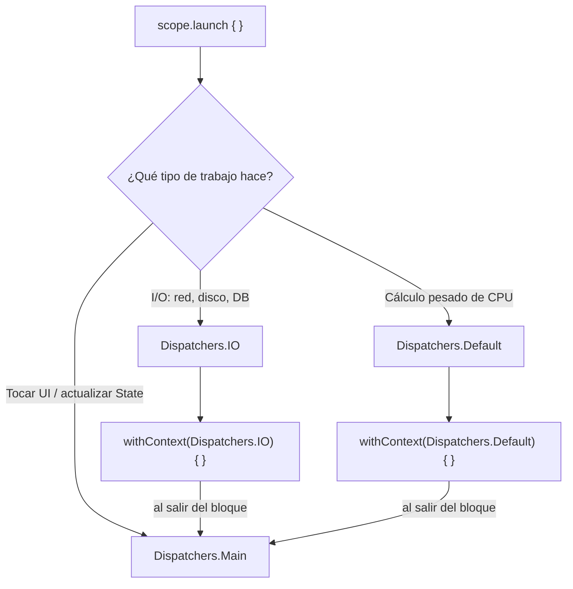

# 07_coroutines / `dispatchers.md`

## 1. Mapa del flujo



Este diagrama hace zoom sobre el nodo D/E de `coroutines_suspend_scope.md` ("Thread se libera" / "Thread hace otra cosa"): acá se responde específicamente **en qué thread** pasa cada parte de ese flujo, y por qué el punto de entrada (`launch`) casi siempre arranca en `Main` pero el cuerpo se desvía a otro dispatcher según el tipo de trabajo.

## 2. Qué es y cómo funciona

Un `Dispatcher` decide en qué thread (o pool de threads) corre una coroutine. La coroutine en sí es independiente del thread — el `Dispatcher` es quien la asigna a uno concreto, y puede reasignarla a otro distinto cada vez que se reanuda después de una suspensión.

Los tres principales, y cómo se relacionan con el diagrama:

- **`Dispatchers.Main`**: el thread de UI. Es donde arranca típicamente la coroutine (nodo A/E) porque es el único thread donde está permitido tocar la UI o actualizar el `State` directamente.
- **`Dispatchers.IO`**: pool de threads dimensionado para operaciones bloqueantes de red/disco (nodo C) — pensado para *esperar*, no para calcular. Al ser un pool grande, puede tener muchos threads ociosos esperando respuestas sin que eso cueste caro.
- **`Dispatchers.Default`**: pool de threads dimensionado según los cores de CPU disponibles (nodo D) — pensado para cálculo pesado real (parsing grande, ordenar listas enormes, procesar una imagen).

Lo importante del diagrama es el camino de vuelta: `withContext(Dispatchers.IO) { }` o `withContext(Dispatchers.Default) { }` cambian el thread **solo para ese bloque**, y al terminar vuelven automáticamente al dispatcher que tenía la coroutine antes de entrar (normalmente `Main`) — no hace falta un `withContext(Dispatchers.Main)` explícito después para "volver". Por convención de arquitectura, esta decisión vive en la capa `data` (quien sabe que está hablando con red o disco), nunca se filtra hacia `domain` (los `UseCase` no importan `Dispatchers` en absoluto) ni hacia `presentation` (el `ViewModel` solo hace `viewModelScope.launch { }` y confía en que el repository ya resolvió en qué thread corre cada cosa).

## 3. Cómo se ve en distintos contextos

**App de fitness:** al guardar una rutina completada, el repositorio hace `withContext(Dispatchers.IO)` para escribir en la base de datos local y sincronizar con el backend — ambas son operaciones de espera, no de cálculo. Si después esa misma función necesitara recalcular estadísticas agregadas (promedio de calorías de los últimos 30 días sobre miles de registros), eso es CPU real y debería separarse en su propio `withContext(Dispatchers.Default)`, no compartir el mismo bloque con la escritura a disco.

**App de e-commerce:** al aplicar un filtro de búsqueda sobre un catálogo de productos ya cargado en memoria (sin volver a pedirlo al backend), ese filtrado y ordenamiento es trabajo de `Dispatchers.Default` si el catálogo es grande — no hay I/O involucrado, es puro cómputo sobre datos que ya están en RAM.

## 4. Implementación real

El PO pide: en la pantalla de Historial de Pedidos, además de traer los pedidos del backend, hay que ordenarlos por un score de relevancia que se calcula localmente (pedidos recientes con productos favoritos del usuario pesan más) antes de mostrarlos.

```kotlin
class OrderRepositoryImpl(
    private val api: OrderApi,
    private val dao: OrderDao
) : OrderRepository {

    // I/O real: llamada de red + escritura a disco
    override suspend fun refreshOrders(): Unit = withContext(Dispatchers.IO) {
        val remoteOrders = api.fetchOrders()
        dao.saveAll(remoteOrders.map { it.toEntity() })
    }

    // I/O real: lectura de disco
    private suspend fun getStoredOrders(): List<Order> = withContext(Dispatchers.IO) {
        dao.getAll().map { it.toDomain() }
    }

    // CPU real: recorre y puntúa cada pedido, no espera nada externo
    override suspend fun getOrdersRankedByRelevance(): List<Order> {
        val orders = getStoredOrders() // ya resuelto en IO, adentro
        return withContext(Dispatchers.Default) {
            orders.sortedByDescending { calculateRelevanceScore(it) }
        }
    }

    private fun calculateRelevanceScore(order: Order): Double {
        // cálculo pesado: pondera fecha, cantidad de ítems, categorías favoritas, etc.
        // (implementación omitida — lo relevante acá es que es CPU-bound)
        return 0.0
    }
}
```

```kotlin
class OrdersViewModel(
    private val getOrdersRankedByRelevanceUseCase: GetOrdersRankedByRelevanceUseCase
) {
    private val viewModelScope = CoroutineScope(SupervisorJob() + Dispatchers.Main.immediate)

    fun onEvent(event: OrdersEvent) {
        when (event) {
            OrdersEvent.OnScreenEntered -> loadOrders()
        }
    }

    private fun loadOrders() {
        viewModelScope.launch {
            // acá seguimos en Main — el ViewModel nunca decide dónde corre el I/O ni el cálculo
            _state.update { it.copy(isLoading = true) }
            val orders = getOrdersRankedByRelevanceUseCase()
            // de vuelta en Main automáticamente al salir de los withContext internos
            _state.update { it.copy(orders = orders, isLoading = false) }
        }
    }
}
```

El punto central: `refreshOrders()` y `getStoredOrders()` usan `IO` porque esperan una respuesta externa; `calculateRelevanceScore` corre en `Default` porque es la CPU trabajando de verdad. El `ViewModel` no sabe nada de esto — solo ve `suspend fun` que devuelven un resultado.

## 5. Buenas prácticas y errores comunes — checklist de auditoría

Si esta parte del código la entregó una IA, revisar puntualmente:

- **¿Metió cálculo pesado de CPU dentro de un `withContext(Dispatchers.IO)`?** Es el error más común: la IA ve "esto tarda" y asume que es `IO` sin distinguir si el motivo de la demora es *esperar una respuesta externa* o *la CPU procesando algo*. Un `sortedByDescending` con un comparador costoso metido dentro de un bloque de `IO` que también hace una query a la DB está mezclando dos tipos de carga bajo el dispatcher equivocado para la mitad de ese trabajo.
- **¿Usa `Dispatchers.Main` para algo que no sea actualizar UI o código muy liviano?** Cualquier bloqueo ahí congela la app entera — si hay una llamada de red o un cálculo pesado corriendo directo en `Main` sin `withContext`, es un bug serio de responsividad, no un detalle menor.
- **¿Envuelve toda una función de `data` en `withContext` aunque ya esté corriendo en un dispatcher correcto por herencia?** No es un error funcional, pero es ruido — si una `suspend fun` de `data` es llamada siempre desde un contexto que ya está en `IO` (por ejemplo, porque quien la llama ya hizo el `withContext`), envolverla de nuevo es redundante. Vale la pena marcarlo, aunque no rompe nada.
- **¿Arma un `Dispatcher` custom (`limitedParallelism`, un `Executor` propio) sin una razón concreta?** `IO`/`Default`/`Main` cubren la gran mayoría de los casos reales. Un dispatcher custom es para control fino de concurrencia en escenarios puntuales (limitar cuántas coroutines acceden a un recurso compartido a la vez, por ejemplo) — si aparece sin que el problema lo pida, es sobreingeniería.
- **¿El `ViewModel` importa `kotlinx.coroutines.Dispatchers` directamente?** Es una señal de que la decisión de dispatcher se filtró a la capa equivocada — esa responsabilidad debería vivir enteramente en `data`, nunca en `presentation`.