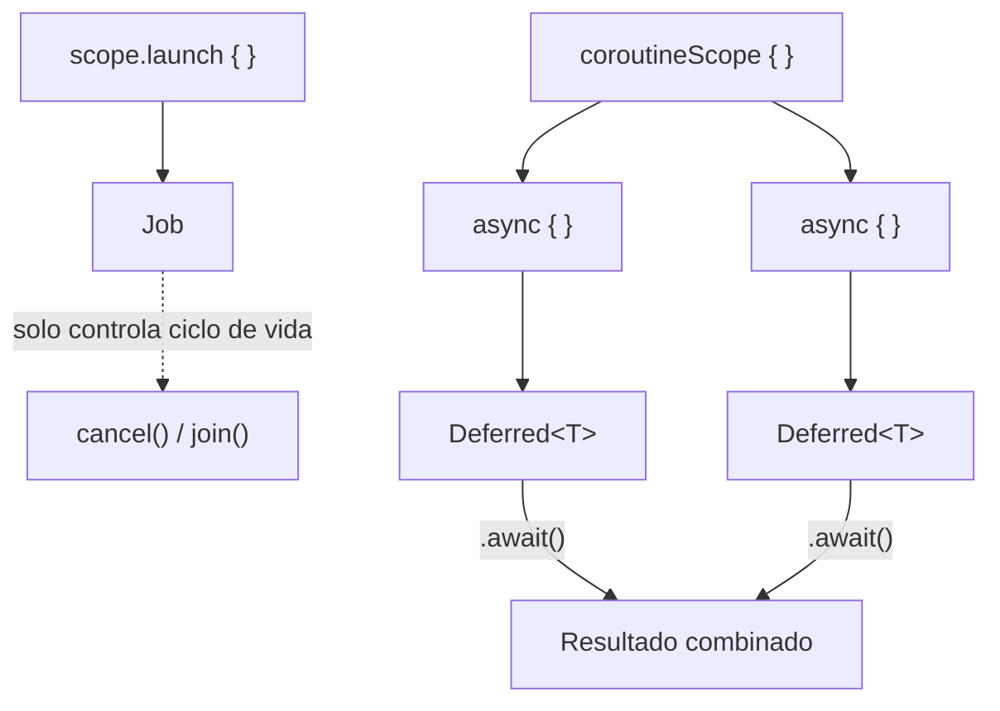

# 07_coroutines / `launch_vs_async.md`

## 1. Mapa del flujo



Este diagrama hace zoom sobre el nodo B ("scope.launch") de `coroutines_suspend_scope.md`: ahí solo se mostraba "se lanza una coroutine", pero hay dos formas distintas de lanzarla según si necesitás un valor de vuelta o no. La mitad de arriba (`launch` → `Job`) es fire-and-forget. La mitad de abajo (`async` → `Deferred` → `await`) es para cuando el resultado importa, y se puede paralelizar lanzando varios `async` antes de esperar ninguno.

## 2. Qué es y cómo funciona

`launch` y `async` son los dos "constructores" (builders) principales para crear una coroutine dentro de un `CoroutineScope`. Ambos arrancan una coroutine de forma inmediata (no esperan a que la pidas), pero difieren en qué devuelven:

- **`launch`**: dispara una coroutine y no espera un resultado de vuelta. Devuelve un `Job`, que solo sirve para controlar el ciclo de vida de esa coroutine (cancelarla, esperar a que termine sin importar el valor que produjo).
- **`async`**: dispara una coroutine que sí produce un resultado. Devuelve un `Deferred<T>`, y el valor se obtiene llamando a `.await()` — que suspende hasta que el resultado esté listo.

Cómo se relacionan: si tenés dos operaciones independientes (no depende una del resultado de la otra) y las llamás como dos `suspend fun` normales, una después de la otra, se ejecutan secuencialmente — la segunda ni arranca hasta que la primera terminó, aunque no haya ninguna razón real para esperar. `async` resuelve esto lanzando ambas coroutines **ya**, en paralelo (nodos E y F se crean juntos), y solo suspendiendo cuando de verdad necesitás cada valor (nodos G/H → `.await()`).

La pieza que ata todo: `coroutineScope { }` (nodo D) crea un scope hijo que espera a que **todos** los `async` lanzados adentro terminen antes de devolver el control — es la forma correcta de agrupar varios `async` relacionados sin depender del scope externo (por ejemplo `viewModelScope`) para esa espera.

Importante distinguir cuándo `async` no aplica: `async` paraleliza **anchos** (operaciones independientes que pasan al mismo tiempo). Cuando hay **profundidad** — el segundo paso necesita un dato que solo produce el primero — no hay nada que paralelizar, y la forma correcta es encadenar `suspend fun` directo, sin ningún builder de por medio:

```kotlin
suspend fun getOrderWithShipping(orderId: String): OrderWithShipping {
    val order = orderRepository.getOrder(orderId) // se suspende acá
    val shipping = shippingRepository.getShipping(order.shippingId) // depende del resultado anterior
    return OrderWithShipping(order, shipping)
}
```

Cada `suspend fun` ya se "pausa" sola en su punto de espera — no hace falta `async` para que eso funcione, es el comportamiento por default de una cadena de funciones suspendidas llamadas una después de la otra. Ambos patrones conviven en el mismo caso real: si además hubiera una tercera operación independiente de esta cadena (por ejemplo, traer promociones activas), esa sí se lanzaría con `async` en paralelo, mientras la cadena `order → shipping` sigue siendo secuencial adentro.

## 3. Cómo se ve en distintos contextos

**App de fitness:** la pantalla de resumen post-entrenamiento necesita combinar las calorías quemadas (calculadas localmente) con el ranking semanal del usuario (que viene del backend) — dos operaciones independientes entre sí. Lanzarlas con `async` en paralelo dentro de un `coroutineScope { }` reduce el tiempo total de carga de esa pantalla a lo que tarda la más lenta de las dos, en vez de la suma de ambas.

**App de e-commerce:** al tocar "Agregar al carrito", se dispara un evento de analytics y se actualiza el contador visual del carrito. Ninguna de las dos acciones necesita devolver un valor que el flujo use después — son candidatas típicas de `launch`, no de `async`: fire-and-forget, cada una en su propia coroutine, sin bloquearse entre sí ni bloquear la UI.

## 4. Implementación real

El PO pide: en la pantalla de Historial de Pedidos, además del historial en sí, mostrar un banner con las promociones activas del usuario — es una consulta totalmente independiente del historial, a otro endpoint.

```kotlin
// domain
class GetOrdersSummaryUseCase(
    private val orderRepository: OrderRepository,
    private val promotionsRepository: PromotionsRepository
) {
    suspend operator fun invoke(): OrdersSummary = coroutineScope {
        val ordersDeferred = async { orderRepository.getOrderHistory() }
        val promosDeferred = async { promotionsRepository.getActivePromotions() }
        // ambos async ya arrancaron en paralelo antes de este punto —
        // acá recién se espera cada resultado
        OrdersSummary(
            orders = ordersDeferred.await(),
            activePromotions = promosDeferred.await()
        )
    }
}
```

```kotlin
class OrdersViewModel(
    private val getOrdersSummaryUseCase: GetOrdersSummaryUseCase,
    private val trackScreenViewedUseCase: TrackScreenViewedUseCase
) {
    private val viewModelScope = CoroutineScope(SupervisorJob() + Dispatchers.Main.immediate)

    fun onEvent(event: OrdersEvent) {
        when (event) {
            OrdersEvent.OnScreenEntered -> {
                loadSummary()
                // launch aparte: analytics es fire-and-forget, no debe bloquear
                // ni acoplarse al resultado de cargar el historial
                viewModelScope.launch { trackScreenViewedUseCase("orders_history") }
            }
        }
    }

    private fun loadSummary() {
        viewModelScope.launch {
            _state.update { it.copy(isLoading = true) }
            val summary = getOrdersSummaryUseCase() // ya viene paralelizado por dentro
            _state.update {
                it.copy(
                    orders = summary.orders,
                    activePromotions = summary.activePromotions,
                    isLoading = false
                )
            }
        }
    }
}
```

`orderRepository.getOrderHistory()` y `promotionsRepository.getActivePromotions()` arrancan al mismo tiempo dentro del `coroutineScope { }` del `UseCase` — el tiempo total de esa carga es el máximo de los dos, no la suma. El `trackScreenViewedUseCase` en cambio usa `launch` directo desde el `ViewModel`, porque no hay ningún valor que el flujo necesite de vuelta.

## 5. Buenas prácticas y errores comunes — checklist de auditoría

Si esta parte del código la entregó una IA, revisar puntualmente:

- **¿Llama `.await()` justo después de cada `async`, en la misma línea o el mismo paso?** Es el error más común y el que menos se nota a simple vista: `async { a() }.await()` seguido de `async { b() }.await()` **no paraleliza nada** — es exactamente tan secuencial como llamar dos `suspend fun` directo, porque la coroutine se suspende en el primer `.await()` antes de que el segundo `async` siquiera se cree. La forma correcta paraleliza cuando **todos** los `async` se crean primero, y los `.await()` se llaman después, juntos.
- **¿Usa `async` para una operación donde no hay nada con qué paralelizar?** `async { algo() }.await()`, solo, sin otro `async` corriendo al lado, es la misma sobrecarga conceptual de manejar un `Deferred` sin ningún beneficio — ahí alcanza con una `suspend fun` llamada directo.
- **¿Usa `launch` cuando el flujo necesita el resultado de esa coroutine para seguir?** `launch` no da una forma limpia de extraer un valor — si el código captura una variable externa mutable desde dentro del lambda para "sacar" el resultado, es un anti-patrón de concurrencia (race condition esperando pasar). Ahí corresponde `async` + `await`, o directamente una `suspend fun` secuencial si no hay paralelismo real que ganar.
- **¿Hay dos operaciones con dependencia real entre sí metidas en `async` como si fueran paralelas?** Si el segundo paso necesita el resultado del primero (por ejemplo, cargar un pedido y después, con su ID, cargar el detalle de envío), paralelizarlas con `async` no tiene sentido — el segundo `async` va a quedar esperando igual, solo que con código más complicado de leer.
- **¿El `coroutineScope { }` que agrupa los `async` está bien delimitado, o el código depende del scope externo (`viewModelScope`) para esperar los resultados?** Sin un `coroutineScope { }` explícito rodeando los `async` relacionados, no hay garantía clara de que se espere a todos antes de seguir — puede funcionar por casualidad en el happy path y romperse en un caso borde.