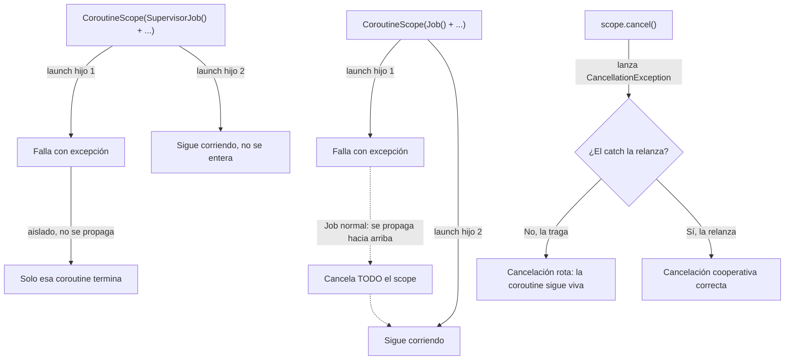
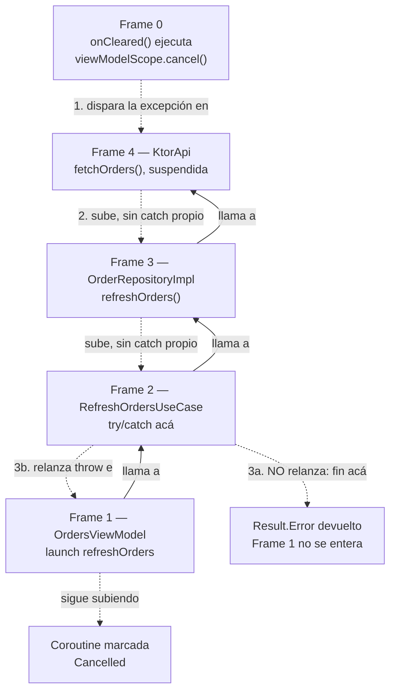
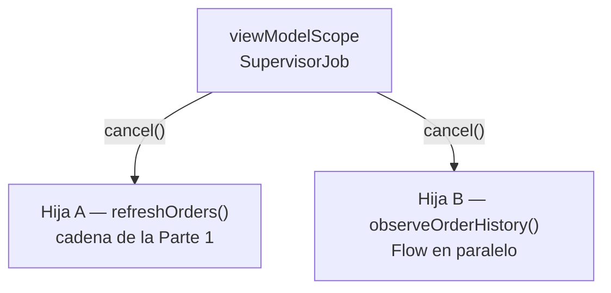

# 07_coroutines / `supervisorjob_excepciones.md`

## 1. Mapa del flujo



Este diagrama tiene dos partes independientes que responden a la misma pregunta de fondo — "¿qué pasa cuando algo sale mal dentro de una coroutine?" — desde dos ángulos: la mitad de arriba es sobre **excepciones de negocio** (una llamada falla) y cómo `Job` vs `SupervisorJob` deciden si eso contamina a las coroutines hermanas. La mitad de abajo es sobre **cancelación** (alguien pidió parar) y cómo un `catch` mal escrito puede interferir con eso — es el mismo mecanismo de propagación de excepciones de Kotlin, pero con una excepción especial (`CancellationException`) que necesita tratamiento distinto.

## 2. Qué es y cómo funciona

Por default, un `Job` normal propaga las excepciones de forma agresiva: si una coroutine hija lanza una excepción no capturada, cancela a todas sus hermanas y se propaga hacia el `Job` padre (nodo B→D→C del diagrama). `SupervisorJob` es una variante donde el fallo de una hija no cancela a sus hermanas ni se propaga hacia arriba — cada hija falla de forma aislada, como si fueran tareas independientes bajo el mismo scope (nodo F→H, G no se entera).

`viewModelScope` usa internamente `SupervisorJob() + Dispatchers.Main.immediate`, justo por este motivo: un error cargando una sección de una pantalla no debería tirar abajo la carga de otra sección que corre en paralelo.

**Cancelación cooperativa** es un mecanismo distinto que usa el mismo canal (excepciones) para una cosa distinta (parar, no fallar). Cuando se llama `scope.cancel()`, Kotlin no "mata" la coroutine a la fuerza — le lanza una `CancellationException` en el próximo punto de suspensión, y espera que esa excepción se propague hacia afuera sin interferencia para que la coroutine termine limpio. El problema (nodo J del diagrama): `CancellationException` es una subclase de `Exception`, así que un `catch (e: Exception)` genérico la atrapa **también** a ella, no solo a los errores de negocio que el catch quería manejar. Si ese catch no relanza la `CancellationException` explícitamente, la cancelación queda "tragada" — la coroutine cree que manejó un error más y sigue ejecutando código que en realidad ya debería haber parado.

**`NonCancellable`** resuelve un caso puntual dentro de esta misma mecánica: código de limpieza que necesita correr *durante* una cancelación en curso — cerrar un archivo, revertir una escritura parcial, notificar que una operación se abortó. Una vez que una coroutine fue cancelada, cualquier punto de suspensión nuevo dentro de ella (otra llamada `suspend`) lanza `CancellationException` de inmediato — así que un `finally { someSuspendFun() }` normal no llega a completar esa limpieza si `someSuspendFun()` es suspendible. `withContext(NonCancellable) { }` abre una ventana que ignora el estado cancelado únicamente para lo que está adentro, dejando que ese código de limpieza puntual sí termine, sin revertir la cancelación del resto de la coroutine.

Cómo se relacionan ambos mecanismos: `SupervisorJob` decide **si** el fallo de una coroutine contamina a otras. La cancelación cooperativa decide **si** una coroutine individual respeta cuando le piden parar. Son ejes distintos, pero ambos dependen de que las excepciones se propaguen correctamente por la jerarquía de coroutines — y por eso un mismo error de código (un `catch` demasiado amplio) puede romper cualquiera de los dos.

## 3. Cómo se ve en distintos contextos

**App de fitness:** la pantalla de dashboard carga en paralelo el resumen semanal y el ranking de amigos, cada uno en su propio `launch` dentro de `viewModelScope`. Si el ranking falla porque el usuario no tiene amigos agregados todavía, el resumen semanal (que no depende de eso) se muestra igual — gracias a `SupervisorJob`, ese fallo no tumba la pantalla completa, solo esa sección queda en estado de error.

**App de e-commerce:** al salir de la pantalla de checkout a mitad de una validación de stock, el scope de esa pantalla se cancela. Si el código que valida el stock tiene un `catch (e: Exception)` genérico alrededor de la llamada de red sin relanzar `CancellationException`, esa validación sigue corriendo en segundo plano después de que el usuario ya volvió a la pantalla anterior — un caso típico de cancelación rota que no se nota hasta que aparece un crash o un estado inconsistente más adelante.

## 4. Implementación real

El PO pide: en la pantalla de Historial de Pedidos, cargar en paralelo el historial y el resumen de puntos de fidelidad — dos secciones independientes que pueden fallar por separado sin afectarse entre sí.

```kotlin
class OrdersViewModel(
    private val getOrderHistoryUseCase: GetOrderHistoryUseCase,
    private val getLoyaltyPointsUseCase: GetLoyaltyPointsUseCase
) {
    // SupervisorJob: el fallo de una sección no debe cancelar la otra
    private val viewModelScope = CoroutineScope(SupervisorJob() + Dispatchers.Main.immediate)

    private val _state = MutableStateFlow(OrdersState())
    val state: StateFlow<OrdersState> = _state.asStateFlow()

    fun onEvent(event: OrdersEvent) {
        when (event) {
            OrdersEvent.OnScreenEntered -> {
                loadOrderHistory()
                loadLoyaltyPoints()
            }
        }
    }

    private fun loadOrderHistory() {
        viewModelScope.launch {
            try {
                val orders = getOrderHistoryUseCase()
                _state.update { it.copy(orders = orders) }
            } catch (e: CancellationException) {
                throw e // la cancelación se relanza siempre, nunca se trata como un error de negocio
            } catch (e: Exception) {
                _state.update { it.copy(ordersError = e.message) }
            }
        }
    }

    private fun loadLoyaltyPoints() {
        viewModelScope.launch {
            try {
                val points = getLoyaltyPointsUseCase()
                _state.update { it.copy(loyaltyPoints = points) }
            } catch (e: CancellationException) {
                throw e
            } catch (e: Exception) {
                // este catch atrapa el error solo porque el scope está protegido con SupervisorJob;
                // si loadOrderHistory() falla sin manejo, esta coroutine sigue viva de todos modos
                _state.update { it.copy(loyaltyPointsError = e.message) }
            }
        }
    }

    fun onCleared() {
        viewModelScope.cancel() // dispara CancellationException en ambos launch activos
    }
}
```

El patrón `catch (e: CancellationException) { throw e }` antes del `catch (e: Exception)` genérico es lo que garantiza que, si `onCleared()` cancela el scope mientras `loadOrderHistory()` está a mitad de camino, esa cancelación se propague limpio en vez de quedar atrapada por el catch genérico y tratada como si fuera un error de red.

Si además hiciera falta registrar en analytics que la carga se cortó a mitad de camino (una llamada `suspend` propia), ese `finally` necesita la ventana de `NonCancellable`:

```kotlin
private fun loadOrderHistory() {
    viewModelScope.launch {
        try {
            val orders = getOrderHistoryUseCase()
            _state.update { it.copy(orders = orders) }
        } catch (e: CancellationException) {
            throw e
        } catch (e: Exception) {
            _state.update { it.copy(ordersError = e.message) }
        } finally {
            withContext(NonCancellable) {
                analyticsRepository.logLoadAttemptFinished() // suspend fun: sin NonCancellable, no llega a ejecutarse si la coroutine ya fue cancelada
            }
        }
    }
}
```

Sin `withContext(NonCancellable) { }`, si la coroutine llega al `finally` ya cancelada, `analyticsRepository.logLoadAttemptFinished()` lanzaría `CancellationException` en el instante en que se suspende — la llamada de analytics ni se completaría, sin ningún error visible que lo delate.

## 5. Buenas prácticas y errores comunes — checklist de auditoría

Si esta parte del código la entregó una IA, revisar puntualmente:

- **¿Hay un `catch (e: Exception)` (o peor, `catch (e: Throwable)`) alrededor de código suspendible sin relanzar `CancellationException`?** Es el error de cancelación cooperativa más común y más difícil de detectar en review — el código compila, el happy path funciona, y el bug solo aparece cuando alguien sale de la pantalla en el momento exacto en que esa coroutine está corriendo. La forma correcta es capturar `CancellationException` primero y relanzarla, o usar `catch (e: Exception) { if (e is CancellationException) throw e; ... }` si el código no puede tener dos bloques `catch` separados.
- **¿Usa `Job()` normal en vez de `SupervisorJob()` para operaciones independientes en paralelo?** Si el código arma un `CoroutineScope` manual (fuera de `viewModelScope`) con `Job()` a secas para lanzar varias operaciones que no dependen entre sí, un fallo en cualquiera de ellas va a cancelar a todas las demás — hay que verificar que el tipo de `Job` coincida con la intención real (aislar fallos vs propagarlos).
- **¿El `try/catch` envuelve un `async { }.await()` asumiendo que alcanza con eso para atrapar el error?** Con un `Job()` normal (no `SupervisorJob`), si otra coroutine hermana falla primero, el scope entero se cancela **antes** de que el flujo llegue al `catch` del `await()` — el catch nunca se ejecuta, aunque esté bien escrito. Esto solo funciona de forma predecible bajo `SupervisorJob`.
- **¿Usa `CoroutineExceptionHandler` como único mecanismo de manejo de errores?** Sirve como red de seguridad para excepciones realmente no anticipadas, pero no da forma de reflejar un error puntual en el campo correspondiente del `State` — no reemplaza el `try/catch` específico por operación. Además, `CoroutineExceptionHandler` no aplica a `async`: la excepción de un `async` queda guardada en el `Deferred` hasta que se llama `.await()`, ahí recién se relanza.
- **¿Cada `launch` paralelo tiene su propio manejo de error, o hay un único `try/catch` envolviendo varios `launch` a la vez?** Un solo `try/catch` no puede envolver múltiples `launch` independientes de forma útil — cada `launch` corre su propio bloque, así que el manejo de error tiene que vivir adentro de cada uno si se espera que fallen de forma aislada.
- **¿Hay una llamada `suspend` de limpieza dentro de un `finally` sin `withContext(NonCancellable) { }`?** Si la coroutine ya está cancelada al llegar al `finally`, cualquier punto de suspensión ahí adentro (sin esa ventana) lanza `CancellationException` de nuevo antes de completarse — la limpieza queda a medias, sin ningún error visible. Solo hace falta `NonCancellable` cuando ese código de limpieza es en sí mismo suspendible — código síncrono en el `finally` no lo necesita.

## 6. Profundización: cómo se propaga `CancellationException` por la pila de llamadas

El diagrama de la sección 1 muestra que la cancelación involucra dos mecánicas distintas: una cadena de llamadas que se recorre frame por frame, y un árbol de `Job`s que reparte la cancelación entre coroutines hermanas. Acá se desarma cada una por separado, cronológicamente.

### Parte 1 — la cadena de llamadas (frame 0 a 4)



**Fase 1 — construcción de la pila (esto ya es mecánica normal de Kotlin, sin nada específico de coroutines):**

1. `viewModelScope.launch { }` arranca → **frame 1**. Empieza a ejecutarse.
2. Frame 1 llama a `refreshOrdersUseCase()` → se apila **frame 2**. Frame 1 espera.
3. Frame 2 llama a `repository.refreshOrders()` → se apila **frame 3**. Frame 2 espera.
4. Frame 3 llama a `api.fetchOrders()` → se apila **frame 4**. Frame 3 espera.
5. Frame 4 hace la llamada HTTP real y la coroutine se **suspende** ahí — no bloquea el hilo, pero queda "colgada" esperando la respuesta del servidor. Este es el estado exacto de la app cuando el usuario toca "atrás".

**El disparo — frame 0:**

6. **Frame 0** es el evento que arranca todo: `onCleared()` se ejecuta (Android lo llama cuando la pantalla se destruye) y dispara `viewModelScope.cancel()`. La cancelación **no** se dispara en frame 0 ni en frame 1 — se dispara en el punto exacto donde la coroutine está suspendida en ese instante: **frame 4**. Ahí es donde Kotlin lanza `CancellationException`, como si esa línea hiciera `throw` en ese momento preciso.

**Fase 2 — la propagación hacia atrás, frame por frame (deshaciendo exactamente el camino de la fase 1):**

1. **Frame 4 → frame 3:** frame 4 no tiene `try/catch` propio, así que la excepción sale disparada hacia quien lo llamó — mecánica pura de Kotlin, cualquier excepción no atrapada vuelve al llamador.
2. **Frame 3 → frame 2:** frame 3 (`OrderRepositoryImpl`) tampoco atrapa nada acá — sigue subiendo.
3. **Frame 2 — el fork:** `RefreshOrdersUseCase` sí tiene `catch (e: CancellationException)`. Dos caminos:
    - **3a — si el catch NO relanza:** la excepción muere ahí. Frame 2 termina con un `return` normal (por ejemplo `Result.Error(e)`), como si nada hubiera pasado. Frame 1 nunca se entera de que hubo una cancelación real.
    - **3b — si el catch hace `throw e`:** la excepción sigue el mismo camino de vuelta, un frame más arriba.
4. **Frame 2 → frame 1** (solo si pasó 3b): frame 1 tampoco la atrapa explícitamente, sigue subiendo hasta que la maquinaria interna de coroutines la recibe y marca esa coroutine como **Cancelled** — ahí termina el recorrido.

No hay nada mágico acá — es el mismo mecanismo de propagación de excepciones de cualquier lenguaje (Java, Python, C#). La diferencia es que Kotlin usa ese canal para transportar una señal de control (cancelación), no solo errores de negocio — por eso hay que dejarla pasar en vez de atraparla.

### Parte 2 — por qué esto no es lo mismo que la cancelación de una coroutine hermana



Un error común es pensar que si `refreshOrders()` (hija A) tarda en cortar porque su `catch` traga la cancelación, eso retrasa o afecta a `observeOrderHistory()` (hija B), que corre en paralelo dentro del mismo `viewModelScope`. **No es así.** `cancel()` no viaja por la cadena de llamadas de la Parte 1 — viaja por el **árbol de `Job`s**: `viewModelScope` es el padre, y cada `launch` (hija A, hija B) es un hijo directo de ese `Job`. Cuando se llama `cancel()`, cada hijo recibe la señal por su propia rama del árbol, al mismo tiempo, sin depender de qué esté pasando en la rama de la otra.

La consecuencia práctica: un `catch` mal escrito en hija A (que absorbe la cancelación y sigue ejecutando código de más) es un bug **contenido en esa rama** — no bloquea ni retrasa que hija B corte correctamente. Es un bug real e igual de grave (ver el checklist de la sección 5), pero no se "propaga" hacia las hermanas — cada rama del árbol de `Job`s vive y muere por su cuenta.