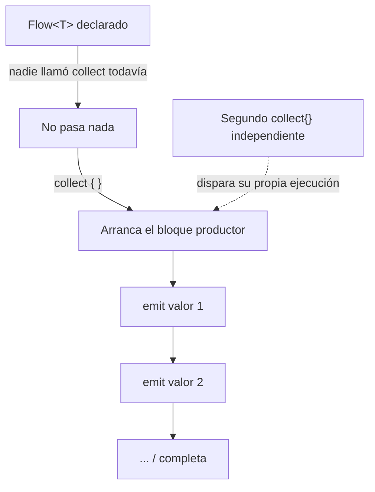

# 08_flow / `flow_basico.md`

## 1. Mapa del flujo



Este diagrama es el mapa macro de `08_flow`: acá se ve el comportamiento base — frío, cada `collect` dispara su propia ejecución del productor. `stateflow.md` hace zoom sobre qué pasa cuando ese comportamiento no alcanza (necesitás que el valor "quede pegado" para nuevos suscriptores). `sharedflow_efectos.md` hace zoom sobre el caso contrario (necesitás que NO quede pegado nada, cada emisión se consume una sola vez). `operadores_flow.md` hace zoom sobre lo que pasa entre el productor y el `collect { }`: los operadores intermedios (`map`, `filter`, `debounce`, `combine`, `flatMapLatest`, `flowOn`, `catch`, `retry`, `buffer`/`conflate`) que transforman, combinan, controlan el ritmo o manejan errores de esas emisiones antes de que lleguen al colector.

## 2. Qué es y cómo funciona

`Flow<T>` es un stream asincrónico de valores que se emiten en el tiempo (cero, uno o muchos). Es **frío** (cold): el bloque productor (nodo C del diagrama) no corre hasta que alguien lo colecta con `.collect { }` — declarar un `Flow` no ejecuta nada por sí solo (nodo B).

La pieza clave para entender el resto del package: cada `.collect { }` dispara **su propia ejecución independiente** del bloque productor (nodo G del diagrama). Si dos partes distintas de la app colectan el mismo `Flow` sin compartir instancia, el productor corre dos veces completas — no hay memoria ni caché compartida entre colectores, cada uno arranca desde cero.

Esto resuelve un problema real: antes de `Flow`, observar un dato que cambia con el tiempo (una tabla de base de datos, una preferencia) significaba elegir entre *polling* manual (consultar cada X segundos, ineficiente) o callbacks/listeners escritos a mano (propensos a leaks si no se desuscriben bien). `Flow` da un mecanismo estándar, integrado con coroutines y `suspend`, para modelar "esto puede cambiar, avisame cuando pase" sin ninguna de esas dos soluciones artesanales.

## 3. Cómo se ve en distintos contextos

**App de fitness:** el repositorio expone `fun getActiveWorkout(): Flow<Workout?>` sobre una tabla local — cada vez que el usuario marca un ejercicio como completado y eso actualiza la tabla, el `Flow` emite automáticamente el nuevo estado sin que nadie tenga que pedirlo explícitamente. Si dos pantallas distintas (la principal y un widget de resumen) colectan ese mismo `Flow` por separado, cada una dispara su propia query a la tabla — dos lecturas, no una.

**App de e-commerce:** el carrito se modela como `Flow<List<CartItem>>` sobre la base local. Cada composable que necesita mostrar el contador de ítems en el carrito colecta ese `Flow` de forma independiente — si son tres lugares distintos de la UI (ícono del carrito, badge en la barra inferior, resumen en checkout), y ninguno comparte instancia, son tres queries corriendo por separado ante cada cambio.

## 4. Implementación real

El PO pide: exponer el historial de pedidos como algo que se actualice solo en la UI cuando cambian los datos locales (sin tener que refrescar manualmente cada vez).

```kotlin
// domain — el contrato solo conoce el tipo Flow, no sabe qué hay detrás
interface OrderRepository {
    fun observeOrderHistory(): Flow<List<Order>>
}

// data
class OrderRepositoryImpl(
    private val dao: OrderDao
) : OrderRepository {
    override fun observeOrderHistory(): Flow<List<Order>> =
        dao.getAllOrders() // Flow que la librería de persistencia emite cada vez que la tabla cambia
            .map { entities -> entities.map { it.toDomain() } } // Entity -> Model
}
```

```kotlin
// presentation
class OrdersViewModel(
    private val orderRepository: OrderRepository
) {
    private val viewModelScope = CoroutineScope(SupervisorJob() + Dispatchers.Main.immediate)

    private val _state = MutableStateFlow(OrdersState())
    val state: StateFlow<OrdersState> = _state.asStateFlow()

    init {
        viewModelScope.launch {
            orderRepository.observeOrderHistory().collect { orders ->
                _state.update { it.copy(orders = orders, isLoading = false) }
            }
        }
    }
}
```

Cada vez que se guarda o elimina un pedido en la tabla local, `dao.getAllOrders()` emite la lista actualizada, `.map` la transforma a `Order` de dominio, y el `.collect { }` del `ViewModel` actualiza el `State` — sin ningún refresh manual ni polling. Este `Flow` en particular es solo el punto de partida: en la práctica casi nunca se colecta un `Flow` frío directo así en un `ViewModel` real, se lo transforma primero en `StateFlow` (ver `stateflow.md`) para que la UI tenga siempre un valor disponible al suscribirse, no solo emisiones futuras.

## 5. Buenas prácticas y errores comunes — checklist de auditoría

Si esta parte del código la entregó una IA, revisar puntualmente:

- **¿El mismo `Flow` se colecta más de una vez desde distintos lugares sin compartir instancia?** Si dos composables o dos `ViewModel` distintos llaman a `repository.observeOrderHistory()` por separado y cada uno hace su propio `.collect { }`, el productor corre dos veces completas — dos queries a la DB (o peor, dos llamadas de red si el `Flow` envuelve una). Si hay múltiples colectores reales del mismo dato, hace falta compartir el `Flow` (típicamente convirtiéndolo a `StateFlow` con `.stateIn()`), no dejar que cada uno dispare su propia ejecución.
- **¿Asume que un valor ya emitido antes queda disponible para un colector que se suscribe después?** Un `Flow` frío común no "recuerda" nada — si nadie está colectando en el momento exacto de una emisión, esa emisión se pierde para quien se suscribe después. Si el código depende de que un colector tardío reciba algo que ya pasó, está usando el tipo equivocado (necesita `StateFlow` o `SharedFlow` con `replay`, no `Flow` a secas).
- **¿Hace operaciones costosas (llamada de red, cálculo pesado) dentro de un operador como `.map { }` sin pensar que corre una vez por cada colector?** Cada colector independiente re-ejecuta todo el pipeline del `Flow`, incluidos los operadores intermedios — si `.map { }` hace algo caro, ese costo se multiplica por cada suscriptor.
- **¿El `Flow` expuesto desde `data` hacia `domain` filtra detalles de la fuente (tipos de la librería de persistencia, excepciones específicas de esa librería) en vez de devolver el tipo de dominio ya mapeado?** El contrato de `domain` solo debería conocer `Flow<Order>`, nunca el tipo de entidad crudo de la capa de datos — si el `.map` de conversión falta o está incompleto, la capa de dominio termina acoplada a un detalle de implementación de `data`.