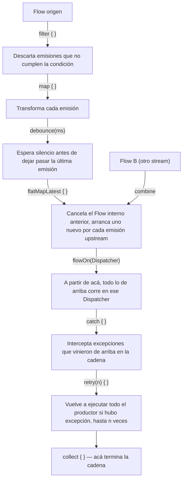

# 08_flow / `operadores_flow.md`

## 1. Mapa del flujo



Este diagrama hace zoom sobre lo que `flow_basico.md` deja como caja negra entre el productor y el `collect { }`: los operadores intermedios. Cada operador (nodos B a H) recibe el `Flow` de arriba y devuelve un `Flow` nuevo — son lazy, igual que el `Flow` base: no hacen nada hasta que alguien llega al `collect { }` final (nodo J) y dispara toda la cadena de una sola vez, de abajo hacia arriba.

## 2. Qué es y cómo funciona

Un operador de `Flow` es una función de extensión que toma un `Flow<T>` y devuelve otro `Flow<R>` (a veces con el mismo tipo, a veces transformado). Encadenarlos arma un pipeline declarativo: en vez de escribir manualmente "por cada valor que llega, hacé esto y después esto otro", se describe la transformación como una secuencia de pasos, y el motor de coroutines se encarga de ejecutarla en orden cuando alguien colecta.

**Transformación y filtrado — `map`, `filter`:**
`map { }` transforma cada emisión en otra cosa (nodo C) — es el mismo concepto que `List.map`, pero aplicado a emisiones que llegan en el tiempo en vez de a elementos que ya están todos disponibles. `filter { }` descarta emisiones que no cumplen una condición (nodo B) sin transformarlas — lo que no pasa el filtro simplemente no llega al siguiente operador ni al colector. Ojo con no confundirlos con sus equivalentes de colecciones: `orders.filter { }` sobre una `List<Order>` ya materializada es una operación distinta (sincrónica, sobre datos que ya están todos ahí) a `ordersFlow.filter { }` sobre un `Flow<Order>` (se evalúa emisión por emisión, a medida que llegan).

**Control de ritmo en el tiempo — `debounce`:**
`debounce(ms)` espera a que pase un período de "silencio" (sin nuevas emisiones) antes de dejar pasar la última emisión recibida (nodo D). Si llegan varias emisiones seguidas dentro de esa ventana, todas menos la última se descartan. El caso de uso típico es texto de búsqueda tipeado por el usuario: sin `debounce`, cada tecla dispara una query; con `debounce(300)`, solo se dispara una query cuando el usuario deja de tipear por 300ms.

**Combinar streams — `combine`:**
`combine` toma dos (o más) `Flow` independientes y emite un valor combinado cada vez que **cualquiera** de los dos emite algo nuevo — usando el último valor conocido del otro (nodo F hacia E). A diferencia de `zip` (que empareja emisiones una a una, en orden), `combine` no espera que ambos emitan al mismo ritmo: reacciona a cualquiera de los dos. Importante: `combine` no emite nada hasta que **todos** los `Flow` que combina emitieron al menos una vez — si uno de los dos nunca emite, el `combine` completo queda sin emitir nunca.

**Cambiar de Flow interno — `flatMapLatest`:**
`flatMapLatest { }` toma cada emisión upstream y la mapea a un **nuevo** `Flow` interno, colectando ese Flow interno — pero si llega una nueva emisión upstream antes de que el `Flow` interno anterior termine, cancela ese anterior y arranca el nuevo (nodo E). Es la pieza clave para "cada vez que cambia X, tirá todo lo anterior relacionado con X y arrancá de cero" — por ejemplo, cada nueva letra de búsqueda cancela la query anterior en vez de dejarla terminar y competir con la nueva.

**Contexto de ejecución — `flowOn`:**
`flowOn(Dispatcher)` cambia el `CoroutineContext` en el que corre todo lo que está **arriba** de él en la cadena (nodo G) — no afecta lo que está después. Es la forma correcta de decir "todo este procesamiento (map, filter, lo que sea costoso) corre en un Dispatcher de background", sin tener que envolver el `collect { }` completo en ese Dispatcher, lo cual sacaría también la actualización de `State` del hilo principal.

**Manejo de errores — `catch`, `retry`:**
`catch { }` intercepta excepciones que ocurrieron en cualquier operador **de arriba** en la cadena (nodo H) — no en el `collect { }` mismo; una excepción lanzada dentro del bloque de `collect { }` no la agarra un `catch` que está antes en la cadena. `retry(retries) { predicate }` vuelve a ejecutar todo el productor desde el principio si hubo una excepción upstream, hasta `retries` veces, solo si el predicado (que recibe la excepción) devuelve `true` (nodo I) — típicamente se usa para reintentar automáticamente ante errores de red transitorios.

**Control explícito de backpressure — `buffer`, `conflate`:**
Estos dos aparecen cuando el colector procesa más lento que el productor emite. Son **operadores manuales** que se agregan explícitamente a un `Flow` frío común — distinto del comportamiento automático de conflation que ya tiene `StateFlow` por diseño (ver `stateflow.md`). `buffer(capacity)` desacopla productor y colector: el productor sigue emitiendo a su ritmo hacia un buffer intermedio, sin esperar a que el colector termine de procesar cada valor, y nada se pierde (hasta que el buffer se llena). `conflate()` en cambio descarta valores intermedios a propósito: si el colector está ocupado y llegan varias emisiones nuevas, cuando vuelve a estar libre solo ve la última — igual que hace `StateFlow` internamente, pero acá es una decisión explícita sobre un `Flow` frío, no un comportamiento implícito del tipo.

## 3. Cómo se ve en distintos contextos

**App de fitness:** la pantalla de historial de rutinas tiene un buscador por nombre de ejercicio. El texto tipeado pasa por `.debounce(300).flatMapLatest { query -> repository.searchExercises(query) }` — cada tecla nueva cancela la búsqueda anterior si todavía estaba en curso, y solo se dispara una consulta real 300ms después de que el usuario deja de tipear. Además, el progreso semanal combina el `Flow` de rutinas completadas con el `Flow` de la meta configurada por el usuario usando `combine`, para recalcular el porcentaje cada vez que cualquiera de los dos cambia.

**App de e-commerce:** el catálogo de productos filtra por categoría seleccionada y rango de precio a la vez — dos `StateFlow` de filtros combinados con `combine`, alimentando un `flatMapLatest` que dispara la query filtrada contra el repositorio cada vez que cualquiera de los dos filtros cambia, cancelando la query anterior si todavía no había terminado. El envío del formulario de checkout usa `retry(2) { it is IOException }` para reintentar automáticamente ante una caída momentánea de red antes de mostrarle un error al usuario.

## 4. Implementación real

El PO pide: agregar un buscador de texto en la pantalla de Historial de Pedidos, que filtre la lista sin disparar una búsqueda en cada tecla, y que el refresh contra el backend reintente automáticamente un par de veces antes de mostrar error.

```kotlin
// domain — el refresh se modela como Flow para poder aplicarle retry/catch
class RefreshOrdersUseCase(
    private val orderRepository: OrderRepository
) {
    operator fun invoke(): Flow<Unit> = flow {
        orderRepository.refreshFromRemote() // suspend fun que pega contra el backend
        emit(Unit)
    }
}
```

```kotlin
// presentation — Contract
data class OrdersState(
    val orders: List<Order> = emptyList(),
    val isLoading: Boolean = true,
    val error: String? = null
)

sealed interface OrdersEvent {
    data class OnSearchQueryChanged(val query: String) : OrdersEvent
    data object OnRefresh : OrdersEvent
}

class OrdersViewModel(
    private val orderRepository: OrderRepository,
    private val refreshOrdersUseCase: RefreshOrdersUseCase
) {
    private val viewModelScope = CoroutineScope(SupervisorJob() + Dispatchers.Main.immediate)

    private val _state = MutableStateFlow(OrdersState())
    val state: StateFlow<OrdersState> = _state.asStateFlow()

    private val searchQuery = MutableStateFlow("")

    init {
        viewModelScope.launch {
            searchQuery
                .filter { it.isEmpty() || it.length >= 2 } // ignora búsquedas de 1 carácter suelto
                .debounce(300)
                .flatMapLatest { query ->
                    orderRepository.observeOrderHistory()
                        .map { orders -> orders.filter { it.matchesQuery(query) } }
                }
                .flowOn(Dispatchers.Default) // el filtrado corre fuera del hilo principal
                .catch { e ->
                    _state.update { it.copy(error = "No se pudo filtrar el historial") }
                }
                .collect { filtered ->
                    _state.update { it.copy(orders = filtered, isLoading = false, error = null) }
                }
        }
    }

    fun onEvent(event: OrdersEvent) {
        when (event) {
            is OrdersEvent.OnSearchQueryChanged -> searchQuery.value = event.query
            OrdersEvent.OnRefresh -> refreshOrders()
        }
    }

    private fun refreshOrders() {
        viewModelScope.launch {
            refreshOrdersUseCase()
                .retry(retries = 2) { e -> e !is CancellationException }
                .catch { e ->
                    _state.update { it.copy(error = "No se pudo actualizar el historial luego de reintentar") }
                }
                .collect()
        }
    }
}
```

Cada letra tipeada actualiza `searchQuery`, pero `.debounce(300)` corta el ruido de teclas intermedias. `.flatMapLatest` asegura que si el usuario sigue tipeando antes de que termine de resolverse una búsqueda anterior, esa búsqueda anterior se cancela — no queda compitiendo con la nueva ni actualiza el `State` con un resultado ya obsoleto. `refreshOrders()` reintenta hasta 2 veces ante cualquier excepción que no sea cancelación, y solo después de agotar los reintentos cae en `catch` para mostrar el error final.

## 5. Buenas prácticas y errores comunes — checklist de auditoría

Si esta parte del código la entregó una IA, revisar puntualmente:

- **¿`flowOn` está ubicado en el lugar equivocado de la cadena?** `flowOn` solo afecta lo que está **arriba** de él. Si el código pone `flowOn(Dispatchers.Default)` después de un `.collect { _state.update { ... } }`, no está haciendo nada útil — y si lo pone antes de operadores que necesitan correr en el hilo principal (por ejemplo, algo que lee `Dispatchers.Main.immediate` explícitamente), puede introducir un bug sutil de threading.
- **¿Usa `flatMapLatest` en un caso donde en realidad se necesita `flatMapMerge` o `flatMapConcat`?** `flatMapLatest` cancela el Flow interno anterior apenas llega una nueva emisión upstream — si el caso de uso necesita que **todas** las búsquedas o requests en curso terminen (por ejemplo, no perder el resultado de un guardado disparado por el usuario), `flatMapLatest` va a cortar trabajo que no debería cortarse. Vale la pena confirmar que la cancelación del anterior es el comportamiento deseado, no un efecto colateral no considerado.
- **¿El `catch { }` está puesto antes del operador que puede tirar la excepción, en vez de después?** `catch` solo agarra excepciones de lo que está arriba en la cadena — si se pone antes de un `.map { }` que puede lanzar, esa excepción no la va a interceptar. También vale chequear que no haya lógica dentro del bloque `collect { }` que pueda tirar una excepción sin protección: eso queda fuera del alcance de cualquier `catch` anterior en la cadena.
- **¿`retry` no filtra `CancellationException`?** Si el predicado de `retry` no excluye explícitamente `CancellationException` (o no tiene predicado y reintenta ante cualquier excepción), una cancelación normal del `scope` — por ejemplo, el usuario salió de la pantalla — puede terminar disparando reintentos en vez de propagarse correctamente y terminar la coroutine.
- **¿Falta un límite de reintentos, o el límite es tan alto que equivale a un loop casi infinito sin backoff?** `retry()` sin argumentos reintenta indefinidamente. Sin un número acotado (y, en escenarios de red real, sin backoff entre intentos), un servicio caído puede generar un loop de reintentos consumiendo batería y red sin que el usuario vea nunca el error.
- **¿Se usa `conflate()` en un stream donde perder valores intermedios rompe la lógica de negocio?** `conflate()` está pensado para casos donde solo importa "el último valor" (progreso de una descarga, por ejemplo) — si el `Flow` representa algo donde cada emisión individual importa (una cola de eventos a procesar uno por uno), `conflate()` va a descartar datos que el sistema necesitaba ver.
- **¿`debounce` se aplica sobre un stream que no es de input de usuario (por ejemplo, datos que vienen de una DB)?** `debounce` tiene sentido para cortar ruido de una fuente que emite en ráfagas rápidas por acción humana (tipeo). Aplicado a un `Flow` que refleja cambios reales de datos persistidos, puede introducir un delay artificial e innecesario antes de que la UI se actualice.