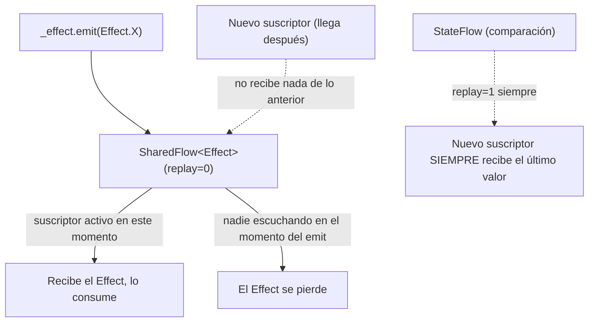

# 08_flow / `sharedflow_efectos.md`

## 1. Mapa del flujo



Este diagrama es el espejo de `stateflow.md`: ahí, un suscriptor nuevo siempre recibía el último valor (nodo F/G, a modo de contraste). Acá, con `replay=0`, un suscriptor nuevo (nodo D) no recibe nada de lo que ya pasó — solo lo que se emita de ahí en adelante. Esa diferencia de comportamiento es exactamente lo que hace que `SharedFlow` sirva para `Effect` y `StateFlow` sirva para `State`.

## 2. Qué es y cómo funciona

`SharedFlow<T>` es un `Flow` **caliente** (hot) y configurable en cuánto "recuerda" — el parámetro `replay`. Con `replay = 0` (el valor típico para modelar eventos), un suscriptor nuevo no recibe nada de lo emitido antes de suscribirse, solo emisiones futuras (nodo B del diagrama). A diferencia de `StateFlow`, que siempre tiene `replay = 1` implícito y por eso un suscriptor nuevo siempre ve el último valor, `SharedFlow` con `replay = 0` no tiene "último valor" que ofrecer — si nadie estaba escuchando en el momento exacto del `emit`, ese valor se pierde (nodo E).

Esto resuelve un problema que `StateFlow` no puede resolver por diseño: modelar eventos que deben consumirse **una sola vez** (navegar a otra pantalla, mostrar un snackbar, disparar una vibración). `StateFlow` siempre repite su último valor a cualquier suscriptor nuevo — eso es justamente lo que lo hace *inútil* para este caso: una rotación de pantalla vuelve a suscribir a la UI, y si el `Effect` viviera en un `StateFlow`, ese snackbar ya mostrado se repetiría sin que el usuario hiciera nada de nuevo. `SharedFlow(replay=0)` corta esa repetición: solo entrega el evento a quien esté escuchando en el instante exacto en que se emite.

Cómo se relaciona con el resto del Contract de MVI: el `State` (en `StateFlow`) responde "¿cómo se ve la pantalla ahora?" — algo que tiene sentido consultar en cualquier momento. El `Effect` (en `SharedFlow`) responde "¿qué acción puntual pasó?" — algo que solo tiene sentido si lo recibís en el momento en que ocurrió, no antes ni después.

**Sobre `Channel`**: antes de que `SharedFlow` existiera con esta configuración, `Channel` era el mecanismo usado para modelar eventos de un solo consumo — es una cola point-to-point (cada valor va a un único receptor, no es multicast como `Flow`/`SharedFlow`). En la práctica actual de una app MVI con Compose, `SharedFlow(replay=0)` reemplazó ese uso: se integra directamente con el resto del stack de `Flow` (mismos operadores, mismo `collect`), mientras que `Channel` requiere una API distinta y separada. Si aparece `Channel` en código nuevo para modelar `Effect`, vale la pena preguntar por qué no se usó `SharedFlow` — no es necesariamente un error, pero es la opción menos habitual hoy para ese caso puntual.

## 3. Cómo se ve en distintos contextos

**App de fitness:** al completar la última serie de un ejercicio, el `ViewModel` emite `WorkoutEffect.ShowCompletionAnimation` por un `SharedFlow(replay=0)`. Si el usuario rota la pantalla justo después, la animación no se repite — el `Effect` ya se consumió en el momento en que ocurrió, y el nuevo suscriptor que aparece tras la rotación no recibe nada de lo que ya pasó.

**App de e-commerce:** al confirmar una compra, el `ViewModel` emite `CheckoutEffect.NavigateToConfirmation(orderId)`. Es un evento de navegación de una sola vez — si se modelara como `StateFlow` en vez de `SharedFlow`, cualquier recomposición posterior de esa pantalla dispararía una navegación repetida hacia la misma confirmación, aunque el usuario ya esté en otra pantalla.

## 4. Implementación real

El PO pide: en la pantalla de Historial de Pedidos, al tocar un pedido, navegar al detalle; y si falla el refresh contra el backend, mostrar un snackbar de error — ninguno de los dos debe repetirse si la pantalla se recompone.

```kotlin
// presentation — Contract
sealed interface OrdersEffect {
    data class NavigateToOrderDetail(val orderId: String) : OrdersEffect
    data class ShowErrorSnackbar(val message: String) : OrdersEffect
}

class OrdersViewModel(
    private val refreshOrdersUseCase: RefreshOrdersUseCase
) {
    private val viewModelScope = CoroutineScope(SupervisorJob() + Dispatchers.Main.immediate)

    private val _effect = MutableSharedFlow<OrdersEffect>() // replay = 0 por default
    val effect: SharedFlow<OrdersEffect> = _effect.asSharedFlow()

    fun onEvent(event: OrdersEvent) {
        when (event) {
            is OrdersEvent.OnOrderClicked -> {
                viewModelScope.launch {
                    _effect.emit(OrdersEffect.NavigateToOrderDetail(event.orderId))
                }
            }
            OrdersEvent.OnRefresh -> refreshOrders()
        }
    }

    private fun refreshOrders() {
        viewModelScope.launch {
            try {
                refreshOrdersUseCase()
            } catch (e: CancellationException) {
                throw e
            } catch (e: Exception) {
                _effect.emit(OrdersEffect.ShowErrorSnackbar("No se pudo actualizar el historial"))
            }
        }
    }
}
```

```kotlin
// consumo típico en la UI (Compose)
LaunchedEffect(Unit) {
    viewModel.effect.collect { effect ->
        when (effect) {
            is OrdersEffect.NavigateToOrderDetail -> navController.navigate("order/${effect.orderId}")
            is OrdersEffect.ShowErrorSnackbar -> snackbarHostState.showSnackbar(effect.message)
        }
    }
}
```

Si el usuario toca un pedido y en el mismo instante rota la pantalla, el `LaunchedEffect` se vuelve a suscribir al `SharedFlow` — pero como `replay = 0`, no recibe de nuevo el `NavigateToOrderDetail` ya emitido. Si en cambio `effect` fuera un `StateFlow`, la navegación se dispararía otra vez apenas se recompone la UI.

## 5. Buenas prácticas y errores comunes — checklist de auditoría

Si esta parte del código la entregó una IA, revisar puntualmente:

- **¿Usa `StateFlow` para modelar un `Effect` (navegación, snackbar, evento de una sola vez)?** Es el error conceptual más común en este tema: `StateFlow` siempre repite su último valor a cualquier suscriptor nuevo, así que una rotación de pantalla o una recomposición dispara ese evento otra vez, aunque el usuario no haya hecho nada nuevo. `Effect` va en `SharedFlow(replay=0)`, nunca en `StateFlow`.
- **¿El `MutableSharedFlow` para `Effect` tiene un `replay` distinto de `0` sin justificación?** Un `replay` mayor a `0` reintroduce el mismo problema que tiene `StateFlow` — el evento queda "pegado" para nuevos suscriptores. Si no hay una razón concreta para necesitar replay, `replay = 0` es lo correcto acá.
- **¿El `_effect.emit(...)` se llama fuera de una coroutine (directo, sin `launch`)?** `emit()` es una `suspend fun` — si el código intenta llamarla sin estar dentro de un contexto de coroutine, no compila; si compila porque está en otro lugar suspendible que no correspondía, puede estar emitiendo en un momento o thread inesperado.
- **¿Usa `Channel` para modelar el `Effect` en vez de `SharedFlow`?** No es necesariamente incorrecto (`Channel` también resuelve "un solo consumo"), pero es la opción menos idiomática en un stack moderno de Compose + MVI, y trae una API distinta a manejar sin necesidad. Vale la pena preguntar si hay una razón concreta antes de aceptarlo.
- **¿La UI colecta el `effect` dentro de un `LaunchedEffect` con una key que se recrea en cada recomposición (por ejemplo, una key que cambia con cada emisión de `State`)?** Si el `LaunchedEffect` se cancela y vuelve a lanzarse constantemente, puede perderse la suscripción al `SharedFlow` justo en el momento en que se emite un `Effect` — la key correcta para este `LaunchedEffect` normalmente es `Unit` o algo estable que no cambie con cada recomposición.