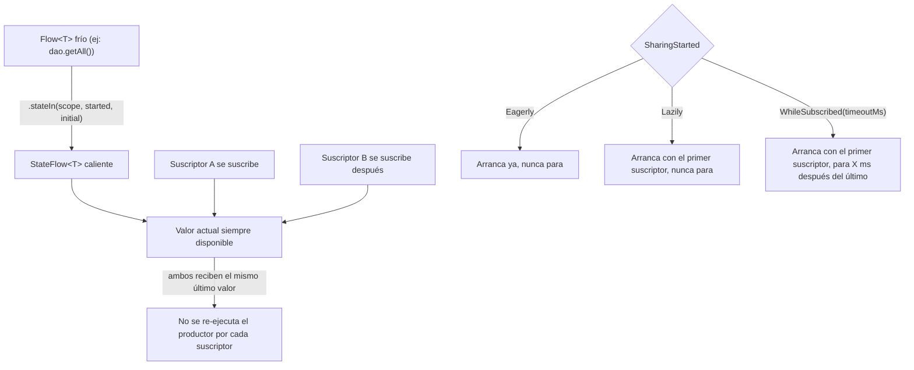

# 08_flow / `stateflow.md`

## 1. Mapa del flujo



Este diagrama hace zoom sobre el problema que dejó abierto `flow_basico.md`: ahí, cada `.collect { }` disparaba su propia ejecución del productor (nodo G de ese diagrama). Acá, `.stateIn()` es la pieza que convierte ese `Flow` frío en algo compartido — un solo productor corriendo, múltiples suscriptores leyendo el mismo valor actual, sin re-ejecutar nada por cada uno.

## 2. Qué es y cómo funciona

`StateFlow<T>` es un `Flow` especializado, **caliente** (hot) y con estado: siempre tiene un valor actual, y cualquier suscriptor nuevo recibe inmediatamente el último valor emitido (nodo C), sin importar cuándo se suscribió (nodos D y E llegan en momentos distintos y ven lo mismo).

Esto resuelve algo que un `Flow` frío no puede: la UI necesita poder pintar "el estado actual" apenas se suscribe — primera carga de pantalla, rotación, recomposición — sin esperar a que llegue una nueva emisión. Con un `Flow` frío, si nadie estaba colectando en el momento exacto de una emisión, esa emisión se pierde para quien se suscribe después. `StateFlow` garantiza que siempre hay "algo" para mostrar de inmediato.

Dos comportamientos internos que valen la pena entender, porque explican bugs no obvios:

- **Conflation**: si el productor emite más rápido de lo que el colector procesa, `StateFlow` no encola cada valor intermedio — el colector se salta directo al último valor disponible cuando vuelve a estar libre. No es un bug, es diseño: `StateFlow` modela "estado actual", no "historial de eventos".
- **`distinctUntilChanged` implícito**: `StateFlow` no vuelve a emitir si el nuevo valor es `equals()` al anterior. Esto tiene una consecuencia directa sobre `data class`: si el `State` cambia una propiedad pero el resultado sigue siendo `equals()` al anterior (poco común, pero puede pasar con estructuras mal diseñadas), la UI no se entera del cambio.

**`.stateIn()`** es la función que convierte un `Flow` frío en un `StateFlow` compartido (flecha del nodo A al B). Recibe tres parámetros: el `scope` donde vive, un `initialValue` (obligatorio, porque `StateFlow` nunca puede estar "vacío"), y un `SharingStarted` que decide **cuándo arranca y cuándo para** el productor de fondo:

- **`SharingStarted.Eagerly`**: arranca apenas se llama `.stateIn()`, sin esperar suscriptores, y nunca para mientras el `scope` viva.
- **`SharingStarted.Lazily`**: arranca recién con el primer suscriptor, pero una vez arrancado tampoco para.
- **`SharingStarted.WhileSubscribed(timeoutMillis)`**: arranca con el primer suscriptor y **para** cuando pasan `timeoutMillis` sin ningún suscriptor activo — es la opción pensada específicamente para Android/Compose, donde una rotación de pantalla desuscribe y vuelve a suscribir casi instantáneamente, y no tiene sentido parar y reiniciar el productor (perdiendo el progreso de una query o conexión) por ese hueco momentáneo.

## 3. Cómo se ve en distintos contextos

**App de fitness:** el `Flow` de la rutina activa (que viene de una tabla local) se comparte entre el `ViewModel` de la pantalla principal y un widget de progreso con `.stateIn(scope, SharingStarted.WhileSubscribed(5000), null)`. Con `WhileSubscribed`, si el usuario rota la pantalla o navega y vuelve en menos de 5 segundos, el productor sigue corriendo de fondo sin reiniciar la query a la tabla — apenas se pasa ese margen sin nadie mirando, se libera el recurso.

**App de e-commerce:** el contador de ítems del carrito se expone como `StateFlow` con `SharingStarted.Eagerly` porque necesita estar actualizado ni bien arranca la app, independientemente de si algún composable ya lo está mirando — por ejemplo, para decidir si mostrar un badge en el ícono de navegación antes de que el usuario entre a esa pantalla.

## 4. Implementación real

El PO pide: en la pantalla de Historial de Pedidos, el `State` tiene que reflejar los pedidos guardados localmente en tiempo real, y ese mismo stream también lo necesita un widget de "últimos pedidos" en la pantalla de inicio — sin duplicar la query a la base de datos.

```kotlin
// data
class OrderRepositoryImpl(
    private val dao: OrderDao,
    private val repositoryScope: CoroutineScope
) : OrderRepository {

    // el Flow frío se comparte una sola vez a nivel repository, no cada vez que alguien lo pide
    private val ordersFlow: StateFlow<List<Order>> =
        dao.getAllOrders()
            .map { entities -> entities.map { it.toDomain() } }
            .stateIn(
                scope = repositoryScope,
                started = SharingStarted.WhileSubscribed(5_000), // sobrevive rotaciones/navegación rápida
                initialValue = emptyList()
            )

    override fun observeOrderHistory(): StateFlow<List<Order>> = ordersFlow
}
```

```kotlin
// presentation
class OrdersViewModel(
    private val orderRepository: OrderRepository
) {
    private val viewModelScope = CoroutineScope(SupervisorJob() + Dispatchers.Main.immediate)

    private val _state = MutableStateFlow(OrdersState())
    val state: StateFlow<OrdersState> = _state.asStateFlow()

    init {
        viewModelScope.launch {
            orderRepository.observeOrderHistory().collect { orders ->
                _state.update { it.copy(orders = orders, isLoading = false) }
            }
        }
    }
}
```

La diferencia clave con `flow_basico.md`: acá `observeOrderHistory()` devuelve un `StateFlow` ya compartido a nivel `data`, así que si tanto `OrdersViewModel` como otro `ViewModel` (el del widget de inicio) lo colectan, la query a `dao.getAllOrders()` corre **una sola vez** — ambos leen del mismo productor compartido, no disparan cada uno el suyo.

## 5. Buenas prácticas y errores comunes — checklist de auditoría

Si esta parte del código la entregó una IA, revisar puntualmente:

- **¿Usa `SharingStarted.Eagerly` o `.Lazily` para un `StateFlow` atado al ciclo de vida de una pantalla, en vez de `WhileSubscribed`?** Sin un timeout de expiración, el productor sigue corriendo (y consumiendo recursos — conexión, listener de DB) indefinidamente aunque no quede ningún suscriptor activo, incluso después de que el usuario salió de la pantalla. `WhileSubscribed(timeoutMillis)` es casi siempre la opción correcta para streams atados a UI.
- **¿El `WhileSubscribed` tiene timeout `0` (o directamente omitido, que también equivale a un valor por default corto)?** Un timeout demasiado corto reinicia el productor en cada rotación de pantalla o transición de navegación rápida — el síntoma es un parpadeo de loading que no debería estar ahí. El valor típico usado en apps reales ronda algunos segundos, ajustado según cuánto tarda el productor en volver a estar listo.
- **¿Falta el `initialValue` en `.stateIn()`, o es un valor que no representa un estado real "vacío"?** `stateIn()` exige un valor inicial porque `StateFlow` nunca puede no tener nada — si el valor elegido no distingue "todavía no cargó" de "cargó y está vacío", la UI puede mostrar un estado incorrecto en el primer frame.
- **¿Se llama `.stateIn()` más de una vez sobre el mismo `Flow` frío, en vez de guardarlo una sola vez como propiedad?** Si `.stateIn()` se invoca dentro de una función que se llama repetidas veces (en vez de guardarse como `val` de clase), se crean múltiples `StateFlow` independientes, cada uno con su propio productor — se pierde por completo el beneficio de compartir la ejecución.
- **¿El `State` expuesto usa una estructura donde dos valores lógicamente distintos podrían resultar `equals()`?** Por el `distinctUntilChanged` implícito de `StateFlow`, si eso pasa, una actualización real de estado no dispara recomposición porque `StateFlow` la considera "el mismo valor" — vale la pena revisar que los campos que sí importan para la UI estén reflejados en la igualdad del `data class`.