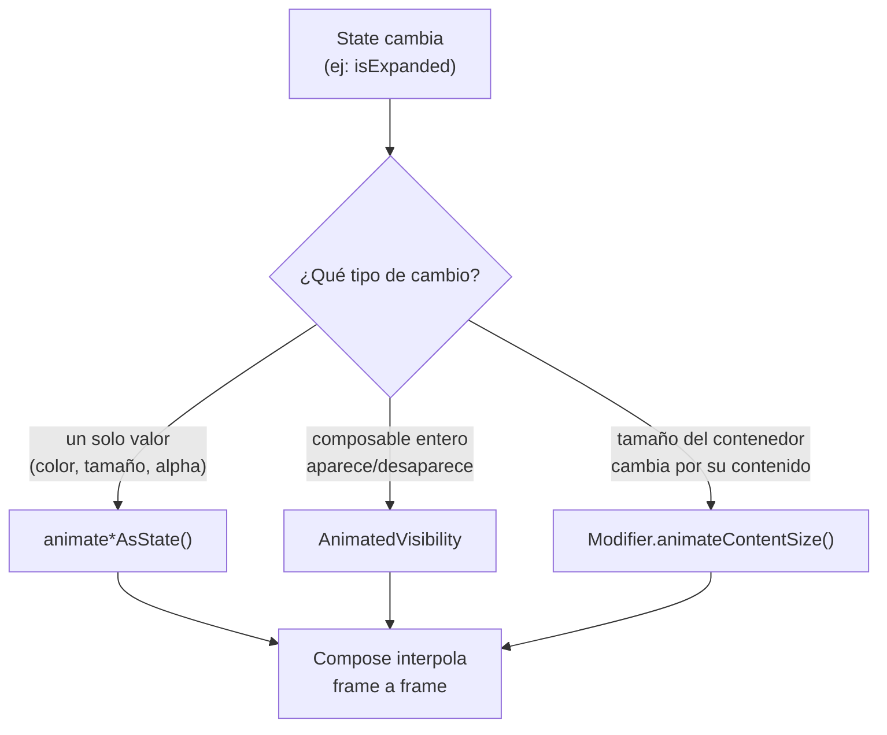

# animaciones_basicas.md

## 1. Mapa del flujo



## 2. Qué es y cómo funciona

Compose ofrece un set de APIs de animación de alto nivel, pensadas para cubrir la gran mayoría de casos comunes sin necesitar manejar interpolación manual de valores: `animate*AsState()` (una familia de funciones: `animateFloatAsState`, `animateColorAsState`, `animateDpAsState`, etc.) para animar un solo valor entre dos estados; `AnimatedVisibility` para animar la entrada/salida de un composable completo; y `animateContentSize()`, un `Modifier` que anima automáticamente el cambio de tamaño de un composable cuando su contenido cambia — como resume el diagrama, las tres parten del mismo cambio de `State` y solo difieren en *qué tipo de cambio visual* están animando.

Todas comparten la misma idea de fondo: en vez de escribir la animación como una secuencia de pasos imperativos, se declara el **valor objetivo** (`targetValue`) y Compose se encarga de interpolar suavemente desde el valor actual hasta ese objetivo cada vez que cambia.

Animar manualmente en un sistema imperativo implica gestionar un timer, calcular manualmente los valores intermedios frame a frame, y sincronizar eso con el render — mucho código repetitivo para casos que en la práctica son muy comunes (un color que cambia suavemente, un elemento que aparece con fade, una card que se expande).

Las animate-APIs de Compose resuelven esto reduciendo la animación a una declaración: "cuando este valor cambia, quiero que la transición sea animada, no instantánea". Compose se encarga de todo el trabajo de interpolación y de disparar recomposición en cada frame intermedio de la animación.

**Criterio de elección:**

- **`animate*AsState()`**: animar un único valor simple (color, tamaño, alpha, offset) entre dos estados conocidos — la opción de menor esfuerzo para el caso más común. Para coordinar varias animaciones relacionadas con timing preciso, corresponde `Animatable` o `updateTransition`, APIs de nivel más bajo que exceden el alcance de este archivo introductorio.
- **`AnimatedVisibility`**: un composable completo debe aparecer/desaparecer de forma animada en respuesta a un `Boolean` — reemplaza un `if (visible) { Content() }` abrupto por una transición real (fade, slide, expand). Si el composable simplemente no debería estar en el árbol en absoluto (una feature flag deshabilitada permanentemente), un `if` normal alcanza y es más simple.
- **`Modifier.animateContentSize()`**: cuando el contenido interno de un composable puede cambiar de tamaño (texto que se expande, una lista que crece) y se prefiere una transición suave del contenedor en vez de un salto brusco. No conviene cuando el cambio de tamaño es tan frecuente o grande que la animación constante se siente como ruido visual (por ejemplo, contenido que cambia de tamaño en cada frame de scroll).
- **Duración/easing por default vs custom**: usar los defaults cuando no hay una razón de diseño específica para desviarse — ya están pensados para sentirse naturales en la mayoría de los casos. Customizar (`animationSpec = tween(300, easing = FastOutSlowInEasing)` o `spring(...)`) cuando el sistema de diseño define timings específicos, o el default se siente demasiado lento/rápido para ese caso puntual.

## 3. Cómo se ve en distintos contextos

En una **app de meditación**, el círculo de respiración que se expande y contrae usa `animateFloatAsState` sobre el radio, con un `animationSpec = tween(...)` custom lo suficientemente lento como para sentirse orgánico — un caso donde los defaults de Compose serían demasiado rápidos para la sensación que la app busca transmitir.

En una **app de e-commerce**, agregar un producto al carrito dispara un pequeño ícono que aparece con `AnimatedVisibility` sobre el botón de carrito (fade + scale), dando feedback visual inmediato sin necesidad de un snackbar — la card del producto en sí usa `animateContentSize()` cuando se expande para mostrar variantes de talle disponibles.

## 4. Implementación real

**El PO pide:** en la lista de pedidos, cuando un pedido cambia a estado "entregado", la fila debe resaltarse con un color verde suave que aparece con transición, y el detalle expandido debe crecer/achicarse de forma animada en vez de saltar abruptamente.

```kotlin
@Composable
fun OrderRow(
    order: Order,
    isExpanded: Boolean,
    onToggleExpand: (String) -> Unit
) {
    // 1. animateColorAsState: interpola el color cada vez que order.status cambia
    val backgroundColor by animateColorAsState(
        targetValue = if (order.status == OrderStatus.DELIVERED)
            MaterialTheme.colorScheme.primaryContainer
        else MaterialTheme.colorScheme.surface,
        label = "orderRowBackground"
    )

    Card(
        modifier = Modifier
            .clickable { onToggleExpand(order.id) }
            .animateContentSize(), // 3. anima el cambio de tamaño al expandir/colapsar
        colors = CardDefaults.cardColors(containerColor = backgroundColor)
    ) {
        Column(modifier = Modifier.padding(12.dp)) {
            Text("Pedido #${order.id}")

            // 2. AnimatedVisibility: anima la entrada/salida del detalle
            AnimatedVisibility(visible = isExpanded) {
                Column {
                    order.items.forEach { item ->
                        Text("${item.quantity}x ${item.name}")
                    }
                }
            }
        }
    }
}
```

Cuando `order.status` cambia a `DELIVERED` (viene del `State` del `ViewModel`, no de un `remember` local — ver `composables_y_state_hoisting.md`), tres cosas animan a la vez: el color de fondo interpola suavemente (`animateColorAsState`), el detalle de ítems aparece/desaparece con transición al expandir (`AnimatedVisibility`), y el tamaño de la `Card` se ajusta de forma animada al nuevo contenido (`animateContentSize()`) — sin que el desarrollador haya escrito ningún cálculo de interpolación a mano.

## 5. Buenas prácticas y errores comunes — checklist de auditoría de código de IA

Si una IA generó o modificó código con intención de animación, revisar:

- **¿Hay una variable nombrada como si animara (`animatedColor`, `animatedSize`) pero en realidad es un `if`/cálculo directo evaluado en cada recomposición?** Es el error más común y engañoso — el nombre sugiere una transición suave, pero el valor salta instantáneamente entre estados sin ninguna interpolación real. La corrección es envolver la expresión en la animate-API correspondiente (`animateColorAsState(targetValue = ...)`), no solo nombrar la variable como si estuviera animada.
- **¿El valor que se anima viene del `State` del `ViewModel`, o de un estado local inventado solo para la animación?** Las animate-APIs son la capa final, puramente visual, sobre un valor que el `State` ya decidió — la animación nunca debería decidir *qué* mostrar, solo *cómo* transiciona algo que ya viene resuelto desde arriba.
- **¿Se usa `AnimatedVisibility` para contenido que en realidad nunca debería estar en el árbol** (una feature deshabilitada permanentemente, no un estado que cambia dinámicamente)? Ahí un `if` simple es más apropiado — `AnimatedVisibility` agrega composición extra sin beneficio si no hay una transición real que mostrar.
- **¿Se usa `animateContentSize()` en un composable cuyo tamaño cambia en cada frame** (por ejemplo, ligado directamente a la posición de scroll)? La animación constante en ese caso se siente como ruido visual, no como ayuda — revisar si el cambio de tamaño es genuinamente discreto (aparece/desaparece un bloque) o continuo.
- **¿Se customizó `animationSpec` sin una razón de diseño concreta?** Los defaults de Compose ya están pensados para sentirse naturales — una customización sin justificación (un `tween` con duración arbitraria) puede ser señal de que se está ajustando "a ojo" en vez de seguir un sistema de diseño consistente.