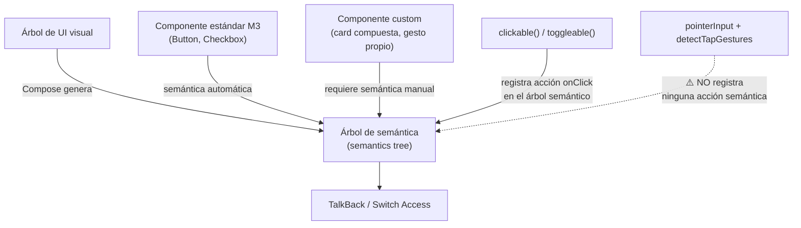

# accesibilidad_a11y.md

## 1. Mapa del flujo



## 2. Qué es y cómo funciona

Accesibilidad (a11y) es el conjunto de prácticas y APIs que permiten que una app sea usable por personas con discapacidades visuales, motoras o cognitivas, típicamente a través de servicios de asistencia como TalkBack (el lector de pantalla de Android) o Switch Access (navegación sin tocar la pantalla, vía switches físicos o gestos de barrido). En Compose, la pieza central es el **árbol de semántica** (semantics tree): un árbol paralelo al árbol de UI visual que describe el "significado" de cada elemento (es un botón, dice "Favorito", está seleccionado) para que los servicios de accesibilidad puedan interpretarlo sin necesidad de "ver" píxeles — como muestra el diagrama, los componentes estándar de Material3 generan esa semántica automáticamente, pero un componente custom o un gesto de bajo nivel no.

Sin un árbol de semántica explícito, un lector de pantalla no tiene forma de saber qué es cada elemento visual: un ícono es solo un conjunto de píxeles, un `Row` con texto e ícono son elementos sueltos sin relación aparente entre sí. Compose construye automáticamente semántica razonable para los componentes estándar (un `Button` ya se anuncia como botón, un `Text` lee su contenido), pero en cuanto se arma algo custom (una card compuesta por ícono + texto + badge, un gráfico, un gesto propio), esa semántica automática no alcanza y hay que describirla a mano — si no se hace, la app queda invisible o confusa para cualquiera que dependa de TalkBack/Switch Access, lo cual además de ser una barrera real es, en mercados como la UE, un requisito legal (European Accessibility Act, vigente desde 2025).

**Criterios de auditoría clave:**

- **`contentDescription = null` vs. una descripción real**: `null` cuando el ícono es puramente decorativo o ya está acompañado de un texto que comunica lo mismo (evita redundancia al lector de pantalla). Una descripción real cuando el elemento es la única fuente de información de esa acción — y debe describir la **acción** ("Eliminar el pedido"), no el ícono en sí ("ícono de tacho de basura").
- **`Modifier.semantics(mergeDescendants = true)`**: cuando varios elementos hijos (ícono + texto + badge) forman conceptualmente una sola unidad de información. Los modifiers estándar (`clickable`, `toggleable`) declaran su propia semántica y quedan automáticamente protegidos de ser absorbidos por el merge del padre — pero un gesto custom de bajo nivel, sin semántica propia, sí puede quedar silenciosamente tragado dentro del nodo mergeado (ver sección 4).
- **Touch target mínimo (48dp)**: por default con componentes de Material (`IconButton`, `Checkbox`), que ya aplican automáticamente una región de touch invisible de al menos 48dp. Ajustarlo manualmente cuando se arma un componente completamente custom con `Modifier.clickable` sobre algo visualmente más chico, o cuando varios elementos chicos quedan muy juntos entre sí.
- **`clearAndSetSemantics {}` vs. `semantics {}`**: `semantics {}` para **agregar** información sin pisar lo que Compose ya generó automáticamente — el caso general. `clearAndSetSemantics {}` para **reemplazar por completo** la semántica de un nodo y sus descendientes — poderosa pero peligrosa, borra toda la semántica previa incluida la de los hijos, así que se recomienda con moderación.

## 3. Cómo se ve en distintos contextos

En una **app de banca**, cada fila del resumen de movimientos agrupa monto, fecha y descripción con `mergeDescendants = true` para que TalkBack la anuncie como una sola unidad coherente ("Transferencia a Juan, $5000, 15 de agosto") en vez de tres anuncios sueltos y descontextualizados.

En una **app de fotos**, un botón de "Me gusta" implementado solo con ícono (sin texto visible) requiere `contentDescription` obligatorio describiendo la acción ("Me gusta esta foto"), mientras que el ícono decorativo de una cámara junto al texto "Tomar foto" en otro botón puede llevar `contentDescription = null`, porque el texto ya comunica la acción completa.

## 4. Implementación real

**El PO pide:** en la fila de cada pedido del historial, un ícono de "más info" que expande detalles al tocarlo — debe funcionar correctamente con TalkBack activado.

```kotlin
// Caso trampa (lo que NO hay que hacer): gesto custom sin semántica de acción
@Composable
fun OrderRowBad(order: Order, onExpandInfo: () -> Unit) {
    Row(
        modifier = Modifier.semantics(mergeDescendants = true) {}
    ) {
        Text("Pedido #${order.id}")
        Icon(
            Icons.Filled.Info,
            contentDescription = "Ver más info",
            modifier = Modifier.pointerInput(Unit) {
                detectTapGestures { onExpandInfo() } // gesto custom, sin clickable()
            }
        )
    }
}
```

```kotlin
// Corrección: clickable() registra la acción semántica automáticamente
@Composable
fun OrderRow(order: Order, onExpandInfo: () -> Unit) {
    Row(
        modifier = Modifier.semantics(mergeDescendants = true) {}
    ) {
        Text("Pedido #${order.id}")
        Icon(
            Icons.Filled.Info,
            contentDescription = "Ver más info del pedido #${order.id}",
            modifier = Modifier.clickable(onClick = onExpandInfo) // registra onClick semántico
        )
    }
}
```

Para un usuario sin discapacidad, ambas versiones funcionan idéntico: tocás el ícono, se dispara `onExpandInfo()`. El problema aparece con TalkBack activado. `clickable`/`toggleable` no son solo manejo de gestos — internamente también registran una acción de accesibilidad (`onClick`) en el árbol de semántica, que es lo que le permite a TalkBack ofrecer "doble tap para activar" sobre ese elemento. `pointerInput` + `detectTapGestures` es pura detección de gesto de bajo nivel: no registra ninguna acción semántica. En la versión `Bad`, la fila entera se mergea y TalkBack anuncia "Pedido #123. Ver más info." — el `contentDescription` del ícono queda absorbido como texto informativo dentro del nodo mergeado, pero no existe ninguna acción activable adjunta a esa parte. El usuario escucha que "hay más info" pero no tiene forma de pedirla: la funcionalidad existe visualmente y funciona al tacto, pero es invisible y no-operable para quien navega con TalkBack.

## 5. Buenas prácticas y errores comunes — checklist de auditoría de código de IA

Si una IA generó o modificó código con elementos interactivos o informativos, revisar:

- **¿Hay un `Modifier.pointerInput`/`detectTapGestures` usado para algo interactuable, sin `Modifier.clickable()` o sin `Modifier.semantics { onClick { } }` explícito?** Es la señal de alarma más importante de este archivo — pasa cualquier QA manual con el dedo sin levantar sospechas, y solo se detecta probando la pantalla con TalkBack activado.
- **¿Un ícono decorativo (acompañado de texto que ya comunica la misma acción) tiene un `contentDescription` real en vez de `null`?** Genera redundancia: TalkBack lee dos veces la misma información ("Estrella. Marcar favorito." en vez de solo "Marcar favorito.").
- **¿Un `IconButton` sin texto visible tiene `contentDescription = null` o ausente?** Es el error inverso — sin descripción, ese botón es completamente invisible para TalkBack.
- **¿Una `contentDescription` describe el ícono en sí ("ícono de tacho de basura") en vez de la acción ("Eliminar pedido")?** Es una descripción técnicamente presente pero de bajo valor real para quien la escucha.
- **¿Se usó `clearAndSetSemantics {}` cuando `semantics {}` (agregar) hubiera alcanzado?** `clearAndSetSemantics` borra toda la semántica previa, incluida la de los hijos — usarla de más deja huecos de información reales que antes existían automáticamente.
- **¿Un componente completamente custom (no basado en Material3) tiene un área táctil menor a 48dp, o varios elementos chicos quedan pegados entre sí sin espaciado?** Componentes estándar de Material ya resuelven esto automáticamente; un componente armado desde cero con `Modifier.clickable` sobre algo visualmente chico necesita ese ajuste manual.