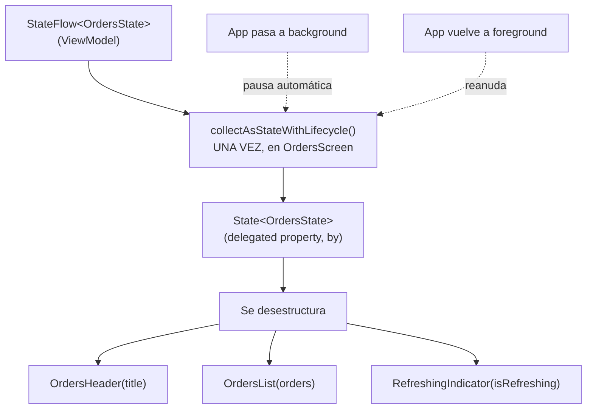

# collect_stateflow_en_compose.md

## 1. Mapa del flujo



## 2. Qué es y cómo funciona

`collectAsStateWithLifecycle()` es la función que conecta un `StateFlow` del `ViewModel` con Compose, convirtiéndolo en un `State<T>` que un composable puede leer y ante cuyos cambios puede recomponer. Es la puerta de entrada estándar por la cual el `State` de MVI (documentado en `06_presentation/mvi.md` y `08_flow/stateflow.md`) llega finalmente a la UI — como muestra el diagrama, la colección ocurre una única vez en el composable raíz de la pantalla, y de ahí el `State` se desestructura hacia los hijos.

Existe también `collectAsState()` (sin el sufijo `WithLifecycle`), una versión más simple pero con una diferencia de comportamiento importante que determina cuál corresponde usar.

Un `StateFlow` es un stream de coroutines — no tiene, por sí mismo, ninguna noción de "la UI está visible" o "la app está en background". Si un composable colecta un `StateFlow` sin ningún control de ciclo de vida, sigue colectando (y potencialmente recomponiendo, o manteniendo trabajo activo aguas arriba) incluso cuando la app pasó a background y no hay nada visible en pantalla — desperdiciando batería y CPU, y en casos más severos, generando crashes por intentar actualizar UI que ya no está en un estado seguro para recibir cambios.

`collectAsStateWithLifecycle()` resuelve esto atando la colección al ciclo de vida real de la plataforma: pausa automáticamente cuando el composable no está en foreground, y la reanuda cuando vuelve — sin que el desarrollador tenga que gestionar esto manualmente. Es la opción recomendada oficialmente para colectar flows atados a UI en producción; `collectAsState()` se reserva para contextos donde el concepto de "ciclo de vida de plataforma" no aplica de la misma forma (algunos targets no-Android de Compose Multiplatform, tests/previews simplificados).

La colección debería ocurrir **una sola vez**, en el composable más alto de la pantalla, y de ahí desestructurarse y pasarse como parámetros puntuales hacia los hijos — coincide con el criterio ya documentado en `recomposicion.md` sobre granularidad de `State`, y mantiene a los composables hijos stateless (`composables_y_state_hoisting.md`), sin necesitar una referencia directa al `ViewModel`.

## 3. Cómo se ve en distintos contextos

En una **app de clima**, la pantalla principal colecta el `StateFlow` del `ViewModel` una sola vez en el composable raíz — si la app pasa a background mientras el usuario cambia de app, esa colección se pausa automáticamente, evitando que se sigan procesando actualizaciones de pronóstico que nadie está viendo.

En una **app de mensajería**, la pantalla de lista de chats sigue el mismo patrón: `collectAsStateWithLifecycle()` una vez en `ChatsScreen`, y de ahí cada `ChatRow` recibe solo `lastMessage: String` y `unreadCount: Int` como parámetros — nunca una referencia al `ViewModel` para colectar por su cuenta.

## 4. Implementación real

**El PO pide:** en la pantalla de historial de pedidos, cada `OrderRow` debe mostrar si ese pedido está marcado como favorito, sin que cada fila de la lista termine colectando su propio `StateFlow`.

```kotlin
// Caso trampa (lo que NO hay que hacer): cada fila colecta su propia copia
@Composable
fun OrderRowBad(order: Order, viewModel: FavoritesViewModel = koinInject()) {
    // Si hay 50 pedidos en la lista, esto son 50 colecciones
    // independientes del mismo StateFlow de FavoritesViewModel
    val favState by viewModel.state.collectAsStateWithLifecycle()
    val isFavorite = favState.favoriteOrderIds.contains(order.id)

    Row {
        Text("Pedido #${order.id}")
        IconButton(onClick = { viewModel.onEvent(FavoritesEvent.OnToggle(order.id)) }) {
            Icon(if (isFavorite) Icons.Filled.Star else Icons.Outlined.Star, null)
        }
    }
}
```

```kotlin
// Corrección: una única colección arriba, desestructurada hacia abajo
@Composable
fun OrdersScreen(
    ordersViewModel: OrdersViewModel,
    favoritesViewModel: FavoritesViewModel
) {
    val ordersState by ordersViewModel.state.collectAsStateWithLifecycle()
    val favoritesState by favoritesViewModel.state.collectAsStateWithLifecycle()

    LazyColumn {
        items(ordersState.orders, key = { it.id }) { order ->
            OrderRow(
                order = order,
                isFavorite = order.id in favoritesState.favoriteOrderIds,
                onToggleFavorite = { favoritesViewModel.onEvent(FavoritesEvent.OnToggle(order.id)) }
            )
        }
    }
}

@Composable
fun OrderRow(
    order: Order,
    isFavorite: Boolean,
    onToggleFavorite: () -> Unit
) {
    // Completamente stateless: no conoce ningún ViewModel
    Row {
        Text("Pedido #${order.id}")
        IconButton(onClick = onToggleFavorite) {
            Icon(if (isFavorite) Icons.Filled.Star else Icons.Outlined.Star, null)
        }
    }
}
```

Con la versión corregida, si la lista tiene 50 pedidos, hay exactamente **dos** colecciones activas en toda la pantalla (`ordersState` y `favoritesState`), sin importar cuántos `OrderRow` se rendericen. En la versión `Bad`, serían 50 colecciones redundantes del mismo `StateFlow` de favoritos — cada una recomponiendo su propio `IconButton` de forma independiente cada vez que cambia cualquier favorito, aunque solo uno haya cambiado.

## 5. Buenas prácticas y errores comunes — checklist de auditoría de código de IA

Si una IA generó o modificó código que colecta un `StateFlow` en Compose, revisar:

- **¿Se usa `collectAsState()` en vez de `collectAsStateWithLifecycle()` en código de producción Android/KMP?** Salvo un contexto explícito donde no aplica ciclo de vida de plataforma (test, preview, target sin Android), siempre corresponde la versión con lifecycle.
- **¿Hay más de una colección del mismo `StateFlow` dentro de la misma pantalla** (un composable hijo con `viewModel: XViewModel = koinInject()` colectando por su cuenta, en vez de recibir el dato por parámetro)? Es el caso trampa más común dentro de listas (`LazyColumn`) — cada ítem terminando con su propia colección redundante en vez de recibir el valor ya resuelto desde arriba.
- **¿Se usa `state.value.campo` en vez de `by` + `state.campo`?** No es un error funcional, pero rompe la convención idiomática del repo — revisar que se use `val state by viewModel.state.collectAsStateWithLifecycle()`.
- **¿El composable hijo recibe una referencia directa a un `ViewModel`** (como parámetro o inyectado con `koinInject()`) cuando debería ser stateless y recibir solo los datos puntuales que necesita? Rompe el patrón documentado en `composables_y_state_hoisting.md` — un composable hijo con acceso directo a un `ViewModel` deja de ser reusable y testeable de forma aislada.
- **¿La colección está en el composable más alto de la pantalla (`XScreen`), o dispersa en composables intermedios?** Cuanto más abajo en el árbol ocurre la colección, más difícil es garantizar que no haya colecciones duplicadas o desincronizadas del mismo stream.