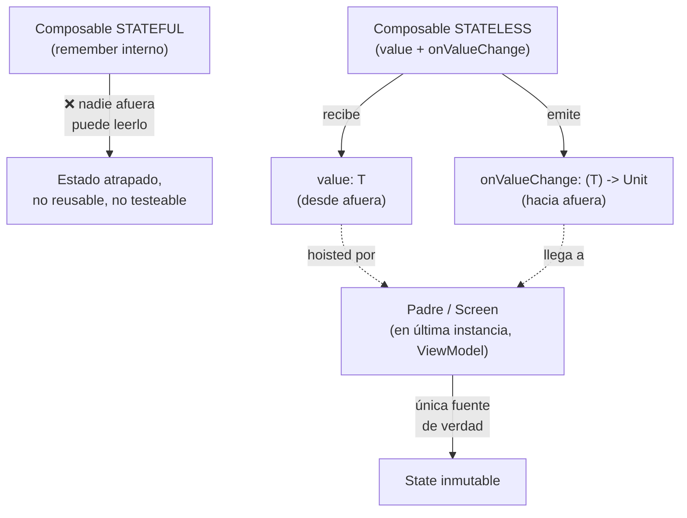

# composables_y_state_hoisting.md

## 1. Mapa del flujo



## 2. Qué es y cómo funciona

Un `@Composable` es una función que describe una porción de UI a partir de datos de entrada, y que Compose puede volver a ejecutar (recomponer) cuando esos datos cambian. **State hoisting** es el patrón de "elevar" el estado desde el composable hijo hacia su padre: el hijo deja de guardar su propio estado interno y en su lugar recibe el valor actual (`value`) y una función para pedir que cambie (`onValueChange`), convirtiéndose en **stateless** — como muestra el diagrama, es la diferencia entre un composable que guarda su propio dato (caja cerrada, nadie más accede) y uno que solo recibe y emite (caja transparente, la fuente de verdad vive afuera).

Un composable stateless es, idealmente, una función pura: mismo input (mismo `State`), mismo resultado visual — sin memoria propia, sin efectos colaterales ocultos.

Si cada composable guardara su propio estado interno (por ejemplo, un `Switch` que mantiene su `checked` con un `remember` propio), ese estado queda encerrado ahí — nadie fuera del composable puede leerlo, validarlo, ni decidir qué hacer con él. En una pantalla real, casi siempre alguien más necesita saber ese valor: el `ViewModel` para persistirlo, otro composable hermano para reaccionar a él, o una regla de negocio que depende de él.

State hoisting resuelve esto separando dos responsabilidades que suelen mezclarse: "cómo se ve/comporta la UI" (el composable) de "cuál es la fuente de verdad del dato" (quien lo hoistea, en última instancia el `ViewModel`). El composable se vuelve reusable (sirve para cualquier fuente de estado, no solo para un `remember` interno), testeable (podés testear su salida visual dado un `value` fijo, sin necesitar disparar estado interno oculto) y predecible.

## 3. Cómo se ve en distintos contextos

En una **app de notas**, el campo de texto donde el usuario escribe el título de una nota nunca guarda ese texto por su cuenta: recibe `title: String` y expone `onTitleChange: (String) -> Unit`, y es el `ViewModel` de la pantalla de edición quien decide qué hacer con cada tecla — validar longitud, disparar autoguardado, o simplemente actualizar el `State`. Si el campo guardara el texto internamente con un `remember`, no habría forma de que el autoguardado del `ViewModel` se entere de lo que el usuario está escribiendo en tiempo real.

En una **app de reservas de restaurantes**, un selector de cantidad de comensales (un `Stepper` con botones +/-) sigue exactamente el mismo patrón: recibe `guestCount: Int` y `onGuestCountChange: (Int) -> Unit`. Esto permite que la misma UI de selector se reuse tanto en la pantalla de nueva reserva como en la de edición de una reserva existente — el composable no sabe ni le importa si el número viene de un valor por defecto o de una reserva ya guardada en base de datos; solo dibuja lo que le llega y avisa cuando el usuario lo cambia.

## 4. Implementación real

**El PO pide:** en la pantalla de historial de pedidos de una app de delivery, el usuario debe poder tocar un pedido para expandirlo y ver el detalle de sus `OrderItem`, sin que ese estado de "expandido" se pierda cuando la lista se reordena por fecha.

```kotlin
// Modelo de dominio (ver 02_domain/model.md)
data class Order(
    val id: String,
    val items: List<OrderItem>,
    val total: Double
)

data class OrderItem(
    val name: String,
    val quantity: Int
)
```

```kotlin
// SIN hoisting: el composable "posee" el estado de expansión,
// nadie afuera puede saber ni controlar qué pedido está expandido
@Composable
fun OrderRowStateful(order: Order) {
    var isExpanded by remember { mutableStateOf(false) }

    Column(modifier = Modifier.clickable { isExpanded = !isExpanded }) {
        Text("Pedido #${order.id} — $${order.total}")
        if (isExpanded) {
            order.items.forEach { item ->
                Text("${item.quantity}x ${item.name}")
            }
        }
    }
}
```

```kotlin
// CON hoisting: el composable es una función pura de sus parámetros
@Composable
fun OrderRow(
    order: Order,
    isExpanded: Boolean,
    onToggleExpand: (String) -> Unit,
    modifier: Modifier = Modifier
) {
    Column(modifier = modifier.clickable { onToggleExpand(order.id) }) {
        Text("Pedido #${order.id} — $${order.total}")
        if (isExpanded) {
            order.items.forEach { item ->
                Text("${item.quantity}x ${item.name}")
            }
        }
    }
}
```

```kotlin
// Quien hoistea el estado: el ViewModel, vía un Set<String> de ids expandidos en el State
data class OrdersState(
    val orders: List<Order> = emptyList(),
    val expandedOrderIds: Set<String> = emptySet()
)

@Composable
fun OrdersScreen(viewModel: OrdersViewModel) {
    val state by viewModel.state.collectAsStateWithLifecycle()

    LazyColumn {
        items(state.orders, key = { it.id }) { order ->
            OrderRow(
                order = order,
                isExpanded = order.id in state.expandedOrderIds,
                onToggleExpand = { id -> viewModel.onEvent(OrdersEvent.OnOrderToggled(id)) }
            )
        }
    }
}
```

La diferencia importa concretamente acá: si la lista de pedidos se reordena (llega un pedido nuevo, o el usuario cambia el criterio de orden), la versión `Stateful` pierde o desincroniza su expansión porque `remember` está atado a la instancia del composable en su posición, no al pedido. La versión hoisted no tiene ese problema — `expandedOrderIds` vive en el `State` del `ViewModel`, indexado por `order.id`, sobreviviendo cualquier reordenamiento de la lista.

## 5. Buenas prácticas y errores comunes — checklist de auditoría de código de IA

Si una IA generó o modificó un composable, revisar:

- **¿El composable guarda con `remember` un valor que en realidad importa fuera de él?** Si otro composable, un `ViewModel`, o una regla de negocio necesitaría ese valor, es una señal de que debería estar hoisted, no atrapado en un `remember` local.
- **¿El nombre de los parámetros sigue la convención `value` + `onValueChange`?** Nombres inventados (`text`/`updateText`, `data`/`onDataChanged`) no son incorrectos técnicamente, pero rompen la previsibilidad esperada en cualquier composable hoisted del proyecto.
- **¿El composable expone un parámetro `modifier: Modifier = Modifier` con default?** Si es un composable reusable y no lo tiene, es una omisión — impide que quien lo usa controle su posición/tamaño desde afuera.
- **¿Hay un `remember` inicializado a partir de un valor que viene de `State` (`remember { mutableStateOf(state.algo) }`)?** Esto es casi siempre un bug: crea una segunda fuente de verdad que se desincroniza del `State` real apenas este cambia por otra vía — el error más común que puede introducir una IA "para simplificar" un composable.
- **¿El nivel al que se hoistea el estado es razonable?** Un estado genuinamente efímero y local (si un tooltip está abierto, la posición visual de un drag momentáneo) no necesita subir hasta el `ViewModel` — pero un dato con relevancia de negocio (como `expandedOrderIds` del ejemplo, si además necesitara persistirse) sí. Sobre-hoistear infla el `State` con cosas puramente visuales; sub-hoistear duplica lógica que debería compartirse.
- **¿El composable sigue siendo, en los hechos, una función pura?** Si además de recibir `value`/`onValueChange` dispara efectos colaterales directamente en su cuerpo (llamadas de red, logs, side effects sin pasar por `LaunchedEffect`/`SideEffect`), ya no es realmente stateless en el sentido que importa — ver `effects_guia_completa.md`.