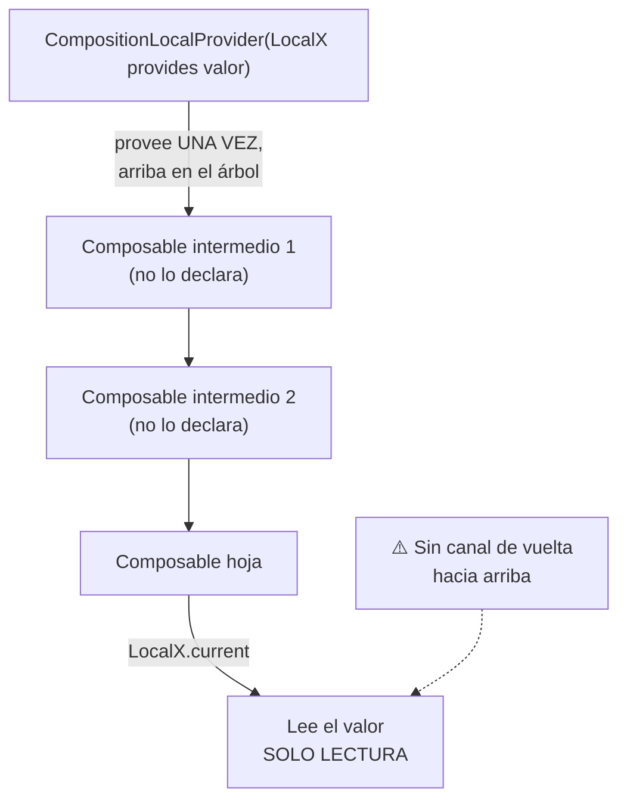

# compositionlocal.md

## 1. Mapa del flujo



## 2. Qué es y cómo funciona

`CompositionLocal` es un mecanismo para pasar datos de forma **implícita** a través del árbol de composables, sin necesidad de declararlos como parámetro explícito en cada función intermedia del árbol. Se declara con `compositionLocalOf { valorPorDefecto }` o `staticCompositionLocalOf { valorPorDefecto }`, se "provee" un valor concreto con `CompositionLocalProvider(MiLocal provides valor) { contenido }`, y cualquier composable dentro de ese `contenido` puede leerlo con `MiLocal.current`, sin importar cuántos niveles de anidamiento haya en el medio — como muestra el diagrama, el dato atraviesa niveles intermedios que ni siquiera necesitan saber que existe, pero el canal es exclusivamente de lectura, de arriba hacia abajo.

Es, conceptualmente, similar a un `Context` de React o una inyección de dependencia acotada exclusivamente al árbol de composición — no es un mecanismo de DI general (para eso está Koin, ver `04_di`).

Sin `CompositionLocal`, cualquier dato que necesite estar disponible en lo profundo de un árbol de composables (por ejemplo, los colores del tema) tendría que pasarse como parámetro explícito en **cada** función intermedia, incluso en las que no usan ese dato directamente, solo para poder pasarlo hacia sus hijos ("prop drilling"). Con un árbol de UI de 5-6 niveles de profundidad, eso ensucia la firma de funciones que conceptualmente no deberían saber nada sobre theming.

`CompositionLocal` resuelve esto haciendo que el dato "atraviese" el árbol de forma implícita: se provee una vez arriba, y se lee donde se necesite, sin que los niveles intermedios tengan que reenviarlo manualmente. `MaterialTheme` (documentado en `theming_material3.md`) está construido internamente sobre este mecanismo — es el ejemplo canónico de uso correcto.

**`compositionLocalOf` vs `staticCompositionLocalOf`:** `compositionLocalOf` cuando el valor puede cambiar durante la vida de la composición y necesitás que Compose recomponga de forma granular solo los composables que leen `.current` — tiene un costo de tracking en runtime a cambio de esa granularidad. `staticCompositionLocalOf` cuando el valor es efectivamente estático dentro de esa porción del árbol (como el tema) — es más performante, pero si el valor cambia igual, Compose recompone **todo** el subárbol bajo ese `Provider`, no solo lo que lee `.current` (la contracara de la granularidad que documenta `recomposicion.md`).

**Cuándo usarlo:** cuando el dato es verdaderamente transversal a toda o gran parte de la UI, y no forma parte de la lógica de negocio — tema visual, configuración de layout (densidad, dirección de texto), o el propio scope de navegación. Usarlo para "esquivar" pasar un parámetro de negocio explícito dificulta rastrear de dónde viene un valor, porque cualquier composable en cualquier profundidad podría estar leyéndolo sin que se note en ninguna firma de función.

## 3. Cómo se ve en distintos contextos

En una **app de lectura de e-books**, la configuración de tamaño de fuente y espaciado de línea que el usuario ajustó se provee vía `CompositionLocal` desde la pantalla de lectura hacia todos los composables de renderizado de texto anidados — es un dato genuinamente transversal, de solo lectura, que muchos niveles de composables de texto necesitan sin que ninguno de ellos deba reenviarlo manualmente.

En una **app de edición de video**, la dirección de layout (LTR/RTL, según el idioma del usuario) se provee una sola vez en la raíz y se lee en los íconos de controles de reproducción que necesitan espejarse — otro caso típico de dato transversal de configuración, sin relación con lógica de negocio.

## 4. Implementación real

**El PO pide:** en la grilla de productos disponibles para armar un pedido, resaltar visualmente el producto actualmente seleccionado.

```kotlin
// Caso trampa (lo que NO hay que hacer): usar CompositionLocal para estado
// de negocio con necesidad de escritura de vuelta al ViewModel
val LocalSelectedItemId = compositionLocalOf<String?> { null }

@Composable
fun NewOrderScreenBad(viewModel: NewOrderViewModel) {
    val state by viewModel.state.collectAsStateWithLifecycle()

    CompositionLocalProvider(LocalSelectedItemId provides state.selectedItemId) {
        ItemsGrid()
    }
}

@Composable
fun ItemCellBad(item: OrderItem) {
    val selectedId = LocalSelectedItemId.current
    val isSelected = item.id == selectedId

    Box(modifier = Modifier.background(if (isSelected) Color.Yellow else Color.Transparent)) {
        Text(item.name)
    }

    Button(onClick = {
        // ¿cómo notifico al ViewModel que se seleccionó este item?
        // LocalSelectedItemId es de solo lectura (.current), no tiene "setter"
    }) { Text("Seleccionar") }
}
```

```kotlin
// Corrección: hoisting explícito, consistente con MVI
@Composable
fun NewOrderScreen(viewModel: NewOrderViewModel) {
    val state by viewModel.state.collectAsStateWithLifecycle()

    ItemsGrid(
        items = state.availableItems,
        selectedItemId = state.selectedItemId,
        onItemSelected = { itemId -> viewModel.onEvent(NewOrderEvent.OnItemSelected(itemId)) }
    )
}

@Composable
fun ItemsGrid(
    items: List<OrderItem>,
    selectedItemId: String?,
    onItemSelected: (String) -> Unit
) {
    LazyVerticalGrid(columns = GridCells.Fixed(2)) {
        items(items, key = { it.id }) { item ->
            ItemCell(
                item = item,
                isSelected = item.id == selectedItemId,
                onSelected = { onItemSelected(item.id) }
            )
        }
    }
}

@Composable
fun ItemCell(item: OrderItem, isSelected: Boolean, onSelected: () -> Unit) {
    Box(modifier = Modifier.background(if (isSelected) Color.Yellow else Color.Transparent)) {
        Text(item.name)
    }
    Button(onClick = onSelected) { Text("Seleccionar") }
}
```

`CompositionLocal` es un canal de **una sola dirección** — de arriba hacia abajo. Es tentador usarlo para "evitar pasar `onItemSelected` como parámetro por dos niveles", pero `.current` solo permite leer, nunca escribir de vuelta hacia el `ViewModel`. El resultado en la versión `Bad` es un diseño a medio camino: la lectura quedó desacoplada (cómoda), pero la escritura (`onItemSelected`) sigue necesitando pasarse explícitamente de todas formas — perdiendo gran parte del beneficio, y agregando una fuente de datos adicional que hay que rastrear mentalmente. La versión corregida hoistea ambos (`selectedItemId` y `onItemSelected`) como parámetros explícitos, igual que cualquier otro estado de negocio.

## 5. Buenas prácticas y errores comunes — checklist de auditoría de código de IA

Si una IA generó o modificó un `CompositionLocal`, revisar:

- **¿El `CompositionLocal` se usa para estado de negocio** (selección, datos que vienen de un `UseCase`, cualquier cosa que un `ViewModel` debería resolver) **en vez de para configuración transversal** (tema, densidad, dirección de layout)? Es el error más común — la primera pregunta de auditoría siempre debería ser: "¿esto es tema/config visual, o es estado de negocio disfrazado de conveniencia?"
- **¿Hay algún intento de "escribir" a través de un `CompositionLocal`** (buscar un setter, un callback guardado dentro del valor provisto)? `CompositionLocal` es estrictamente de solo lectura hacia abajo — cualquier necesidad de comunicación hacia arriba (hacia el `ViewModel`) requiere el canal explícito de `Event`/callback, no una variante ingeniosa de `CompositionLocal`.
- **¿Se usó `staticCompositionLocalOf` para un valor que en la práctica cambia con cierta frecuencia?** Cada cambio fuerza recomposición de *todo* el subárbol bajo el `Provider`, no solo de lo que lee `.current` — un costo de performance mucho mayor al esperado si el valor no es realmente estático.
- **¿El valor por defecto es `error("mensaje")` cuando el `CompositionLocal` genuinamente debe proveerse siempre, o es un valor "razonable" cuando existe un fallback válido?** Un `error(...)` mal puesto en un `CompositionLocal` que a veces no se provee causa crashes evitables; un valor por defecto silencioso donde debería forzarse la provisión oculta bugs de configuración.
- **¿El único uso de `CompositionLocal` en el proyecto es indirecto, a través de `MaterialTheme`?** Si aparece un `CompositionLocal` propio nuevo, vale la pena confirmar explícitamente que la razón para crearlo es un dato verdaderamente transversal y de solo lectura — no una forma más corta de evitar declarar parámetros.