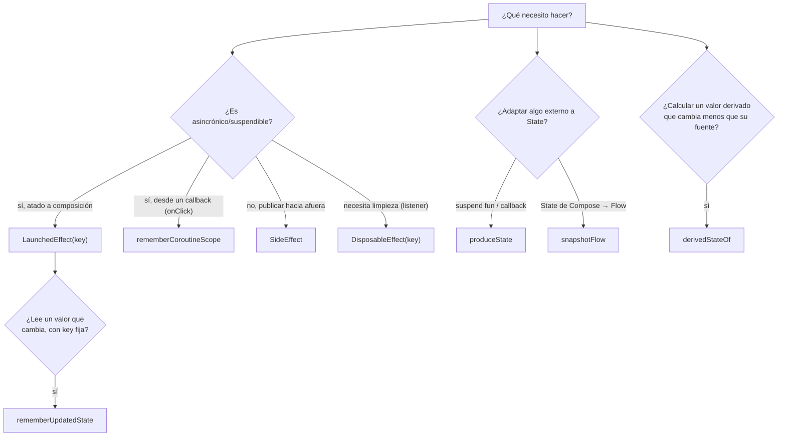

# effects_guia_completa.md

## 1. Mapa del flujo



## 2. Qué es y cómo funciona

Las side-effect APIs son el conjunto de funciones de Compose diseñadas para ejecutar código que "sale" del modelo puro de composición — llamadas de red, suscripciones a listeners, animaciones, notificar a librerías externas, lanzar coroutines desde un callback — de forma controlada y atada al ciclo de vida de la composición, en vez de ejecutarse directamente y sin control dentro del cuerpo de un `@Composable`.

Las 8 APIs que cubren prácticamente todos los casos reales son: `LaunchedEffect`, `rememberCoroutineScope`, `rememberUpdatedState`, `DisposableEffect`, `SideEffect`, `produceState`, `derivedStateOf` y `snapshotFlow`. Cada una resuelve un tipo distinto de efecto secundario, como resume el árbol de decisión del diagrama; elegir la incorrecta no siempre rompe la compilación, pero sí produce comportamiento erróneo, fugas de recursos, o bugs de "closure vieja" difíciles de detectar a simple vista.

Un `@Composable` idealmente es una función pura (documentado en `composables_y_state_hoisting.md`): mismo `State`, mismo resultado visual. El cuerpo de esa función puede ejecutarse **muchas veces** por segundo durante recomposición — así que cualquier efecto secundario escrito directamente en el cuerpo (una llamada de red, un `println` de analytics, suscribirse a un listener) se dispararía repetidamente, sin control, cada vez que Compose decide recomponer por cualquier motivo.

Además, Compose introduce un problema adicional que no existe en código imperativo: coroutines que solo pueden lanzarse *dentro* del cuerpo de un composable (`LaunchedEffect`), vs. coroutines que necesitan lanzarse *desde un callback* como `onClick` (donde `LaunchedEffect` no se puede usar). Las 8 APIs de esta guía cubren, entre todas, cada combinación posible de "cuándo se dispara" y "qué tipo de trabajo hace".

**Criterio de elección de cada API:**

- **`LaunchedEffect(key)`**: lanzar una coroutine ligada al ciclo de vida de la composición — cargar datos al entrar (`LaunchedEffect(Unit)`), o relanzar cuando cambia un parámetro (`LaunchedEffect(orderId)`). Elegir mal la `key` es la fuente de bugs más común — determina cuándo se cancela el efecto anterior y se relanza uno nuevo.
- **`rememberCoroutineScope`**: lanzar una coroutine en respuesta a un evento puntual del usuario (`onClick`, `onDismiss`), no atado a la composición en sí. El scope obtenido vive tanto como el composable que lo creó.
- **`rememberUpdatedState`**: cuando hay un efecto de larga duración con `key` fija a propósito (por ejemplo, un loop infinito que no debería reiniciarse) pero ese efecto necesita leer un valor que sí cambia con el tiempo. Se reserva para cuando relanzar el efecto completo sería costoso o incorrecto — si simplemente podés incluir el valor como `key`, es más simple hacer eso.
- **`DisposableEffect(key)`**: cuando el efecto necesita limpieza explícita al salir de composición — suscribirse/desuscribirse a un listener, un observer del sistema, un callback nativo. El compilador exige terminar con `onDispose { }`.
- **`SideEffect`**: publicar un valor de Compose hacia código no-Compose (analytics, interop con una librería nativa) sin lanzar una coroutine — se ejecuta después de cada recomposición exitosa.
- **`produceState`**: adaptar una fuente externa (una `suspend fun`, un callback, un `Flow` no nativo de Compose) a un `State<T>` observable. Si ya tenés un `StateFlow` del `ViewModel`, corresponde `collectAsStateWithLifecycle()` directamente (ver `collect_stateflow_en_compose.md`), no reinventar el mecanismo con `produceState`.
- **`derivedStateOf`**: calcular un valor derivado de otro `State` que cambia con más frecuencia de la que el resultado derivado realmente cambia. Siempre se envuelve en `remember { derivedStateOf { ... } }` — omitir el `remember` externo lo recrea en cada recomposición, anulando su propósito.
- **`snapshotFlow`**: aplicar operadores de `Flow` (`debounce`, `distinctUntilChanged`, `filter`, `map`) sobre cambios de un `State` de Compose. Es la API menos intuitiva de las 8 si no se entendió primero qué es un `Flow` (ver `08_flow/flowbasico.md`).

## 3. Cómo se ve en distintos contextos

En una **app de clima**, la pantalla de detalle de una ciudad usa `LaunchedEffect(cityId)` para recargar el pronóstico cada vez que el usuario navega a una ciudad distinta, y `DisposableEffect(Unit)` para suscribirse a un listener de ubicación del sistema que se desregistra automáticamente al salir de la pantalla.

En una **app de streaming de música**, `derivedStateOf` es lo que permite mostrar un mini-reproductor solo cuando el usuario scrolleó más allá de cierto punto: la posición de scroll cambia en cada pixel, pero el booleano "mostrar mini-reproductor" solo cambia cuando cruza el umbral — recalcularlo con `derivedStateOf` evita que ese cruce de umbral dispare recomposición en cada pixel scrolleado.

## 4. Implementación real

**El PO pide:** en la pantalla de detalle de un pedido, cargar los datos al entrar, escuchar cambios de conectividad para mostrar un aviso si se pierde la conexión, y colectar los `Effect` del `ViewModel` para mostrar un snackbar de confirmación.

```kotlin
@Composable
fun OrderDetailScreen(orderId: String, viewModel: OrderDetailViewModel) {
    val state by viewModel.state.collectAsStateWithLifecycle()
    val scope = rememberCoroutineScope()
    val snackbarHostState = remember { SnackbarHostState() }

    // 1. LaunchedEffect: dispara la carga al entrar, o si cambia orderId
    LaunchedEffect(orderId) {
        viewModel.onEvent(OrderDetailEvent.OnScreenOpened(orderId))
    }

    // 2. LaunchedEffect: colecta los Effect del ViewModel (navegación, snackbars)
    LaunchedEffect(Unit) {
        viewModel.effect.collect { effect ->
            when (effect) {
                is OrderDetailEffect.ShowConfirmation ->
                    scope.launch { snackbarHostState.showSnackbar("Pedido confirmado") }
            }
        }
    }

    // 3. rememberCoroutineScope: para lanzar un snackbar desde un callback (onClick)
    Button(onClick = {
        scope.launch { snackbarHostState.showSnackbar("Guardado localmente") }
    }) { Text("Guardar nota") }

    // 4. DisposableEffect: se suscribe a conectividad y se desuscribe al salir
    DisposableEffect(Unit) {
        val listener = ConnectivityListener { isOnline ->
            viewModel.onEvent(OrderDetailEvent.OnConnectivityChanged(isOnline))
        }
        listener.register()
        onDispose { listener.unregister() } // limpieza obligatoria
    }

    // 5. SideEffect: publica el total actual hacia una librería de analytics no-Compose
    SideEffect {
        AnalyticsTracker.setCurrentOrderTotal(state.order?.total ?: 0.0)
    }

    OrderDetailContent(state = state, snackbarHostState = snackbarHostState)
}
```

Cada efecto resuelve un problema distinto en la misma pantalla: el primer `LaunchedEffect(orderId)` carga datos y se relanza si el usuario navega a otro pedido; el segundo `LaunchedEffect(Unit)` cierra el loop MVI de `Effect` → acción de UI (ver `navegacion.md` para el mismo patrón aplicado a navegación); `rememberCoroutineScope` cubre el caso donde el snackbar nace de un click directo, no de un `Effect`; `DisposableEffect` garantiza que el listener de conectividad no quede registrado después de salir de la pantalla; `SideEffect` empuja el total actual hacia analytics sin mezclar coroutines en el medio.

## 5. Buenas prácticas y errores comunes — checklist de auditoría de código de IA

Si una IA generó o modificó código con estas APIs, revisar:

- **¿La `key` de un `LaunchedEffect` es fija (`Unit`, `true`) cuando en realidad el efecto depende de un parámetro que cambia?** Un `LaunchedEffect(Unit)` que dispara la carga inicial usando `orderId` nunca se relanza si `orderId` cambia después — si el composable persiste entre navegaciones que reutilizan la instancia, la pantalla queda mostrando datos del pedido equivocado. Como referencia, la documentación oficial de Compose señala que `LaunchedEffect(true)` debería generar la misma sospecha que un `while(true)` en código imperativo — es casi siempre una key mal elegida, no una decisión deliberada.
- **¿Hay un efecto de larga duración con `key` fija a propósito que lee un valor externo sin pasar por `rememberUpdatedState`?** Es el bug de "closure vieja" — ver profundización en la sección 6. Si el efecto necesita permanecer vivo (no reiniciarse) pero también necesita el valor más reciente de un parámetro, falta `rememberUpdatedState`.
- **¿Un `DisposableEffect` no tiene `onDispose { }`, o el `onDispose` no revierte completamente lo que hizo el efecto?** El compilador obliga a declarar `onDispose`, pero no garantiza que su contenido sea correcto — revisar que cada `register()`/`suscribe()` tenga su contraparte exacta de limpieza.
- **¿Se usó `produceState` para envolver algo que ya es un `StateFlow` del `ViewModel`?** Es una complicación innecesaria — corresponde `collectAsStateWithLifecycle()` directo.
- **¿Se usó `derivedStateOf` sin envolverlo en `remember { }`?** Sin el `remember` externo, se recrea en cada recomposición y pierde por completo su propósito de evitar recálculos innecesarios.
- **¿Hay lógica de negocio (llamadas a un `UseCase`, validaciones) directamente dentro de un `SideEffect`?** `SideEffect` está pensado para publicar hacia afuera (analytics, interop), no para lanzar trabajo asincrónico ni contener reglas de negocio — eso pertenece al `ViewModel`.

## 6. Profundización: closure vieja en un efecto de larga duración

Este es el bug más sutil de los ocho, y vale la pena entenderlo mecánicamente en vez de memorizarlo como regla.

```kotlin
@Composable
fun OrderDetailScreen(orderId: String, viewModel: OrderDetailViewModel) {
    // loop infinito de heartbeat, con key fija a propósito (no queremos reiniciarlo)
    LaunchedEffect(Unit) {
        while (true) {
            delay(30_000)
            viewModel.onEvent(OrderDetailEvent.OnHeartbeat(orderId)) // <- BUG
        }
    }
}
```

**Por qué pasa:** cuando Compose ejecuta `LaunchedEffect(Unit)`, crea un lambda de coroutine y lo lanza. Ese lambda es un **closure**: captura las variables del scope en el momento en que se creó — en este caso, el valor de `orderId` que existía la primera vez que el composable compuso. Como la `key` es `Unit` (fija), Compose nunca vuelve a ejecutar ese bloque `LaunchedEffect` — la coroutine sigue viva, corriendo el mismo `while(true)` original, para siempre.

Mientras tanto, el composable sí puede recomponer muchas veces con un `orderId` distinto (por ejemplo, si la misma instancia de pantalla se reutiliza para navegar entre pedidos). Cada recomposición crea un *nuevo* valor de `orderId` en el scope del composable — pero el closure de la coroutine, que ya fue creado y nunca se vuelve a crear, sigue apuntando a la variable capturada en su momento de creación original. El resultado: el heartbeat sigue reportando el `orderId` del primer pedido visitado, indefinidamente, aunque la UI en pantalla muestre otro pedido completamente distinto.

**Por qué el bug es invisible:** compila sin warnings, corre sin crashear, y en un test manual simple (abrir la pantalla una vez, sin navegar entre pedidos) el bug ni siquiera se manifiesta — porque en ese caso el valor capturado y el valor "actual" coinciden. Solo aparece cuando la instancia del composable persiste a través de más de un `orderId`, un escenario que depende de cómo esté configurada la navegación (si reusa instancias) y que puede no estar cubierto por el test manual típico de "abro la pantalla y la cierro".

**La solución — `rememberUpdatedState`:**

```kotlin
@Composable
fun OrderDetailScreen(orderId: String, viewModel: OrderDetailViewModel) {
    val currentOrderId by rememberUpdatedState(orderId)

    LaunchedEffect(Unit) {
        while (true) {
            delay(30_000)
            viewModel.onEvent(OrderDetailEvent.OnHeartbeat(currentOrderId)) // siempre actualizado
        }
    }
}
```

`rememberUpdatedState` no cambia la key del efecto ni lo relanza — en cambio, mantiene un `State<T>` interno que se actualiza en cada recomposición, y el closure de la coroutine lee ese `State` (`currentOrderId`) en cada iteración del loop, en vez de haber capturado el valor plano de `orderId` una sola vez. La coroutine sigue siendo la misma instancia de siempre (nunca se reinicia), pero cada vez que llega a la línea `viewModel.onEvent(...)`, lee el valor más reciente disponible en ese instante — resolviendo exactamente la tensión entre "no reiniciar el efecto" y "usar el dato actualizado" que este patrón existe para resolver.