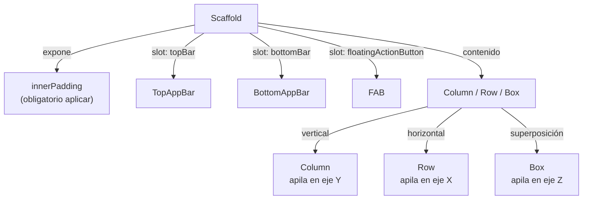

# layouts_basicos.md

## 1. Mapa del flujo



## 2. Qué es y cómo funciona

Los layouts básicos son los tres composables fundamentales que definen cómo se organizan otros composables en el espacio: `Column` (apila verticalmente), `Row` (apila horizontalmente) y `Box` (apila en capas, unos sobre otros). A esto se suma `Scaffold`, que no es un layout de posicionamiento sino un composable estructural: define el esqueleto estándar de una pantalla (top bar, bottom bar, FAB, contenido) y calcula automáticamente el padding necesario para que el contenido no quede tapado por ninguna de esas piezas — como muestra el diagrama, `Scaffold` es la raíz que organiza los distintos slots de la pantalla (`topBar`, `bottomBar`, `floatingActionButton`), y dentro de su contenido es donde entran los tres bloques de posicionamiento.

Todo layout más complejo en Compose (una lista, una card, una pantalla completa) es, en el fondo, una composición de estos tres bloques.

En sistemas de UI más viejos (XML de Android View, por ejemplo), el posicionamiento se declaraba con atributos dispersos por muchas líneas (`layout_below`, `layout_toEndOf`, `layout_gravity`) y era fácil terminar con jerarquías de `RelativeLayout` anidados difíciles de leer. Compose resuelve esto con tres primitivas simples y componibles: si necesitás algo vertical, es un `Column`; si es horizontal, un `Row`; si es superposición, un `Box`. La complejidad de un layout real surge de anidar estos tres de forma clara, no de aprender un cuarto o quinto tipo de contenedor.

`Scaffold` resuelve un problema distinto: sin él, cada pantalla tendría que calcular a mano cuánto espacio ocupan una `TopAppBar`, una `BottomAppBar` o un `FloatingActionButton` para no tapar el contenido debajo. `Scaffold` expone ese cálculo como un parámetro (`innerPadding`) que estás obligado a usar — es responsabilidad de quien escribe el composable aplicarlo, no algo que el compilador fuerce.

## 3. Cómo se ve en distintos contextos

En una **app de tareas**, la pantalla principal usa `Scaffold` con un `FloatingActionButton` para agregar una tarea nueva; el `innerPadding` que expone asegura que la última tarea de la lista no quede tapada por el FAB. Cada ítem de tarea es un `Row` con un `Checkbox` a la izquierda y el texto a la derecha (`Arrangement.SpaceBetween` si además hay una fecha límite del otro lado).

En una **app de streaming de música**, el reproductor persistente en la parte inferior de la pantalla es un caso típico de `Box`: la carátula del álbum de fondo, con controles de reproducción superpuestos encima usando `contentAlignment` — la naturaleza de "cosas una sobre otra" es exactamente lo que distingue a `Box` de `Column`/`Row`, que solo pueden acomodar contenido en secuencia, nunca superpuesto.

## 4. Implementación real

**El PO pide:** una pantalla de historial de pedidos con una `TopAppBar` fija, y cada pedido de la lista debe mostrar un badge de "Nuevo" superpuesto sobre el ícono cuando fue creado en las últimas 24hs.

```kotlin
@Composable
fun OrdersScreen(
    state: OrdersState,
    onEvent: (OrdersEvent) -> Unit
) {
    Scaffold(
        topBar = {
            TopAppBar(title = { Text("Mis pedidos") })
        }
    ) { innerPadding ->
        // innerPadding viene de Scaffold: asegura que el primer pedido
        // no quede tapado por la TopAppBar
        Column(
            modifier = Modifier
                .fillMaxSize()
                .padding(innerPadding),
            verticalArrangement = Arrangement.spacedBy(8.dp)
        ) {
            state.orders.forEach { order ->
                Row(
                    modifier = Modifier.fillMaxWidth(),
                    horizontalArrangement = Arrangement.SpaceBetween
                ) {
                    // Box permite superponer el badge "Nuevo" sobre el ícono
                    Box(contentAlignment = Alignment.TopEnd) {
                        Icon(Icons.Filled.ShoppingBag, contentDescription = null)
                        if (order.isNew) {
                            Badge()
                        }
                    }

                    Text("Pedido #${order.id} — $${order.total}")
                }
            }
        }
    }
}
```

`Column` ordena la lista de pedidos verticalmente. Cada pedido es un `Row` que separa el ícono del texto (`SpaceBetween`). El `Box` alrededor del ícono permite dibujar un `Badge` superpuesto solo cuando `order.isNew` es verdadero — algo que ni `Column` ni `Row` pueden hacer, porque ninguno de los dos apila en el eje Z.

## 5. Buenas prácticas y errores comunes — checklist de auditoría de código de IA

Si una IA generó o modificó un layout, revisar:

- **¿Se ignora el `innerPadding` que provee `Scaffold`?** Es el error más común y silencioso: el código *compila* y *corre* sin errores, e incluso puede verse bien en un preview chico, pero en pantalla real el contenido queda parcialmente tapado por la `TopAppBar`/`BottomBar`/`FAB`. `Scaffold` no fuerza el uso del padding en tiempo de compilación — si el `Column`/`LazyColumn` dentro del `content` no aplica `.padding(innerPadding)`, es un bug que hay que detectar a ojo.
- **¿Se usa `Column`/`Row` para una lista potencialmente grande o de tamaño desconocido?** `Column` compone TODOS sus hijos de una — es un error de performance real, no cosmético, en cuanto la lista deja de ser chica y fija. Corresponde `LazyColumn`/`LazyRow` (ver `listas_lazy.md`).
- **¿Se usa `Box` como reemplazo perezoso de `Column`/`Row`** ("total, con `Modifier` lo acomodo")? Esto ensucia la semántica del layout — `Box` debería reservarse para superposición real o para un contenedor de un solo hijo que necesita `contentAlignment`.
- **¿`Scaffold` aparece como componente interno de una pantalla** (dentro de una card, un ítem de lista) en vez de como raíz? `Scaffold` es un patrón a nivel pantalla completa, no un layout de propósito general — anidarlo produce comportamiento inesperado con `TopAppBar`/`FAB` duplicados o mal posicionados.