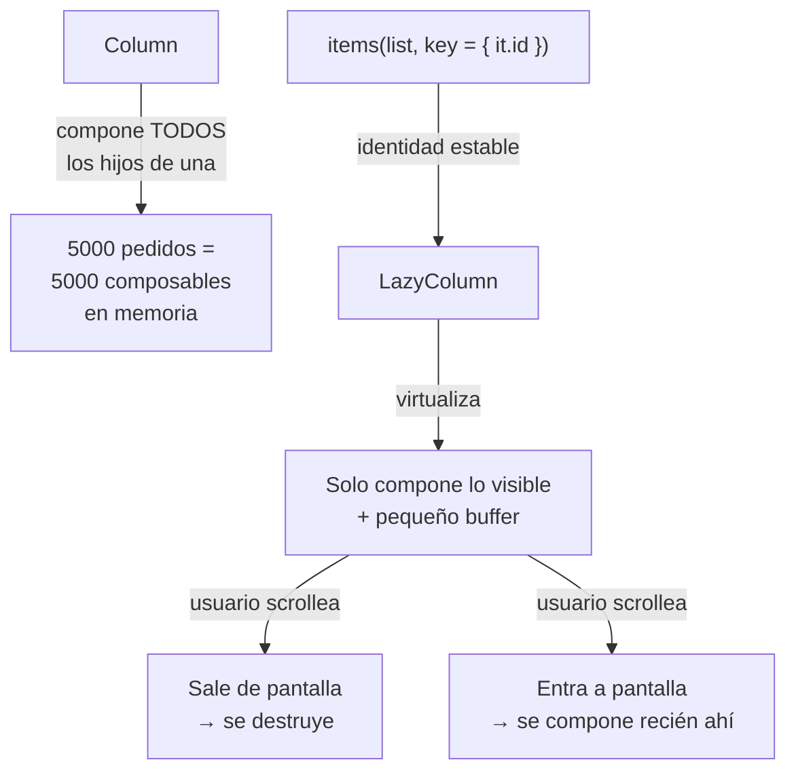

# listas_lazy.md

## 1. Mapa del flujo



## 2. Qué es y cómo funciona

`LazyColumn` y `LazyRow` son las versiones "perezosas" (lazy) de `Column` y `Row`: en vez de componer todos sus hijos de una, solo componen y dibujan los ítems que efectivamente están (o van a estar pronto) visibles en pantalla, reciclando el trabajo a medida que el usuario scrollea. Se construyen con un DSL propio (`LazyListScope`) en vez de recibir composables hijos directos: `items()`, `item()`, `itemsIndexed()`.

`Column` compone TODOS sus hijos apenas se le pide, sin importar cuántos sean ni si están visibles — como muestra el diagrama, con una lista de 5.000 elementos eso significa crear 5.000 composables en memoria de una sola vez, la mayoría invisibles, con el consiguiente costo de composición, medición y memoria, además de romper el scroll (habría que envolver el `Column` en un `verticalScroll` manual, que tampoco virtualiza nada).

`LazyColumn`/`LazyRow` resuelven esto con virtualización: componen solo lo visible en viewport (más un pequeño buffer), y a medida que el usuario scrollea, los ítems que salen de pantalla se destruyen y los que entran se componen recién en ese momento. Es el mismo problema que resuelve un `RecyclerView` en Android View clásico, pero declarativo.

`items(items = lista, key = { it.id })` le dice a `LazyColumn` cómo identificar cada elemento de forma única y estable — usar un identificador estable del dato, nunca el índice de la lista, es la decisión más importante al armar una lista lazy: si la lista puede reordenarse, insertar o eliminar elementos en el medio, usar el índice como key hace que Compose confunda qué composable corresponde a qué dato tras un cambio, causando que el estado interno de un ítem "salte" al ítem incorrecto. `contentPadding` (a diferencia de un `Modifier.padding()`) agrega espacio alrededor del contenido scrolleable sin afectar el área de scroll en sí — el primer y último ítem quedan con aire, pero el usuario puede seguir scrolleando "por encima" de ese padding.

## 3. Cómo se ve en distintos contextos

En una **app de fotos**, la grilla de miniaturas de la galería usa `LazyVerticalGrid` (la variante en grilla de la misma familia) con `photo.id` como `key` — con miles de fotos en el dispositivo, solo las miniaturas visibles en pantalla se cargan y componen en cada momento, reciclando el trabajo a medida que el usuario scrollea.

En una **app de finanzas personales**, el historial de transacciones usa `LazyColumn` con `transaction.id` como key, y agrupa por fecha usando `item()` para los headers de sección ("Hoy", "Ayer") intercalados con `items()` para las transacciones — la combinación de `item`/`items` dentro del mismo `LazyListScope` es justamente lo que permite mezclar contenido heterogéneo (headers, separadores, filas de datos) en una sola lista virtualizada.

## 4. Implementación real

**El PO pide:** en la pantalla de historial de pedidos, el usuario puede reordenar manualmente sus pedidos favoritos arrastrándolos — la lista debe mantener el estado de expansión de cada pedido correctamente aunque se reordene.

```kotlin
// Caso trampa (lo que NO hay que hacer): itemsIndexed sin key explícita
@Composable
fun OrdersListBad(orders: List<Order>) {
    LazyColumn {
        itemsIndexed(orders) { index, order ->
            OrderRow(order = order, position = index)
            // sin key: Compose usa la POSICIÓN como identidad implícita
        }
    }
}
```

```kotlin
// Corrección: key explícita basada en el id de dominio del pedido
@Composable
fun OrdersList(
    orders: List<Order>,
    expandedOrderIds: Set<String>,
    onToggleExpand: (String) -> Unit,
    modifier: Modifier = Modifier
) {
    LazyColumn(
        modifier = modifier.fillMaxSize(),
        contentPadding = PaddingValues(16.dp),
        verticalArrangement = Arrangement.spacedBy(8.dp)
    ) {
        items(
            items = orders,
            key = { order -> order.id } // clave estable, no el índice
        ) { order ->
            OrderRow(
                order = order,
                isExpanded = order.id in expandedOrderIds,
                onToggleExpand = onToggleExpand
            )
        }
    }
}
```

Sin `key` explícita (versión `Bad`), si el usuario arrastra el pedido que estaba en la posición 2 hacia la posición 4, Compose no se entera de que "ese pedido se movió" — asume que el composable que ocupa la posición 2 simplemente cambió de datos. Cualquier estado local de ese composable (por ejemplo, si esa fila estaba expandida vía `remember`) queda pegado a la *posición*, no al pedido — resultando en filas que aparecen expandidas o colapsadas incorrectamente después de reordenar. Con `key = { order.id }`, Compose trackea la identidad real del pedido a través del reordenamiento, y el estado de expansión (que en este caso vive en el `ViewModel`, ver `composables_y_state_hoisting.md`) se mantiene correctamente asociado a cada pedido específico.

## 5. Buenas prácticas y errores comunes — checklist de auditoría de código de IA

Si una IA generó o modificó una lista lazy, revisar:

- **¿`items()`/`itemsIndexed()` tiene un `key` explícito basado en un identificador estable del dato?** Su ausencia funciona "por ahora" en listas estáticas, pero es una bomba de tiempo en cuanto la lista se vuelve dinámica (reordenable, con inserciones/eliminaciones) — el default es siempre incluirlo, aunque hoy no parezca necesario.
- **¿El `key` usado es el índice de la lista (`itemsIndexed { index, item -> ... key = index }`) en vez del id de dominio del dato?** Es el error más común y el más peligroso — el índice cambia con cada reordenamiento, mientras que el id del dato no.
- **¿Se usa `LazyColumn`/`LazyRow` para una cantidad de ítems fija y chica** (un formulario de 5 campos, una fila de 3 botones)? El overhead del DSL de Lazy no se justifica ahí — corresponde `Column`/`Row` simple (ver `layouts_basicos.md`).
- **¿Se usa `Column`/`Row` con scroll manual para una lista potencialmente grande o de tamaño desconocido** (el error inverso al anterior)? Sin virtualización, cada ítem se compone de una sola vez sin importar si está visible — un problema de performance real en cuanto la lista crece.
- **¿Se usa `itemsIndexed` cuando el índice no aporta nada al contenido del ítem en sí?** Agregar el índice sin necesidad es ruido en la firma del lambda — usar `items()` simple si no hace falta el índice.