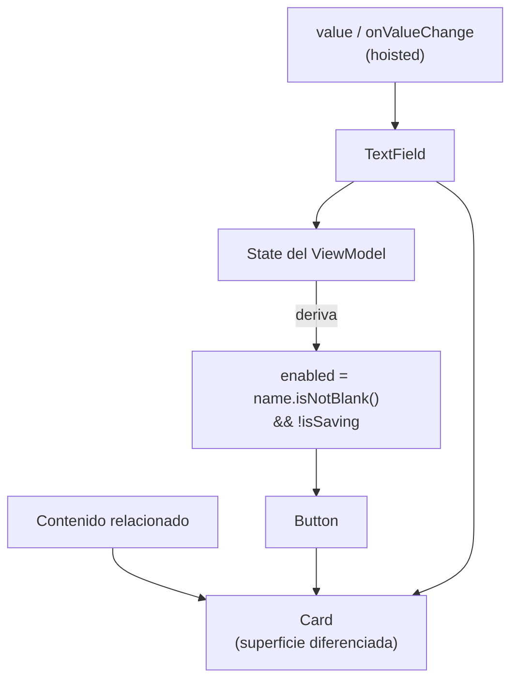

# material3_componentes_comunes.md

## 1. Mapa del flujo



## 2. Qué es y cómo funciona

Material3 (M3) es la implementación de Compose de la especificación Material Design 3 de Google: un set de componentes de UI listos para usar (`Button`, `TextField`, `Card`, entre otros) que ya vienen con estilo, estados (enabled/disabled, focused, error) y comportamiento accesible por default. No son layouts (no organizan espacio) — son piezas de contenido con las que se arma la interfaz dentro de esos layouts.

Este archivo cubre los tres que más se usan día a día: `Button` (y sus variantes), `TextField`, y `Card`.

Sin un sistema de diseño, cada botón, cada input de texto y cada card tendrían que construirse desde cero combinando `Box`/`Row`/`Modifier` — reimplementando manualmente estados de foco, ripple de click, elevación, colores por tema, contraste accesible, etc. Material3 encapsula todo eso en componentes con una API estable y consistente, para que la decisión de diseño no sea "cómo construyo un botón" sino "qué variante de botón le corresponde semánticamente a esta acción" — como muestra el diagrama, tanto `TextField` como `Button` reciben su estado desde afuera (hoisted), y `Card` los agrupa como superficie visual, sin poseer estado propio de ninguno de los dos.

**Criterio de elección:**

- **Variantes de `Button`** (`Button`, `OutlinedButton`, `TextButton`, `FilledTonalButton`): `Button` (filled, color sólido) para la acción principal de la pantalla — solo debería haber una por pantalla o sección. `OutlinedButton` para una acción secundaria junto a la principal. `TextButton` para acciones de bajo énfasis visual, como en un diálogo o dentro de una `TopAppBar`. Usar varios `Button` filled en la misma pantalla rompe la jerarquía visual, porque todas las acciones compiten por la misma atención — elegir la variante correcta no es estético, es semántico.
- **`TextField` vs `OutlinedTextField`**: cumplen la misma función, difieren en estilo visual (fondo relleno vs borde) — elegir uno según el sistema de diseño de la app y mantenerlo consistente. Nunca manejan estado propio del texto internamente: siempre hoisteado (ver `remember_vs_remembersaveable.md` para el caso en que sí conviene un estado puramente local y efímero).
- **`Card`**: agrupar contenido relacionado con una superficie visualmente diferenciada (elevación, borde redondeado) — ítems de lista, formularios, secciones destacadas. Si es solo un contenedor de layout sin necesidad de diferenciación visual, un `Column`/`Box` simple alcanza y evita elevación/sombra innecesaria — `Card` trae estilo gratis, pero también trae opinión de diseño.

## 3. Cómo se ve en distintos contextos

En una **app de recetas**, el formulario para agregar un ingrediente nuevo usa `OutlinedTextField` para el nombre y la cantidad, dentro de una `Card` que agrupa visualmente todo el formulario, con un `Button` filled ("Agregar") habilitado solo cuando ambos campos tienen contenido válido.

En una **app de tareas**, cada tarea de la lista es una `Card` con un `TextButton` de bajo énfasis ("Posponer") junto a un ícono de check — la elección de `TextButton` en vez de un `Button` filled comunica que posponer es una acción secundaria, disponible pero no la protagonista de esa fila.

## 4. Implementación real

**El PO pide:** un formulario para agregar una nota de entrega a un pedido, con un campo de texto y un botón de guardar que debe deshabilitarse mientras se está guardando o si el campo está vacío.

```kotlin
@Composable
fun AddDeliveryNoteForm(
    note: String,
    onNoteChange: (String) -> Unit,
    onSaveClick: () -> Unit,
    isSaving: Boolean,
    modifier: Modifier = Modifier
) {
    Card(modifier = modifier.fillMaxWidth()) {
        Column(
            modifier = Modifier.padding(16.dp),
            verticalArrangement = Arrangement.spacedBy(12.dp)
        ) {
            OutlinedTextField(
                value = note,               // state hoisting: el valor vive afuera
                onValueChange = onNoteChange, // el TextField no guarda su propio estado
                label = { Text("Nota de entrega") },
                singleLine = true
            )

            Button(
                onClick = onSaveClick,
                enabled = note.isNotBlank() && !isSaving, // regla de UI, no de negocio
                modifier = Modifier.align(Alignment.End)
            ) {
                Text(if (isSaving) "Guardando..." else "Guardar")
            }
        }
    }
}
```

`OutlinedTextField` sigue el mismo patrón de state hoisting ya documentado: no guarda `note` internamente, recibe `value` y `onValueChange` desde afuera, así el `ViewModel` (a través del `State`) es la única fuente de verdad, incluso para lo que el usuario está tipeando. La `Card` agrupa visualmente todo el formulario como una unidad, y el `Button` deriva su `enabled` directamente del `State` — nunca de una condición inventada suelta en el composable.

## 5. Buenas prácticas y errores comunes — checklist de auditoría de código de IA

Si una IA generó o modificó componentes de Material3, revisar:

- **¿Un `Button` que dispara una acción con validación (guardar, confirmar, enviar) no tiene `enabled` calculado a partir del `State`?** Es el error más común y silencioso: sin `enabled`, el botón siempre está habilitado, incluso con un formulario inválido o un guardado en curso — no hay error de compilación ni de runtime, simplemente el usuario puede disparar el `Event` en un estado inválido.
- **¿La condición de `enabled` está hardcodeada en el composable (`enabled = true` o una condición inventada sin relación al `State`) en vez de derivarse de campos reales del `State`** (`state.name.isNotBlank()`, `!state.isSaving`)? Confundir "eso lo valida el `UseCase`" con "entonces no hace falta deshabilitar el botón" es un error de capa — el `UseCase` debe validar igual (nunca confiar solo en la UI), pero deshabilitar el botón es lo que le da al usuario feedback inmediato sin ida y vuelta al `ViewModel`.
- **¿Hay más de un `Button` (filled) compitiendo por atención en la misma pantalla o sección?** Revisar si alguno de ellos debería ser `OutlinedButton` o `TextButton` según su jerarquía real de importancia.
- **¿Un `TextField`/`OutlinedTextField` maneja su propio estado con `remember` en vez de recibir `value`/`onValueChange` hoisted?** Rompe el mismo principio ya cubierto en `composables_y_state_hoisting.md` — el campo se desincroniza de la fuente de verdad real.
- **¿Se usa `Card` como contenedor genérico sin necesidad real de diferenciación visual?** Agrega elevación y sombra que pueden no ser necesarias — si es solo agrupación de layout sin intención de destacar visualmente esa sección, un `Column`/`Box` simple es más apropiado.